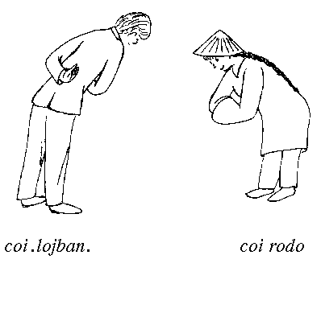

## Table of Contents

test

## 1.1. What is Lojban?

Lojban (pronounced “LOZH-bahn”) is a constructed language. Previous versions of the language were called “Loglan” by Dr. James Cooke Brown, who founded the Loglan Project and started the development of the language in 1955. The goals for the language were first described in the open literature in the article “Loglan”, published in *Scientific American*, June, 1960. Made well-known by that article and by occasional references in science fiction (most notably in Robert Heinlein's novel *The Moon Is A Harsh Mistress*) and computer publications, Loglan and Lojban have been built over four decades by dozens of workers and hundreds of supporters, led since 1987 by The Logical Language Group (who are the publishers of this book).

There are thousands of artificial languages (of which Esperanto is the best-known), but Loglan/Lojban has been engineered to make it unique in several ways. The following are the main features of Lojban:

- Lojban is designed to be used by people in communication with each other, and possibly in the future with computers.
- Lojban is designed to be neutral between cultures.
- Lojban grammar is based on the principles of predicate logic.
- Lojban has an unambiguous yet flexible grammar.
- Lojban has phonetic spelling, and unambiguously resolves its sounds into words.
- Lojban is simple compared to natural languages; it is easy to learn.
- Lojban's 1300 root words can be easily combined to form a vocabulary of millions of words.
- Lojban is regular; the rules of the language are without exceptions.
- Lojban attempts to remove restrictions on creative and clear thought and communication.
- Lojban has a variety of uses, ranging from the creative to the scientific, from the theoretical to the practical.
- Lojban has been demonstrated in translation and in original works of prose and poetry.

## 1.2. What is this book?

This book is what is called a “reference grammar”. It attempts to expound the whole Lojban language, or at least as much of it as is understood at present. Lojban is a rich language with many features, and an attempt has been made to discover the functions of those features. The word “discover” is used advisedly; Lojban was not “invented” by any one person or committee. Often, grammatical features were introduced into the language long before their usage was fully understood. Sometimes they were introduced for one reason, only to prove more useful for other reasons not recognized at the time.

By intention, this book is complete in description but not in explanation. For every rule in the formal Lojban grammar (given in [Chapter 21](/chapter21/ "Chapter 21. Formal Grammars")), there is a bit of explanation and an example somewhere in the book, and often a great deal more than a bit. In essence, [Chapter 2](/chapter02/ "Chapter 2. A Quick Tour of Lojban Grammar, With Diagrams") gives a brief overview of the language, [Chapter 21](/chapter21/ "Chapter 21. Formal Grammars") gives the formal structure of the language, and the chapters in between put semantic flesh on those formal bones. I hope that eventually more grammatical material founded on (or even correcting) the explanations in this book will become available.

Nevertheless, the publication of this book is, in one sense, the completion of a long period of language evolution. With the exception of a possible revision of the language that will not even be considered until five years from publication date, and any revisions of this book needed to correct outright errors, the language described in this book will not be changing by deliberate act of its creators any more. Instead, language change will take place in the form of new vocabulary – Lojban does not yet have nearly the vocabulary it needs to be a fully usable language of the modern world, as [Chapter 12](/chapter12/ "Chapter 12. Dog House And White House: Determining lujvo Place Structures") explains – and through the irregular natural processes of drift and (who knows?) native-speaker evolution. (Teach your children Lojban!) You can learn the language described here with assurance that (unlike previous versions of Lojban and Loglan, as well as most other artificial languages) it will not be subject to further fiddling by language-meisters.

It is probably worth mentioning that this book was written somewhat piecemeal. Each chapter began life as an explication of a specific Lojban topic; only later did these begin to clump together into a larger structure of words and ideas. Therefore, there are perhaps not as many cross-references as there should be. However, I have attempted to make the index as comprehensive as possible.

Each chapter has a descriptive title, often involving some play on words; this is an attempt to make the chapters more memorable. The title of [Chapter 1](/chapter01/ "Chapter 1. Lojban As We Mangle It In Lojbanistan: About This Book") (which you are now reading), for example, is an allusion to the book *English As We Speak It In Ireland*, by P. W. Joyce, which is a sort of informal reference grammar of Hiberno-English. “Lojbanistan” is both an imaginary country where Lojban is the native language, and a term for the actual community of Lojban-speakers, scattered over the world. Why “mangle”? As yet, nobody in the real Lojbanistan speaks the language at all well, by the standards of the imaginary Lojbanistan; that is one of the circumstances this book is meant to help remedy.

## 1.3. What are the typographical conventions of this book?

Each chapter is broken into numbered sections; each section contains a mixture of expository text, numbered examples, and possibly tables.

The reader will notice a certain similarity in the examples used throughout the book. One chapter after another rings the changes on the self-same sentences:

##### Example 1.1.

|     |       |                            |        |
| --- | ----- | -------------------------- | ------ |
| mi  | klama | le                         | zarci  |
| I   | go-to | that-which-I-describe-as-a | store. |

*I go to the store.*

will become wearisomely familiar before [Chapter 21](/chapter21/ "Chapter 21. Formal Grammars") is reached. This method is deliberate; I have tried to use simple and (eventually) familiar examples wherever possible, to avoid obscuring new grammatical points with new vocabulary. Of course, this is not the method of a textbook, but this book is not a textbook (although people have learned Lojban from it and its predecessors). Rather, it is intended both for self-learning (of course, at present would-be Lojban teachers must be self-learners) and to serve as a reference in the usual sense, for looking up obscure points about the language.

It is useful to talk further about [Example 1.1](/chapter01/#example-11 "Example 1.1.") for what it illustrates about examples in this book. Examples usually occupy three lines. The first of these is in Lojban (in italics), the second in a word-by-word literal translation of the Lojban into English (in boldface), and the third in colloquial English. The second and third lines are sometimes called the “literal translation” and the “colloquial translation” respectively. Sometimes, when clarity is not sacrificed thereby, one or both are omitted. If there is more than one Lojban sentence, it generally means that they have the same meaning.

Words are sometimes surrounded by square brackets. In Lojban texts, these enclose optional grammatical particles that may (in the context of the particular example) be either omitted or included. In literal translations, they enclose words that are used as conventional translations of specific Lojban words, but don't have exactly the meanings or uses that the English word would suggest. In [Chapter 3](/chapter03/ "Chapter 3. The Hills Are Alive With The Sounds Of Lojban"), square brackets surround phonetic representations in the International Phonetic Alphabet.

Many of the tables, especially those placed at the head of various sections, are in three columns. The first column contains Lojban words discussed in that section; the second column contains the grammatical category (represented by an UPPER CASE Lojban word) to which the word belongs, and the third column contains a brief English gloss, not necessarily or typically a full explanation. Other tables are explained in context.

A few Lojban words are used in this book as technical terms. All of these are explained in [Chapter 2](/chapter02/ "Chapter 2. A Quick Tour of Lojban Grammar, With Diagrams"), except for a few used only in single chapters, which are explained in the introductory sections of those chapters.

## 1.4. Disclaimers

It is necessary to add, alas, that the examples used in this book do not refer to any existing person, place, or institution, and that any such resemblance is entirely coincidental and unintentional, and not intended to give offense.

When definitions and place structures of gismu, and especially of lujvo, are given in this book, they may differ from those given in the English-Lojban dictionary (which, as of this writing, is not yet published). If so, the information given in the dictionary supersedes whatever is given here.

## 1.5. Acknowledgements and Credits

Although the bulk of this book was written for the Logical Language Group (LLG) by John Cowan, who is represented by the occasional authorial “I”, certain chapters were first written by others and then heavily edited by me to fit into this book.

In particular: [Chapter 2](/chapter02/ "Chapter 2. A Quick Tour of Lojban Grammar, With Diagrams") is a fusion of originally separate documents, one by Athelstan, and one by Nora Tansky LeChevalier and Bob LeChevalier; [Chapter 3](/chapter03/ "Chapter 3. The Hills Are Alive With The Sounds Of Lojban") and [Chapter 4](/chapter04/ "Chapter 4. The Shape Of Words To Come: Lojban Morphology") were originally written by Bob LeChevalier with contributions by Chuck Barton; [Chapter 12](/chapter12/ "Chapter 12. Dog House And White House: Determining lujvo Place Structures") was originally written (in much longer form) by Nick Nicholas; the dialogue near the end of [Chapter 13](/chapter13/ "Chapter 13. Oooh! Arrgh! Ugh! Yecch! Attitudinal and Emotional Indicators") was contributed by Nora Tansky LeChevalier; [Chapter 15](/chapter15/ "Chapter 15. “No” Problems: On Lojban Negation") and parts of [Chapter 16](/chapter16/ "Chapter 16. “Who Did You Pass On The Road? Nobody”: Lojban And Logic") were originally by Bob LeChevalier; and the YACC grammar in [Chapter 21](/chapter21/ "Chapter 21. Formal Grammars") is the work of several hands, but is primarily by Bob LeChevalier and Jeff Taylor. The BNF grammar, which is also in [Chapter 21](/chapter21/ "Chapter 21. Formal Grammars"), was originally written by me, then rewritten by Clark Nelson, and finally touched up by me again.

The research into natural languages from which parts of [Chapter 5](/chapter05/ "Chapter 5. “Pretty Little Girls' School”: The Structure Of Lojban selbri") draw their material was performed by Ivan Derzhanski. LLG acknowledges his kind permission to use the fruits of his research.

The pictures in this book were drawn by Nora Tansky LeChevalier, except for the picture appearing in [Chapter 4](/chapter04/ "Chapter 4. The Shape Of Words To Come: Lojban Morphology"), which is by Sylvia Rutiser Rissell.

The index was made by Nora Tansky LeChevalier.

I would like to thank the following people for their detailed reviews, suggestions, comments, and early detection of my embarrassing errors in Lojban, logic, English, and cross-references: Nick Nicholas, Mark Shoulson, Veijo Vilva, Colin Fine, And Rosta, Jorge Llambias, Iain Alexander, Paulo S. L. M. Barreto, Robert J. Chassell, Gale Cowan, Karen Stein, Ivan Derzhanski, Jim Carter, Irene Gates, Bob LeChevalier, John Parks-Clifford (also known as “pc”), and Nora Tansky LeChevalier.

Nick Nicholas (NSN) would like to thank the following Lojbanists: Mark Shoulson, Veijo Vilva, Colin Fine, And Rosta, and Iain Alexander for their suggestions and comments; John Cowan, for his extensive comments, his exemplary trailblazing of Lojban grammar, and for solving the *manskapi* dilemma for NSN; Jorge Llambias, for his even more extensive comments, and for forcing NSN to think more than he was inclined to; Bob LeChevalier, for his skeptical overview of the issue, his encouragement, and for scouring all Lojban text his computer has been burdened with for lujvo; Nora Tansky LeChevalier, for writing the program converting old rafsi text to new rafsi text, and sparing NSN from embarrassing errors; and Jim Carter, for his dogged persistence in analyzing lujvo algorithmically, which inspired this research, and for first identifying the three lujvo classes.

Of course, the entire Loglan Project owes a considerable debt to James Cooke Brown as the language inventor, and also to several earlier contributors to the development of the language. Especially noteworthy are Doug Landauer, Jeff Prothero, Scott Layson, Jeff Taylor, and Bob McIvor. Final responsibility for the remaining errors and infelicities is solely mine.

## 1.6. Informal Bibliography

The founding document for the Loglan Project, of which this book is one of the products, is *Loglan 1: A Logical Language* by James Cooke Brown (4th ed. 1989, The Loglan Institute, Gainesville, Florida, U.S.A.). The language described therein is not Lojban, but is very close to it and may be considered an ancestral version. It is regrettably necessary to state that nothing in this book has been approved by Dr. Brown, and that the very existence of Lojban is disapproved of by him.

The logic of Lojban, such as it is, owes a good deal to the American philosopher W. v.O. Quine, especially *Word and Object* (1960, M.I.T. Press). Much of Quine's philosophical writings, especially on observation sentences, reads like a literal translation from Lojban.

The theory of negation expounded in [Chapter 15](/chapter15/ "Chapter 15. “No” Problems: On Lojban Negation") is derived from a reading of Laurence Horn's work *A Natural History of Negation*.

Of course, neither Brown nor Quine nor Horn is in any way responsible for the uses or misuses I have made of their works.

Depending on just when you are reading this book, there may be three other books about Lojban available: a textbook, a Lojban/English dictionary, and a book containing general information about Lojban. You can probably get these books, if they have been published, from the same place where you got this book. In addition, other books not yet foreseen may also exist.

## 1.7. Captions to Pictures

The following examples list the Lojban caption, with a translation, for the picture at the head of each chapter. If a chapter's picture has no caption, “(none)” is specified instead.

|                           |                                                                                                                                                                                                                                                                       |
| ------------------------- | --------------------------------------------------------------------------------------------------------------------------------------------------------------------------------------------------------------------------------------------------------------------- |
| [Chapter 1](/chapter01/)  | *coi .lojban.*   Greetings, O Lojban!   *coi rodo* Greetings, all-of you                                                                                                                                                                                    |
| [Chapter 2](/chapter02/)  | (none)                                                                                                                                                                                                                                                                |
| [Chapter 3](/chapter03/)  | *.i .ai .i .ai .o*   \[a sequence of arbitrary Lojban words\]                                                                                                                                                                                                    |
| [Chapter 4](/chapter04/)  | *jbobliku*   Lojbanic-blocks                                                                                                                                                                                                                                     |
| [Chapter 5](/chapter05/)  | (none)                                                                                                                                                                                                                                                                |
| [Chapter 6](/chapter06/)  | *lei re nanmu cu bevri le re nanmu*   The-mass-of two men carry the two men   Two men (jointly) carry two men (both of them).                                                                                                                               |
| [Chapter 7](/chapter07/)  | *ma drani danfu*   \[What-sumti\] is-the-correct type-of-answer?   *.i di'e*   The-next-sentence.   *.i di'u .i dei*   The-previous-sentence. This-sentence.   *.i ri .i do'i*   The-previous-sentence.  An-unspecified-utterance. |
| [Chapter 8](/chapter08/)  | *ko viska re prenu poi bruna la santas.*   \[You!\] see two persons who-are brothers-of that-named Santa.                                                                                                                                                        |
| [Chapter 9](/chapter09/)  | (none)                                                                                                                                                                                                                                                                |
| [Chapter 10](/chapter10/) | *za'o klama*   \[superfective\] come/go   Something goes (or comes) for too long.                                                                                                                                                                           |
| [Chapter 11](/chapter11/) | *le si'o kunti*   The concept-of emptiness                                                                                                                                                                                                                       |
| [Chapter 12](/chapter12/) | (none)                                                                                                                                                                                                                                                                |
| [Chapter 13](/chapter13/) | *.oi ro'i ro'a ro'o*   \[Pain!\] \[emotional\] \[social\] \[physical\]                                                                                                                                                                                           |
| [Chapter 14](/chapter14/) | (none)                                                                                                                                                                                                                                                                |
| [Chapter 15](/chapter15/) | *mi na'e lumci le karce*   I other-than wash the car   I didn't wash the car.                                                                                                                                                                               |
| [Chapter 16](/chapter16/) | *drata mupli pe'u .djan.*   another example \[please\] John   Another example, John, please!                                                                                                                                                                |
| [Chapter 17](/chapter17/) | *zai xanlerfu bu ly. .obu .jy by. .abu ny.*   \[Shift\] hand-letters l o j b a n   "Lojban" in a manual alphabet                                                                                                                                            |
| [Chapter 18](/chapter18/) | *no no*   0 0                                                                                                                                                                                                                                                    |
| [Chapter 19](/chapter19/) | (none)                                                                                                                                                                                                                                                                |
| [Chapter 20](/chapter20/) | (none)                                                                                                                                                                                                                                                                |
| [Chapter 21](/chapter21/) | (none)                                                                                                                                                                                                                                                                |

## 1.8. Boring Legalities

Copyright © 1997 by The Logical Language Group, Inc. All Rights Reserved.

Permission is granted to make and distribute verbatim copies of this book, either in electronic or in printed form, provided the copyright notice and this permission notice are preserved on all copies.

Permission is granted to copy and distribute modified versions of this book, provided that the modifications are clearly marked as such, and provided that the entire resulting derived work is distributed under the terms of a permission notice identical to this one.

Permission is granted to copy and distribute translations of this book into another language, under the above conditions for modified versions, except that this permission notice may be stated in a translation that has been approved by the Logical Language Group, rather than in English.

The contents of [Chapter 21](/chapter21/ "Chapter 21. Formal Grammars") are in the public domain.

For information, contact: The Logical Language Group, 2904 Beau Lane, Fairfax VA 22031-1303 USA. Telephone: 703-385-0273. Email address: llg-board\[at\]lojban.org . Web Address: http://www.lojban.org .

