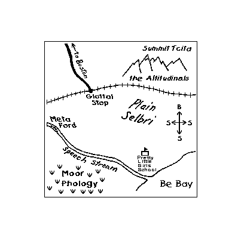

## The concept of the bridi

This chapter gives diagrammed examples of basic Lojban sentence structures. The most general pattern is covered first, followed by successive variations on the basic components of the Lojban sentence. There are many more capabilities not covered in this chapter, but covered in detail in later chapters, so this chapter is a “quick tour” of the material later covered more slowly throughout the book. It also introduces most of the Lojban words used to discuss Lojban grammar.

Let us consider John and Sam and three statements about them:

### Example 2.1.

John is the father of Sam.

### Example 2.2.

John hits Sam.

### Example 2.3.

John is taller than Sam.

These examples all describe relationships between John and Sam. However, in English, we use the noun “father” to describe a static relationship in [Example 2.1](chapter02#example-random-id-qIuj "Example 2.1. "), the verb “hits” to describe an active relationship in [Example 2.2](chapter02#example-random-id-qiuQ "Example 2.2. "), and the adjective “taller” to describe an attributive relationship in [Example 2.3](chapter02#example-random-id-qIuS "Example 2.3. "). In Lojban we make no such grammatical distinctions; these three sentences, when expressed in Lojban, are structurally identical. The same part of speech is used to represent the relationship. In formal logic this whole structure is called a “predication”; in Lojban it is called a _[bridi](glossary#valsi-bridi)_, and the central part of speech is the _[selbri](glossary#valsi-selbri)_. Logicians refer to the things thus related as “arguments”, while Lojbanists call them _[sumti](glossary#valsi-sumti)_. These Lojban terms will be used for the rest of the book.

In a relationship, there are a definite number of things being related. In English, for example, “give” has three places: the donor, the recipient and the gift. For example:

### Example 2.4.

John gives Sam the book.

and

### Example 2.5.

Sam gives John the book.

mean two different things because the relative positions of “John” and “Sam” have been switched. Further,

### Example 2.6.

The book gives John Sam.

seems strange to us merely because the places are being filled by unorthodox arguments. The relationship expressed by “give” has not changed.

In Lojban, each selbri has a specified number and type of arguments, known collectively as its “place structure”. The simplest kind of selbri consists of a single root word, called a _[gismu](glossary#valsi-gismu)_, and the definition in a dictionary gives the place structure explicitly. The primary task of constructing a Lojban sentence, after choosing the relationship itself, is deciding what you will use to fill in the sumti places.

This book uses the Lojban terms _[bridi](glossary#valsi-bridi)_, _[sumti](glossary#valsi-sumti)_, and _[selbri](glossary#valsi-selbri)_, because it is best to come to understand them independently of the English associations of the corresponding words, which are only roughly similar in meaning anyhow.

The Lojban examples in this chapter (but not in the rest of the book) use boldface (as well as the usual italics) for selbri, to help you to tell them apart.

## Pronunciation

Detailed pronunciation and spelling rules are given in [Chapter 3](chapter03 "Chapter 3. The Hills Are Alive With The Sounds Of Lojban"), but what follows will keep the reader from going too far astray while digesting this chapter.

Lojban has six recognized vowels: _a_, _e_, _i_, _o_, _u_ and _y_. The first five are roughly pronounced as “a” as in “father”, _e_ as in “let”, _i_ as in “machine”, _o_ as in “dome” and _u_ as in “flute”. _y_ is pronounced as the sound called “schwa”, that is, as the unstressed “a” as in “about” or “around”.

Twelve consonants in Lojban are pronounced more or less as their counterparts are in English: _b_, _d_, _f_, _k_, _l_, _m_, _n_, _p_, _r_, _t_, _v_ and _z_. The letter _c_, on the other hand is pronounced as the “sh” in “hush”, while _j_ is its voiced counterpart, the sound of the “s” in “pleasure”. _g_ is always pronounced as it is in “gift”, never as in “giant”. _s_ is as in “sell”, never as in “rose”. The sound of _x_ is not found in English in normal words. It is found as “ch” in Scottish “loch”, as “j” in Spanish “junta”, and as „ch“ in German „Bach“; it also appears in the English interjection “yecchh!”. It gets easier to say as you practice it. The letter _r_ can be trilled, but doesn't have to be.

The Lojban diphthongs _ai_, _ei_, _oi_, and _au_ are pronounced much as in the English words “sigh”, “say”, “boy”, and “how”. Other Lojban diphthongs begin with an _i_ pronounced like English “y” (for example, _io_ is pronounced “yo”) or else with a _u_ pronounced like English “w” (for example, _ua_ is pronounced “wa”).

Lojban also has three “semi-letters”: the period, the comma and the apostrophe. The period represents a glottal stop or a pause; it is a required stoppage of the flow of air in the speech stream. The apostrophe sounds just like the English letter “h”. Unlike a regular consonant, it is not found at the beginning or end of a word, nor is it found adjacent to a consonant; it is only found between two vowels. The comma has no sound associated with it, and is used to separate syllables that might ordinarily run together. It is not used in this chapter.

Stress falls on the next to the last syllable of all words, unless that vowel is _y_, which is never stressed; in such words the third-to-last syllable is stressed. If a word only has one syllable, then that syllable is not stressed.

All Lojban words are pronounced as they are spelled: there are no silent letters.

## Words that can act as sumti

Here is a short table of single words used as sumti. This table provides examples only, not the entire set of such words, which may be found in [Section 7.16](chapter07#section-koha-summary "7.16. KOhA cmavo by series").

|      |                                                                 |
| ---- | --------------------------------------------------------------- |
| mi   | I/me, we/us                                                     |
| do   | you                                                             |
| ti   | this, these                                                     |
| ta   | that, those                                                     |
| tu   | that far away, those far away                                   |
| zo'e | unspecified value (used when a sumti is unimportant or obvious) |

Lojban sumti are not specific as to number (singular or plural), nor gender (masculine/feminine/neutral). Such distinctions can be optionally added by methods that are beyond the scope of this chapter.

The cmavo _[ti](glossary#valsi-ti)_, _[ta](glossary#valsi-ta)_, and _[tu](glossary#valsi-tu)_ refer to whatever the speaker is pointing at, and should not be used to refer to things that cannot in principle be pointed at.

Names may also be used as sumti, provided they are preceded with the word _[la](glossary#valsi-la)_:

|             |                         |
| ----------- | ----------------------- |
| _la meris._ | the one/ones named Mary |
| _la djan._  | the one/ones named John |

Other Lojban spelling versions are possible for names from other languages, and there are restrictions on which letters may appear in Lojban names: see [Section 6.12](chapter06#section-names "6.12. Lojban names") for more information.

## Some words used to indicate selbri relations

Here is a short table of some words used as Lojban selbri in this chapter:

|                                        |                                                                                                            |
| -------------------------------------- | ---------------------------------------------------------------------------------------------------------- |
| _[vecnu](glossary#valsi-vecnu)_     | x1 (seller) sells x2 (goods) to x3 (buyer) for x4 (price)                                                  |
| _[tavla](glossary#valsi-tavla)_     | x1 (talker) talks to x2 (audience) about x3 (topic) in language x4                                         |
| _[sutra](glossary#valsi-sutra)_     | x1 (agent) is fast at doing x2 (action)                                                                    |
| _[blari'o](glossary#valsi-blariho)_ | x1 (object/light source) is blue-green                                                                     |
| _[melbi](glossary#valsi-melbi)_     | x1 (object/idea) is beautiful to x2 (observer) by standard x3                                              |
| _[cutci](glossary#valsi-cutci)_     | x1 is a shoe/boot for x2 (foot) made of x3 (material)                                                      |
| _[bajra](glossary#valsi-bajra)_     | x1 runs on x2 (surface) using x3 (limbs) in manner x4 (gait)                                               |
| _[klama](glossary#valsi-klama)_     | x1 goes/comes to x2 (destination) from x3 (origin point) via x4 (route) using x5 (means of transportation) |
| _[pluka](glossary#valsi-pluka)_     | x1 pleases/is pleasing to x2 (experiencer) under conditions x3                                             |
| _[gerku](glossary#valsi-gerku)_     | x1 is a dog of breed x2                                                                                    |
| _[kurji](glossary#valsi-kurji)_     | x1 takes care of x2                                                                                        |
| _[kanro](glossary#valsi-kanro)_     | x1 is healthy by standard x2                                                                               |
| _[stali](glossary#valsi-stali)_     | x1 stays/remains with x2                                                                                   |
| _[zarci](glossary#valsi-zarci)_     | x1 is a market/store/shop selling x2 (products) operated by x3 (storekeeper)                               |

Each selbri (relation) has a specific rule that defines the role of each sumti in the bridi, based on its position. In the table above, that order was expressed by labeling the sumti positions as x1, x2, x3, x4, and x5.

Like the table in [Section 2.3](chapter02#section-sumti-cmavo "2.3. Words that can act as sumti"), this table is far from complete: in fact, no complete table can exist, because Lojban allows new words to be created (in specified ways) whenever a speaker or writer finds the existing supply of words inadequate. This notion is a basic difference between Lojban (and some other languages such as German and Chinese) and English; in English, most people are very leery of using words that “aren't in the dictionary”. Lojbanists are encouraged to invent new words; doing so is a major way of participating in the development of the language. [Chapter 4](chapter04 "Chapter 4. The Shape Of Words To Come: Lojban Morphology") explains how to make new words, and [Chapter 12](chapter12 "Chapter 12. Dog House And White House: Determining lujvo Place Structures") explains how to give them appropriate meanings.

## Some simple Lojban bridi

Let's look at a simple Lojban bridi. The place structure of the gismu _[tavla](glossary#valsi-tavla)_ is

### Example 2.7.

x1 talks to x2 about x3 in language x4

where the “x” es with following numbers represent the various arguments that could be inserted at the given positions in the English sentence. For example:

### Example 2.8.

John talks to Sam about engineering in Lojban.

has “John” in the x1 place, “Sam” in the x2 place, “engineering” in the x3 place, and “Lojban” in the x4 place, and could be paraphrased:

### Example 2.9.

Talking is going on, with speaker John and listener Sam and subject matter engineering and language Lojban.

The Lojban bridi corresponding to [Example 2.7](chapter02#example-random-id-5Lis "Example 2.7. ") will have the form

### Example 2.10.

|    |       |       |    |    |    |
| -- | ----- | ----- | -- | -- | -- |
| x1 | \[cu] | tavla | x2 | x3 | x4 |

The word _[cu](glossary#valsi-cu)_ serves as a separator between any preceding sumti and the selbri. It can often be omitted, as in the following examples.

### Example 2.11.

|    |       |    |      |      |
| -- | ----- | -- | ---- | ---- |
| mi | tavla | do | zo'e | zo'e |

|                                                 |
| ----------------------------------------------- |
| I talk to you about something in some language. |

### Example 2.12.

|    |       |    |    |      |
| -- | ----- | -- | -- | ---- |
| do | tavla | mi | ta | zo'e |

|                                                |
| ---------------------------------------------- |
| You talk to me about that thing in a language. |

### Example 2.13.

|    |       |      |    |    |
| -- | ----- | ---- | -- | -- |
| mi | tavla | zo'e | tu | ti |

|                                                             |
| ----------------------------------------------------------- |
| I talk to someone about that thing yonder in this language. |

([Example 2.13](chapter02#example-random-id-k03n "Example 2.13. ") is a bit unusual, as there is no easy way to point to a language; one might point to a copy of this book, and hope the meaning gets across!)

When there are one or more occurrences of the cmavo _[zo'e](glossary#valsi-zohe)_ at the end of a bridi, they may be omitted, a process called “ellipsis”. [Example 2.11](chapter02#example-random-id-k02C "Example 2.11. ") and [Example 2.12](chapter02#example-random-id-k02u "Example 2.12. ") may be expressed thus:

### Example 2.14.

|    |       |    |
| -- | ----- | -- |
| mi | tavla | do |

|                                                   |
| ------------------------------------------------- |
| I talk to you (about something in some language). |

### Example 2.15.

|    |       |    |    |
| -- | ----- | -- | -- |
| do | tavla | mi | ta |

|                                                     |
| --------------------------------------------------- |
| You talk to me about that thing (in some language). |

Note that [Example 2.13](chapter02#example-random-id-k03n "Example 2.13. ") is not subject to ellipsis by this direct method, as the _[zo'e](glossary#valsi-zohe)_ in it is not at the end of the bridi.

## Variant bridi structure

Consider the sentence

### Example 2.16.

|           |       |       |               |          |                 |
| --------- | ----- | ----- | ------------- | -------- | --------------- |
| mi        | \[cu] | vecnu | ti            | ta       | zo'e            |
| seller-x1 | -     | sells | goods-sold-x2 | buyer-x3 | price-x4        |
| I         | -     | sell  | this          | to that  | for some price. |

|                                                            |
| ---------------------------------------------------------- |
| I sell this-thing/these-things to that-buyer/those-buyers. |
| (the price is obvious or unimportant)                      |

[Example 2.16](chapter02#example-random-id-k068 "Example 2.16. ") has one sumti (the x1) before the selbri. It is also possible to put more than one sumti before the selbri, without changing the order of sumti:

### Example 2.17.

|           |               |       |       |          |
| --------- | ------------- | ----- | ----- | -------- |
| mi        | ti            | \[cu] | vecnu | ta       |
| seller-x1 | goods-sold-x2 | -     | sells | buyer-x3 |
| I         | this          | -     | sell  | to that. |

|                                           |
| ----------------------------------------- |
| (translates as stilted or poetic English) |
| I this thing do sell to that buyer.       |

### Example 2.18.

|           |               |          |       |       |
| --------- | ------------- | -------- | ----- | ----- |
| mi        | ti            | ta       | \[cu] | vecnu |
| seller-x1 | goods-sold-x2 | buyer-x3 | -     | sells |
| I         | this          | to that  | -     | sell  |

|                                           |
| ----------------------------------------- |
| (translates as stilted or poetic English) |
| I this thing to that buyer do sell.       |

[Example 2.16](chapter02#example-random-id-k068 "Example 2.16. ") through [Example 2.18](chapter02#example-random-id-k0Bm "Example 2.18. ") mean the same thing. Usually, placing more than one sumti before the selbri is done for style or for emphasis on the sumti that are out-of-place from their normal position. (Native speakers of languages other than English may prefer such orders.)

If there are no sumti before the selbri, then it is understood that the x1 sumti value is equivalent to _[zo'e](glossary#valsi-zohe)_; i.e. unimportant or obvious, and therefore not given. Any sumti after the selbri start counting from x2.

### Example 2.19.

|                |       |                   |                               |
| -------------- | ----- | ----------------- | ----------------------------- |
| ta             | \[cu] | melbi             |                               |
| object/idea-x1 | -     | is-beautiful      | (to someone by some standard) |
| That/Those     | -     | is/are beautiful. |                               |

|                      |
| -------------------- |
| That is beautiful.   |
| Those are beautiful. |

when the x1 is omitted, becomes:

### Example 2.20.

|                |              |                             |
| -------------- | ------------ | --------------------------- |
|                | melbi        |                             |
| unspecified-x1 | is-beautiful | to someone by some standard |

|                 |
| --------------- |
| Beautiful!      |
| It's beautiful! |

Omitting the x1 adds emphasis to the selbri relation, which has become first in the sentence. This kind of sentence is termed an observative, because it is often used when someone first observes or takes note of the relationship, and wishes to quickly communicate it to someone else. Commonly understood English observatives include “Smoke!” upon seeing smoke or smelling the odor, or “Car!” to a person crossing the street who might be in danger. Any Lojban selbri can be used as an observative if no sumti appear before the selbri.

The word _[cu](glossary#valsi-cu)_ does not occur in an observative; _[cu](glossary#valsi-cu)_ is a separator, and there must be a sumti before the selbri that needs to be kept separate for _[cu](glossary#valsi-cu)_ to be used. With no sumti preceding the selbri, _[cu](glossary#valsi-cu)_ is not permitted. Short words like _[cu](glossary#valsi-cu)_ which serve grammatical functions are called _[cmavo](glossary#valsi-cmavo)_ in Lojban.

## Varying the order of sumti

For one reason or another you may want to change the order, placing one particular sumti at the front of the bridi. The cmavo _[se](glossary#valsi-se)_, when placed before the last word of the selbri, will switch the meanings of the first and second sumti places. So

### Example 2.21.

|    |       |    |    |
| -- | ----- | -- | -- |
| mi | tavla | do | ti |

|                           |
| ------------------------- |
| I talk to you about this. |

has the same meaning as

### Example 2.22.

|    |          |    |    |
| -- | -------- | -- | -- |
| do | se tavla | mi | ti |

|                                     |
| ----------------------------------- |
| You are talked to by me about this. |

The cmavo _[te](glossary#valsi-te)_, when used in the same location, switches the meanings of the first and the third sumti places.

### Example 2.23.

|    |       |    |    |
| -- | ----- | -- | -- |
| mi | tavla | do | ti |

|                           |
| ------------------------- |
| I talk to you about this. |

has the same meaning as

### Example 2.24.

|    |          |    |    |
| -- | -------- | -- | -- |
| ti | te tavla | do | mi |

|                                    |
| ---------------------------------- |
| This is talked about to you by me. |

Note that only the first and third sumti have switched places; the second sumti has remained in the second place.

The cmavo _[ve](glossary#valsi-ve)_ and _[xe](glossary#valsi-xe)_ switch the first and fourth sumti places, and the first and fifth sumti places, respectively. These changes in the order of places are known as “conversions”, and the _[se](glossary#valsi-se)_, _[te](glossary#valsi-te)_, _[ve](glossary#valsi-ve)_, and _[xe](glossary#valsi-xe)_ cmavo are said to convert the selbri.

More than one of these operators may be used on a given selbri at one time, and in such a case they are evaluated from left to right. However, in practice they are used one at a time, as there are better tools for complex manipulation of the sumti places. See [Section 9.4](chapter09#section-SE "9.4. Conversion: SE") for details.

The effect is similar to what in English is called the “passive voice”. In Lojban, the converted selbri has a new place structure that is renumbered to reflect the place reversal, thus having effects when such a conversion is used in combination with other constructs such as _le selbri \[ku]_ (see [Section 2.10](chapter02#section-description-sumti "2.10. Description sumti")).

## The basic structure of longer utterances

People don't always say just one sentence. Lojban has a specific structure for talk or writing that is longer than one sentence. The entirety of a given speech event or written text is called an utterance. The sentences (usually, but not always, bridi) in an utterance are separated by the cmavo _[ni'o](glossary#valsi-niho)_ and _[i](glossary#valsi-i)_. These correspond to a brief pause (or nothing at all) in spoken English, and the various punctuation marks like period, question mark, and exclamation mark in written English. These separators prevent the sumti at the beginning of the next sentence from being mistaken for a trailing sumti of the previous sentence.

The cmavo _[ni'o](glossary#valsi-niho)_ separates paragraphs (covering different topics of discussion). In a long text or utterance, the topical structure of the text may be indicated by multiple _[ni'o](glossary#valsi-niho)_ s, with perhaps _ni'oni'oni'o_ used to indicate a chapter, _ni'oni'o_ to indicate a section, and a single _[ni'o](glossary#valsi-niho)_ to indicate a subtopic corresponding to a single English paragraph.

The cmavo _[i](glossary#valsi-i)_ separates sentences. It is sometimes compounded with words that modify the exact meaning (the semantics) of the sentence in the context of the utterance. (The cmavo _[xu](glossary#valsi-xu)_, discussed in [Section 2.15](chapter02#section-basic-questions "2.15. Questions"), is one such word – it turns the sentence from a statement to a question about truth.) When more than one person is talking, a new speaker will usually omit the _[i](glossary#valsi-i)_ even though she/he may be continuing on the same topic.

It is still O.K. for a new speaker to say the _[i](glossary#valsi-i)_ before continuing; indeed, it is encouraged for maximum clarity (since it is possible that the second speaker might merely be adding words onto the end of the first speaker's sentence). A good translation for _[i](glossary#valsi-i)_ is the “and” used in run-on sentences when people are talking informally: “I did this, and then I did that, and ..., and ...”.

## tanru

When two gismu are adjacent, the first one modifies the second, and the selbri takes its place structure from the rightmost word. Such combinations of gismu are called _[tanru](glossary#valsi-tanru)_. For example,

### Example 2.25.

sutra tavla

has the place structure

### Example 2.26.

x1 is a fast type-of talker to x2 about x3 in language x4

x1 talks fast to x2 about x3 in language x4

When three or more gismu are in a row, the first modifies the second, and that combined meaning modifies the third, and that combined meaning modifies the fourth, and so on. For example

### Example 2.27.

sutra tavla cutci

has the place structure

### Example 2.28.

s1 is a fast-talker type of shoe worn by s2 of material s3

That is, it is a shoe that is worn by a fast talker rather than a shoe that is fast and is also worn by a talker.

Note especially the use of “type-of” as a mechanism for connecting the English translations of the two or more gismu; this convention helps the learner understand each tanru in its context. Creative interpretations are also possible, however:

### Example 2.29.

|        |       |
| ------ | ----- |
| bajra  | cutci |
| runner | shoe  |

most probably refers to shoes suitable for runners, but might be interpreted in some imaginative instances as “shoes that run (by themselves?)”. In general, however, the meaning of a tanru is determined by the literal meaning of its components, and not by any connotations or figurative meanings. Thus

### Example 2.30.

|       |        |
| ----- | ------ |
| sutra | tavla  |
| fast  | talker |

would not necessarily imply any trickery or deception, unlike the English idiom, and a

### Example 2.31.

|        |           |
| ------ | --------- |
| jikca  | toldi     |
| social | butterfly |

must always be an insect with large brightly-colored wings, of the family _Lepidoptera_.

The place structure of a tanru is always that of the final component of the tanru. Thus, the following has the place structure of _[klama](glossary#valsi-klama)_:

### Example 2.32.

|    |       |             |           |
| -- | ----- | ----------- | --------- |
| mi | \[cu] | sutra klama | la meris. |
| I  | -     | quickly-go  | to Mary.  |

With the conversion _se klama_ as the final component of the tanru, the place structure of the entire selbri is that of _se klama_: the x1 place is the destination, and the x2 place is the one who goes:

### Example 2.33.

|    |       |         |            |           |
| -- | ----- | ------- | ---------- | --------- |
| mi | \[cu] | sutra   | se klama   | la meris. |
| I  | -     | quickly | am-gone-to | by Mary.  |

The following example shows that there is more to conversion than merely switching places, though:

### Example 2.34.

|         |       |                       |           |
| ------- | ----- | --------------------- | --------- |
| la tam. | \[cu] | melbi tavla           | la meris. |
| Tom     | -     | beautifully-talks     | to Mary.  |
| Tom     | -     | is a beautiful-talker | to Mary.  |

has the place structure of _[tavla](glossary#valsi-tavla)_, but note the two distinct interpretations.

Now, using conversion, we can modify the place structure order:

### Example 2.35.

|           |       |                          |          |
| --------- | ----- | ------------------------ | -------- |
| la meris. | \[cu] | melbi se tavla           | la tam.  |
| Mary      | -     | is beautifully-talked-to | by Tom.  |
| Mary      | -     | is a beautiful-audience  | for Tom. |

and we see that the modification has been changed so as to focus on Mary's role in the bridi relationship, leading to a different set of possible interpretations.

Note that there is no place structure change if the modifying term is converted, and so less drastic variation in possible meanings:

### Example 2.36.

|         |       |                       |           |
| ------- | ----- | --------------------- | --------- |
| la tam. | \[cu] | tavla melbi           | la meris. |
| Tom     | -     | is talkerly-beautiful | to Mary.  |

### Example 2.37.

|         |       |                         |           |
| ------- | ----- | ----------------------- | --------- |
| la tam. | \[cu] | se tavla melbi          | la meris. |
| Tom     | -     | is audiencely-beautiful | to Mary.  |

and we see that the manner in which Tom is seen as beautiful by Mary changes, but Tom is still the one perceived as beautiful, and Mary, the observer of beauty.

## Description sumti

Often we wish to talk about things other than the speaker, the listener and things we can point to. Let's say I want to talk about a talker other than _[mi](glossary#valsi-mi)_. What I want to talk about would naturally fit into the first place of _[tavla](glossary#valsi-tavla)_. Lojban, it turns out, has an operator that pulls this first place out of a selbri and converts it to a sumti called a “description sumti”. The description sumti _le tavla ku_ means “the talker”, and may be used wherever any sumti may be used.

For example,

### Example 2.38.

|    |       |    |          |       |
| -- | ----- | -- | -------- | ----- |
| mi | tavla | do | le tavla | \[ku] |

means the same as

### Example 2.39.

I talk to you about the talker

where “the talker” is presumably someone other than me, though not necessarily.

Similarly _le sutra tavla ku_ is “the fast talker”, and _le sutra te tavla ku_ is “the fast subject of talk” or “the subject of fast talk”. Which of these related meanings is understood will depend on the context in which the expression is used. The most plausible interpretation within the context will generally be assumed by a listener to be the intended one.

In many cases the word _[ku](glossary#valsi-ku)_ may be omitted. In particular, it is never necessary in a description at the end of a sentence, so:

### Example 2.40.

|    |         |     |                  |
| -- | ------- | --- | ---------------- |
| mi | tavla   | do  | le tavla         |
| I  | talk-to | you | about-the talker |

means exactly the same thing as [Example 2.38](chapter02#example-random-id-k0Pj "Example 2.38. ").

There is a problem when we want to say “The fast one is talking.” The “obvious” translation _le sutra tavla_ turns out to mean “the fast talker”, and has no selbri at all. To solve this problem we can use the word _[cu](glossary#valsi-cu)_, which so far has always been optional, in front of the selbri.

The word _[cu](glossary#valsi-cu)_ has no meaning, and exists only to mark the beginning of the selbri within the bridi, separating it from a previous sumti. It comes before any other part of the selbri, including other cmavo like _[se](glossary#valsi-se)_ or _[te](glossary#valsi-te)_. Thus:

### Example 2.41.

|                 |
| --------------- |
| le sutra tavla  |
| The fast talker |

### Example 2.42.

|              |    |             |
| ------------ | -- | ----------- |
| le sutra     | cu | tavla       |
| The fast one | -  | is talking. |

### Example 2.43.

|                        |
| ---------------------- |
| le sutra se tavla      |
| The fast talked-to one |

### Example 2.44.

|              |    |               |
| ------------ | -- | ------------- |
| le sutra     | cu | se tavla      |
| The fast one | -  | is talked to. |

Consider the following more complex example, with two description sumti.

### Example 2.45.

|    |       |         |            |       |                             |       |
| -- | ----- | ------- | ---------- | ----- | --------------------------- | ----- |
| mi | \[cu] | tavla   | le vecnu   | \[ku] | le blari'o                  | \[ku] |
| I  | -     | talk-to | the seller | -     | about the blue-green-thing. | -     |

The sumti _le vecnu_ contains the selbri _[vecnu](glossary#valsi-vecnu)_, which has the “seller” in the x1 place, and uses it in this sentence to describe a particular “seller” that the speaker has in mind (one that he or she probably expects the listener will also know about). Similarly, the speaker has a particular blue-green thing in mind, which is described using _[le](glossary#valsi-le)_ to mark _[blari'o](glossary#valsi-blariho)_, a selbri whose first sumti is something blue-green.

It is safe to omit both occurrences of _[ku](glossary#valsi-ku)_ in [Example 2.45](chapter02#example-random-id-k0S1 "Example 2.45. "), and it is also safe to omit the _[cu](glossary#valsi-cu)_.

## Examples of brivla

The simplest form of selbri is an individual word. A word which may by itself express a selbri relation is called a _[brivla](glossary#valsi-brivla)_. The three types of brivla are gismu (root words), lujvo (compounds), and fu'ivla (borrowings from other languages). All have identical grammatical uses. So far, most of our selbri have been gismu or tanru built from gismu.

gismu:

### Example 2.46.

|       |       |       |             |        |       |        |
| ----- | ----- | ----- | ----------- | ------ | ----- | ------ |
| mi    | \[cu] | klama | ti          | zo'e   | zo'e  | ta     |
| Go-er | -     | goes  | destination | origin | route | means. |

|                                                                       |
| --------------------------------------------------------------------- |
| I go here (to this) using that means (from somewhere via some route). |

lujvo:

### Example 2.47.

|      |       |                |
| ---- | ----- | -------------- |
| ta   | \[cu] | blari'o        |
| That | -     | is-blue-green. |

fu'ivla:

### Example 2.48.

|      |       |               |
| ---- | ----- | ------------- |
| ti   | \[cu] | djarspageti   |
| This | -     | is-spaghetti. |

Some cmavo may also serve as selbri, acting as variables that stand for another selbri. The most commonly used of these is _[go'i](glossary#valsi-gohi)_, which represents the main bridi of the previous Lojban sentence, with any new sumti or other sentence features being expressed replacing the previously expressed ones. Thus, in this context:

### Example 2.49.

|      |       |                          |
| ---- | ----- | ------------------------ |
| ta   | \[cu] | go'i                     |
| That | -     | too/same-as-last selbri. |

|                           |
| ------------------------- |
| That (is spaghetti), too. |

## The sumti _di'u_ and _la'e di'u_

In English, I might say “The dog is beautiful”, and you might reply “This pleases me.” How do you know what “this” refers to? Lojban uses different expressions to convey the possible meanings of the English:

### Example 2.50.

|          |       |    |       |
| -------- | ----- | -- | ----- |
| le gerku | \[ku] | cu | melbi |

|                       |
| --------------------- |
| The dog is beautiful. |

The following three sentences all might translate as “This pleases me.”

### Example 2.51.

|    |       |       |    |
| -- | ----- | ----- | -- |
| ti | \[cu] | pluka | mi |

|                            |
| -------------------------- |
| This (the dog) pleases me. |

### Example 2.52.

|      |       |       |    |
| ---- | ----- | ----- | -- |
| di'u | \[cu] | pluka | mi |

|                                                                                         |
| --------------------------------------------------------------------------------------- |
| This (the last sentence) pleases me (perhaps because it is grammatical or sounds nice). |

### Example 2.53.

|           |       |       |    |
| --------- | ----- | ----- | -- |
| la'e di'u | \[cu] | pluka | mi |

|                                                                                     |
| ----------------------------------------------------------------------------------- |
| This (the meaning of the last sentence; i.e. that the dog is beautiful) pleases me. |

[Example 2.53](chapter02#example-random-id-k0YS "Example 2.53. ") uses one sumti to point to or refer to another by inference. It is common to write _[la'edi'u](glossary#valsi-lahedihu)_ as a single word; it is used more often than _[di'u](glossary#valsi-dihu)_ by itself.

## Possession

“Possession” refers to the concept of specifying an object by saying who it belongs to (or with). A full explanation of Lojban possession is given in [Chapter 8](chapter08 "Chapter 8. Relative Clauses, Which Make sumti Even More Complicated"). A simple means of expressing possession, however, is to place a sumti representing the possessor of an object within the description sumti that refers to the object: specifically, between the _[le](glossary#valsi-le)_ and the selbri of the description:

### Example 2.54.

|               |    |          |
| ------------- | -- | -------- |
| le mi gerku   | cu | sutra    |
| The of-me dog | -  | is fast. |

|                 |
| --------------- |
| My dog is fast. |

In Lojban, possession doesn't necessarily mean ownership: one may “possess” a chair simply by sitting on it, even though it actually belongs to someone else. English uses possession casually in the same way, but also uses it to refer to actual ownership or even more intimate relationships: “my arm” doesn't mean “some arm I own” but rather “the arm that is part of my body”. Lojban has methods of specifying all these different kinds of possession precisely and easily.

## Vocatives and commands

You may call someone's attention to the fact that you are addressing them by using _[doi](glossary#valsi-doi)_ followed by their name. The sentence

### Example 2.55.

doi djan.

means “Oh, John, I'm talking to you”. It also has the effect of setting the value of _[do](glossary#valsi-do)_; _[do](glossary#valsi-do)_ now refers to “John” until it is changed in some way in the conversation. Note that [Example 2.55](chapter02#example-random-id-ahVb "Example 2.55. ") is not a bridi, but it is a legitimate Lojban sentence nevertheless; it is known as a “vocative phrase”.

Other cmavo can be used instead of _[doi](glossary#valsi-doi)_ in a vocative phrase, with a different significance. For example, the cmavo _[coi](glossary#valsi-coi)_ means “hello” and _[co'o](glossary#valsi-coho)_ means “good-bye”. Either word may stand alone, they may follow one another, or either may be followed by a pause and a name. (Vocative phrases with _[doi](glossary#valsi-doi)_ do not need a pause before the name.)

### Example 2.56.

|        |       |
| ------ | ----- |
| coi.   | djan. |
| Hello, | John. |

### Example 2.57.

|           |       |
| --------- | ----- |
| co'o.     | djan. |
| Good-bye, | John. |

Commands are expressed in Lojban by a simple variation of the main bridi structure. If you say

### Example 2.58.

|     |              |
| --- | ------------ |
| do  | tavla        |
| You | are-talking. |

you are simply making a statement of fact. In order to issue a command in Lojban, substitute the word _[ko](glossary#valsi-ko)_ for _[do](glossary#valsi-do)_. The bridi

### Example 2.59.

|    |       |
| -- | ----- |
| ko | tavla |

instructs the listener to do whatever is necessary to make [Example 2.58](chapter02#example-random-id-k11I "Example 2.58. ") true; it means “Talk!” Other examples:

### Example 2.60.

|    |       |
| -- | ----- |
| ko | sutra |

|          |
| -------- |
| Be fast! |

The _[ko](glossary#valsi-ko)_ need not be in the x1 place, but rather can occur anywhere a sumti is allowed, leading to possible Lojban commands that are very unlike English commands:

### Example 2.61.

|    |       |    |
| -- | ----- | -- |
| mi | tavla | ko |

|                     |
| ------------------- |
| Be talked to by me. |
| Let me talk to you. |

The cmavo _[ko](glossary#valsi-ko)_ can fill any appropriate sumti place, and can be used as often as is appropriate for the selbri:

### Example 2.62.

|    |       |    |
| -- | ----- | -- |
| ko | kurji | ko |

and

### Example 2.63.

|    |    |       |
| -- | -- | ----- |
| ko | ko | kurji |

both mean “You take care of you” and “Be taken care of by you”, or to put it colloquially, “Take care of yourself”.

## Questions

There are many kinds of questions in Lojban: full explanations appear in [Section 19.5](chapter19#section-questions-and-answers "19.5. Questions and answers") and in various other chapters throughout the book. In this chapter, we will introduce three kinds: sumti questions, selbri questions, and yes/no questions.

The cmavo _[ma](glossary#valsi-ma)_ is used to create a sumti question: it indicates that the speaker wishes to know the sumti which should be placed at the location of the _[ma](glossary#valsi-ma)_ to make the bridi true. It can be translated as “Who?” or “What?” in most cases, but also serves for “When?”, “Where?”, and “Why?” when used in sumti places that express time, location, or cause. For example:

### Example 2.64.

|      |       |        |           |
| ---- | ----- | ------ | --------- |
| ma   | tavla | do     | mi        |
| Who? | talks | to-you | about-me. |

|                                 |
| ------------------------------- |
| Who is talking to you about me? |

The listener can reply by simply stating a sumti:

### Example 2.65.

|          |
| -------- |
| la djan. |

|                                    |
| ---------------------------------- |
| John (is talking to you about me). |

Like _[ko](glossary#valsi-ko)_, _[ma](glossary#valsi-ma)_ can occur in any position where a sumti is allowed, not just in the first position:

### Example 2.66.

|     |       |       |               |
| --- | ----- | ----- | ------------- |
| do  | \[cu] | tavla | ma            |
| You | -     | talk  | to what/whom? |

A _[ma](glossary#valsi-ma)_ can also appear in multiple sumti positions in one sentence, in effect asking several questions at once.

### Example 2.67.

|          |       |       |               |
| -------- | ----- | ----- | ------------- |
| ma       | \[cu] | tavla | ma            |
| What/Who | -     | talks | to what/whom? |

The two separate _[ma](glossary#valsi-ma)_ positions ask two separate questions, and can therefore be answered with different values in each sumti place.

The cmavo _[mo](glossary#valsi-mo)_ is the selbri analogue of _[ma](glossary#valsi-ma)_. It asks the respondent to provide a selbri that would be a true relation if inserted in place of the _[mo](glossary#valsi-mo)_:

### Example 2.68.

|     |       |                   |
| --- | ----- | ----------------- |
| do  | \[cu] | mo                |
| You | -     | are-what/do-what? |

A _[mo](glossary#valsi-mo)_ may be used anywhere a brivla or other selbri might. Keep this in mind for later examples. Unfortunately, by itself, _[mo](glossary#valsi-mo)_ is a very non-specific question. The response to the question in [Example 2.68](chapter02#example-random-id-k1DE "Example 2.68. ") could be:

### Example 2.69.

|    |       |       |
| -- | ----- | ----- |
| mi | \[cu] | melbi |

|                 |
| --------------- |
| I am beautiful. |

or:

### Example 2.70.

|    |       |       |
| -- | ----- | ----- |
| mi | \[cu] | tavla |

|         |
| ------- |
| I talk. |

Clearly, _[mo](glossary#valsi-mo)_ requires some cooperation between the speaker and the respondent to ensure that the right question is being answered. If context doesn't make the question specific enough, the speaker must ask the question more specifically using a more complex construction such as a tanru (see [Section 2.9](chapter02#section-basic-tanru "2.9. tanru")).

It is perfectly permissible for the respondent to fill in other unspecified places in responding to a _[mo](glossary#valsi-mo)_ question. Thus, the respondent in [Example 2.70](chapter02#example-random-id-k1gh "Example 2.70. ") could have also specified an audience, a topic, and/or a language in the response.

Finally, we must consider questions that can be answered “Yes” or “No”, such as

### Example 2.71.

Are you talking to me?

Like all yes-or-no questions in English, [Example 2.71](chapter02#example-random-id-fVMN "Example 2.71. ") may be reformulated as

### Example 2.72.

Is it true that you are talking to me?

In Lojban we have a word that asks precisely that question in precisely the same way. The cmavo _[xu](glossary#valsi-xu)_, when placed in front of a bridi, asks whether that bridi is true as stated. So

### Example 2.73.

|                 |     |             |        |
| --------------- | --- | ----------- | ------ |
| xu              | do  | tavla       | mi     |
| Is-it-true-that | you | are-talking | to-me? |

is the Lojban translation of [Example 2.71](chapter02#example-random-id-fVMN "Example 2.71. ").

The answer “Yes” may be given by simply restating the bridi without the _[xu](glossary#valsi-xu)_ question word. Lojban has a shorthand for doing this with the word _[go'i](glossary#valsi-gohi)_, mentioned in [Section 2.11](chapter02#section-some-brivla "2.11. Examples of brivla"). Instead of a negative answer, the bridi may be restated in such a way as to make it true. If this can be done by substituting sumti, it may be done with _[go'i](glossary#valsi-gohi)_ as well. For example:

### Example 2.74.

|    |    |       |
| -- | -- | ----- |
| xu | do | kanro |

|                  |
| ---------------- |
| Are you healthy? |

can be answered with

### Example 2.75.

|    |       |
| -- | ----- |
| mi | kanro |

|               |
| ------------- |
| I am healthy. |

or

### Example 2.76.

|      |
| ---- |
| go'i |

|               |
| ------------- |
| I am healthy. |

(Note that _[do](glossary#valsi-do)_ to the questioner is _[mi](glossary#valsi-mi)_ to the respondent.)

or

### Example 2.77.

|          |    |       |
| -------- | -- | ----- |
| le tavla | cu | kanro |

|                        |
| ---------------------- |
| The talker is healthy. |

or

### Example 2.78.

|          |    |      |
| -------- | -- | ---- |
| le tavla | cu | go'i |

|                        |
| ---------------------- |
| The talker is healthy. |

A general negative answer may be given by _na go'i_. _[na](glossary#valsi-na)_ may be placed before any selbri (but after the _[cu](glossary#valsi-cu)_). It is equivalent to stating “It is not true that ...” before the bridi. It does not imply that anything else is true or untrue, only that that specific bridi is not true. More details on negative statements are available in [Chapter 15](chapter15 "Chapter 15. “No” Problems: On Lojban Negation").

## Indicators

Different cultures express emotions and attitudes with a variety of intonations and gestures that are not usually included in written language. Some of these are available in some languages as interjections (i.e. “Aha!”, “Oh no!”, “Ouch!”, “Aahh!”, etc.), but they vary greatly from culture to culture.

Lojban has a group of cmavo known as “attitudinal indicators” which specifically covers this type of commentary on spoken statements. They are both written and spoken, but require no specific intonation or gestures. Grammatically they are very simple: one or more attitudinals at the beginning of a bridi apply to the entire bridi; anywhere else in the bridi they apply to the word immediately to the left. For example:

### Example 2.79.

|            |    |       |       |
| ---------- | -- | ----- | ----- |
| .ie        | mi | \[cu] | klama |
| Agreement! | I  | -     | go.   |

|               |
| ------------- |
| Yep! I'll go. |

### Example 2.80.

|             |    |       |       |
| ----------- | -- | ----- | ----- |
| .ei         | mi | \[cu] | klama |
| Obligation! | I  | -     | go.   |

|              |
| ------------ |
| I should go. |

### Example 2.81.

|    |       |       |                        |
| -- | ----- | ----- | ---------------------- |
| mi | \[cu] | klama | le melbi               |
| I  | -     | go    | to-the beautiful-thing |

|                                                               |       |
| ------------------------------------------------------------- | ----- |
| .ui                                                           | \[ku] |
| and I am happy because it is the beautiful thing I'm going to | -     |

Not all indicators indicate attitudes. Discursives, another group of cmavo with the same grammatical rules as attitudinal indicators, allow free expression of certain kinds of commentary about the main utterances. Using discursives allows a clear separation of these so-called “metalinguistic” features from the underlying statements and logical structure. By comparison, the English words “but” and “also”, which discursively indicate contrast or an added weight of example, are logically equivalent to “and”, which does not have a discursive content. The average English-speaker does not think about, and may not even realize, the paradoxical idea that “but” basically means “and”.

### Example 2.82.

|    |       |       |    |     |       |       |
| -- | ----- | ----- | -- | --- | ----- | ----- |
| mi | \[cu] | klama | .i | do  | \[cu] | stali |
| I  | -     | go.   |    | You | -     | stay. |

### Example 2.83.

|    |       |       |    |              |     |       |       |              |
| -- | ----- | ----- | -- | ------------ | --- | ----- | ----- | ------------ |
| mi | \[cu] | klama | .i | ji'a         | do  | \[cu] | stali |              |
| I  | -     | go.   |    | In addition, | you | -     | stay. | added weight |

### Example 2.84.

|    |       |       |    |          |     |       |       |          |
| -- | ----- | ----- | -- | -------- | --- | ----- | ----- | -------- |
| mi | \[cu] | klama | .i | ku'i     | do  | \[cu] | stali |          |
| I  | -     | go.   |    | However, | you | -     | stay. | contrast |

Another group of indicators are called “evidentials”. Evidentials show the speaker's relationship to the statement, specifically how the speaker came to make the statement. These include _[za'a](glossary#valsi-zaha)_ (I directly observe the relationship), _[pe'i](glossary#valsi-pehi)_ (I believe that the relationship holds), _[ru'a](glossary#valsi-ruha)_ (I postulate the relationship), and others. Many American Indian languages use this kind of words.

### Example 2.85.

|          |     |       |                |
| -------- | --- | ----- | -------------- |
| pe'i     | do  | \[cu] | melbi          |
| I opine! | You | -     | are beautiful. |

### Example 2.86.

|                     |     |       |                |
| ------------------- | --- | ----- | -------------- |
| za'a                | do  | \[cu] | melbi          |
| I directly observe! | You | -     | are beautiful. |

## Tenses

In English, every verb is tagged for the grammatical category called tense: past, present, or future. The sentence

### Example 2.87.

John went to the store

necessarily happens at some time in the past, whereas

### Example 2.88.

John is going to the store

is necessarily happening right now.

The Lojban sentence

### Example 2.89.

|          |       |                   |              |
| -------- | ----- | ----------------- | ------------ |
| la djan. | \[cu] | klama             | le zarci     |
| John     | -     | goes/went/will-go | to-the store |

serves as a translation of either [Example 2.87](chapter02#example-random-id-xIVa "Example 2.87. ") or [Example 2.88](chapter02#example-random-id-1Acu "Example 2.88. "), and of many other possible English sentences as well. It is not marked for tense, and can refer to an event in the past, the present or the future. This rule does not mean that Lojban has no way of representing the time of an event. A close translation of [Example 2.87](chapter02#example-random-id-xIVa "Example 2.87. ") would be:

### Example 2.90.

|          |         |       |              |
| -------- | ------- | ----- | ------------ |
| la djan. | pu      | klama | le zarci     |
| John     | \[past] | goes  | to-the store |

where the tag _[pu](glossary#valsi-pu)_ forces the sentence to refer to a time in the past. Similarly,

### Example 2.91.

|          |            |       |              |
| -------- | ---------- | ----- | ------------ |
| la djan. | ca         | klama | le zarci     |
| John     | \[present] | goes  | to-the store |

necessarily refers to the present, because of the tag _[ca](glossary#valsi-ca)_. Tags used in this way always appear at the very beginning of the selbri, just after the _[cu](glossary#valsi-cu)_, and they may make a _[cu](glossary#valsi-cu)_ unnecessary, since tags cannot be absorbed into tanru. Such tags serve as an equivalent to English tenses and adverbs. In Lojban, tense information is completely optional. If unspecified, the appropriate tense is picked up from context.

Lojban also extends the notion of “tense” to refer not only to time but to space. The following example uses the tag _[vu](glossary#valsi-vu)_ to specify that the event it describes happens far away from the speaker:

### Example 2.92.

|     |             |                        |
| --- | ----------- | ---------------------- |
| do  | vu vecnu    | zo'e                   |
| You | yonder sell | something-unspecified. |

In addition, tense tags (either for time or space) can be prefixed to the selbri of a description, producing a tensed sumti:

### Example 2.93.

|                                |       |    |               |
| ------------------------------ | ----- | -- | ------------- |
| le pu bajra                    | \[ku] | cu | tavla         |
| The earlier/former/past runner | -     | -  | talked/talks. |

(Since Lojban tense is optional, we don't know when he or she talks.)

Tensed sumti with space tags correspond roughly to the English use of “this” or “that” as adjectives, as in the following example, which uses the tag _[vi](glossary#valsi-vi)_ meaning “nearby”:

### Example 2.94.

|                   |       |    |        |
| ----------------- | ----- | -- | ------ |
| le vi bajra       | \[ku] | cu | tavla  |
| The nearby runner | -     | -  | talks. |

|                    |
| ------------------ |
| This runner talks. |

Do not confuse the use of _[vi](glossary#valsi-vi)_ in [Example 2.94](chapter02#example-random-id-k28N "Example 2.94. ") with the cmavo _[ti](glossary#valsi-ti)_, which also means “this”, but in the sense of “this thing”.

Furthermore, a tense tag can appear both on the selbri and within a description, as in the following example (where _[ba](glossary#valsi-ba)_ is the tag for future time):

### Example 2.95.

|                 |       |    |                 |
| --------------- | ----- | -- | --------------- |
| le vi tavla     | \[ku] | cu | ba klama        |
| The here talker | -     | -  | \[future] goes. |

|                                 |
| ------------------------------- |
| The talker who is here will go. |
| This talker will go.            |

## Lojban grammatical terms

Here is a review of the Lojban grammatical terms used in this chapter, plus some others used throughout this book. Only terms that are themselves Lojban words are included: there are of course many expressions like “indicator” in [Chapter 16](chapter16 "Chapter 16. “Who Did You Pass On The Road? Nobody”: Lojban And Logic") that are not explained here. See the Index for further help with these.

|                                        |                                                                                                                                                                                                                                                                                                                                        |
| -------------------------------------- | -------------------------------------------------------------------------------------------------------------------------------------------------------------------------------------------------------------------------------------------------------------------------------------------------------------------------------------- |
| _[bridi](glossary#valsi-bridi)_     | predication; the basic unit of Lojban expression; the main kind of Lojban sentence; a claim that some objects stand in some relationship, or that some single object has some property.                                                                                                                                                |
| _[sumti](glossary#valsi-sumti)_     | argument; words identifying something which stands in a specified relationship to something else, or which has a specified property. See [Chapter 6](chapter06 "Chapter 6. To Speak Of Many Things: The Lojban sumti").                                                                                                       |
| _[selbri](glossary#valsi-selbri)_   | logical predicate; the core of a bridi; the word or words specifying the relationship between the objects referred to by the sumti. See [Chapter 5](chapter05 "Chapter 5. “Pretty Little Girls' School”: The Structure Of Lojban selbri").                                                                                   |
| _[cmavo](glossary#valsi-cmavo)_     | one of the Lojban parts of speech; a short word; a structural word; a word used for its grammatical function.                                                                                                                                                                                                                          |
| _[brivla](glossary#valsi-brivla)_   | one of the Lojban parts of speech; a content word; a predicate word; can function as a selbri; is a gismu, a lujvo, or a fu'ivla. See [Chapter 4](chapter04 "Chapter 4. The Shape Of Words To Come: Lojban Morphology").                                                                                                 |
| _[gismu](glossary#valsi-gismu)_     | a root word; a kind of brivla; has associated rafsi. See [Chapter 4](chapter04 "Chapter 4. The Shape Of Words To Come: Lojban Morphology").                                                                                                                                                                              |
| _[lujvo](glossary#valsi-lujvo)_     | a compound word; a kind of brivla; may or may not appear in a dictionary; does not have associated rafsi. See [Chapter 4](chapter04 "Chapter 4. The Shape Of Words To Come: Lojban Morphology") and [Chapter 12](chapter12 "Chapter 12. Dog House And White House: Determining lujvo Place Structures").        |
| _[fu'ivla](glossary#valsi-fuhivla)_ | a borrowed word; a kind of brivla; may or may not appear in a dictionary; copied in a modified form from some non-Lojban language; usually refers to some aspect of culture or the natural world; does not have associated rafsi. See [Chapter 4](chapter04 "Chapter 4. The Shape Of Words To Come: Lojban Morphology"). |
| _[rafsi](glossary#valsi-rafsi)_     | a word fragment; one or more is associated with each gismu; can be assembled according to rules in order to make lujvo; not a valid word by itself. See [Chapter 4](chapter04 "Chapter 4. The Shape Of Words To Come: Lojban Morphology").                                                                               |
| _[tanru](glossary#valsi-tanru)_     | a group of two or more brivla, possibly with associated cmavo, that form a selbri; always divisible into two parts, with the first part modifying the meaning of the second part (which is taken to be basic). See [Chapter 5](chapter05 "Chapter 5. “Pretty Little Girls' School”: The Structure Of Lojban selbri").        |
| _[selma'o](glossary#valsi-selmaho)_ | a group of cmavo that have the same grammatical use (can appear interchangeably in sentences, as far as the grammar is concerned) but differ in meaning or other usage. See [Chapter 20](chapter20 "Chapter 20. A Catalogue of selma'o").                                                                                 |

