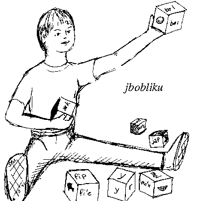

## Introductory

Morphology is the part of grammar that deals with the form of words. Lojban's morphology is fairly simple compared to that of many languages, because Lojban words don't change form depending on how they are used. English has only a small number of such changes compared to languages like Russian, but it does have changes like “boys” as the plural of “boy”, or “walked” as the past-tense form of “walk”. To make plurals or past tenses in Lojban, you add separate words to the sentence that express the number of boys, or the time when the walking was going on.

However, Lojban does have what is called “derivational morphology”: the capability of building new words from old words. In addition, the form of words tells us something about their grammatical uses, and sometimes about the means by which they entered the language. Lojban has very orderly rules for the formation of words of various types, both the words that already exist and new words yet to be created by speakers and writers.

A stream of Lojban sounds can be uniquely broken up into its component words according to specific rules. These so-called “morphology rules” are summarized in this chapter. (However, a detailed algorithm for breaking sounds into words has not yet been fully debugged, and so is not presented in this book.) First, here are some conventions used to talk about groups of Lojban letters, including vowels and consonants.

1. V represents any single Lojban vowel except _y_; that is, it represents _a_, _e_, _i_, _o_, or _u_.

2. VV represents either a diphthong, one of the following:

   |      |      |      |      |
   | ---- | ---- | ---- | ---- |
   | _ai_ | _ei_ | _oi_ | _au_ |

   or a two-syllable vowel pair with an apostrophe separating the vowels, one of the following:

   |       |       |       |       |       |
   | ----- | ----- | ----- | ----- | ----- |
   | _a'a_ | _a'e_ | _a'i_ | _a'o_ | _a'u_ |
   | _e'a_ | _e'e_ | _e'i_ | _e'o_ | _e'u_ |
   | _i'a_ | _i'e_ | _i'i_ | _i'o_ | _i'u_ |
   | _o'a_ | _o'e_ | _o'i_ | _o'o_ | _o'u_ |
   | _u'a_ | _u'e_ | _u'i_ | _u'o_ | _u'u_ |

3. C represents a single Lojban consonant, not including the apostrophe, one of _b_, _c_, _d_, _f_, _g_, _j_, _k_, _l_, _m_, _n_, _p_, _r_, _s_, _t_, _v_, _x_, or _z_ . Syllabic _l_, _m_, _n_, and _r_ always count as consonants for the purposes of this chapter.

4. CC represents two adjacent consonants of type C which constitute one of the 48 permissible initial consonant pairs:

   |      |      |   |   |      |      |      |      |   |   |      |      |
   | ---- | ---- | - | - | ---- | ---- | ---- | ---- | - | - | ---- | ---- |
   | _pl_ | _pr_ |   |   |      |      |      |      |   |   | _fl_ | _fr_ |
   | _bl_ | _br_ |   |   |      |      |      |      |   |   | _vl_ | _vr_ |
   |      |      |   |   |      |      |      |      |   |   |      |      |
   | _cp_ | _cf_ |   |   | _ct_ | _ck_ | _cm_ | _cn_ |   |   | _cl_ | _cr_ |
   | _jb_ | _jv_ |   |   | _jd_ | _jg_ | _jm_ |      |   |   |      |      |
   | _sp_ | _sf_ |   |   | _st_ | _sk_ | _sm_ | _sn_ |   |   | _sl_ | _sr_ |
   | _zb_ | _zv_ |   |   | _zd_ | _zg_ | _zm_ |      |   |   |      |      |
   |      |      |   |   |      |      |      |      |   |   |      |      |
   | _tc_ | _tr_ |   |   | _ts_ |      |      |      |   |   | _kl_ | _kr_ |
   | _dj_ | _dr_ |   |   | _dz_ |      |      |      |   |   | _gl_ | _gr_ |
   |      |      |   |   |      |      |      |      |   |   |      |      |
   | _ml_ | _mr_ |   |   |      |      |      |      |   |   | _xl_ | _xr_ |

5. C/C represents two adjacent consonants which constitute one of the permissible consonant pairs (not necessarily a permissible initial consonant pair). The permissible consonant pairs are explained in [Section 3.6](chapter03#section-clusters "3.6. Consonant Clusters"). In brief, any consonant pair is permissible unless it: contains two identical letters, contains both a voiced (excluding _r_, _l_, _m_, _n_) and an unvoiced consonant, or is one of certain specified forbidden pairs.

6. C/CC represents a consonant triple. The first two consonants must constitute a permissible consonant pair; the last two consonants must constitute a permissible initial consonant pair.

Lojban has three basic word classes – parts of speech – in contrast to the eight that are traditional in English. These three classes are called cmavo, brivla, and cmene. Each of these classes has uniquely identifying properties – an arrangement of letters that allows the word to be uniquely and unambiguously recognized as a separate word in a string of Lojban, upon either reading or hearing, and as belonging to a specific word-class.

They are also functionally different: cmavo are the structure words, corresponding to English words like “and”, “if”, “the” and “to”; brivla are the content words, corresponding to English words like “come”, “red”, “doctor”, and “freely”; cmene are proper names, corresponding to English “James”, “Afghanistan”, and “Pope John Paul II”.

## cmavo

[_selma'o_](glossary#valsi-selmaho), each having a specifically defined grammatical usage. The various selma'o are discussed throughout [Chapter 5](chapter05 "Chapter 5. “Pretty Little Girls' School”: The Structure Of Lojban selbri") to [Chapter 19](chapter19 "Chapter 19. Putting It All Together: Notes on the Structure of Lojban Texts") and summarized in [Chapter 20](chapter20 "Chapter 20. A Catalogue of selma'o").

Standard cmavo occur in four forms defined by their word structure. Here are some examples of the various forms:

|          |                                  |                                |                                  |                                |                                  |
| -------- | -------------------------------- | ------------------------------ | -------------------------------- | ------------------------------ | -------------------------------- |
| V-form   | _[.a](glossary#valsi-a)_      | _[.e](glossary#valsi-e)_    | _[.i](glossary#valsi-i)_      | _[.o](glossary#valsi-o)_    | _[.u](glossary#valsi-u)_      |
| CV-form  | _[ba](glossary#valsi-ba)_     | _[ce](glossary#valsi-ce)_   | _[di](glossary#valsi-di)_     | _[fo](glossary#valsi-fo)_   | _[gu](glossary#valsi-gu)_     |
| VV-form  | _[.au](glossary#valsi-au)_    | _[.ei](glossary#valsi-ei)_  | _[.ia](glossary#valsi-ia)_    | _[o'u](glossary#valsi-ohu)_ | _[u'e](glossary#valsi-uhe)_   |
| CVV-form | _[ki'a](glossary#valsi-kiha)_ | _[pei](glossary#valsi-pei)_ | _[mi'o](glossary#valsi-miho)_ | _[coi](glossary#valsi-coi)_ | _[cu'u](glossary#valsi-cuhu)_ |

In addition, there is the cmavo _[.y.](glossary#valsi-y)_ (remember that _y_ is not a V), which must have pauses before and after it.

A simple cmavo thus has the property of having only one or two vowels, or of having a single consonant followed by one or two vowels. Words consisting of three or more vowels in a row, or a single consonant followed by three or more vowels, are also of cmavo form, but are reserved for experimental use: a few examples are _ku'a'e_, _sau'e_, and _bai'ai_. All CVV cmavo beginning with the letter _x_ are also reserved for experimental use. In general, though, the form of a cmavo tells you little or nothing about its grammatical use.

“Experimental use” means that the language designers will not assign any standard meaning or usage to these words, and words and usages coined by Lojban speakers will not appear in official dictionaries for the indefinite future. Experimental-use words provide an escape hatch for adding grammatical mechanisms (as opposed to semantic concepts) the need for which was not foreseen.

The cmavo of VV-form include not only the diphthongs and vowel pairs listed in [Section 4.1](chapter04#section-morphology-introduction "4.1. Introductory"), but also the following ten additional diphthongs:

|                               |                               |                               |                               |                               |
| ----------------------------- | ----------------------------- | ----------------------------- | ----------------------------- | ----------------------------- |
| _[.ia](glossary#valsi-ia)_ | _[.ie](glossary#valsi-ie)_ | _[.ii](glossary#valsi-ii)_ | _[.io](glossary#valsi-io)_ | _[.iu](glossary#valsi-iu)_ |
| _[.ua](glossary#valsi-ua)_ | _[.ue](glossary#valsi-ue)_ | _[.ui](glossary#valsi-ui)_ | _[.uo](glossary#valsi-uo)_ | _[.uu](glossary#valsi-uu)_ |

In addition, cmavo can have the form _Cy_, a consonant followed by the letter _y_. These cmavo represent letters of the Lojban alphabet, and are discussed in detail in [Chapter 17](chapter17 "Chapter 17. As Easy As A-B-C? The Lojban Letteral System And Its Uses").

Compound cmavo are sequences of cmavo attached together to form a single written word. A compound cmavo is always identical in meaning and in grammatical use to the separated sequence of simple cmavo from which it is composed. These words are written in compound form merely to save visual space, and to ease the reader's burden in identifying when the component cmavo are acting together.

Compound cmavo, while not visually short like their components, can be readily identified by two characteristics:

1. They have no consonant pairs or clusters, and

2. They end in a vowel.

For example:

### Example 4.1.

- .iseci'i

- .i se ci'i

### Example 4.2.

- punaijecanai

- pu nai je ca nai

### Example 4.3.

- ki'e.u'e

- ki'e .u'e

The cmavo _[u'e](glossary#valsi-uhe)_ begins with a vowel, and like all words beginning with a vowel, requires a pause (represented by _._) before it. This pause cannot be omitted simply because the cmavo is incorporated into a compound cmavo. On the other hand,

### Example 4.4.

ki'e'u'e

is a single cmavo reserved for experimental purposes: it has four vowels.

### Example 4.5.

- cy.ibu.abu

- cy. .ibu .abu

Again the pauses are required (see [Section 4.9](chapter04#section-pauses "4.9. Rules for inserting pauses")); the pause after _[cy.](glossary#valsi-cy)_ merges with the pause before _[.ibu](glossary#valsi-ibu)_.

There is no particular stress required in cmavo or their compounds. Some conventions do exist that are not mandatory. For two-syllable cmavo, for example, stress is typically placed on the first vowel; an example is

### Example 4.6.

- .e'o ko ko kurji

- .E'o ko ko KURji

This convention results in a consistent rhythm to the language, since brivla are required to have penultimate stress; some find this esthetically pleasing.

If the final syllable of one word is stressed, and the first syllable of the next word is stressed, you must insert a pause or glottal stop between the two stressed syllables. Thus

### Example 4.7.

le re nanmu

can be optionally pronounced

### Example 4.8.

- le RE. NANmu

since there are no rules forcing stress on either of the first two words; the stress on _[re](glossary#valsi-re)_, though, demands that a pause separate _[re](glossary#valsi-re)_ from the following syllable _nan_ to ensure that the stress on _nan_ is properly heard as a stressed syllable. The alternative pronunciation

### Example 4.9.

- LE re NANmu

is also valid; this would apply secondary stress (used for purposes of emphasis, contrast or sentence rhythm) to _[le](glossary#valsi-le)_, comparable in rhythmical effect to the English phrase “THE two men”. In [Example 4.8](chapter04#example-random-id-dfzc "Example 4.8. "), the secondary stress on _[re](glossary#valsi-re)_ would be similar to that in the English phrase “the TWO men”.

Both cmavo may also be left unstressed, thus:

### Example 4.10.

- le re NANmu

This would probably be the most common usage.

## brivla

Predicate words, called _[brivla](glossary#valsi-brivla)_, are at the core of Lojban. They carry most of the semantic information in the language. They serve as the equivalent of English nouns, verbs, adjectives, and adverbs, all in a single part of speech.

Every brivla belongs to one of three major subtypes. These subtypes are defined by the form, or morphology, of the word – all words of a particular structure can be assigned by sight or sound to a particular type (cmavo, brivla, or cmene) and subtype. Knowing the type and subtype then gives you, the reader or listener, significant clues to the meaning and the origin of the word, even if you have never heard the word before.

The same principle allows you, when speaking or writing, to invent new brivla for new concepts “on the fly”; yet it offers people that you are trying to communicate with a good chance to figure out your meaning. In this way, Lojban has a flexible vocabulary which can be expanded indefinitely.

All brivla have the following properties:

1. always end in a vowel;

2. always contain a consonant pair in the first five letters, where _y_ and apostrophe are not counted as letters for this purpose (see [Section 4.6](chapter04#section-rafsi "4.6. rafsi").);

3. always are stressed on the next-to-the-last (penultimate) syllable; this implies that they have two or more syllables.

The presence of a consonant pair distinguishes brivla from cmavo and their compounds. The final vowel distinguishes brivla from cmene, which always end in a consonant. Thus _da'amei_ must be a compound cmavo because it lacks a consonant pair; _[lojban.](glossary#valsi-lojban)_ must be a name because it lacks a final vowel.

Thus, _bisycla_ has the consonant pair _sc_ in the first five non- _y_ letters even though the _sc_ actually appears in the form of _[sy.](glossary#valsi-sy)_. Similarly, the word _ro'inre'o_ contains _nr_ in the first five letters because the apostrophes are not counted for this purpose.

The three subtypes of brivla are:

1. gismu, the Lojban primitive roots from which all other brivla are built;

2. lujvo, the compounds of two or more gismu; and

3. fu'ivla (literally “copy-word”), the specialized words that are not Lojban primitives or natural compounds, and are therefore borrowed from other languages.

## gismu

The gismu, or Lojban root words, are those brivla representing concepts most basic to the language. The gismu were chosen for various reasons: some represent concepts that are very familiar and basic; some represent concepts that are frequently used in other languages; some were added because they would be helpful in constructing more complex words; some because they represent fundamental Lojban concepts (like _[cmavo](glossary#valsi-cmavo)_ and _[gismu](glossary#valsi-gismu)_ themselves).

The gismu do not represent any sort of systematic partitioning of semantic space. Some gismu may be superfluous, or appear for historical reasons: the gismu list was being collected for almost 35 years and was only weeded out once. Instead, the intention is that the gismu blanket semantic space: they make it possible to talk about the entire range of human concerns.

There are about 1350 gismu. In learning Lojban, you need only to learn most of these gismu and their combining forms (known as _[rafsi](glossary#valsi-rafsi)_) as well as perhaps 200 major cmavo, and you will be able to communicate effectively in the language. This may sound like a lot, but it is a small number compared to the vocabulary needed for similar communications in other languages.

All gismu have very strong form restrictions. Using the conventions defined in [Section 4.1](chapter04#section-morphology-introduction "4.1. Introductory"), all gismu are of the forms CVC/CV or CCVCV. They must meet the rules for all brivla given in [Section 4.3](chapter04#section-morphology-brivla "4.3. brivla"); furthermore, they:

1. always have five letters;

2. always start with a consonant and end with a single vowel;

3. always contain exactly one consonant pair, which is a permissible initial pair (CC) if it's at the beginning of the gismu, but otherwise only has to be a permissible pair (C/C);

4. are always stressed on the first syllable (since that is penultimate).

The five letter length distinguishes gismu from lujvo and fu'ivla. In addition, no gismu contains _'_ .

With the exception of five special brivla variables, _[broda](glossary#valsi-broda)_, _[brode](glossary#valsi-brode)_, _[brodi](glossary#valsi-brodi)_, _[brodo](glossary#valsi-brodo)_, and _[brodu](glossary#valsi-brodu)_, no two gismu differ only in the final vowel. Furthermore, the set of gismu was specifically designed to reduce the likelihood that two similar sounding gismu could be confused. For example, because _[gismu](glossary#valsi-gismu)_ is in the set of gismu, _kismu_, _xismu_, _gicmu_, _gizmu_, and _gisnu_ cannot be.

Almost all Lojban gismu are constructed from pieces of words drawn from other languages, specifically Chinese, English, Hindi, Spanish, Russian, and Arabic, the six most widely spoken natural languages. For a given concept, words in the six languages that represent that concept were written in Lojban phonetics. Then a gismu was selected to maximize the recognizability of the Lojban word for speakers of the six languages by weighting the inclusion of the sounds drawn from each language by the number of speakers of that language. See [Section 4.14](chapter04#section-gismu-making "4.14. The gismu creation algorithm") for a full explanation of the algorithm.

Here are a few examples of gismu, with rough English equivalents (not definitions):

### Example 4.11.

|       |
| ----- |
| creka |

|       |
| ----- |
| shirt |

### Example 4.12.

|       |
| ----- |
| lijda |

|          |
| -------- |
| religion |

### Example 4.13.

|       |
| ----- |
| blanu |

|      |
| ---- |
| blue |

### Example 4.14.

|       |
| ----- |
| mamta |

|        |
| ------ |
| mother |

### Example 4.15.

|       |
| ----- |
| cukta |

|      |
| ---- |
| book |

### Example 4.16.

|       |
| ----- |
| patfu |

|        |
| ------ |
| father |

### Example 4.17.

|       |
| ----- |
| nanmu |

|     |
| --- |
| man |

### Example 4.18.

|       |
| ----- |
| ninmu |

|       |
| ----- |
| woman |

A small number of gismu were formed differently; see [Section 4.15](chapter04#section-cultural-gismu "4.15. Cultural and other non-algorithmic gismu") for a list.

## lujvo

When specifying a concept that is not found among the gismu (or, more specifically, when the relevant gismu seems too general in meaning), a Lojbanist generally attempts to express the concept as a tanru. Lojban tanru are an elaboration of the concept of “metaphor” used in English. In Lojban, any brivla can be used to modify another brivla. The first of the pair modifies the second. This modification is usually restrictive – the modifying brivla reduces the broader sense of the modified brivla to form a more narrow, concrete, or specific concept. Modifying brivla may thus be seen as acting like English adverbs or adjectives. For example,

### Example 4.19.

skami pilno

is the tanru which expresses the concept of “computer user”.

The simplest Lojban tanru are pairings of two concepts or ideas. Such tanru take two simpler ideas that can be represented by gismu and combine them into a single more complex idea. Two-part tanru may then be recombined in pairs with other tanru, or with individual gismu, to form more complex or more specific ideas, and so on.

The meaning of a tanru is usually at least partly ambiguous: _skami pilno_ could refer to a computer that is a user, or to a user of computers. There are a variety of ways that the modifier component can be related to the modified component. It is also possible to use cmavo within tanru to provide variations (or to prevent ambiguities) of meaning.

Making tanru is essentially a poetic or creative act, not a science. While the syntax expressing the grouping relationships within tanru is unambiguous, tanru are still semantically ambiguous, since the rules defining the relationships between the gismu are flexible. The process of devising a new tanru is dealt with in detail in [Chapter 5](chapter05 "Chapter 5. “Pretty Little Girls' School”: The Structure Of Lojban selbri").

To express a simple tanru, simply say the component gismu together. Thus the binary metaphor “big boat” becomes the tanru

### Example 4.20.

barda bloti

representing roughly the same concept as the English word “ship”.

The binary metaphor “father mother” can refer to a paternal grandmother (“a father-ly type of mother”), while “mother father” can refer to a maternal grandfather (“a mother-ly type of father”). In Lojban, these become the tanru

### Example 4.21.

patfu mamta

and

### Example 4.22.

mamta patfu

respectively.

The possibility of semantic ambiguity can easily be seen in the last case. To interpret [Example 4.22](chapter04#example-random-id-KQ4s "Example 4.22. "), the listener must determine what type of motherliness pertains to the father being referred to. In an appropriate context, _mamta patfu_ could mean not “grandfather” but simply “father with some motherly attributes”, depending on the culture. If absolute clarity is required, there are ways to expand upon and explain the exact interrelationship between the components; but such detail is usually not needed.

When a concept expressed in a tanru proves useful, or is frequently expressed, it is desirable to choose one of the possible meanings of the tanru and assign it to a new brivla. For [Example 4.19](chapter04#example-random-id-xhQP "Example 4.19. "), we would probably choose “user of computers”, and form the new word

### Example 4.23.

|        |
| ------ |
| sampli |

Such a brivla, built from the rafsi which represent its component words, is called a _[lujvo](glossary#valsi-lujvo)_. Another example, corresponding to the tanru of [Example 4.20](chapter04#example-random-id-oLE3 "Example 4.20. "), would be:

### Example 4.24.

|            |
| ---------- |
| bralo'i    |
| “big-boat” |
| ship       |

The lujvo representing a given tanru is built from units representing the component gismu. These units are called _[rafsi](glossary#valsi-rafsi)_ in Lojban. Each rafsi represents only one gismu. The rafsi are attached together in the order of the words in the tanru, occasionally inserting so-called “hyphen” letters to ensure that the pieces stick together as a single word and cannot accidentally be broken apart into cmavo, gismu, or other word forms. As a result, each lujvo can be readily and accurately recognized, allowing a listener to pick out the word from a string of spoken Lojban, and if necessary, unambiguously decompose the word to a unique source tanru, thus providing a strong clue to its meaning.

The lujvo that can be built from the tanru _mamta patfu_ in [Example 4.22](chapter04#example-random-id-KQ4s "Example 4.22. ") is

### Example 4.25.

|         |
| ------- |
| mampa'u |

which refers specifically to the concept “maternal grandfather”. The two gismu that constitute the tanru are represented in _mampa'u_ by the rafsi _mam-_ and _-pa'u_, respectively; these two rafsi are then concatenated together to form _mampa'u_.

Like gismu, lujvo have only one meaning. When a lujvo is formally entered into a dictionary of the language, a specific definition will be assigned based on one particular interrelationship between the terms. (See [Chapter 12](chapter12 "Chapter 12. Dog House And White House: Determining lujvo Place Structures") for how this has been done.) Unlike gismu, lujvo may have more than one form. This is because there is no difference in meaning between the various rafsi for a gismu when they are used to build a lujvo. A long rafsi may be used, especially in noisy environments, in place of a short rafsi; the result is considered the same lujvo, even though the word is spelled and pronounced differently. Thus the word _[brivla](glossary#valsi-brivla)_, built from the tanru _bridi valsi_, is the same lujvo as _brivalsi_, _bridyvla_, and _bridyvalsi_, each of which uses a different combination of rafsi.

When assembling rafsi together into lujvo, the rules for valid brivla must be followed: a consonant cluster must occur in the first five letters (excluding _y_ and _'_ ), and the lujvo must end in a vowel.

A _y_ (which is ignored in determining stress or consonant clusters) is inserted in the middle of the consonant cluster to glue the word together when the resulting cluster is either not permissible or the word is likely to break up. There are specific rules describing these conditions, detailed in [Section 4.6](chapter04#section-rafsi "4.6. rafsi").

An _r_ (in some cases, an _n_) is inserted when a CVV-form rafsi attaches to the beginning of a lujvo in such a way that there is no consonant cluster. For example, in the lujvo

### Example 4.26.

|                    |
| ------------------ |
| soirsai            |
| from _sonci sanmi_ |
| “soldier meal”     |
| field rations      |

the rafsi _soi-_ and _-sai_ are joined, with the additional _r_ making up the _rs_ consonant pair needed to make the word a brivla. Without the _r_, the word would break up into _soi sai_, two cmavo. The pair of cmavo have no relation to their rafsi lookalikes; they will either be ungrammatical (as in this case), or will express a different meaning from what was intended.

Learning rafsi and the rules for assembling them into lujvo is clearly seen to be necessary for fully using the potential Lojban vocabulary.

Most important, it is possible to invent new lujvo while you speak or write in order to represent a new or unfamiliar concept, one for which you do not know any existing Lojban word. As long as you follow the rules for building these compounds, there is a good chance that you will be understood without explanation.

## rafsi

Every gismu has from two to five rafsi, each of a different form, but each such rafsi represents only one gismu. It is valid to use any of the rafsi forms in building lujvo – whichever the reader or listener will most easily understand, or whichever is most pleasing – subject to the rules of lujvo making. There is a scoring algorithm which is intended to determine which of the possible and legal lujvo forms will be the standard dictionary form (see [Section 4.12](chapter04#section-lujvo-scoring "4.12. The lujvo scoring algorithm")).

Each gismu always has at least two rafsi forms; one is the gismu itself (used only at the end of a lujvo), and one is the gismu without its final vowel (used only at the beginning or middle of a lujvo). These forms are represented as CVC/CV or CCVCV (called “the 5-letter rafsi”), and CVC/C or CCVC (called “the 4-letter rafsi”) respectively. The dashes in these rafsi form representations show where other rafsi may be attached to form a valid lujvo. When lujvo are formed only from 4-letter and 5-letter rafsi, known collectively as “long rafsi”, they are called “unreduced lujvo”.

Some examples of unreduced lujvo forms are:

### Example 4.27.

|                                           |
| ----------------------------------------- |
| mamtypatfu                                |
| from _mamta patfu_                        |
| “mother father” or “maternal grandfather” |

### Example 4.28.

|                                      |
| ------------------------------------ |
| lerfyliste                           |
| from _lerfu liste_                   |
| “letter list” or a “list of letters” |
| (letters of the alphabet)            |

### Example 4.29.

|                                  |
| -------------------------------- |
| nancyprali                       |
| from _nanca prali_               |
| “year profit” or “annual profit” |

### Example 4.30.

|                                                 |
| ----------------------------------------------- |
| prunyplipe                                      |
| from _pruni plipe_                              |
| “elastic (springy) leap” or “spring” (the verb) |

### Example 4.31.

|                            |
| -------------------------- |
| vancysanmi                 |
| from _vanci sanmi_         |
| “evening meal” or “supper” |

In addition to these two forms, each gismu may have up to three additional short rafsi, three letters long. All short rafsi have one of the forms CVC, CCV, or CVV. The total number of rafsi forms that are assigned to a gismu depends on how useful the gismu is, or is presumed to be, in making lujvo, when compared to other gismu that could be assigned the rafsi.

For example, _[zmadu](glossary#valsi-zmadu)_ (“more than”) has the two short rafsi _zma_ and _mau_ (in addition to its unreduced rafsi _zmad_ and _[zmadu](glossary#valsi-zmadu)_), because a vast number of lujvo have been created based on _[zmadu](glossary#valsi-zmadu)_, corresponding in general to English comparative adjectives ending in “-er” such as “whiter” (Lojban _labmau_). On the other hand, _[bakri](glossary#valsi-bakri)_ (“chalk”) has no short rafsi and few lujvo.

There are at most one CVC-form, one CCV-form, and one CVV-form rafsi per gismu. In fact, only a tiny handful of gismu have both a CCV-form and a CVV-form rafsi assigned, and still fewer have all three forms of short rafsi. However, gismu with both a CVC-form and another short rafsi are fairly common, partly because more possible CVC-form rafsi exist. Yet CVC-form rafsi, even though they are fairly easy to remember, cannot be used at the end of a lujvo (because lujvo must end in vowels), so justifying the assignment of an additional short rafsi to many gismu.

The intention was to use the available “rafsi space”- the set of all possible short rafsi forms – in the most efficient way possible; the goal is to make the most-used lujvo as short as possible (thus maximizing the use of short rafsi), while keeping the rafsi very recognizable to anyone who knows the source gismu. For this reason, the letters in a rafsi have always been chosen from among the five letters of the corresponding gismu. As a result, there are a limited set of short rafsi available for assignment to each gismu. At most seven possible short rafsi are available for consideration (of which at most three can be used, as explained above).

[_sakli_](glossary#valsi-sakli). The digits in the second column represent the gismu letters used to form the rafsi.

|     |      |          |
| --- | ---- | -------- |
| CVC | 123  | _-sak-_  |
| CVC | 124  | _-sal-_  |
| CVV | 12'5 | _-sa'i-_ |
| CVV | 125  | _-sai-_  |
| CCV | 345  | _-kli-_  |
| CCV | 132  | _-ska-_  |

(The only actual short rafsi for _[sakli](glossary#valsi-sakli)_ is _-sal-_.)

For gismu of the form CCVCV, like _[blaci](glossary#valsi-blaci)_, the only short rafsi forms that can exist are:

|     |      |          |
| --- | ---- | -------- |
| CVC | 134  | _-bac-_  |
| CVC | 234  | _-lac_   |
| CVV | 13'5 | _-ba'i-_ |
| CVV | 135  | _-bai-_  |
| CVV | 23'5 | _-la'i-_ |
| CVV | 235  | _-lai-_  |
| CCV | 123  | _-bla-_  |

(In fact, _[blaci](glossary#valsi-blaci)_ has none of these short rafsi; they are all assigned to other gismu. Lojban speakers are not free to reassign any of the rafsi; the tables shown here are to help understand how the rafsi were chosen in the first place.)

There are a few restrictions: a CVV-form rafsi without an apostrophe cannot exist unless the vowels make up one of the four diphthongs _ai_, _ei_, _oi_, or _au_; and a CCV-form rafsi is possible only if the two consonants form a permissible initial consonant pair (see [Section 4.1](chapter04#section-morphology-introduction "4.1. Introductory")). Thus _[mamta](glossary#valsi-mamta)_, which has the same form as _[salci](glossary#valsi-salci)_, can only have _mam_, _mat_, and _ma'a_ as possible rafsi: in fact, only _mam_ is assigned to it.

Some cmavo also have associated rafsi, usually CVC-form. For example, the ten common numerical digits, which are all CV form cmavo, each have a CVC-form rafsi formed by adding a consonant to the cmavo. Most cmavo that have rafsi are ones used in composing tanru.

The term for a lujvo made up solely of short rafsi is “fully reduced lujvo”. Here are some examples of fully reduced lujvo:

### Example 4.32.

|                       |
| --------------------- |
| cumfri                |
| from _cumki lifri_    |
| “possible experience” |

### Example 4.33.

|                    |
| ------------------ |
| klezba             |
| from _klesi zbasu_ |
| “category make”    |

### Example 4.34.

|                    |
| ------------------ |
| kixta'a            |
| from _krixa tavla_ |
| “cry-out talk”     |

### Example 4.35.

|                    |
| ------------------ |
| sniju'o            |
| from _sinxa djuno_ |
| “sign know”        |

In addition, the unreduced forms in [Example 4.27](chapter04#example-random-id-qj84 "Example 4.27. ") and [Example 4.28](chapter04#example-random-id-qj99 "Example 4.28. ") may be fully reduced to:

### Example 4.36.

|                                           |
| ----------------------------------------- |
| mampa'u                                   |
| from _mamta patfu_                        |
| “mother father” or “maternal grandfather” |

### Example 4.37.

|                                      |
| ------------------------------------ |
| lerste                               |
| from _lerfu liste_                   |
| “letter list” or a “list of letters” |

As noted above, CVC-form rafsi cannot appear as the final rafsi in a lujvo, because all lujvo must end with one or two vowels. As a brivla, a lujvo must also contain a consonant cluster within the first five letters – this ensures that they cannot be mistaken for compound cmavo. Of course, all lujvo have at least six letters since they have two or more rafsi, each at least three letters long; hence they cannot be confused with gismu.

When attaching two rafsi together, it may be necessary to insert a hyphen letter. In Lojban, the term “hyphen” always refers to a letter, either the vowel _y_ or one of the consonants _r_ and _n_. (The letter _l_ can also be a hyphen, but is not used as one in lujvo.)

The y-hyphen is used after a CVC-form rafsi when joining it with the following rafsi could result in an impermissible consonant pair, or when the resulting lujvo could fall apart into two or more words (either cmavo or gismu).

Thus, the tanru _pante tavla_ (“protest talk”) cannot produce the lujvo _patta'a_, because _tt_ is not a permissible consonant pair; the lujvo must be _[patyta'a](glossary#valsi-patytaha)_. Similarly, the tanru _mudri siclu_ (“wooden whistle”) cannot form the lujvo _mudsiclu_; instead, _mudysiclu_ must be used. (Remember that _y_ is not counted in determining whether the first five letters of a brivla contain a consonant cluster: this is why.)

The y-hyphen is also used to attach a 4-letter rafsi, formed by dropping the final vowel of a gismu, to the following rafsi. (This procedure was shown, but not explained, in [Example 4.27](chapter04#example-random-id-qj84 "Example 4.27. ") to [Example 4.31](chapter04#example-random-id-qjbP "Example 4.31. ").)

The lujvo forms _zunlyjamfu_, _zunlyjma_, _zuljamfu_, and _[zuljma](glossary#valsi-zuljma)_ are all legitimate and equivalent forms made from the tanru _zunle jamfu_ (“left foot”). Of these, _[zuljma](glossary#valsi-zuljma)_ is the preferred one since it is the shortest; it thus is likely to be the form listed in a Lojban dictionary.

The r-hyphen and its close relative, the n-hyphen, are used in lujvo only after CVV-form rafsi. A hyphen is always required in a two-part lujvo of the form CVV-CVV, since otherwise there would be no consonant cluster.

An r-hyphen or n-hyphen is also required after the CVV-form rafsi of any lujvo of the form CVV-CVC/CV or CVV-CCVCV since it would otherwise fall apart into a CVV-form cmavo and a gismu. In any lujvo with more than two parts, a CVV-form rafsi in the initial position must always be followed by a hyphen. If the hyphen were to be omitted, the supposed lujvo could be broken into smaller words without the hyphen: because the CVV-form rafsi would be interpreted as a cmavo, and the remainder of the word as a valid lujvo that is one rafsi shorter.

An n-hyphen is only used in place of an r-hyphen when the following rafsi begins with _r_. For example, the tanru _rokci renro_ (“rock throw”) cannot be expressed as _ro'ire'o_ (which breaks up into two cmavo), nor can it be _ro'irre'o_ (which has an impermissible double consonant); the n-hyphen is required, and the correct form of the hyphenated lujvo is _ro'inre'o_. The same lujvo could also be expressed without hyphenation as _rokre'o_.

There is also a different way of building lujvo, or rather phrases which are grammatically and semantically equivalent to lujvo. You can make a phrase containing any desired words, joining each pair of them with the special cmavo _[zei](glossary#valsi-zei)_. Thus,

### Example 4.38.

|                 |
| --------------- |
| bridi zei valsi |

is the exact equivalent of _[brivla](glossary#valsi-brivla)_ (but not necessarily the same as the underlying tanru _bridi valsi_, which could have other meanings.) Using _[zei](glossary#valsi-zei)_ is the only way to get a cmavo lacking a rafsi, a cmene, or a fu'ivla into a lujvo:

### Example 4.39.

|               |
| ------------- |
| xy. zei kantu |
| X ray         |

### Example 4.40.

|                        |
| ---------------------- |
| kulnr,farsi zei lolgai |
| “Farsi floor-cover”    |
| Persian rug            |

### Example 4.41.

|                                            |
| ------------------------------------------ |
| na'e zei .a zei na'e zei by. livgyterbilma |
| “non-A, non-B liver-disease”               |
| non-A, non-B hepatitis                     |

### Example 4.42.

|                       |
| --------------------- |
| .cerman. zei jamkarce |
| “Sherman war-car”     |
| Sherman tank          |

[Example 4.41](chapter04#example-random-id-qJef "Example 4.41. ") is particularly noteworthy because the phrase that would be produced by removing the _[zei](glossary#valsi-zei)_&#x73; from it doesn't end with a brivla, and in fact is not even grammatical. As written, the example is a tanru with two components, but by adding a _[zei](glossary#valsi-zei)_ between _[by.](glossary#valsi-by)_ and _livgyterbilma_ to produce

### Example 4.43.

|                                                |
| ---------------------------------------------- |
| na'e zei .a zei na'e zei by. zei livgyterbilma |
| non-A-non-B-hepatitis                          |

the whole phrase would become a single lujvo. The longer lujvo of [Example 4.43](chapter04#example-random-id-Wnaz "Example 4.43. ") may be preferable, because its place structure can be built from that of _[bilma](glossary#valsi-bilma)_, whereas the place structure of a lujvo without a brivla must be constructed ad hoc.

Note that rafsi may not be used in _[zei](glossary#valsi-zei)_ phrases, because they are not words. CVV rafsi look like words (specifically cmavo) but there can be no confusion between the two uses of the same letters, because cmavo appear only as separate words or in compound cmavo (which are really just a notation for writing separate but closely related words as if they were one); rafsi appear only as parts of lujvo.

## fu'ivla

The use of tanru or lujvo is not always appropriate for very concrete or specific terms (e.g. “brie” or “cobra”), or for jargon words specialized to a narrow field (e.g. “quark”, “integral”, or “iambic pentameter”). These words are in effect names for concepts, and the names were invented by speakers of another language. The vast majority of words referring to plants, animals, foods, and scientific terminology cannot be easily expressed as tanru. They thus must be borrowed (actually “copied”) into Lojban from the original language.

There are four stages of borrowing in Lojban, as words become more and more modified (but shorter and easier to use). Stage 1 is the use of a foreign name quoted with the cmavo _[la'o](glossary#valsi-laho)_ (explained in full in [Section 19.10](chapter19#section-more-quotations "19.10. More on quotations: ZO, ZOI")):

### Example 4.44.

me la'o ly. spaghetti .ly.

is a predicate with the place structure “x1 is a quantity of spaghetti”.

Stage 2 involves changing the foreign name to a Lojbanized name, as explained in [Section 4.8](chapter04#section-cmene "4.8. cmene"):

### Example 4.45.

me la spagetis.

One of these expedients is often quite sufficient when you need a word quickly in conversation. (This can make it easier to get by when you do not yet have full command of the Lojban vocabulary, provided you are talking to someone who will recognize the borrowing.)

Where a little more universality is desired, the word to be borrowed must be Lojbanized into one of several permitted forms. A rafsi is then usually attached to the beginning of the Lojbanized form, using a hyphen to ensure that the resulting word doesn't fall apart.

The rafsi categorizes or limits the meaning of the fu'ivla; otherwise a word having several different jargon meanings in other languages would require the word-inventor to choose which meaning should be assigned to the fu'ivla, since fu'ivla (like other brivla) are not permitted to have more than one definition. Such a Stage 3 borrowing is the most common kind of fu'ivla.

Finally, Stage 4 fu'ivla do not have any rafsi classifier, and are used where a fu'ivla has become so common or so important that it must be made as short as possible. (See [Section 4.16](chapter04#section-rafsi-fuhivla "4.16. rafsi fu'ivla: a proposal") for a proposal concerning Stage 4 fu'ivla.)

The form of a fu'ivla reliably distinguishes it from both the gismu and the cmavo. Like cultural gismu, fu'ivla are generally based on a word from a single non-Lojban language. The word is “borrowed” (actually “copied”, hence the Lojban tanru _fukpi valsi_) from the other language and Lojbanized – the phonemes are converted to their closest Lojban equivalent and modifications are made as necessary to make the word a legitimate Lojban fu'ivla-form word. All fu'ivla:

1. must contain a consonant cluster in the first five letters of the word; if this consonant cluster is at the beginning, it must either be a permissible initial consonant pair, or a longer cluster such that each pair of adjacent consonants in the cluster is a permissible initial consonant pair: _spraile_ is acceptable, but not _ktraile_ or _trkaile_;

2. must end in one or more vowels;

3. must not be gismu or lujvo, or any combination of cmavo, gismu, and lujvo; furthermore, a fu'ivla with a CV cmavo joined to the front of it must not have the form of a lujvo (the so-called “slinku'i test”, not discussed further in this book);

4. cannot contain _y_, although they may contain syllabic pronunciations of Lojban consonants;

5. like other brivla, are stressed on the penultimate syllable.

Note that consonant triples or larger clusters that are not at the beginning of a fu'ivla can be quite flexible, as long as all consonant pairs are permissible. There is no need to restrict fu'ivla clusters to permissible initial pairs except at the beginning.

This is a fairly liberal definition and allows quite a lot of possibilities within “fu'ivla space”. Stage 3 fu'ivla can be made easily on the fly, as lujvo can, because the procedure for forming them always guarantees a word that cannot violate any of the rules. Stage 4 fu'ivla require running tests that are not simple to characterize or perform, and should be made only after deliberation and by someone knowledgeable about all the considerations that apply.

Here is a simple and reliable procedure for making a non-Lojban word into a valid Stage 3 fu'ivla:

1. Eliminate all double consonants and silent letters.

2. Convert all sounds to their closest Lojban equivalents. Lojban _y_, however, may not be used in any fu'ivla.

3. If the last letter is not a vowel, modify the ending so that the word ends in a vowel, either by removing a final consonant or by adding a suggestively chosen final vowel.

4. If the first letter is not a consonant, modify the beginning so that the word begins with a consonant, either by removing an initial vowel or adding a suggestively chosen initial consonant.

5. Prefix the result of steps 1-5 with a 4-letter rafsi that categorizes the fu'ivla into a “topic area”. It is only safe to use a 4-letter rafsi; short rafsi sometimes produce invalid fu'ivla. Hyphenate the rafsi to the rest of the fu'ivla with an r-hyphen; if that would produce a double _r_, use an n-hyphen instead; if the rafsi ends in _r_ and the rest of the fu'ivla begins with _n_ (or vice versa), or if the rafsi ends in "r" and the rest of the fu'ivla begins with "tc", "ts", "dj", or "dz" (using "n" would result in a phonotactically impermissible cluster), use an l-hyphen. (This is the only use of l-hyphen in Lojban.)

   Alternatively, if a CVC-form short rafsi is available it can be used instead of the long rafsi.

6. Remember that the stress necessarily appears on the penultimate (next-to-the-last) syllable.

In this section, the hyphen is set off with commas in the examples, but these commas are not required in writing, and the hyphen need not be pronounced as a separate syllable.

Here are a few examples:

### Example 4.46.

|                                     |
| ----------------------------------- |
| spaghetti (from English or Italian) |
| spageti (Lojbanize)                 |
| cidj,r,spageti (prefix long rafsi)  |
| dja,r,spageti (prefix short rafsi)  |

where _cidj-_ is the 4-letter rafsi for _[cidja](glossary#valsi-cidja)_, the Lojban gismu for “food”, thus categorizing _[cidjrspageti](glossary#valsi-cidjrspageti)_ as a kind of food. The form with the short rafsi happens to work, but such good fortune cannot be relied on: in any event, it means the same thing.

### Example 4.47.

|                                                |
| ---------------------------------------------- |
| Acer (the scientific name of maple trees)      |
| acer (Lojbanize)                               |
| xaceru (add initial consonant and final vowel) |
| tric,r,xaceru (prefix rafsi)                   |
| ric,r,xaceru (prefix short rafsi)              |

where _tric-_ and _ric-_ are rafsi for _[tricu](glossary#valsi-tricu)_, the gismu for “tree”. Note that by the same principles, “maple sugar” could get the fu'ivla _saktrxaceru_, or could be represented by the tanru _tricrxaceru sakta_. Technically, _ricrxaceru_ and _tricrxaceru_ are distinct fu'ivla, but they would surely be given the same meanings if both happened to be in use.

### Example 4.48.

|                           |
| ------------------------- |
| brie (from French)        |
| bri (Lojbanize)           |
| cirl,r,bri (prefix rafsi) |

where _cirl-_ represents _[cirla](glossary#valsi-cirla)_ (“cheese”).

### Example 4.49.

|                             |
| --------------------------- |
| cobra                       |
| kobra (Lojbanize)           |
| sinc,r,kobra (prefix rafsi) |

where _sinc-_ represents _[since](glossary#valsi-since)_ (“snake”).

### Example 4.50.

|                              |
| ---------------------------- |
| quark                        |
| kuark (Lojbanize)            |
| kuarka (add final vowel)     |
| sask,r,kuarka (prefix rafsi) |

where _sask-_ represents _[saske](glossary#valsi-saske)_ (“science”). Note the extra vowel _a_ added to the end of the word, and the diphthong _ua_, which never appears in gismu or lujvo, but may appear in fu'ivla.

### Example 4.51.

|                             |
| --------------------------- |
| 자모 (from Korean)            |
| djamo (Lojbanize)           |
| lerf,r,djamo (prefix rafsi) |
| ler,l,djamo (prefix rafsi)  |

where _ler-_ represents _[lerfu](glossary#valsi-lerfu)_ (“letter”). Note the l-hyphen in "lerldjamo", since "lerndjamo" contains the forbidden cluster "ndj".

The use of the prefix helps distinguish among the many possible meanings of the borrowed word, depending on the field. As it happens, _[spageti](glossary#valsi-spageti)_ and _[kuarka](glossary#valsi-kuarka)_ are valid Stage 4 fu'ivla, but _xaceru_ looks like a compound cmavo, and _kobra_ like a gismu.

For another example, “integral” has a specific meaning to a mathematician. But the Lojban fu'ivla _integrale_, which is a valid Stage 4 fu'ivla, does not convey that mathematical sense to a non-mathematical listener, even one with an English-speaking background; its source – the English word “integral” – has various other specialized meanings in other fields.

Left uncontrolled, _integrale_ almost certainly would eventually come to mean the same collection of loosely related concepts that English associates with “integral”, with only the context to indicate (possibly) that the mathematical term is meant.

The prefix method would render the mathematical concept as _cmacrntegrale_, if the _i_ of _integrale_ is removed, or something like _cmacrnintegrale_, if a new consonant is added to the beginning; _cmac-_ is the rafsi for _[cmaci](glossary#valsi-cmaci)_ (“mathematics”). The architectural sense of “integral” might be conveyed with _dinjrnintegrale_ or _tarmrnintegrale_, where _[dinju](glossary#valsi-dinju)_ and _[tarmi](glossary#valsi-tarmi)_ mean “building” and “form” respectively.

Here are some fu'ivla representing cultures and related things, shown with more than one rafsi prefix:

### Example 4.52.

|                         |
| ----------------------- |
| bang,r,blgaria          |
| Bulgarian (in language) |

### Example 4.53.

|                        |
| ---------------------- |
| kuln,r,blgaria         |
| Bulgarian (in culture) |

### Example 4.54.

|                        |
| ---------------------- |
| gugd,r,blgaria         |
| Bulgaria (the country) |

### Example 4.55.

|                       |
| --------------------- |
| bang,r,kore,a         |
| Korean (the language) |

### Example 4.56.

|                      |
| -------------------- |
| kuln,r,kore,a        |
| Korean (the culture) |

Note the commas in [Example 4.55](chapter04#example-random-id-qJGv "Example 4.55. ") and [Example 4.56](chapter04#example-random-id-qjh0 "Example 4.56. "), used because _ea_ is not a valid diphthong in Lojban. Arguably, some form of the native name “Chosen” should have been used instead of the internationally known “Korea”; this is a recurring problem in all borrowings. In general, it is better to use the native name unless using it will severely impede understanding: “Navajo” is far more widely known than “Dine'e”.

## cmene

Lojbanized names, called _[cmene](glossary#valsi-cmene)_, are very much like their counterparts in other languages. They are labels applied to things (or people) to stand for them in descriptions or in direct address. They may convey meaning in themselves, but do not necessarily do so.

Because names are often highly personal and individual, Lojban attempts to allow native language names to be used with a minimum of modification. The requirement that the Lojban speech stream be unambiguously analyzable, however, means that most names must be modified somewhat when they are Lojbanized. Here are a few examples of English names and possible Lojban equivalents:

### Example 4.57.

|       |
| ----- |
| djim. |
| Jim   |

### Example 4.58.

|        |
| ------ |
| djein. |
| Jane   |

### Example 4.59.

|          |
| -------- |
| .arnold. |
| Arnold   |

### Example 4.60.

|      |
| ---- |
| pit. |
| Pete |

### Example 4.61.

|           |
| --------- |
| katrinas. |
| Katrina   |

### Example 4.62.

|           |
| --------- |
| kat,r,in. |
| Catherine |

(Note that syllabic _r_ is skipped in determining the stressed syllable, so [Example 4.62](chapter04#example-random-id-qjIq "Example 4.62. ") is stressed on the _[ka](glossary#valsi-ka)_.)

### Example 4.63.

|        |
| ------ |
| katis. |
| Cathy  |

### Example 4.64.

|       |
| ----- |
| keit. |
| Kate  |

Names may have almost any form, but always end in a consonant, and are followed by a pause. They are penultimately stressed, unless unusual stress is marked with capitalization. A name may have multiple parts, each ending with a consonant and pause, or the parts may be combined into a single word with no pause. For example,

### Example 4.65.

|              |
| ------------ |
| djan. braun. |

and

### Example 4.66.

|            |
| ---------- |
| djanbraun. |

are both valid Lojbanizations of “John Brown”.

The final arbiter of the correct form of a name is the person doing the naming, although most cultures grant people the right to determine how they want their own name to be spelled and pronounced. The English name “Mary” can thus be Lojbanized as _meris._, _maris._, _meiris._, _merix._, or even _marys._. The last alternative is not pronounced much like its English equivalent, but may be desirable to someone who values spelling over pronunciation. The final consonant need not be an _s_; there must, however, be some Lojban consonant at the end.

Names are not permitted to have the sequences _[la](glossary#valsi-la)_, _[lai](glossary#valsi-lai)_, or _[doi](glossary#valsi-doi)_ embedded in them, unless the sequence is immediately preceded by a consonant. These minor restrictions are due to the fact that all Lojban cmene embedded in a speech stream will be preceded by one of these words or by a pause. With one of these words embedded, the cmene might break up into valid Lojban words followed by a shorter cmene. However, break-up cannot happen after a consonant, because that would imply that the word before the _[la](glossary#valsi-la)_, or whatever, ended in a consonant without pause, which is impossible.

For example, the invalid name _laplas._ would look like the Lojban words _la plas._, and _ilanas._ would be misunderstood as _.i la nas._. However, _NEderlants._ cannot be misheard as _NEder lants._, because _NEder_ with no following pause is not a possible Lojban word.

There are close alternatives to these forbidden sequences that can be used in Lojbanizing names, such as _[ly](glossary#valsi-ly)_, _[lei](glossary#valsi-lei)_, and _[dai](glossary#valsi-dai)_ or _[do'i](glossary#valsi-dohi)_, that do not cause these problems.

Lojban cmene are identifiable as word forms by the following characteristics:

1. They must end in one or more consonants. There are no rules about how many consonants may appear in a cluster in cmene, provided that each consonant pair (whether standing by itself, or as part of a larger cluster) is a permissible pair.

2. They may contain the letter y as a normal, non-hyphenating vowel. They are the only kind of Lojban word that may contain the two diphthongs _iy_ and _uy_.

3. They are always followed in speech by a pause after the final consonant, written as _._.

4. They may be stressed on any syllable; if this syllable is not the penultimate one, it must be capitalized when writing. Neither names nor words that begin sentences are capitalized in Lojban, so this is the only use of capital letters.

Names meeting these criteria may be invented, Lojbanized from names in other languages, or formed by appending a consonant onto a cmavo, a gismu, a fu'ivla or a lujvo. Some cmene built from Lojban words are:

### Example 4.67.

|      |
| ---- |
| pav. |

|         |
| ------- |
| the One |

from the cmavo _[pa](glossary#valsi-pa)_, with rafsi _pav_, meaning “one”

### Example 4.68.

|      |
| ---- |
| sol. |

|         |
| ------- |
| the Sun |

from the gismu _[solri](glossary#valsi-solri)_, meaning “solar”, or actually “pertaining to the Sun”

### Example 4.69.

|       |
| ----- |
| ralj. |

|                    |
| ------------------ |
| Chief (as a title) |

from the gismu _[ralju](glossary#valsi-ralju)_, meaning “principal”.

### Example 4.70.

|      |
| ---- |
| nol. |

|           |
| --------- |
| Lord/Lady |

from the gismu _[nobli](glossary#valsi-nobli)_, with rafsi _nol_, meaning “noble”.

To Lojbanize a name from the various natural languages, apply the following rules:

1. Eliminate double consonants and silent letters.

2. Add a final _s_ or _n_ (or some other consonant that sounds good) if the name ends in a vowel.

3. Convert all sounds to their closest Lojban equivalents.

4. If possible and acceptable, shift the stress to the penultimate (next-to-the-last) syllable. Use commas and capitalization in written Lojban when it is necessary to preserve non-standard syllabication or stress. Do not capitalize names otherwise.

5. If the name contains an impermissible consonant pair, insert a vowel between the consonants: _y_ is recommended.

6. No cmene may have the syllables _[la](glossary#valsi-la)_, _[lai](glossary#valsi-lai)_, or _[doi](glossary#valsi-doi)_ in them, unless immediately preceded by a consonant. If these combinations are present, they must be converted to something else. Possible substitutions include _[ly](glossary#valsi-ly)_, _ly'i_, and _[dai](glossary#valsi-dai)_ or _[do'i](glossary#valsi-dohi)_, respectively.

There are some additional rules for Lojbanizing the scientific names (technically known as “Linnaean binomials” after their inventor) which are internationally applied to each species of animal or plant. Where precision is essential, these names need not be Lojbanized, but can be directly inserted into Lojban text using the cmavo _[la'o](glossary#valsi-laho)_, explained in [Section 19.10](chapter19#section-more-quotations "19.10. More on quotations: ZO, ZOI"). Using this cmavo makes the already lengthy Latinized names at least four syllables longer, however, and leaves the pronunciation in doubt. The following suggestions, though incomplete, will assist in converting Linnaean binomals to valid Lojban names. They can also help to create fu'ivla based on Linnaean binomials or other words of the international scientific vocabulary. The term “back vowel” in the following list refers to any of the letters _a_, _o_, or _u_; the term “front vowel” correspondingly refers to any of the letters _e_, _i_, or _y_.

1. Change double consonants other than _cc_ to single consonants.

2. Change _cc_ before a front vowel to _kc_, but otherwise to _k_.

3. Change _c_ before a back vowel and final _c_ to _k_.

4. Change _ng_ before a consonant (other than _h_) and final _ng_ to _n_.

5. Change _x_ to _z_ initially, but otherwise to _ks_.

6. Change _pn_ to _n_ initially.

7. Change final _ie_ and _ii_ to _i_.

8. Make the following idiosyncratic substitutions:

   |      |    |
   | ---- | -- |
   | aa   | a  |
   | ae   | e  |
   | ch   | k  |
   | ee   | i  |
   | eigh | ei |
   | ew   | u  |
   | igh  | ai |
   | oo   | u  |
   | ou   | u  |
   | ow   | au |
   | ph   | f  |
   | q    | k  |
   | sc   | sk |
   | w    | u  |
   | y    | i  |

   However, the diphthong substitutions should not be done if the two vowels are in two different syllables.

9. Change “h” between two vowels to _'_ , but otherwise remove it completely. If preservation of the “h” seems essential, change it to _x_ instead.

10. Place _'_ between any remaining vowel pairs that do not form Lojban diphthongs.

Some further examples of Lojbanized names are:

|          |               |                                                                                        |
| -------- | ------------- | -------------------------------------------------------------------------------------- |
| English  | “Mary”        | _meris._ or _meiris._                                                                  |
| English  | “Smith”       | _smit._                                                                                |
| English  | “Jones”       | _djonz._                                                                               |
| English  | “John”        | _djan._ or _jan._ (American) or _djon._ or _jon._ (British)                            |
| English  | “Alice”       | _.alis._                                                                               |
| English  | “Elise”       | _.eLIS._                                                                               |
| English  | “Johnson”     | _djansn._                                                                              |
| English  | “William”     | _.uiliam._ or _.uil,iam._                                                              |
| English  | “Brown”       | _braun._                                                                               |
| English  | “Charles”     | _tcarlz._                                                                              |
| French   | “Charles”     | _carl._                                                                                |
| French   | “De Gaulle”   | _dyGOL._                                                                               |
| German   | “Heinrich”    | _xainrix._                                                                             |
| Spanish  | “Joaquin”     | _xuaKIN._                                                                              |
| Russian  | “Svetlana”    | _sfietlanys._                                                                          |
| Russian  | “Khrushchev”  | _xrucTCOF._                                                                            |
| Hindi    | “Krishna”     | _kricnas._                                                                             |
| Polish   | “Lech Walesa” | _lex. va,uensas._                                                                      |
| Spanish  | “Don Quixote” | _don. kicotes._ or modern Spanish: _don. kixotes._ or Mexican dialect: _don. ki'otes._ |
| Chinese  | “Mao Zedong”  | _maudzydyn._                                                                           |
| Japanese | “Fujiko”      | _fudjikos._ or _fujikos._                                                              |

## Rules for inserting pauses

Summarized in one place, here are the rules for inserting pauses between Lojban words:

1. Any two words may have a pause between them; it is always illegal to pause in the middle of a word, because that breaks up the word into two words.

2. Every word ending in a consonant must be followed by a pause. Necessarily, all such words are cmene.

3. Every word beginning with a vowel must be preceded by a pause. Such words are either cmavo, fu'ivla, or cmene; all gismu and lujvo begin with consonants.

4. Every cmene must be preceded by a pause, unless the immediately preceding word is one of the cmavo _[la](glossary#valsi-la)_, _[lai](glossary#valsi-lai)_, _[la'i](glossary#valsi-lahi)_, or _[doi](glossary#valsi-doi)_ (which is why those strings are forbidden in cmene). However, the situation triggering this rule rarely occurs.

5. If the last syllable of a word bears the stress, and a brivla follows, the two must be separated by a pause, to prevent confusion with the primary stress of the brivla. In this case, the first word must be either a cmavo or a cmene with unusual stress (which already ends with a pause, of course).

6. A cmavo of the form “Cy” must be followed by a pause unless another “Cy”-form cmavo follows.

7. When non-Lojban text is embedded in Lojban, it must be preceded and followed by pauses. (How to embed non-Lojban text is explained in [Section 19.10](chapter19#section-more-quotations "19.10. More on quotations: ZO, ZOI").)

## Considerations for making lujvo

Given a tanru which expresses an idea to be used frequently, it can be turned into a lujvo by following the lujvo-making algorithm which is given in [Section 4.11](chapter04#section-lujvo-making "4.11. The lujvo-making algorithm").

In building a lujvo, the first step is to replace each gismu with a rafsi that uniquely represents that gismu. These rafsi are then attached together by fixed rules that allow the resulting compound to be recognized as a single word and to be analyzed in only one way.

There are three other complications; only one is serious.

The first is that there is usually more than one rafsi that can be used for each gismu. The one to be used is simply whichever one sounds or looks best to the speaker or writer. There are usually many valid combinations of possible rafsi. They all are equally valid, and all of them mean exactly the same thing. (The scoring algorithm given in [Section 4.12](chapter04#section-lujvo-scoring "4.12. The lujvo scoring algorithm") is used to choose the standard form of the lujvo – the version which would be entered into a dictionary.)

The second complication is the serious one. Remember that a tanru is ambiguous – it has several possible meanings. A lujvo, or at least one that would be put into the dictionary, has just a single meaning. Like a gismu, a lujvo is a predicate which encompasses one area of the semantic universe, with one set of places. Hopefully the meaning chosen is the most useful of the possible semantic spaces. A possible source of linguistic drift in Lojban is that as Lojbanic society evolves, the concept that seems the most useful one may change.

You must also be aware of the possibility of some prior meaning of a new lujvo, especially if you are writing for posterity. If a lujvo is invented which involves the same tanru as one that is in the dictionary, and is assigned a different meaning (or even just a different place structure), linguistic drift results. This isn't necessarily bad. Every natural language does it. But in communication, when you use a meaning different from the dictionary definition, someone else may use the dictionary and therefore misunderstand you. You can use the cmavo _[za'e](glossary#valsi-zahe)_ (explained in [Section 19.11](chapter19#section-bahe "19.11. Contrastive emphasis: BAhE")) before a newly coined lujvo to indicate that it may have a non-dictionary meaning.

The essential nature of human communication is that if the listener understands, then all is well. Let this be the ultimate guideline for choosing meanings and place structures for invented lujvo.

The third complication is also simple, but tends to scare new Lojbanists with its implications. It is based on Zipf's Law, which says that the length of words is inversely proportional to their usage. The shortest words are those which are used more; the longest ones are used less. Conversely, commonly used concepts will be tend to be abbreviated. In English, we have abbreviations and acronyms and jargon, all of which represent complex ideas that are used often by small groups of people, so they shortened them to convey more information more rapidly.

Therefore, given a complicated tanru with grouping markers, abstraction markers, and other cmavo in it to make it syntactically unambiguous, the psychological basis of Zipf's Law may compel the lujvo-maker to drop some of the cmavo to make a shorter (technically incorrect) tanru, and then use that tanru to make the lujvo.

This doesn't lead to ambiguity, as it might seem to. A given lujvo still has exactly one meaning and place structure. It is just that more than one tanru is competing for the same lujvo. But more than one meaning for the tanru was already competing for the “right” to define the meaning of the lujvo. Someone has to use judgment in deciding which one meaning is to be chosen over the others.

If the lujvo made by a shorter form of tanru is in use, or is likely to be useful for another meaning, the decider then retains one or more of the cmavo, preferably ones that set this meaning apart from the shorter form meaning that is used or anticipated. As a rule, therefore, the shorter lujvo will be used for a more general concept, possibly even instead of a more frequent word. If both words are needed, the simpler one should be shorter. It is easier to add a cmavo to clarify the meaning of the more complex term than it is to find a good alternate tanru for the simpler term.

And of course, we have to consider the listener. On hearing an unknown word, the listener will decompose it and get a tanru that makes no sense or the wrong sense for the context. If the listener realizes that the grouping operators may have been dropped out, he or she may try alternate groupings, or try inserting an abstraction operator if that seems plausible. (The grouping of tanru is explained in [Chapter 5](chapter05 "Chapter 5. “Pretty Little Girls' School”: The Structure Of Lojban selbri"); abstraction is explained in [Chapter 11](chapter11 "Chapter 11. Events, Qualities, Quantities, And Other Vague Words: On Lojban Abstraction").) Plausibility is the key to learning new ideas and to evaluating unfamiliar lujvo.

## The lujvo-making algorithm

The following is the current algorithm for generating Lojban lujvo given a known tanru and a complete list of gismu and their assigned rafsi. The algorithm was designed by Bob LeChevalier and Dr. James Cooke Brown for computer program implementation. It was modified in 1989 with the assistance of Nora LeChevalier, who detected a flaw in the original “tosmabru test”.

Given a tanru that is to be made into a lujvo:

1. Choose a 3-letter or 4-letter rafsi for each of the gismu and cmavo in the tanru except the last.

2. Choose a 3-letter (CVV-form or CCV-form) or 5-letter rafsi for the final gismu in the tanru.

3. Join the resulting string of rafsi, initially without hyphens.

4. Add hyphen letters where necessary. It is illegal to add a hyphen at a place that is not required by this algorithm. Right-to-left tests are recommended, for reasons discussed below.

   1. If there are more than two words in the tanru, put an r-hyphen (or an n-hyphen) after the first rafsi if it is CVV-form. If there are exactly two words, then put an r-hyphen (or an n-hyphen) between the two rafsi if the first rafsi is CVV-form, unless the second rafsi is CCV-form (for example, _saicli_ requires no hyphen). Use an r-hyphen unless the letter after the hyphen is _r_, in which case use an n-hyphen. Never use an n-hyphen unless it is required.

   2. Put a y-hyphen between the consonants of any impermissible consonant pair. This will always appear between rafsi.

   3. Put a y-hyphen after any 4-letter rafsi form.

5. Test all forms with one or more initial CVC-form rafsi – with the pattern “CVC ... CVC + X” – for “tosmabru failure”. X must either be a CVCCV long rafsi that happens to have a permissible initial pair as the consonant cluster, or is something which has caused a y-hyphen to be installed between the previous CVC and itself by one of the above rules.

   The test is as follows:

   1. Examine all the C/C consonant pairs up to the first y-hyphen, or up to the end of the word in case there are no y-hyphens.

      These consonant pairs are called "joints”.

   2. If all of those joints are permissible initials, then the trial word will break up into a cmavo and a shorter brivla. If not, the word will not break up, and no further hyphens are needed.

   3. Install a y-hyphen at the first such joint.

Note that the “tosmabru test” implies that the algorithm will be more efficient if rafsi junctures are tested for required hyphens from right to left, instead of from left to right; when the test is required, it cannot be completed until hyphenation to the right has been determined.

## The lujvo scoring algorithm

This algorithm was devised by Bob and Nora LeChevalier in 1989. It is not the only possible algorithm, but it usually gives a choice that people find preferable. The algorithm may be changed in the future. The lowest-scoring variant will usually be the dictionary form of the lujvo. (In previous versions, it was the highest-scoring variant.)

1. Count the total number of letters, including hyphens and apostrophes; call it `L`.

2. Count the number of apostrophes; call it `A`.

3. Count the number of _y-_, _r-_, and n-hyphens; call it `H`.

4. For each rafsi, find the value in the following table. Sum this value over all rafsi; call it `R`:

   |                        |            |   |
   | ---------------------- | ---------- | - |
   | CVC/CV (final)         | (_-sarji_) | 1 |
   | CVC/C                  | (_-sarj-_) | 2 |
   | CCVCV (final)          | (_-zbasu_) | 3 |
   | CCVC                   | (_-zbas-_) | 4 |
   | CVC                    | (_-nun-_)  | 5 |
   | CVV with an apostrophe | (_-ta'u-_) | 6 |
   | CCV                    | (_-zba-_)  | 7 |
   | CVV with no apostrophe | (_-sai-_)  | 8 |

5. Count the number of vowels, not including _y_; call it `V`.

The score is then:

(1000 \* L) - (500 \* A) + (100 \* H) - (10 \* R) - V

In case of ties, there is no preference. This should be rare. Note that the algorithm essentially encodes a hierarchy of priorities: short words are preferred (counting apostrophes as half a letter), then words with fewer hyphens, words with more pleasing rafsi (this judgment is subjective), and finally words with more vowels are chosen. Each decision principle is applied in turn if the ones before it have failed to choose; it is possible that a lower-ranked principle might dominate a higher-ranked one if it is ten times better than the alternative.

Here are some lujvo with their scores (not necessarily the lowest scoring forms for these lujvo, nor even necessarily sensible lujvo):

### Example 4.71.

|                                                               |
| ------------------------------------------------------------- |
| zbasai                                                        |
| _zba + sai_                                                   |
| (1000 \* 6) - (500 \* 0) + (100 \* 0) - (10 \* 15) - 3 = 5847 |

### Example 4.72.

|                                                               |
| ------------------------------------------------------------- |
| nunynau                                                       |
| _nun + y + nau_                                               |
| (1000 \* 7) - (500 \* 0) + (100 \* 1) - (10 \* 13) - 3 = 6967 |

### Example 4.73.

|                                                                 |
| --------------------------------------------------------------- |
| sairzbata'u                                                     |
| _sai + r + zba + ta'u_                                          |
| (1000 \* 11) - (500 \* 1) + (100 \* 1) - (10 \* 21) - 5 = 10385 |

### Example 4.74.

|                                                                 |
| --------------------------------------------------------------- |
| zbazbasysarji                                                   |
| _zba + zbas + y + sarji_                                        |
| (1000 \* 13) - (500 \* 0) + (100 \* 1) - (10 \* 12) - 4 = 12976 |

## lujvo-making examples

This section contains examples of making and scoring lujvo. First, we will start with the tanru _gerku zdani_ (“dog house”) and construct a lujvo meaning “doghouse”, that is, a house where a dog lives. We will use a brute-force application of the algorithm in [Section 4.12](chapter04#section-lujvo-scoring "4.12. The lujvo scoring algorithm"), using every possible rafsi.

The rafsi for _[gerku](glossary#valsi-gerku)_ are:

|          |           |           |          |
| -------- | --------- | --------- | -------- |
| _-ger-_, | _-ge'u-_, | _-gerk-_, | _-gerku_ |

The rafsi for _[zdani](glossary#valsi-zdani)_ are:

|          |           |           |
| -------- | --------- | --------- |
| _-zda-_, | _-zdan-_, | _-zdani_. |

Step 1 of the algorithm directs us to use _-ger-_, _-ge'u-_ and _-gerk-_ as possible rafsi for _[gerku](glossary#valsi-gerku)_; Step 2 directs us to use _-zda-_ and _-zdani_ as possible rafsi for _[zdani](glossary#valsi-zdani)_. The six possible forms of the lujvo are then:

|                 |
| --------------- |
| _ger_ _-zda_    |
| _ger_ _-zdani_  |
| _ge'u_ _-zda_   |
| _ge'u_ _-zdani_ |
| _gerk_ _-zda_   |
| _gerk_ _-zdani_ |

We must then insert appropriate hyphens in each case. The first two forms need no hyphenation: _[ge](glossary#valsi-ge)_ cannot fall off the front, because the following word would begin with _rz_, which is not a permissible initial consonant pair. So the lujvo forms are _[gerzda](glossary#valsi-gerzda)_ and _gerzdani_.

The third form, _ge'u__-zda_, needs no hyphen, because even though the first rafsi is CVV, the second one is CCV, so there is a consonant cluster in the first five letters. So _ge'uzda_ is this form of the lujvo.

The fourth form, _ge'u-zdani_, however, requires an r-hyphen; otherwise, the _ge'u-_ part would fall off as a cmavo. So this form of the lujvo is _ge'urzdani_.

The last two forms require y-hyphens, as all 4-letter rafsi do, and so are _gerkyzda_ and _gerkyzdani_ respectively.

The scoring algorithm is heavily weighted in favor of short lujvo, so we might expect that _[gerzda](glossary#valsi-gerzda)_ would win. Its `L` score is 6, its `A` score is 0, its `H` score is 0, its `R` score is 12, and its `V` score is 3, for a final score of 5878. The other forms have scores of 7917, 6367, 9506, 8008, and 10047 respectively. Consequently, this lujvo would probably appear in the dictionary in the form _[gerzda](glossary#valsi-gerzda)_.

For the next example, we will use the tanru _bloti klesi_ (“boat class”) presumably referring to the category (rowboat, motorboat, cruise liner) into which a boat falls. We will omit the long rafsi from the process, since lujvo containing long rafsi are almost never preferred by the scoring algorithm when there are short rafsi available.

The rafsi for _[bloti](glossary#valsi-bloti)_ are _-lot-_, _-blo-_, and _-lo'i-_; for _[klesi](glossary#valsi-klesi)_ they are _-kle-_ and _-lei-_. Both these gismu are among the handful which have both CVV-form and CCV-form rafsi, so there is an unusual number of possibilities available for a two-part tanru:

|          |                                      |            |
| -------- | ------------------------------------ | ---------- |
| _lotkle_ | _blokle_                             | _lo'ikle_  |
| _lotlei_ | _[blolei](glossary#valsi-blolei)_ | _lo'irlei_ |

Only _lo'irlei_ requires hyphenation (to avoid confusion with the cmavo sequence _lo'i lei_). All six forms are valid versions of the lujvo, as are the six further forms using long rafsi; however, the scoring algorithm produces the following results:

|                                      |      |
| ------------------------------------ | ---- |
| _lotkle_                             | 5878 |
| _blokle_                             | 5858 |
| _lo'ikle_                            | 6367 |
| _lotlei_                             | 5867 |
| _[blolei](glossary#valsi-blolei)_ | 5847 |
| _lo'irlei_                           | 7456 |

So the form _[blolei](glossary#valsi-blolei)_ is preferred, but only by a tiny margin over _blokle_; "lotlei" and "lotkle" are only slightly worse; _lo'ikle_ suffers because of its apostrophe, and _lo'irlei_ because of having both apostrophe and hyphen.

Our third example will result in forming both a lujvo and a name from the tanru _logji bangu girzu_, or “logical-language group” in English. (“The Logical Language Group” is the name of the publisher of this book and the organization for the promotion of Lojban.)

The available rafsi are _-loj-_ and _-logj-_; _-ban-_, _-bau-_, and _-bang-_; and _-gri-_ and _-girzu_, and (for name purposes only) _-gir-_ and _-girz-_. The resulting 12 lujvo possibilities are:

|                        |                        |                         |
| ---------------------- | ---------------------- | ----------------------- |
| _loj_ _-ban_ _-gri_    | _loj_ _-bau_ _-gri_    | _loj_ _-bang_ _-gri_    |
| _logj_ _-ban_ _-gri_   | _logj_ _-bau_ _-gri_   | _logj_ _-bang_ _-gri_   |
| _loj_ _-ban_ _-girzu_  | _loj_ _-bau_ _-girzu_  | _loj_ _-bang_ _-girzu_  |
| _logj_ _-ban_ _-girzu_ | _logj_ _-bau_ _-girzu_ | _logj_ _-bang_ _-girzu_ |

and the 12 name possibilities are:

|                       |                       |                        |
| --------------------- | --------------------- | ---------------------- |
| _loj_ _-ban_ _-gir_   | _loj_ _-bau_ _-gir_   | _loj_ _-bang_ _-gir_   |
| _logj_ _-ban_ _-gir_  | _logj_ _-bau_ _-gir_  | _logj_ _-bang_ _-gir_  |
| _loj_ _-ban_ _-girz_  | _loj_ _-bau_ _-girz_  | _loj_ _-bang_ _-girz_  |
| _logj_ _-ban_ _-girz_ | _logj_ _-bau_ _-girz_ | _logj_ _-bang_ _-girz_ |

After hyphenation, we have:

|                                              |                 |                   |
| -------------------------------------------- | --------------- | ----------------- |
| _lojbangri_                                  | _lojbaugri_     | _lojbangygri_     |
| _logjybangri_                                | _logjybaugri_   | _logjybangygri_   |
| _lojbangirzu_                                | _lojbaugirzu_   | _lojbangygirzu_   |
| _logjybangirzu_                              | _logjybaugirzu_ | _logjybangygirzu_ |
| _lojbangir_                                  | _lojbaugir_     | _lojbangygir_     |
| _logjybangir_                                | _logjybaugir_   | _logjybangygir_   |
| _[lojbangirz](glossary#valsi-lojbangirz)_ | _lojbaugirz_    | _lojbangygirz_    |
| _logjybangirz_                               | _logjybaugirz_  | _logjybangygirz_  |

The only fully reduced lujvo forms are _lojbangri_ and _[lojbaugri](glossary#valsi-lojbaugri)_, of which the latter has a slightly lower score: 8827 versus 8796, respectively. However, for the name of the organization, we chose to make sure the name of the language was embedded in it, and to use the clearer long-form rafsi for _[girzu](glossary#valsi-girzu)_, producing _lojbangirz._

Finally, here is a four-part lujvo with a cmavo in it, based on the tanru _nakni ke cinse ctuca_ or “male (sexual teacher)”. The _[ke](glossary#valsi-ke)_ cmavo ensures the interpretation “teacher of sexuality who is male”, rather than “teacher of male sexuality”. Here are the possible forms of the lujvo, both before and after hyphenation:

|                                |                                                    |
| ------------------------------ | -------------------------------------------------- |
| _nak_ _-kem_ _-cin_ _-ctu_     | _[nakykemcinctu](glossary#valsi-nakykemcinctu)_ |
| _nak_ _-kem_ _-cin_ _-ctuca_   | _nakykemcinctuca_                                  |
| _nak_ _-kem_ _-cins_ _-ctu_    | _nakykemcinsyctu_                                  |
| _nak_ _-kem_ _-cins_ _-ctuca_  | _nakykemcinsyctuca_                                |
| _nakn_ _-kem_ _-cin_ _-ctu_    | _naknykemcinctu_                                   |
| _nakn_ _-kem_ _-cin_ _-ctuca_  | _naknykemcinctuca_                                 |
| _nakn_ _-kem_ _-cins_ _-ctu_   | _naknykemcinsyctu_                                 |
| _nakn_ _-kem_ _-cins_ _-ctuca_ | _naknykemcinsyctuca_                               |

Of these forms, _[nakykemcinctu](glossary#valsi-nakykemcinctu)_ is the shortest and is preferred by the scoring algorithm. On the whole, however, it might be better to just make a lujvo for _cinse ctuca_ (which would be _cinctu_) since the sex of the teacher is rarely important. If there was a reason to specify “male”, then the simpler tanru _nakni cinctu_ (“male sexual-teacher”) would be appropriate. This tanru is actually shorter than the four-part lujvo, since the _[ke](glossary#valsi-ke)_ required for grouping need not be expressed.

## The gismu creation algorithm

The gismu were created through the following process:

1. At least one word was found in each of the six source languages (Chinese, English, Hindi, Spanish, Russian, Arabic) corresponding to the proposed gismu. This word was rendered into Lojban phonetics rather liberally: consonant clusters consisting of a stop and the corresponding fricative were simplified to just the fricative (_tc_ became _c_, _dj_ became _j_) and non-Lojban vowels were mapped onto Lojban ones. Furthermore, morphological endings were dropped. The same mapping rules were applied to all six languages for the sake of consistency.

2. All possible gismu forms were matched against the six source-language forms. The matches were scored as follows:

   1. If three or more letters were the same in the proposed gismu and the source-language word, and appeared in the same order, the score was equal to the number of letters that were the same. Intervening letters, if any, did not matter.

   2. If exactly two letters were the same in the proposed gismu and the source-language word, and either the two letters were consecutive in both words, or were separated by a single letter in both words, the score was 2. Letters in reversed order got no score.

   3. Otherwise, the score was 0.

3. The scores were divided by the length of the source-language word in its Lojbanized form, and then multiplied by a weighting value specific to each language, reflecting the proportional number of first-language and second-language speakers of the language. (Second-language speakers were reckoned at half their actual numbers.) The weights were chosen to sum to 1.00. The sum of the weighted scores was the total score for the proposed gismu form.

4. Any gismu forms that conflicted with existing gismu were removed. Obviously, being identical with an existing gismu constitutes a conflict. In addition, a proposed gismu that was identical to an existing gismu except for the final vowel was considered a conflict, since two such gismu would have identical 4-letter rafsi.

   More subtly: If the proposed gismu was identical to an existing gismu except for a single consonant, and the consonant was "too similar” based on the following table, then the proposed gismu was rejected.

   | proposed gismu | existing gismu |
   | -------------- | -------------- |
   | _b_            | _p_, _v_       |
   | _c_            | _j_, _s_       |
   | _d_            | _t_            |
   | _f_            | _p_, _v_       |
   | _g_            | _k_, _x_       |
   | _j_            | _c_, _z_       |
   | _k_            | _g_, _x_       |
   | _l_            | _r_            |
   | _m_            | _n_            |
   | _n_            | _m_            |
   | _p_            | _b_, _f_       |
   | _r_            | _l_            |
   | _s_            | _c_, _z_       |
   | _t_            | _d_            |
   | _v_            | _b_, _f_       |
   | _x_            | _g_, _k_       |
   | _z_            | _j_, _s_       |

   See [Section 4.4](chapter04#section-gismu "4.4. gismu") for an example.

5. The gismu form with the highest score usually became the actual gismu. Sometimes a lower-scoring form was used to provide a better rafsi. A few gismu were changed in error as a result of transcription blunders (for example, the gismu _[gismu](glossary#valsi-gismu)_ should have been _gicmu_, but it's too late to fix it now).

   The language weights used to make most of the gismu were as follows:

   |         |      |
   | ------- | ---- |
   | Chinese | 0.36 |
   | English | 0.21 |
   | Hindi   | 0.16 |
   | Spanish | 0.11 |
   | Russian | 0.09 |
   | Arabic  | 0.07 |

   reflecting 1985 number-of-speakers data. A few gismu were made much later using updated weights:

   |         |       |
   | ------- | ----- |
   | Chinese | 0.347 |
   | Hindi   | 0.196 |
   | English | 0.160 |
   | Spanish | 0.123 |
   | Russian | 0.089 |
   | Arabic  | 0.085 |

   (English and Hindi switched places due to demographic changes.)

Note that the stressed vowel of the gismu was considered sufficiently distinctive that two or more gismu may differ only in this vowel; as an extreme example, _[bradi](glossary#valsi-bradi)_, _[bredi](glossary#valsi-bredi)_, _[bridi](glossary#valsi-bridi)_, and _[brodi](glossary#valsi-brodi)_ (but fortunately not _brudi_) are all existing gismu.

## Cultural and other non-algorithmic gismu

The following gismu were not made by the gismu creation algorithm. They are, in effect, coined words similar to fu'ivla. They are exceptions to the otherwise mandatory gismu creation algorithm where there was sufficient justification for such exceptions. Except for the small metric prefixes and the assignable predicates beginning with _brod-_, they all end in the letter _o_, which is otherwise a rare letter in Lojban gismu.

The following gismu represent concepts that are sufficiently unique to Lojban that they were either coined from combining forms of other gismu, or else made up out of whole cloth. These gismu are thus conceptually similar to lujvo even though they are only five letters long; however, unlike lujvo, they have rafsi assigned to them for use in building more complex lujvo. Assigning gismu to these concepts helps to keep the resulting lujvo reasonably short.

|                                    |                                     |
| ---------------------------------- | ----------------------------------- |
| _[broda](glossary#valsi-broda)_ | 1st assignable predicate            |
| _[brode](glossary#valsi-brode)_ | 2nd assignable predicate            |
| _[brodi](glossary#valsi-brodi)_ | 3rd assignable predicate            |
| _[brodo](glossary#valsi-brodo)_ | 4th assignable predicate            |
| _[brodu](glossary#valsi-brodu)_ | 5th assignable predicate            |
| _[cmavo](glossary#valsi-cmavo)_ | structure word (from _cmalu valsi_) |
| _[lojbo](glossary#valsi-lojbo)_ | Lojbanic (from _logji bangu_)       |
| _[lujvo](glossary#valsi-lujvo)_ | compound word (from _pluja valsi_)  |
| _[mekso](glossary#valsi-mekso)_ | Mathematical EXpression             |

It is important to understand that even though _[cmavo](glossary#valsi-cmavo)_, _[lojbo](glossary#valsi-lojbo)_, and _[lujvo](glossary#valsi-lujvo)_ were made up from parts of other gismu, they are now full-fledged gismu used in exactly the same way as all other gismu, both in grammar and in word formation.

The following three groups of gismu represent concepts drawn from the international language of science and mathematics. They are used for concepts that are represented in most languages by a root which is recognized internationally.

Small metric prefixes (values less than 1):

|                                    |       |       |
| ---------------------------------- | ----- | ----- |
| _[decti](glossary#valsi-decti)_ | .1    | deci  |
| _[centi](glossary#valsi-centi)_ | .01   | centi |
| _[milti](glossary#valsi-milti)_ | .001  | milli |
| _[mikri](glossary#valsi-mikri)_ | 10-6  | micro |
| _[nanvi](glossary#valsi-nanvi)_ | 10-9  | nano  |
| _[picti](glossary#valsi-picti)_ | 10-12 | pico  |
| _[femti](glossary#valsi-femti)_ | 10-15 | femto |
| _[xatsi](glossary#valsi-xatsi)_ | 10-18 | atto  |
| _[zepti](glossary#valsi-zepti)_ | 10-21 | zepto |
| _[gocti](glossary#valsi-gocti)_ | 10-24 | yocto |

Large metric prefixes (values greater than 1):

|                                    |      |       |
| ---------------------------------- | ---- | ----- |
| _[dekto](glossary#valsi-dekto)_ | 10   | deka  |
| _[xecto](glossary#valsi-xecto)_ | 100  | hecto |
| _[kilto](glossary#valsi-kilto)_ | 1000 | kilo  |
| _[megdo](glossary#valsi-megdo)_ | 106  | mega  |
| _[gigdo](glossary#valsi-gigdo)_ | 109  | giga  |
| _[terto](glossary#valsi-terto)_ | 1012 | tera  |
| _[petso](glossary#valsi-petso)_ | 1015 | peta  |
| _[xexso](glossary#valsi-xexso)_ | 1018 | exa   |
| _[zetro](glossary#valsi-zetro)_ | 1021 | zetta |
| _[gotro](glossary#valsi-gotro)_ | 1024 | yotta |

Other scientific or mathematical terms:

|                                    |           |
| ---------------------------------- | --------- |
| _[delno](glossary#valsi-delno)_ | candela   |
| _[kelvo](glossary#valsi-kelvo)_ | kelvin    |
| _[molro](glossary#valsi-molro)_ | mole      |
| _[radno](glossary#valsi-radno)_ | radian    |
| _[sinso](glossary#valsi-sinso)_ | sine      |
| _[stero](glossary#valsi-stero)_ | steradian |
| _[tanjo](glossary#valsi-tanjo)_ | tangent   |
| _[xampo](glossary#valsi-xampo)_ | ampere    |

The gismu _[sinso](glossary#valsi-sinso)_ and _[tanjo](glossary#valsi-tanjo)_ were only made non-algorithmically because they were identical (having been borrowed from a common source) in all the dictionaries that had translations. The other terms in this group are units in the international metric system; some metric units, however, were made by the ordinary process (usually because they are different in Chinese).

Finally, there are the cultural gismu, which are also borrowed, but by modifying a word from one particular language, instead of using the multi-lingual gismu creation algorithm. Cultural gismu are used for words that have local importance to a particular culture; other cultures or languages may have no word for the concept at all, or may borrow the word from its home culture, just as Lojban does. In such a case, the gismu algorithm, which uses weighted averages, doesn't accurately represent the frequency of usage of the individual concept. Cultural gismu are not even required to be based on the six major languages.

The six Lojban source languages:

|                                    |                                |
| ---------------------------------- | ------------------------------ |
| _[jungo](glossary#valsi-jungo)_ | Chinese (from “Zhong 1 guo 2”) |
| _[glico](glossary#valsi-glico)_ | English                        |
| _[xindo](glossary#valsi-xindo)_ | Hindi                          |
| _[spano](glossary#valsi-spano)_ | Spanish                        |
| _[rusko](glossary#valsi-rusko)_ | Russian                        |
| _[xrabo](glossary#valsi-xrabo)_ | Arabic                         |

Seven other widely spoken languages that were on the list of candidates for gismu-making, but weren't used:

|                                    |                                |
| ---------------------------------- | ------------------------------ |
| _[bengo](glossary#valsi-bengo)_ | Bengali                        |
| _[porto](glossary#valsi-porto)_ | Portuguese                     |
| _[baxso](glossary#valsi-baxso)_ | Bahasa Melayu/Bahasa Indonesia |
| _[ponjo](glossary#valsi-ponjo)_ | Japanese (from “Nippon”)       |
| _[dotco](glossary#valsi-dotco)_ | German (from „Deutsch“)        |
| _[fraso](glossary#valsi-fraso)_ | French (from « Français »)     |
| _[xurdo](glossary#valsi-xurdo)_ | Urdu                           |

(Urdu and Hindi began as the same language with different writing systems, but have now become somewhat different, principally in borrowed vocabulary. Urdu-speakers were counted along with Hindi-speakers when weights were assigned for gismu-making purposes.)

Countries with a large number of speakers of any of the above languages (where the meaning of “large” is dependent on the specific language):

|                                    |            |
| ---------------------------------- | ---------- |
| English:                           |            |
| _[merko](glossary#valsi-merko)_ | American   |
| _[brito](glossary#valsi-brito)_ | British    |
| _[skoto](glossary#valsi-skoto)_ | Scottish   |
| _[sralo](glossary#valsi-sralo)_ | Australian |
| _[kadno](glossary#valsi-kadno)_ | Canadian   |

|                                    |             |
| ---------------------------------- | ----------- |
| Spanish:                           |             |
| _[gento](glossary#valsi-gento)_ | Argentinian |
| _[mexno](glossary#valsi-mexno)_ | Mexican     |

|                                    |             |
| ---------------------------------- | ----------- |
| Russian:                           |             |
| _[softo](glossary#valsi-softo)_ | Soviet/USSR |
| _[vukro](glossary#valsi-vukro)_ | Ukrainian   |

|                                    |                           |
| ---------------------------------- | ------------------------- |
| Arabic:                            |                           |
| _[filso](glossary#valsi-filso)_ | Palestinian               |
| _[jerxo](glossary#valsi-jerxo)_ | Algerian                  |
| _[jordo](glossary#valsi-jordo)_ | Jordanian                 |
| _[libjo](glossary#valsi-libjo)_ | Libyan                    |
| _[lubno](glossary#valsi-lubno)_ | Lebanese                  |
| _[misro](glossary#valsi-misro)_ | Egyptian (from “Mizraim”) |
| _[morko](glossary#valsi-morko)_ | Moroccan                  |
| _[rakso](glossary#valsi-rakso)_ | Iraqi                     |
| _[sadjo](glossary#valsi-sadjo)_ | Saudi                     |
| _[sirxo](glossary#valsi-sirxo)_ | Syrian                    |

|                                    |            |
| ---------------------------------- | ---------- |
| Bahasa Melayu/Bahasa Indonesia:    |            |
| _[bindo](glossary#valsi-bindo)_ | Indonesian |
| _[meljo](glossary#valsi-meljo)_ | Malaysian  |

|                                    |           |
| ---------------------------------- | --------- |
| Portuguese:                        |           |
| _[brazo](glossary#valsi-brazo)_ | Brazilian |

|                                    |           |
| ---------------------------------- | --------- |
| Urdu:                              |           |
| _[kisto](glossary#valsi-kisto)_ | Pakistani |

The continents (and oceanic regions) of the Earth:

|                                    |                                     |
| ---------------------------------- | ----------------------------------- |
| _[bemro](glossary#valsi-bemro)_ | North American (from _berti merko_) |
| _[dzipo](glossary#valsi-dzipo)_ | Antarctican (from _cadzu cipni_)    |
| _[ketco](glossary#valsi-ketco)_ | South American (from “Quechua”)     |
| _[friko](glossary#valsi-friko)_ | African                             |
| _[polno](glossary#valsi-polno)_ | Polynesian/Oceanic                  |
| _[ropno](glossary#valsi-ropno)_ | European                            |
| _[xazdo](glossary#valsi-xazdo)_ | Asiatic                             |

A few smaller but historically important cultures:

|                                    |                       |
| ---------------------------------- | --------------------- |
| _[latmo](glossary#valsi-latmo)_ | Latin/Roman           |
| _[srito](glossary#valsi-srito)_ | Sanskrit              |
| _[xebro](glossary#valsi-xebro)_ | Hebrew/Israeli/Jewish |
| _[xelso](glossary#valsi-xelso)_ | Greek (from «Hellas») |

Major world religions:

|                                    |                |
| ---------------------------------- | -------------- |
| _[budjo](glossary#valsi-budjo)_ | Buddhist       |
| _[dadjo](glossary#valsi-dadjo)_ | Taoist         |
| _[muslo](glossary#valsi-muslo)_ | Islamic/Moslem |
| _[xriso](glossary#valsi-xriso)_ | Christian      |

A few terms that cover multiple groups of the above:

|                                    |                                   |
| ---------------------------------- | --------------------------------- |
| _[jegvo](glossary#valsi-jegvo)_ | Jehovist (Judeo-Christian-Moslem) |
| _[semto](glossary#valsi-semto)_ | Semitic                           |
| _[slovo](glossary#valsi-slovo)_ | Slavic                            |
| _[xispo](glossary#valsi-xispo)_ | Hispanic (New World Spanish)      |

## rafsi fu'ivla: a proposal

The list of cultures represented by gismu, given in [Section 4.15](chapter04#section-cultural-gismu "4.15. Cultural and other non-algorithmic gismu"), is unavoidably controversial. Much time has been spent debating whether this or that culture “deserves a gismu” or “must languish in fu'ivla space”. To help defuse this argument, a last-minute proposal was made when this book was already substantially complete. I have added it here with experimental status: it is not yet a standard part of Lojban, since all its implications have not been tested in open debate, and it affects a part of the language (lujvo-making) that has long been stable, but is known to be fragile in the face of small changes. (Many attempts were made to add general mechanisms for making lujvo that contained fu'ivla, but all failed on obvious or obscure counterexamples; finally the general _[zei](glossary#valsi-zei)_ mechanism was devised instead.)

The first part of the proposal is uncontroversial and involves no change to the language mechanisms. All valid Type 4 fu'ivla of the form CCVVCV would be reserved for cultural brivla analogous to those described in [Section 4.15](chapter04#section-cultural-gismu "4.15. Cultural and other non-algorithmic gismu"). For example,

### Example 4.75.

|         |
| ------- |
| tci'ile |

|         |
| ------- |
| Chilean |

is of the appropriate form, and passes all tests required of a Stage 4 fu'ivla. No two fu'ivla of this form would be allowed to coexist if they differed only in the final vowel; this rule was applied to gismu, but does not apply to other fu'ivla or to lujvo.

The second, and fully experimental, part of the proposal is to allow rafsi to be formed from these cultural fu'ivla by removing the final vowel and treating the result as a 4-letter rafsi (although it would contain five letters, not four). These rafsi could then be used on a par with all other rafsi in forming lujvo. The tanru

### Example 4.76.

|         |           |       |            |
| ------- | --------- | ----- | ---------- |
| tci'ile | ke        | canre | tutra      |
| Chilean | type-of-( | sand  | territory) |

|                |
| -------------- |
| Chilean desert |

could be represented by the lujvo

### Example 4.77.

tci'ilykemcantutra

which is an illegal word in standard Lojban, but a valid lujvo under this proposal. There would be no short rafsi or 5-letter rafsi assigned to any fu'ivla, so no fu'ivla could appear as the last element of a lujvo.

The cultural fu'ivla introduced under this proposal are called _rafsi fu'ivla_, since they are distinguished from other Type 4 fu'ivla by the property of having rafsi. If this proposal is workable and introduces no problems into Lojban morphology, it might become standard for all Type 4 fu'ivla, including those made for plants, animals, foodstuffs, and other things.

---

| The Complete Lojban Language |
| :--------------------------: |

|                                           |                                        |
| ----------------------------------------: | :------------------------------------- |
| [Prev: Chapter 3](chapter03) | [Next: Chapter 5](chapter05) |

[Table of Contents](../)

[Book Info Page](http://www.lojban.org/cll)
