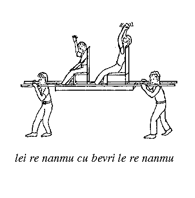

Chapter 6. To Speak Of Many Things: The Lojban sumti

| The Complete Lojban Language |
| :--------------------------: |

|                                        |                                                 |
| -------------------------------------: | :---------------------------------------------- |
| [Prev: Chapter 5](chapter05) | [Next: Chapter 7](chapter07) |

[Table of Contents](../)

[Book Info Page](http://www.lojban.org/cll)

---

# To Speak Of Many Things: The Lojban sumti

## The five kinds of simple sumti

If you understand anything about Lojban, you know what a sumti is by now, right? An argument, one of those things that fills the places of simple Lojban sentences like:

### Example 6.1.

|     |       |     |        |
| --- | ----- | --- | ------ |
| mi  | klama | le  | zarci  |
| I   | go-to | the | market |

In [Example 6.1](chapter06#example-random-id-VKU6 "Example 6.1. "), _[mi](glossary#valsi-mi)_ and _le zarci_ are the sumti. It is easy to see that these two sumti are not of the same kind: _[mi](glossary#valsi-mi)_ is a pro-sumti (the Lojban analogue of a pronoun) referring to the speaker, whereas _le zarci_ is a description which refers to something described as being a market.

There are five kinds of simple sumti provided by Lojban:

1. descriptions like _le zarci_, which usually begin with a descriptor (called a _[gadri](glossary#valsi-gadri)_ in Lojban) such as _[le](glossary#valsi-le)_;

2. pro-sumti, such as _[mi](glossary#valsi-mi)_;

3. names, such as _la lojban._, which usually begin with _[la](glossary#valsi-la)_;

4. quotations, which begin with _[lu](glossary#valsi-lu)_, _[le'u](glossary#valsi-lehu)_, _[zo](glossary#valsi-zo)_, or _[zoi](glossary#valsi-zoi)_;

5. pure numbers, which usually begin with _[li](glossary#valsi-li)_.

Here are a few examples of each kind of sumti:

### Example 6.2.

|                 |                   |         |            |         |
| --------------- | ----------------- | ------- | ---------- | ------- |
| e'osai          | ko                | sarji   | la         | lojban. |
| \[request] \[!] | You \[imperative] | support | that-named | Lojban. |

|                        |
| ---------------------- |
| Please support Lojban! |

[Example 6.2](chapter06#example-random-id-Dx1s "Example 6.2. ") exhibits _[ko](glossary#valsi-ko)_, a pro-sumti; and _la lojban._, a name.

### Example 6.3.

|     |         |          |                 |            |        |         |
| --- | ------- | -------- | --------------- | ---------- | ------ | ------- |
| mi  | cusku   | lu       | e'osai          | li'u       | le     | tcidu   |
| I   | express | \[quote] | \[request] \[!] | \[unquote] | to-the | reader. |

|                                    |
| ---------------------------------- |
| I express “Please!” to the reader. |

[Example 6.3](chapter06#example-random-id-v1mS "Example 6.3. ") exhibits _[mi](glossary#valsi-mi)_, a pro-sumti; _lu e'osai li'u_, a quotation; and _le tcidu_, a description.

### Example 6.4.

|      |                    |            |        |
| ---- | ------------------ | ---------- | ------ |
| ti   | mitre              | li         | ci     |
| This | measures-in-meters | the-number | three. |

|                            |
| -------------------------- |
| This is three meters long. |

[Example 6.4](chapter06#example-random-id-0YaH "Example 6.4. ") exhibits _[ti](glossary#valsi-ti)_, a pro-sumti; and _li ci_, a number.

Most of this chapter is about descriptions, as they have the most complicated syntax and usage. Some attention is also given to names, which are closely interwoven with descriptions. Pro-sumti, numbers, and quotations are described in more detail in [Chapter 7](chapter07 "Chapter 7. Brevity Is The Soul Of Language: Pro-sumti And Pro-bridi"), [Chapter 18](chapter18 "Chapter 18. lojbau mekso: Mathematical Expressions in Lojban"), and [Chapter 19](chapter19 "Chapter 19. Putting It All Together: Notes on the Structure of Lojban Texts") respectively, so this chapter only gives summaries of their forms and uses. See [Section 6.13](chapter06#section-pro-sumti "6.13. Pro-sumti summary") through [Section 6.15](chapter06#section-number-summary "6.15. Number summary") for these summaries.

## The three basic description types

The following cmavo are discussed in this section:

|     |     |                                      |
| --- | --- | ------------------------------------ |
| le  | LE  | the, the one(s) described as         |
| lo  | LE  | some, some of those which really are |
| la  | LA  | the one(s) named                     |
| ku  | KU  | elidable terminator for LE, LA       |

The syntax of descriptions is fairly complex, and not all of it can be explained within the confines of this chapter: relative clauses, in particular, are discussed in [Chapter 8](chapter08 "Chapter 8. Relative Clauses, Which Make sumti Even More Complicated"). However, most descriptions have just two components: a descriptor belonging to selma'o LE or LA, and a selbri. (The difference between selma'o LE and selma'o LA is not important until [Section 6.12](chapter06#section-names "6.12. Lojban names").) Furthermore, the selbri is often just a single brivla. Here is an elementary example:

### Example 6.5.

|                                                         |                |
| ------------------------------------------------------- | -------------- |
| le                                                      | zarci          |
| one-or-more-specific-things-each-of-which-I-describe-as | being-a-market |

|            |
| ---------- |
| the market |

The long gloss for _[le](glossary#valsi-le)_ is of course far too long to use most of the time, and in fact _[le](glossary#valsi-le)_ is quite close in meaning to English “the”. It has particular implications, however, which “the” does not have.

The general purpose of all descriptors is to create a sumti which might occur in the x1 place of the selbri belonging to the description. Thus _le zarci_ conveys something which might be found in the x1 place of _[zarci](glossary#valsi-zarci)_, namely a market.

The specific purpose of _[le](glossary#valsi-le)_ is twofold. First, it indicates that the speaker has one or more specific markets in mind (whether or not the listener knows which ones they are). Second, it also indicates that the speaker is merely describing the things he or she has in mind as markets, without being committed to the truth of that description.

### Example 6.6.

|                                                 |           |     |             |
| ----------------------------------------------- | --------- | --- | ----------- |
| le                                              | zarci     | cu  | barda       |
| One-or-more-specific-things-which-I-describe-as | “markets” |     | is/are-big. |

|                      |
| -------------------- |
| The market is big.   |
| The markets are big. |

Note that English-speakers must state whether a reference to markets is to just one (“the market”) or to more than one (“the markets”). Lojban requires no such forced choice, so both colloquial translations of [Example 6.6](chapter06#example-random-id-ULGC "Example 6.6. ") are valid. Only the context can specify which is meant. (This rule does not mean that Lojban has no way of specifying the number of markets in such a case: that mechanism is explained in [Section 6.7](chapter06#section-quantified-descriptions "6.7. Quantified descriptions").)

Now consider the following strange-looking example:

### Example 6.7.

|                                                 |       |     |               |
| ----------------------------------------------- | ----- | --- | ------------- |
| le                                              | nanmu | cu  | ninmu         |
| One-or-more-specific-things-which-I-describe-as | “men” |     | is/are-women. |

|                     |
| ------------------- |
| The man is a woman. |
| The men are women.  |

[Example 6.7](chapter06#example-random-id-PutX "Example 6.7. ") is not self-contradictory in Lojban, because _le nanmu_ merely means something or other which, for my present purposes, I choose to describe as a man, whether or not it really is a man. A plausible instance would be: someone we had assumed to be a man at a distance turned out to be actually a woman on closer observation. [Example 6.7](chapter06#example-random-id-PutX "Example 6.7. ") is what I would say to point out my observation to you.

In all descriptions with _[le](glossary#valsi-le)_, the listener is presumed to either know what I have in mind or else not to be concerned at present (perhaps I will give more identifying details later). In particular, I might be pointing at the supposed man or men: [Example 6.7](chapter06#example-random-id-PutX "Example 6.7. ") would then be perfectly intelligible, since _le nanmu_ merely clarifies that I am pointing at the supposed man, not at a landscape, or a nose, which happens to lie in the same direction.

The second descriptor dealt with in this section is _[lo](glossary#valsi-lo)_. Unlike _[le](glossary#valsi-le)_, _[lo](glossary#valsi-lo)_ is nonspecific:

### Example 6.8.

|                                            |             |
| ------------------------------------------ | ----------- |
| lo                                         | zarci       |
| one-or-more-of-all-the-things-which-really | are-markets |

|              |
| ------------ |
| a market     |
| some markets |

Again, there are two colloquial English translations. The effect of using _[lo](glossary#valsi-lo)_ in [Example 6.8](chapter06#example-random-id-t11z "Example 6.8. ") is to refer generally to one or more markets, without being specific about which. Unlike _le zarci_, _lo zarci_ must refer to something which actually is a market (that is, which can appear in the x1 place of a truthful bridi whose selbri is _[zarci](glossary#valsi-zarci)_). Thus

### Example 6.9.

|                      |       |     |             |
| -------------------- | ----- | --- | ----------- |
| lo                   | nanmu | cu  | ninmu       |
| That-which-really-is | a-man |     | is-a-woman. |

|                      |
| -------------------- |
| Some man is a woman. |
| Some men are women.  |

must be false in Lojban, given that there are no objects in the real world which are both men and women. Pointing at some specific men or women would not make [Example 6.9](chapter06#example-random-id-fSxN "Example 6.9. ") true, because those specific individuals are no more both-men-and-women than any others. In general, _[lo](glossary#valsi-lo)_ refers to whatever individuals meet its description.

The last descriptor of this section is _[la](glossary#valsi-la)_, which indicates that the selbri which follows it has been dissociated from its normal meaning and is being used as a name. Like _[le](glossary#valsi-le)_ descriptions, _[la](glossary#valsi-la)_ descriptions are implicitly restricted to those I have in mind. (Do not confuse this use of _[la](glossary#valsi-la)_ with its use before regular Lojbanized names, which is discussed in [Section 6.12](chapter06#section-names "6.12. Lojban names").) For example:

### Example 6.10.

|            |        |         |         |     |        |
| ---------- | ------ | ------- | ------- | --- | ------ |
| la         | cribe  | pu      | finti   | le  | lisri  |
| That-named | “bear” | \[past] | creates | the | story. |

|                       |
| --------------------- |
| Bear wrote the story. |

In [Example 6.10](chapter06#example-random-id-PrGp "Example 6.10. "), _la cribe_ refers to someone whose naming predicate is _[cribe](glossary#valsi-cribe)_, i.e. “Bear”. In English, most names don't mean anything, or at least not anything obvious. The name “Frank” coincides with the English word “frank”, meaning “honest”, and so one way of translating “Frank ate some cheese” into Lojban would be:

### Example 6.11.

|            |                |         |       |      |         |
| ---------- | -------------- | ------- | ----- | ---- | ------- |
| la         | stace          | pu      | citka | lo   | cirla   |
| That-named | “Honest/Frank” | \[past] | eats  | some | cheese. |

English-speakers typically would not do this, as we tend to be more attached to the sound of our names than their meaning, even if the meaning (etymological or current) is known. Speakers of other languages may feel differently. (In point of fact, “Frank” originally meant “the free one” rather than “the honest one”.)

It is important to note the differences between [Example 6.10](chapter06#example-random-id-PrGp "Example 6.10. ") and the following:

### Example 6.12.

|                                                 |       |         |         |     |        |
| ----------------------------------------------- | ----- | ------- | ------- | --- | ------ |
| le                                              | cribe | pu      | finti   | le  | lisri  |
| One-or-more-specific-things-which-I-describe-as | bears | \[past] | creates | the | story. |

|                              |
| ---------------------------- |
| The bear(s) wrote the story. |

### Example 6.13.

|                                        |           |         |         |     |        |
| -------------------------------------- | --------- | ------- | ------- | --- | ------ |
| lo                                     | cribe     | pu      | finti   | le  | lisri  |
| One-or-more-of-the-things-which-really | are-bears | \[past] | creates | the | story. |

|                             |
| --------------------------- |
| A bear wrote the story.     |
| Some bears wrote the story. |

[Example 6.12](chapter06#example-random-id-nXyo "Example 6.12. ") is about a specific bear or bearlike thing(s), or thing(s) which the speaker (perhaps whimsically or metaphorically) describes as a bear (or more than one); [Example 6.13](chapter06#example-random-id-93Yv "Example 6.13. ") is about one or more of the really existing, objectively defined bears. In either case, though, each of them must have contributed to the writing of the story, if more than one bear (or “bear”) is meant.

(The notion of a “really existing, objectively defined bear” raises certain difficulties. Is a panda bear a “real bear”? How about a teddy bear? In general, the answer is “yes”. Lojban gismu are defined as broadly as possible, allowing tanru and lujvo to narrow down the definition. There probably are no necessary and sufficient conditions for defining what is and what is not a bear that can be pinned down with complete precision: the real world is fuzzy. In borderline cases, _[le](glossary#valsi-le)_ may communicate better than _[lo](glossary#valsi-lo)_.)

So while [Example 6.10](chapter06#example-random-id-PrGp "Example 6.10. ") could easily be true (there is a real writer named “Greg Bear”), and [Example 6.12](chapter06#example-random-id-nXyo "Example 6.12. ") could be true if the speaker is sufficiently peculiar in what he or she describes as a bear, [Example 6.13](chapter06#example-random-id-93Yv "Example 6.13. ") is certainly false.

Similarly, compare the following two examples, which are analogous to [Example 6.12](chapter06#example-random-id-nXyo "Example 6.12. ") and [Example 6.13](chapter06#example-random-id-93Yv "Example 6.13. ") respectively:

### Example 6.14.

|                    |         |         |        |                   |          |
| ------------------ | ------- | ------- | ------ | ----------------- | -------- |
| le                 | remna   | pu      | finti  | le                | lisri    |
| Those-described-as | a-human | \[past] | writes | that-described-as | a-story. |

|                                     |
| ----------------------------------- |
| The human being(s) wrote the story. |

### Example 6.15.

|                      |         |         |        |                   |          |
| -------------------- | ------- | ------- | ------ | ----------------- | -------- |
| lo                   | remna   | pu      | finti  | le                | lisri    |
| That-which-really-is | a-human | \[past] | writes | that-described-as | a-story. |

|                                    |
| ---------------------------------- |
| A human being wrote the story.     |
| Some human beings wrote the story. |

[Example 6.14](chapter06#example-random-id-qKw7 "Example 6.14. ") says who the author of the story is: one or more particular human beings that the speaker has in mind. If the topic of conversation is the story, then [Example 6.14](chapter06#example-random-id-qKw7 "Example 6.14. ") identifies the author as someone who can be pointed out or who has been previously mentioned; whereas if the topic is a person, then _le remna_ is in effect a shorthand reference to that person. [Example 6.15](chapter06#example-random-id-qKYf "Example 6.15. ") merely says that the author is human.

The elidable terminator for all descriptions is _[ku](glossary#valsi-ku)_. It can almost always be omitted with no danger of ambiguity. The main exceptions are in certain uses of relative clauses, which are discussed in [Section 8.6](chapter08#section-descriptors "8.6. Relative clauses and descriptors"), and in the case of a description immediately preceding the selbri. In this latter case, using an explicit _[cu](glossary#valsi-cu)_ before the selbri makes the _[ku](glossary#valsi-ku)_ unnecessary. There are also a few other uses of _[ku](glossary#valsi-ku)_: in the compound negator _naku_ (discussed in [Chapter 16](chapter16 "Chapter 16. “Who Did You Pass On The Road? Nobody”: Lojban And Logic")) and to terminate place-structure, tense, and modal tags that do not have associated sumti (discussed in [Chapter 9](chapter09 "Chapter 9. To Boston Via The Road Go I, With An Excursion Into The Land Of Modals") and [Chapter 10](chapter10 "Chapter 10. Imaginary Journeys: The Lojban Space/Time Tense System")).

## Individuals and masses

The following cmavo are discussed in this section:

|     |     |                                            |
| --- | --- | ------------------------------------------ |
| lei | LE  | the mass I describe as                     |
| loi | LE  | part of the mass of those which really are |
| lai | LA  | the mass of those named                    |

All Lojban sumti are classified by whether they refer to one of three types of objects, known as “individuals”, “masses”, and “sets”. The term “individual” is misleading when used to refer to more than one object, but no less-confusing term has as yet been found. All the descriptions in [Section 6.1](chapter06#section-simple-sumti-kinds "6.1. The five kinds of simple sumti") and [Section 6.2](chapter06#section-basic-descriptors "6.2. The three basic description types") refer to individuals, whether one or more than one. Consider the following example:

### Example 6.16.

|                                    |         |     |       |     |        |
| ---------------------------------- | ------- | --- | ----- | --- | ------ |
| le                                 | prenu   | cu  | bevri | le  | pipno  |
| One-or-more-of-those-I-describe-as | persons |     | carry | the | piano. |

|                                |
| ------------------------------ |
| The person(s) carry the piano. |

(Of course the second _[le](glossary#valsi-le)_ should really get the same translation as the first, but I am putting the focus of this discussion on the first _[le](glossary#valsi-le)_, the one preceding _[prenu](glossary#valsi-prenu)_. I will assume that there is only one piano under discussion.)

Suppose the context of [Example 6.16](chapter06#example-random-id-mwhq "Example 6.16. ") is such that you can determine that I am talking about three persons. What am I claiming? I am claiming that each of the three persons carried the piano. This claim can be true if the persons carried the piano one at a time, or in turns, or in a variety of other ways. But in order for [Example 6.16](chapter06#example-random-id-mwhq "Example 6.16. ") to be true, I must be willing to assert that person 1 carried the piano, and that person 2 carried the piano, and that person 3 carried the piano.

But suppose I am not willing to claim that. For in fact pianos are heavy, and very few persons can carry a piano all by themselves. The most likely factual situation is that person 1 carried one end of the piano, and person 2 the other end, while person 3 either held up the middle or else supervised the whole operation without actually lifting anything. The correct way of expressing such a situation in Lojban is:

### Example 6.17.

|                                                |         |     |       |     |        |
| ---------------------------------------------- | ------- | --- | ----- | --- | ------ |
| lei                                            | prenu   | cu  | bevri | le  | pipno  |
| The-mass-of-one-or-more-of-those-I-describe-as | persons |     | carry | the | piano. |

|                                |
| ------------------------------ |
| The person(s) carry the piano. |

Here the same three persons are treated not as individuals, but as a so-called “mass entity”, or just “mass”. A mass has the properties of each individual which composes it, and may have other properties of its own as well. This can lead to apparent contradictions. Thus suppose in the piano-moving example above that person 1 has fair skin, whereas person 2 has dark skin. Then it is correct to say that the person-mass has both fair skin and dark skin. Using the mass descriptor _[lei](glossary#valsi-lei)_ signals that ordinary logical reasoning is not applicable: contradictions can be maintained, and all sorts of other peculiarities may exist. However, we can safely say that a mass inherits only the component properties that are relevant to it; it would be ludicrous to say that a mass of two persons is of molecular dimensions, simply because some of the parts (namely, the molecules) of the persons are that small.

The descriptors _[loi](glossary#valsi-loi)_ and _[lai](glossary#valsi-lai)_ are analogous to _[lo](glossary#valsi-lo)_ and _[lai](glossary#valsi-lai)_). A classic example of _[loi](glossary#valsi-loi)_ use is:

### Example 6.18.

|                                        |           |     |          |     |               |
| -------------------------------------- | --------- | --- | -------- | --- | ------------- |
| loi                                    | cinfo     | cu  | xabju    | le  | fi'ortu'a     |
| Part-of-the-mass-of-those-which-really | are-lions |     | dwell-in | the | African-land. |

|                            |
| -------------------------- |
| The lion dwells in Africa. |
| Lions dwell in Africa.     |

The difference between _[lei](glossary#valsi-lei)_ and _[loi](glossary#valsi-loi)_ is that _lei cinfo_ refers to a mass of specific individuals which the speaker calls lions, whereas _loi cinfo_ refers to some part of the mass of all those individuals which actually are lions. The restriction to “some part of the mass” allows statements like [Example 6.18](chapter06#example-random-id-T1pF "Example 6.18. ") to be true even though some lions do not dwell in Africa – they live in various zoos around the world. On the other hand, [Example 6.18](chapter06#example-random-id-T1pF "Example 6.18. ") doesn't actually say that most lions live in Africa: equally true is

### Example 6.19.

|                                        |                     |
| -------------------------------------- | ------------------- |
| loi                                    | glipre              |
| Part-of-the-mass-of-those-which-really | are-English-persons |

|     |          |     |               |
| --- | -------- | --- | ------------- |
| cu  | xabju    | le  | fi'ortu'a     |
|     | dwell-in | the | African-land. |

|                              |
| ---------------------------- |
| The English dwell in Africa. |

since there is at least one English person living there. [Section 6.4](chapter06#section-sets "6.4. Masses and sets") explains another method of saying what is usually meant by “The lion lives in Africa” which does imply that living in Africa is normal, not exceptional, for lions.

Note that the Lojban mass articles are sometimes translated by English plurals (the most usual case), sometimes by English singulars (when the singular is used to express typicalness or abstraction), and sometimes by singulars with no article:

### Example 6.20.

|                                          |                      |     |          |
| ---------------------------------------- | -------------------- | --- | -------- |
| loi                                      | matne                | cu  | ranti    |
| Part-of-the-mass-of-that-which-really-is | a-quantity-of-butter |     | is-soft. |

|                 |
| --------------- |
| Butter is soft. |

Of course, some butter is hard (for example, if it is frozen butter), so the “part-of” implication of _[loi](glossary#valsi-loi)_ becomes once again useful. The reason this mechanism works is that the English words like “butter”, which are seen as already describing masses, are translated in Lojban by non-mass forms. The place structure of _[matne](glossary#valsi-matne)_ is “x1 is a quantity of butter from source x2”, so the single English word “butter” is translated as something like “a part of the mass formed from all the quantities of butter that exist”. (Note that the operation of forming a mass entity does not imply, in Lojban, that the components of the mass are necessarily close to one another or even related in any way other than conceptually. Masses are formed by the speaker's intention to form a mass, and can in principle contain anything.)

The mass name descriptor _[lai](glossary#valsi-lai)_ is used in circumstances where we wish to talk about a mass of things identified by a name which is common to all of them. It is not used to identify a mass by a single name peculiar to it. Thus the mass version of [Example 6.9](chapter06#example-random-id-fSxN "Example 6.9. "),

### Example 6.21.

|                         |        |         |         |     |        |       |
| ----------------------- | ------ | ------- | ------- | --- | ------ | ----- |
| lai                     | cribe  | pu      | finti   | le  | vi     | cukta |
| The-mass-of-those-named | “bear” | \[past] | creates | the | nearby | book. |

|                            |
| -------------------------- |
| The Bears wrote this book. |

in a context where _la cribe_ would be understood as plural, would mean that either Tom Bear or Fred Bear (to make up some names) might have written the book, or that Tom and Fred might have written it as collaborators. Using _[la](glossary#valsi-la)_ instead of _[lai](glossary#valsi-lai)_ in [Example 6.21](chapter06#example-random-id-H8z5 "Example 6.21. ") would give the implication that each of Tom and Fred, considered individually, had written it.

## Masses and sets

The following cmavo are discussed in this section:

|      |     |                                   |
| ---- | --- | --------------------------------- |
| le'i | LE  | the set described as              |
| lo'i | LE  | the set of those which really are |
| la'i | LA  | the set of those named            |

Having said so much about masses, let us turn to sets. Sets are easier to understand than masses, but are more rarely used. Like a mass, a set is an abstract object formed from a number of individuals; however, the properties of a set are not derived from any of the properties of the individuals that compose it.

Sets have properties like cardinality (how many elements in the set), membership (the relationship between a set and its elements), and set inclusion (the relationship between two sets, one of which – the superset – contains all the elements of the other – the subset). The set descriptors _[le'i](glossary#valsi-lehi)_, _[lo'i](glossary#valsi-lohi)_ and _[la'i](glossary#valsi-lahi)_ correspond exactly to the mass descriptors _[lei](glossary#valsi-lei)_, _[loi](glossary#valsi-loi)_, and _[lai](glossary#valsi-lai)_ except that normally we talk of the whole of a set, not just part of it. Here are some examples contrasting _[lo](glossary#valsi-lo)_, _[loi](glossary#valsi-loi)_, and _[lo'i](glossary#valsi-lohi)_:

### Example 6.22.

|                                       |       |     |            |
| ------------------------------------- | ----- | --- | ---------- |
| lo                                    | ratcu | cu  | bunre      |
| One-or-more-of-those-which-really-are | rats  |     | are-brown. |

|                      |
| -------------------- |
| Some rats are brown. |

### Example 6.23.

|                                            |       |     |            |
| ------------------------------------------ | ----- | --- | ---------- |
| loi                                        | ratcu | cu  | cmalu      |
| Part-of-the-mass-of-those-which-really-are | rats  |     | are-small. |

|                 |
| --------------- |
| Rats are small. |

### Example 6.24.

|            |       |     |           |
| ---------- | ----- | --- | --------- |
| lo'i       | ratcu | cu  | barda     |
| The-set-of | rats  |     | is-large. |

|                          |
| ------------------------ |
| There are a lot of rats. |

The mass of rats is small because at least one rat is small; the mass of rats is also large; the set of rats, though, is unquestionably large – it has billions of members. The mass of rats is also brown, since some of its components are; but it would be incorrect to call the set of rats brown – brown-ness is not the sort of property that sets possess.

Lojban speakers should generally think twice before employing the set descriptors. However, certain predicates have places that require set sumti to fill them. For example, the place structure of _[fadni](glossary#valsi-fadni)_ is:

> x1 is ordinary/common/typical/usual in property x2 among the members of set x3

Why is it necessary for the x3 place of _[fadni](glossary#valsi-fadni)_ to be a set? Because it makes no sense for an individual to be typical of another individual: an individual is typical of a group. In order to make sure that the bridi containing _[fadni](glossary#valsi-fadni)_ is about an entire group, its x3 place must be filled with a set:

### Example 6.25.

|     |             |                            |                  |               |
| --- | ----------- | -------------------------- | ---------------- | ------------- |
| mi  | fadni       | zo'e                       | lo'i             | lobypli       |
| I   | am-ordinary | in-property \[unspecified] | among-the-set-of | Lojban-users. |

|                             |
| --------------------------- |
| I am a typical Lojban user. |

Note that the x2 place has been omitted; I am not specifying in exactly which way I am typical – whether in language knowledge, or age, or interests, or something else. If _[lo'i](glossary#valsi-lohi)_ were changed to _[lo](glossary#valsi-lo)_ in [Example 6.25](chapter06#example-random-id-xIXo "Example 6.25. "), the meaning would be something like “I am typical of some Lojban user”, which is nonsense.

## Descriptors for typical objects

The following cmavo are discussed in this section:

|      |     |                   |
| ---- | --- | ----------------- |
| lo'e | LE  | the typical       |
| le'e | LE  | the stereotypical |

As promised in [Section 6.3](chapter06#section-masses "6.3. Individuals and masses"), Lojban has a method for discriminating between “the lion” who lives in Africa and “the Englishman” who, generally speaking, doesn't live in Africa even though some Englishmen do. The descriptor _[lo'e](glossary#valsi-lohe)_ means “the typical”, as in

### Example 6.26.

|             |       |     |           |     |               |
| ----------- | ----- | --- | --------- | --- | ------------- |
| lo'e        | cinfo | cu  | xabju     | le  | fi'ortu'a     |
| The-typical | lion  |     | dwells-in | the | African-land. |

|                            |
| -------------------------- |
| The lion dwells in Africa. |

What is this “typical lion”? Surely it is not any particular lion, because no lion has all of the “typical” characteristics, and (worse yet) some characteristics that all real lions have can't be viewed as typical. For example, all real lions are either male or female, but it would be bizarre to suppose that the typical lion is either one. So the typical lion has no particular sex, but does have a color (golden brown), a residence (Africa), a diet (game), and so on. Likewise we can say that

### Example 6.27.

|             |                |     |           |
| ----------- | -------------- | --- | --------- |
| lo'e        | glipre         | cu  | xabju     |
| The-typical | English-person |     | dwells-in |

|     |              |            |     |                  |
| --- | ------------ | ---------- | --- | ---------------- |
| le  | fi'ortu'a    | na.e       | le  | gligugde         |
| the | African-land | (Not!) and | the | English-country. |

|                                                                 |
| --------------------------------------------------------------- |
| The typical English person dwells not in Africa but in England. |

The relationship between _lo'e cinfo_ and _lo'i cinfo_ may be explained thus: the typical lion is an imaginary lion-abstraction which best exemplifies the set of lions. There is a similar relationship between _[le'e](glossary#valsi-lehe)_ and _[le'i](glossary#valsi-lehi)_:

### Example 6.28.

|                   |               |          |     |                         |        |
| ----------------- | ------------- | -------- | --- | ----------------------- | ------ |
| le'e              | xelso         | merko    | cu  | gusta                   | ponse  |
| The-stereotypical | Greek-type-of | American |     | is-a-restaurant-type-of | owner. |

|                                          |
| ---------------------------------------- |
| Lots of Greek-Americans own restaurants. |

Here we are concerned not with the actual set of Greek-Americans, but with the set of those the speaker has in mind, which is typified by one (real or imaginary) who owns a restaurant. The word “stereotypical” is often derogatory in English, but _[le'e](glossary#valsi-lehe)_ need not be derogatory in Lojban: it simply suggests that the example is typical in the speaker's imagination rather than in some objectively agreed-upon way. Of course, different speakers may disagree about what the features of “the typical lion” are (some would include having a short intestine, whereas others would know nothing of lions' intestines), so the distinction between _lo'e cinfo_ and _le'e cinfo_ may be very fine.

Furthermore,

### Example 6.29.

|                   |       |     |             |      |            |            |
| ----------------- | ----- | --- | ----------- | ---- | ---------- | ---------- |
| le'e              | skina | cu  | se finti    | ne'i | la         | xali,uyd.  |
| The-stereotypical | movie |     | is-invented | in   | that-named | Hollywood. |

is probably true to an American, but might be false (not the stereotype) to someone living in India or Russia.

Note that there is no naming equivalent of _[lo'e](glossary#valsi-lohe)_ and _[le'e](glossary#valsi-lehe)_, because there is no need, as a rule, for a “typical George” or a “typical Smith”. People or things who share a common name do not, in general, have any other common attributes worth mentioning.

## Quantified sumti

The following cmavo are discussed in this section:

|      |     |                   |
| ---- | --- | ----------------- |
| ro   | PA  | all of/each of    |
| su'o | PA  | at least (one of) |

Quantifiers tell us how many: in the case of quantifiers with sumti, how many things we are talking about. In Lojban, quantifiers are expressed by numbers and mathematical expressions: a large topic discussed in some detail in [Chapter 18](chapter18 "Chapter 18. lojbau mekso: Mathematical Expressions in Lojban"). For the purposes of this chapter, a simplified treatment will suffice. Our examples will employ either the simple Lojban numbers _[pa](glossary#valsi-pa)_, _[re](glossary#valsi-re)_, _[ci](glossary#valsi-ci)_, _[vo](glossary#valsi-vo)_, and _[mu](glossary#valsi-mu)_, meaning “one”, “two”, “three”, “four”, “five” respectively, or else one of four special quantifiers, two of which are discussed in this section and listed above. These four quantifiers are important because every Lojban sumti has either one or two of them implicitly present in it – which one or two depends on the particular kind of sumti. There is more explanation of implicit quantifiers later in this section. (The other two quantifiers, _[piro](glossary#valsi-piro)_ and _[pisu'o](glossary#valsi-pisuho)_, are explained in [Section 6.7](chapter06#section-quantified-descriptions "6.7. Quantified descriptions").)

Every Lojban sumti may optionally be preceded by an explicit quantifier. The purpose of this quantifier is to specify how many of the things referred to by the sumti are being talked about. Here are some simple examples contrasting sumti with and without explicit quantifiers:

### Example 6.30.

|     |         |     |       |
| --- | ------- | --- | ----- |
| do  | cadzu   | le  | bisli |
| You | walk-on | the | ice.  |

### Example 6.31.

|        |     |         |     |       |
| ------ | --- | ------- | --- | ----- |
| re     | do  | cadzu   | le  | bisli |
| Two-of | you | walk-on | the | ice.  |

The difference between [Example 6.30](chapter06#example-random-id-qL61 "Example 6.30. ") and [Example 6.31](chapter06#example-random-id-qLAH "Example 6.31. ") is the presence of the explicit quantifier _[re](glossary#valsi-re)_ in the latter example. Although _[re](glossary#valsi-re)_ by itself means “two”, when used as a quantifier it means “two-of”. Out of the group of listeners (the number of which isn't stated), two (we are not told which ones) are asserted to be “walkers on the ice”. Implicitly, the others (if any) are not walkers on the ice. In Lojban, you cannot say “I own three shoes” if in fact you own four shoes. Numbers need never be specified, but if they are specified they must be correct.

(This rule does not mean that there is no way to specify a number which is vague. The sentence

### Example 6.32.

|     |         |          |       |        |
| --- | ------- | -------- | ----- | ------ |
| mi  | ponse   | su'o     | ci    | cutci  |
| I   | possess | at-least | three | shoes. |

is true if you own three shoes, or four, or indeed any larger number. More details on vague numbers appear in the discussion of mathematical expressions in [Chapter 18](chapter18 "Chapter 18. lojbau mekso: Mathematical Expressions in Lojban").)

Now consider [Example 6.30](chapter06#example-random-id-qL61 "Example 6.30. ") again. How many of the listeners are claimed to walk on the ice? The answer turns out to be: all of them, however many that is. So [Example 6.30](chapter06#example-random-id-qL61 "Example 6.30. ") and [Example 6.33](chapter06#example-random-id-0qr0 "Example 6.33. "):

### Example 6.33.

|        |     |         |     |       |
| ------ | --- | ------- | --- | ----- |
| ro     | do  | cadzu   | le  | bisli |
| All-of | you | walk-on | the | ice.  |

turn out to mean exactly the same thing. This is a safe strategy, because if one of my listeners doesn't turn out to be walking on the ice, I can safely claim that I didn't intend that person to be a listener! And in fact, all of the personal pro-sumti such as _[mi](glossary#valsi-mi)_ and _[mi'o](glossary#valsi-miho)_ and _[ko](glossary#valsi-ko)_ obey the same rule. We say that personal pro-sumti have a so-called “implicit quantifier” of _[ro](glossary#valsi-ro)_ (all). This just means that if no quantifier is given explicitly, the meaning is the same as if the implicit quantifier had been used.

Not all sumti have _[ro](glossary#valsi-ro)_ as the implicit quantifier, however. Consider the quotation in:

### Example 6.34.

|     |         |          |     |         |     |       |             |
| --- | ------- | -------- | --- | ------- | --- | ----- | ----------- |
| mi  | cusku   | lu       | do  | cadzu   | le  | bisli | li'u        |
| I   | express | \[quote] | you | walk-on | the | ice   | \[unquote]. |

|                               |
| ----------------------------- |
| I say, “You walk on the ice.” |

What is the implicit quantifier of the quotation _lu do cadzu le bisli li'u_? Surely not _[ro](glossary#valsi-ro)_. If _[ro](glossary#valsi-ro)_ were supplied explicitly, thus:

### Example 6.35.

|     |         |        |          |     |         |     |       |             |
| --- | ------- | ------ | -------- | --- | ------- | --- | ----- | ----------- |
| mi  | cusku   | ro     | lu       | do  | cadzu   | le  | bisli | li'u        |
| I   | express | all-of | \[quote] | you | walk-on | the | ice   | \[unquote]. |

the meaning would be something like “I say every occurrence of the sentence 'You walk on the ice'”. Of course I don't say every occurrence of it, only some occurrences. One might suppose that [Example 6.34](chapter06#example-random-id-3eMo "Example 6.34. ") means that I express exactly one occurrence, but it is more Lojbanic to leave the number unspecified, as with other sumti. We can say definitely, however, that I say it at least once.

The Lojban cmavo meaning “at least” is _[su'o](glossary#valsi-suho)_, and if no ordinary number follows, _[su'o](glossary#valsi-suho)_ means “at least once”. (See [Example 6.32](chapter06#example-random-id-gLpy "Example 6.32. ") for the use of _[su'o](glossary#valsi-suho)_ with an ordinary number). Therefore, the explicitly quantified version of [Example 6.34](chapter06#example-random-id-3eMo "Example 6.34. ") is

### Example 6.36.

|     |         |                 |          |     |         |     |       |             |
| --- | ------- | --------------- | -------- | --- | ------- | --- | ----- | ----------- |
| mi  | cusku   | su'o            | lu       | do  | cadzu   | le  | bisli | li'u        |
| I   | express | at-least-one-of | \[quote] | you | walk-on | the | ice   | \[unquote]. |

|                                                       |
| ----------------------------------------------------- |
| I say one or more instances of “You walk on the ice”. |
| I say “You walk on the ice”.                          |

If an explicit ordinary number such as _[re](glossary#valsi-re)_ were to appear, it would have to convey an exact expression, so

### Example 6.37.

|     |         |        |          |     |         |     |       |             |
| --- | ------- | ------ | -------- | --- | ------- | --- | ----- | ----------- |
| mi  | cusku   | re     | lu       | do  | cadzu   | le  | bisli | li'u        |
| I   | express | two-of | \[quote] | you | walk-on | the | ice   | \[unquote]. |

means that I say the sentence exactly twice, neither more nor less.

## Quantified descriptions

The following cmavo are discussed in this section:

|        |     |              |
| ------ | --- | ------------ |
| piro   | PA  | the whole of |
| pisu'o | PA  | a part of    |

Like other sumti, descriptions can be quantified. When a quantifier appears before a description, it has the same meaning as one appearing before a non-description sumti: it specifies how many things, of all those referred to by the description, are being talked about in this particular bridi. Suppose that context tells us that _le gerku_ refers to three dogs. Then we can say that exactly two of them are white as follows:

### Example 6.38.

|        |     |       |     |            |
| ------ | --- | ----- | --- | ---------- |
| re     | le  | gerku | cu  | blabi      |
| Two-of | the | dogs  |     | are-white. |

|                            |
| -------------------------- |
| Two of the dogs are white. |

When discussing descriptions, this ordinary quantifier is called an “outer quantifier”, since it appears outside the description. But there is another possible location for a quantifier: between the descriptor and the selbri. This quantifier is called an “inner quantifier”, and its meaning is quite different: it tells the listener how many objects the description selbri characterizes.

For example, the context of [Example 6.38](chapter06#example-random-id-WtUh "Example 6.38. ") supposedly told us that _le gerku_ referred to some three specific dogs. This assumption can be made certain with the use of an explicit inner quantifier:

### Example 6.39.

|        |     |       |       |     |            |
| ------ | --- | ----- | ----- | --- | ---------- |
| re     | le  | ci    | gerku | cu  | blabi      |
| Two-of | the | three | dogs  |     | are-white. |

|                                  |
| -------------------------------- |
| Two of the three dogs are white. |

(As explained in the discussion of [Example 6.32](chapter06#example-random-id-gLpy "Example 6.32. "), simple numbers like those in [Example 6.39](chapter06#example-random-id-X3iY "Example 6.39. ") must be exact: it therefore follows that the third dog cannot be white.)

You may also specify an explicit inner quantifier and leave the outer quantifier implicit:

### Example 6.40.

|     |       |       |     |            |
| --- | ----- | ----- | --- | ---------- |
| le  | ci    | gerku | cu  | blabi      |
| The | three | dogs  |     | are-white. |

|                           |
| ------------------------- |
| The three dogs are white. |

There are rules for each of the 11 descriptors specifying what the implicit values for the inner and outer quantifiers are. They are meant to provide sensible default values when context is absent, not necessarily to prescribe hard and fast rules. The following table lists the implicit values:

|                                 |                   |                                                        |
| ------------------------------- | ----------------- | ------------------------------------------------------ |
| _[le](glossary#valsi-le)_:     | _ro le su'o_      | all of the at-least-one described as                   |
| _[lo](glossary#valsi-lo)_:     | _su'o lo ro_      | at least one of all of those which really are          |
| _[la](glossary#valsi-la)_:     | _ro la su'o_      | all of the at least one named                          |
| _[lei](glossary#valsi-lei)_:   | _pisu'o lei su'o_ | some part of the mass of the at-least-one described as |
| _[loi](glossary#valsi-loi)_:   | _pisu'o loi ro_   | some part of the mass of all those that really are     |
| _[lai](glossary#valsi-lai)_:   | _pisu'o lai su'o_ | some part of the mass of the at-least-one named        |
| _[le'i](glossary#valsi-lehi)_: | _piro le'i su'o_  | the whole of the set of the at-least-one described as  |
| _[lo'i](glossary#valsi-lohi)_: | _piro lo'i ro_    | the whole of the set of all those that really are      |
| _[la'i](glossary#valsi-lahi)_: | _piro la'i su'o_  | the whole of the set of the at-least-one named         |
| _[le'e](glossary#valsi-lehe)_: | _ro le'e su'o_    | all the stereotypes of the at-least-one described as   |
| _[lo'e](glossary#valsi-lohe)_: | _su'o lo'e ro_    | at least one of the types of all those that really are |

When examined for the first time, this table looks dreadfully arbitrary. In fact, there are quite a few regularities in it. First of all, the la-series (that is, the descriptors _[la](glossary#valsi-la)_, _[lai](glossary#valsi-lai)_, and _[la'i](glossary#valsi-lahi)_) and the le-series (that is, the descriptors _[le](glossary#valsi-le)_, _[lei](glossary#valsi-lei)_, _[le'i](glossary#valsi-lehi)_, and _[le'e](glossary#valsi-lehe)_) always have corresponding implicit quantifiers, so we may subsume the la-series under the le-series for the rest of this discussion: “le-series cmavo” will refer to both the le-series proper and to the la-series.

The rule for the inner quantifier is very simple: the lo-series cmavo (namely, _[lo](glossary#valsi-lo)_, _[loi](glossary#valsi-loi)_, _[lo'i](glossary#valsi-lohi)_, and _[lo'e](glossary#valsi-lohe)_) all have an implicit inner quantifier of _[ro](glossary#valsi-ro)_, whereas the le-series cmavo all have an implicit inner quantifier of _[su'o](glossary#valsi-suho)_.

Why? Because lo-series descriptors always refer to all of the things which really fit into the x1 place of the selbri. They are not restricted by the speaker's intention. Descriptors of the le-series, however, are so restricted, and therefore talk about some number, definite or indefinite, of objects the speaker has in mind – but never less than one.

Understanding the implicit outer quantifier requires rules of greater subtlety. In the case of mass and set descriptors, a single rule suffices for each: reference to a mass is implicitly a reference to some part of the mass; reference to a set is implicitly a reference to the whole set. Masses and sets are inherently singular objects: it makes no sense to talk about two distinct masses with the same components, or two distinct sets with the same members. Therefore, the largest possible outer quantifier for either a set description or a mass description is _[piro](glossary#valsi-piro)_, the whole of it.

(Pedantically, it is possible that the mass of water molecules composing an ice cube might be thought of as different from the same mass of water molecules in liquid form, in which case we might talk about _re lei djacu_, two masses of the water-bits I have in mind.)

Why “_[pi](glossary#valsi-pi)_-”? It is the Lojban cmavo for the decimal point. Just as _pimu_ means “.5”, and when used as a quantifier specifies a portion consisting of five tenths of a thing, _[piro](glossary#valsi-piro)_ means a portion consisting of the all-ness – the entirety – of a thing. Similarly, _[pisu'o](glossary#valsi-pisuho)_ specifies a portion consisting of at least one part of a thing, i.e. some of it.

Smaller quantifiers are possible for sets, and refer to subsets. Thus _pimu le'i nanmu_ is a subset of the set of men I have in mind; we don't know precisely which elements make up this subset, but it must have half the size of the full set. This is the best way to say “half of the men”; saying _pimu le nanmu_ would give us a half-portion of one of them instead! Of course, the result of _pimu le'i nanmu_ is still a set; if you need to refer to the individuals of the subset, you must say so (see _[lu'a](glossary#valsi-luha)_ in [Section 6.10](chapter06#section-sumti-qualifiers "6.10. sumti qualifiers")).

The case of outer quantifiers for individual descriptors (including _[le](glossary#valsi-le)_, _[lo](glossary#valsi-lo)_, _[la](glossary#valsi-la)_, and the typical descriptors _[le'e](glossary#valsi-lehe)_ and _[lo'e](glossary#valsi-lohe)_) is special. When we refer to specific individuals with _[le](glossary#valsi-le)_, we mean to refer to all of those we have in mind, so _[ro](glossary#valsi-ro)_ is appropriate as the implicit quantifier, just as it is appropriate for _[do](glossary#valsi-do)_. Reference to non-specific individuals with _[lo](glossary#valsi-lo)_, however, is typically to only some of the objects which can be correctly described, and so _[su'o](glossary#valsi-suho)_ is the appropriate implicit quantifier, just as for quotations.

From the English-speaking point of view, the difference in structure between the following example using _[le](glossary#valsi-le)_:

### Example 6.41.

|           |                    |       |       |     |            |
| --------- | ------------------ | ----- | ----- | --- | ---------- |
| \[ro]     | le                 | ci    | gerku | cu  | blabi      |
| \[All-of] | those-described-as | three | dogs  |     | are-white. |

|                           |
| ------------------------- |
| The three dogs are white. |

and the corresponding form with _[lo](glossary#valsi-lo)_:

### Example 6.42.

|          |                 |        |       |     |            |
| -------- | --------------- | ------ | ----- | --- | ---------- |
| ci       | lo              | \[ro]  | gerku | cu  | blabi      |
| Three-of | those-which-are | \[all] | dogs  |     | are-white. |

|                       |
| --------------------- |
| Three dogs are white. |

looks very peculiar. Why is the number _[ci](glossary#valsi-ci)_ found as an inner quantifier in [Example 6.41](chapter06#example-random-id-f643 "Example 6.41. ") and as an outer quantifier in [Example 6.42](chapter06#example-random-id-gr7Y "Example 6.42. ")? The number of dogs is the same in either case. The answer is that the _[ci](glossary#valsi-ci)_ in [Example 6.41](chapter06#example-random-id-f643 "Example 6.41. ") is part of the specification: it tells us the actual number of dogs in the group that the speaker has in mind. In [Example 6.42](chapter06#example-random-id-gr7Y "Example 6.42. "), however, the dogs referred to by _... lo gerku_ are all the dogs that exist: the outer quantifier then restricts the number to three; which three, we cannot tell. The implicit quantifiers are chosen to avoid claiming too much or too little: in the case of _[le](glossary#valsi-le)_, the implicit outer quantifier _[ro](glossary#valsi-ro)_ says that each of the dogs in the restricted group is white; in the case of _[lo](glossary#valsi-lo)_, the implicit inner quantifier simply says that three dogs, chosen from the group of all the dogs there are, are white.

Using exact numbers as inner quantifiers in lo-series descriptions is dangerous, because you are stating that exactly that many things exist which really fit the description. So examples like

### Example 6.43.

|            |                        |       |       |     |            |
| ---------- | ---------------------- | ----- | ----- | --- | ---------- |
| \[so'o]    | lo                     | ci    | gerku | cu  | blabi      |
| \[some-of] | those-which-really-are | three | dogs  |     | are-white. |

are semantically anomalous; [Example 6.43](chapter06#example-random-id-uYH4 "Example 6.43. ") claims that some dog (or dogs) is white, but also that there are just three dogs in the universe!

Nevertheless, inner quantifiers are permitted on _[lo](glossary#valsi-lo)_ descriptors for consistency's sake, and may occasionally be useful.

Note that the inner quantifier of _[le](glossary#valsi-le)_, even when exact, need not be truthful: _le ci nanmu_ means “what I describe as three men”, not “three of what I describe as men”. This follows from the rule that what is described by a _[le](glossary#valsi-le)_ description represents the speaker's viewpoint rather than the objective way things are.

## Indefinite descriptions

By a quirk of Lojban syntax, it is possible to omit the descriptor _[lo](glossary#valsi-lo)_, but never any other descriptor, from a description like that of [Example 6.42](chapter06#example-random-id-gr7Y "Example 6.42. "); namely, one which has an explicit outer quantifier but no explicit inner quantifier. The following example:

### Example 6.44.

|                          |       |       |     |            |
| ------------------------ | ----- | ----- | --- | ---------- |
| ci                       | gerku | \[ku] | cu  | blabi      |
| Three-of-those-which-are | dogs  |       |     | are-white. |

|                       |
| --------------------- |
| Three dogs are white. |

is equivalent in meaning to [Example 6.42](chapter06#example-random-id-gr7Y "Example 6.42. "). Even though the descriptor is not present, the elidable terminator _[ku](glossary#valsi-ku)_ may still be used. The name “indefinite description” for this syntactic form is historically based: of course, it is no more and no less indefinite than its counterpart with an explicit _[lo](glossary#valsi-lo)_. Indefinite descriptions were introduced into the language in order to imitate the syntax of English and other natural languages.

Indefinite descriptions must fit this mold exactly: there is no way to make one which does not have an explicit outer quantifier (thus _\*gerku cu blabi_ is ungrammatical), or which has an explicit inner quantifier (thus _\*reboi ci gerku cu blabi_ is also ungrammatical – _re ci gerku cu blabi_ is fine, but means “23 dogs are white”).

Note: [Example 6.32](chapter06#example-random-id-gLpy "Example 6.32. ") also contains an indefinite description, namely _su'o ci cutci_; another version of that example using an explicit _[lo](glossary#valsi-lo)_ would be:

### Example 6.45.

|     |         |          |       |                         |       |
| --- | ------- | -------- | ----- | ----------------------- | ----- |
| mi  | ponse   | su'o     | ci    | lo                      | cutci |
| I   | possess | at-least | three | things-which-really-are | shoes |

|                              |
| ---------------------------- |
| I own three (or more) shoes. |

## sumti-based descriptions

As stated in [Section 6.2](chapter06#section-basic-descriptors "6.2. The three basic description types"), most descriptions consist of just a descriptor and a selbri. (In this chapter, the selbri have always been single gismu, but of course any selbri, however complex, can be employed in a description. The syntax and semantics of selbri are explained in [Chapter 5](chapter05 "Chapter 5. “Pretty Little Girls' School”: The Structure Of Lojban selbri").) In the intervening sections, inner and outer quantifiers have been added to the syntax. Now it is time to discuss a description of a radically different kind: the sumti-based description.

A sumti-based description has a sumti where the selbri would normally be, and the inner quantifier is required – it cannot be implicit. An outer quantifier is permitted but not required.

A full theory of sumti-based descriptions has yet to be worked out. One common case, however, is well understood. Compare the following:

### Example 6.46.

|        |     |     |          |
| ------ | --- | --- | -------- |
| re     | do  | cu  | nanmu    |
| Two-of | you |     | are-men. |

### Example 6.47.

|     |        |     |     |          |
| --- | ------ | --- | --- | -------- |
| le  | re     | do  | cu  | nanmu    |
| The | two-of | you |     | are-men. |

[Example 6.46](chapter06#example-random-id-qLaQ "Example 6.46. ") simply specifies that of the group of listeners, size unknown, two are men. [Example 6.47](chapter06#example-random-id-qLAr "Example 6.47. "), which has the sumti-based description _le re do_, says that of the two listeners, all (the implicit outer quantifier _[ro](glossary#valsi-ro)_) are men. So in effect the inner quantifier _[re](glossary#valsi-re)_ gives the number of individuals which the inner sumti _[do](glossary#valsi-do)_ refers to.

Here is another group of examples:

### Example 6.48.

|        |     |       |       |     |            |
| ------ | --- | ----- | ----- | --- | ---------- |
| re     | le  | ci    | cribe | cu  | bunre      |
| Two-of | the | three | bears |     | are-brown. |

### Example 6.49.

|     |        |     |       |       |     |            |
| --- | ------ | --- | ----- | ----- | --- | ---------- |
| le  | re     | le  | ci    | cribe | cu  | bunre      |
| The | two-of | the | three | bears |     | are-brown. |

### Example 6.50.

|        |     |        |     |       |       |     |           |
| ------ | --- | ------ | --- | ----- | ----- | --- | --------- |
| pa     | le  | re     | le  | ci    | cribe | cu  | bunre     |
| One-of | the | two-of | the | three | bears |     | is-brown. |

In each case, _le ci cribe_ restricts the bears (or alleged bears) being talked of to some group of three which the speaker has in mind. [Example 6.48](chapter06#example-random-id-qLbf "Example 6.48. ") says that two of them (which two is not stated) are brown. [Example 6.49](chapter06#example-random-id-qLbh "Example 6.49. ") says that a specific pair of them are brown. [Example 6.50](chapter06#example-random-id-qLBq "Example 6.50. ") says that of a specific pair chosen from the original three, one or the other of that pair is brown.

## sumti qualifiers

The following cmavo are discussed in this section:

|        |         |                                          |
| ------ | ------- | ---------------------------------------- |
| la'e   | LAhE    | something referred to by                 |
| lu'e   | LAhE    | a reference to                           |
| tu'a   | LAhE    | an abstraction involving                 |
| lu'a   | LAhE    | an individual/member/component of        |
| lu'i   | LAhE    | a set formed from                        |
| lu'o   | LAhE    | a mass formed from                       |
| vu'i   | LAhE    | a sequence formed from                   |
| na'ebo | NAhE+BO | something other than                     |
| to'ebo | NAhE+BO | the opposite of                          |
| no'ebo | NAhE+BO | the neutral form of                      |
| je'abo | NAhE+BO | that which indeed is                     |
| lu'u   | LUhU    | elidable terminator for LAhE and NAhE+BO |

Well, that's quite a list of cmavo. What are they all about?

The above cmavo and compound cmavo are called the “sumti qualifiers”. All of them are either single cmavo of selma'o LAhE, or else compound cmavo involving a scalar negation cmavo of selma'o NAhE immediately followed by _[bo](glossary#valsi-bo)_ of selma'o BO. Syntactically, you can prefix a sumti qualifier to any sumti and produce another simple sumti. (You may need to add the elidable terminator _[lu'u](glossary#valsi-luhu)_ to show where the qualified sumti ends.)

Semantically, sumti qualifiers represent short forms of certain common special cases. Suppose you want to say “I see 'The Red Pony'”, where “The Red Pony” is the title of a book. How about:

### Example 6.51.

|     |       |          |     |       |             |             |
| --- | ----- | -------- | --- | ----- | ----------- | ----------- |
| mi  | viska | lu       | le  | xunre | cmaxirma    | li'u        |
| I   | see   | \[quote] | the | red   | small-horse | \[unquote]. |

But [Example 6.51](chapter06#example-random-id-6W3v "Example 6.51. ") doesn't work: it says that you see a piece of text “The Red Pony”. That might be all right if you were looking at the cover of the book, where the words “The Red Pony” are presumably written. (More precisely, where the words _le xunre cmaxirma_ are written – but we may suppose the book has been translated into Lojban.)

What you really want to say is:

### Example 6.52.

|     |       |     |                      |
| --- | ----- | --- | -------------------- |
| mi  | viska | le  | selsinxa             |
| I   | see   | the | thing-represented-by |

|     |          |     |       |             |             |
| --- | -------- | --- | ----- | ----------- | ----------- |
| be  | lu       | le  | xunre | cmaxirma    | li'u        |
|     | \[quote] | the | red   | small-horse | \[unquote]. |

The x2 place of _selsinxa_ (the x1 place of _[sinxa](glossary#valsi-sinxa)_) is a sign or symbol, and the x1 place of _selsinxa_ (the x2 place of _[sinxa](glossary#valsi-sinxa)_) is the thing represented by the sign. [Example 6.52](chapter06#example-random-id-MSVK "Example 6.52. ") allows us to use a symbol (namely the title of a book) to represent the thing it is a symbol of (namely the book itself).

This operation turns out to be needed often enough that it's useful to be able to say:

### Example 6.53.

|     |       |                 |          |     |       |             |            |         |
| --- | ----- | --------------- | -------- | --- | ----- | ----------- | ---------- | ------- |
| mi  | viska | la'e            | lu       | le  | xunre | cmaxirma    | li'u       | \[lu'u] |
| I   | see   | the-referent-of | \[quote] | the | red   | small-horse | \[unquote] | -.      |

So when _[la'e](glossary#valsi-lahe)_ is prefixed to a sumti referring to a symbol, it produces a sumti referring to the referent of that symbol. (In computer jargon, _[la'e](glossary#valsi-lahe)_ dereferences a pointer.)

By introducing a sumti qualifier, we correct a false sentence ([Example 6.51](chapter06#example-random-id-6W3v "Example 6.51. ")), which too closely resembles its literal English equivalent, into a true sentence ([Example 6.53](chapter06#example-random-id-Ajty "Example 6.53. ")), without having to change it overmuch; in particular, the structure remains the same. Most of the uses of sumti qualifiers are of this general kind.

The sumti qualifier _[lu'e](glossary#valsi-luhe)_ provides the converse operation: it can be prefixed to a sumti referring to some thing to produce a sumti referring to a sign or symbol for the thing. For example,

### Example 6.54.

|     |         |         |              |     |        |       |
| --- | ------- | ------- | ------------ | --- | ------ | ----- |
| mi  | pu      | cusku   | lu'e         | le  | vi     | cukta |
| I   | \[past] | express | a-symbol-for | the | nearby | book. |

|                                |
| ------------------------------ |
| I said the title of this book. |

The equivalent form not using a sumti qualifier would be:

### Example 6.55.

|     |         |         |     |            |     |     |        |       |
| --- | ------- | ------- | --- | ---------- | --- | --- | ------ | ----- |
| mi  | pu      | cusku   | le  | sinxa      | be  | le  | vi     | cukta |
| I   | \[past] | express | the | symbol-for |     | the | nearby | book. |

\
which is equivalent to [Example 6.54](chapter06#example-random-id-7ytm "Example 6.54. "), but longer.The other sumti qualifiers follow the same rules. The cmavo _[tu'a](glossary#valsi-tuha)_ is used in forming abstractions, and is explained more fully in [Section 11.11](chapter11#section-events-and-contours "11.11. Event-type abstractors and event contour tenses"). The triplet _[lu'a](glossary#valsi-luha)_, _[lu'i](glossary#valsi-luhi)_, and _[lu'o](glossary#valsi-luho)_ convert between individuals, sets, and masses; _[vu'i](glossary#valsi-vuhi)_ belongs to this group as well, but creates a sequence, which is similar to a set but has a definite order. (The set of John and Charles is the same as the set of Charles and John, but the sequences are different.) Here are some examples:

### Example 6.56.

|     |       |                        |     |       |
| --- | ----- | ---------------------- | --- | ----- |
| mi  | troci | tu'a                   | le  | vorme |
| I   | try   | some-abstraction-about | the | door. |

|                           |
| ------------------------- |
| I try (to open) the door. |

\
[Example 6.56](chapter06#example-random-id-ioCu "Example 6.56. ") might mean that I try to do something else involving the door; the form is deliberately vague.Most of the following examples make use of the cmavo _[ri](glossary#valsi-ri)_, belonging to selma'o KOhA. This cmavo means “the thing last mentioned”; it is equivalent to repeating the immediately previous sumti (but in its original context). It is explained in more detail in [Section 7.6](chapter07#section-ri-gohi-series "7.6. Anaphoric pro-sumti and pro-bridi: the ri-series and the go'i-series").

### Example 6.57.

|            |       |     |           |
| ---------- | ----- | --- | --------- |
| lo'i       | ratcu | cu  | barda     |
| The-set-of | rats  |     | is-large. |

|        |                 |                   |            |
| ------ | --------------- | ----------------- | ---------- |
| .iku'i | lu'a            | ri                | cmalu      |
| But    | some-members-of | it-last-mentioned | are-small. |

|                                                              |
| ------------------------------------------------------------ |
| The set of rats is large, but some of its members are small. |

### Example 6.58.

|      |       |     |            |        |            |                     |           |
| ---- | ----- | --- | ---------- | ------ | ---------- | ------------------- | --------- |
| lo   | ratcu | cu  | cmalu      | .iku'i | lu'i       | ri                  | barda     |
| Some | rats  |     | are-small. | But    | the-set-of | them-last-mentioned | is-large. |

|                                                    |
| -------------------------------------------------- |
| Some rats are small, but the set of rats is large. |

### Example 6.59.

|     |               |     |            |
| --- | ------------- | --- | ---------- |
| mi  | ce            | do  | girzu      |
| I   | in-a-set-with | you | are-a-set. |

|     |                 |                   |               |
| --- | --------------- | ----------------- | ------------- |
| .i  | lu'o            | ri                | gunma         |
|     | The-mass-of     | it-last-mentioned | is-a-mass.    |
| .i  | vu'i            | ri                | porsi         |
|     | The-sequence-of | it-last-mentioned | is-a-sequence |

|                                                                                                             |
| ----------------------------------------------------------------------------------------------------------- |
| The set of you and me is a set. The mass of you and me is a mass. The sequence of you and me is a sequence. |

\
(Yes, I know these examples are a bit silly. This set was introduced for completeness, and practical examples are as yet hard to come by.)Finally, the four sumti qualifiers formed from a cmavo of NAhE and _[bo](glossary#valsi-bo)_ are all concerned with negation, which is discussed in detail in [Chapter 15](chapter15 "Chapter 15. “No” Problems: On Lojban Negation"). Here are a few examples of negation sumti qualifiers:

### Example 6.60.

|     |       |                      |     |       |
| --- | ----- | -------------------- | --- | ----- |
| mi  | viska | na'ebo               | le  | gerku |
| I   | see   | something-other-than | the | dog.  |

This compound, _na'ebo_, is the most common of the four negation sumti qualifiers. The others usually only make sense in the context of repeating, with modifications, something already referred to:

### Example 6.61.

|     |       |                     |             |       |
| --- | ----- | ------------------- | ----------- | ----- |
| mi  | nelci | loi                 | glare       | cidja |
| I   | like  | part-of-the-mass-of | hot-type-of | food. |

|      |     |       |                 |                     |
| ---- | --- | ----- | --------------- | ------------------- |
| .ije | do  | nelci | to'ebo          | ri                  |
| And  | you | like  | the-opposite-of | the-last-mentioned. |

|      |            |        |       |                      |                      |
| ---- | ---------- | ------ | ----- | -------------------- | -------------------- |
| .ije | la         | djein. | nelci | no'ebo               | ra                   |
| And  | that-named | Jane   | likes | the-neutral-value-of | something-mentioned. |

|                                                                        |
| ---------------------------------------------------------------------- |
| I like hot food, and you like cold food, and Jane likes lukewarm food. |

\
(In [Example 6.61](chapter06#example-random-id-JwCb "Example 6.61. "), the sumti _[ra](glossary#valsi-ra)_ refers to some previously mentioned sumti other than that referred to by _[ri](glossary#valsi-ri)_. We cannot use _[ri](glossary#valsi-ri)_ here, because it would signify _la djein._, that being the most recent sumti available to _[ri](glossary#valsi-ri)_. See more detailed explanations in [Section 7.6](chapter07#section-ri-gohi-series "7.6. Anaphoric pro-sumti and pro-bridi: the ri-series and the go'i-series").)_

_## The syntax of vocative phrasesVocative phrases are not sumti, but are explained in this chapter because their syntax is very similar to that of sumti. Grammatically, a vocative phrase is one of the so-called “free modifiers” of Lojban, along with subscripts, parentheses, and various other constructs explained in [Chapter 19](chapter19 "Chapter 19. Putting It All Together: Notes on the Structure of Lojban Texts"). They can be placed after many, but not all, constructions of the grammar: in general, after any elidable terminator (which, however, must not then be elided!), at the beginnings and ends of sentences, and in many other places.The purpose of a vocative phrase is to indicate who is being addressed, or to indicate to that person that he or she ought to be listening. A vocative phrase begins with a cmavo of selma'o COI or DOI, all of which are explained in more detail in [Section 13.14](chapter13#section-vocative-scales "13.14. Vocative scales"). Sometimes that is all there is to the phrase:

### Example 6.62.

|              |
| ------------ |
| coi          |
| \[greetings] |

|        |
| ------ |
| Hello. |

### Example 6.63.

|                    |
| ------------------ |
| je'e               |
| \[acknowledgement] |

|         |
| ------- |
| Uh-huh. |
| Roger!  |

In these cases, the person being addressed is obvious from the context. However, a vocative word (more precisely, one or more cmavo of COI, possibly followed by _[doi](glossary#valsi-doi)_, or else just _[doi](glossary#valsi-doi)_ by itself) can be followed by one of several kinds of phrases, all of which are intended to indicate the addressee. The most common case is a name:

### Example 6.64.

|              |       |
| ------------ | ----- |
| coi.         | djan. |
| \[greetings] | John. |

|              |
| ------------ |
| Hello, John. |

A pause is required (for morphological reasons) between a member of COI and a name. You can use _[doi](glossary#valsi-doi)_ instead of a pause:

### Example 6.65.

|              |     |       |
| ------------ | --- | ----- |
| coi          | doi | djan. |
| \[greetings] | O   | John. |

|              |
| ------------ |
| Hello, John. |

means exactly the same thing and does not require a pause. Using _[doi](glossary#valsi-doi)_ by itself is like just saying someone's name to attract his or her attention:

### Example 6.66.

|     |       |
| --- | ----- |
| doi | djan. |
| O   | John. |

|       |
| ----- |
| John! |

In place of a name, a description may appear, lacking its descriptor, which is understood to be _[le](glossary#valsi-le)_:

### Example 6.67.

|        |              |                |       |
| ------ | ------------ | -------------- | ----- |
| coi    | xunre        | pastu          | nixli |
| Hello, | (red-type-of | dress)-type-of | girl. |

|                                 |
| ------------------------------- |
| Hello, girl with the red dress! |

The listener need not really be a _xunre pastu nixli_, as long as she understands herself correctly from the description. (Actually, only a bare selbri can appear; explicit quantifiers are forbidden in this form of vocative, so the implicit quantifiers _su'o le ro_ are in effect.)Finally, a complete sumti may be used, the most general case.

### Example 6.68.

|             |            |      |     |            |        |
| ----------- | ---------- | ---- | --- | ---------- | ------ |
| co'o        | la         | bab. | .e  | la         | noras. |
| \[partings] | that-named | Bob  | and | that-named | Nora.  |

|                        |
| ---------------------- |
| Goodbye, Bob and Nora. |

[Example 6.67](chapter06#example-random-id-V530 "Example 6.67. ") is thus the same as:

### Example 6.69.

|        |                      |              |                |       |
| ------ | -------------------- | ------------ | -------------- | ----- |
| coi    | le                   | xunre        | pastu          | nixli |
| Hello, | the-one-described-as | (red-type-of | dress)-type-of | girl! |

and [Example 6.66](chapter06#example-random-id-ULHn "Example 6.66. ") is the same as:

### Example 6.70.

|     |            |       |
| --- | ---------- | ----- |
| doi | la         | djan. |
| O   | that-named | John! |

Finally, the elidable terminator for vocative phrases is _[do'u](glossary#valsi-dohu)_ (of selma'o DOhU), which is rarely needed except when a simple vocative word is being placed somewhere within a bridi. It may also be required when a vocative is placed between a sumti and its relative clause, or when there are a sequence of so-called “free modifiers” (vocatives, subscripts, utterance ordinals – see [Chapter 18](chapter18 "Chapter 18. lojbau mekso: Mathematical Expressions in Lojban") – metalinguistic comments – see [Section 19.12](chapter19#section-parentheses "19.12. Parenthesis and metalinguistic commentary: TO, TOI, SEI") – or reciprocals – see [Chapter 19](chapter19 "Chapter 19. Putting It All Together: Notes on the Structure of Lojban Texts")) which must be properly separated.The meaning of a vocative phrase that is within a sentence is not affected by its position in the sentence: thus [Example 6.70](chapter06#example-random-id-bx2C "Example 6.70. ") and [Example 6.71](chapter06#example-random-id-qLFi "Example 6.71. ") mean the same thing:

### Example 6.71.

|     |       |                   |       |     |
| --- | ----- | ----------------- | ----- | --- |
| doi | djan. | ko                | klama | mi  |
| O   | John  | you \[imperative] | go-to | me. |

|                   |
| ----------------- |
| John, come to me! |

### Example 6.72.

|                   |       |     |     |       |
| ----------------- | ----- | --- | --- | ----- |
| ko                | klama | mi  | doi | djan. |
| You \[imperative] | go-to | me  | O   | John. |

|                   |
| ----------------- |
| Come to me, John! |

As usual for this chapter, the full syntax of vocative phrases has not been explained: relative clauses, discussed in [Chapter 8](chapter08 "Chapter 8. Relative Clauses, Which Make sumti Even More Complicated"), make for more possibilities.## Lojban namesNames have been used freely as sumti throughout this chapter without too much explanation. The time for the explanation has now come.First of all, there are two different kinds of things usually called “names” when talking about Lojban. The naming predicates of [Section 6.2](chapter06#section-basic-descriptors "6.2. The three basic description types") are just ordinary predicates which are being used in a special sense. In addition, though, there is a class of Lojban words which are used only to name things: these can be recognized by the fact that they end in a consonant followed by a pause. Some examples:

### Example 6.73.

|       |        |        |        |
| ----- | ------ | ------ | ------ |
| djan. | meris. | djein. | .alis. |
| John. | Mary.  | Jane.  | Alice. |

(Note that _.alis._ begins as well as ends with a pause, because all Lojban words beginning with a vowel must be preceded by a pause. See [Chapter 4](chapter04 "Chapter 4. The Shape Of Words To Come: Lojban Morphology") for more information.)Names of this kind have two basic uses in Lojban: when used in a vocative phrase (see [Section 6.11](chapter06#section-vocative-syntax "6.11. The syntax of vocative phrases")) they indicate who the listener is or should be. When used with a descriptor of selma'o LA, namely _[la](glossary#valsi-la)_, _[lai](glossary#valsi-lai)_, or _[la'i](glossary#valsi-lahi)_, they form sumti which refer to the persons or things known by the name.

### Example 6.74.

|             |        |       |     |        |
| ----------- | ------ | ----- | --- | ------ |
| la          | djonz. | klama | le  | zarci  |
| Those-named | Jones  | go-to | the | store. |

|                              |
| ---------------------------- |
| The Joneses go to-the store. |

### Example 6.75.

|                         |        |         |     |        |
| ----------------------- | ------ | ------- | --- | ------ |
| lai                     | djonz. | klama   | le  | zarci  |
| The-mass-of-those-named | Jones  | goes-to | the | store. |

|                              |
| ---------------------------- |
| The Joneses go to the store. |

In [Example 6.74](chapter06#example-random-id-qLgw "Example 6.74. "), the significance is that all the persons (perhaps only one) I mean to refer to by the name _djonz._ are going to the store. In [Example 6.75](chapter06#example-random-id-qLHn "Example 6.75. "), the Joneses are massified, and only some part of them needs to be going. Of course, by _djonz._ I can mean whomever I want: that person need not use the name _djonz._ at all.The sumti in [Example 6.74](chapter06#example-random-id-qLgw "Example 6.74. ") and [Example 6.75](chapter06#example-random-id-qLHn "Example 6.75. ") operate exactly like the similar uses of _[la](glossary#valsi-la)_ and _[lai](glossary#valsi-lai)_ in [Example 6.10](chapter06#example-random-id-PrGp "Example 6.10. ") and [Example 6.21](chapter06#example-random-id-H8z5 "Example 6.21. ") respectively. The only difference is that these descriptors are followed by Lojban name-words. And in fact, the only difference between descriptors of selma'o LA (these three) and of selma'o LE (all the other descriptors) is that the former can be followed by name-words, whereas the latter cannot.There are certain limitations on the form of name-words in Lojban. In particular, they cannot contain the letter-sequences (or sound-sequences) _[la](glossary#valsi-la)_, _[lai](glossary#valsi-lai)_, or _[doi](glossary#valsi-doi)_ unless a consonant immediately precedes within the name. Reciprocally, every name not preceded by _[la](glossary#valsi-la)_, _[lai](glossary#valsi-lai)_, _[la'i](glossary#valsi-lahi)_, or _[doi](glossary#valsi-doi)_ must be preceded by a pause instead:

### Example 6.76.

|              |        |
| ------------ | ------ |
| coi          | .djan. |
| \[greetings] | John.  |

|              |
| ------------ |
| Hello, John. |

### Example 6.77.

|          |        |                |     |
| -------- | ------ | -------------- | --- |
| zo       | .djan. | cmene          | mi  |
| The-word | “John” | is-the-name-of | me. |

|                  |
| ---------------- |
| My name is John. |

In [Example 6.76](chapter06#example-random-id-qLiB "Example 6.76. ") and [Example 6.77](chapter06#example-random-id-qLIJ "Example 6.77. "), _.djan._ appears with a pause before it as well as after it, because the preceding word is not one of the four special cases. These rules force names to always be separable from the general word-stream.Unless some other rule prevents it (such as the rule that _[zo](glossary#valsi-zo)_ is always followed by a single word, which is quoted), multiple names may appear wherever one name is permitted, each with its terminating pause:

### Example 6.78.

|     |                   |     |       |     |       |                 |                |
| --- | ----------------- | --- | ----- | --- | ----- | --------------- | -------------- |
| doi | djan. pol. djonz. | le  | bloti | cu  | klama | fi la           | niuport. niuz. |
| O   | John Paul Jones   | the | boat  |     | goes  | from-that-named | Newport News.  |

|                                                                   |
| ----------------------------------------------------------------- |
| John Paul Jones, the boat comes (to somewhere) from Newport News. |

A name may not contain any consonant combination that is illegal in Lojban words generally: the “impermissible consonant clusters” of Lojban morphology (explained in [Section 3.6](chapter03#section-clusters "3.6. Consonant Clusters")). Thus _djeimz._ is not a valid version of “James” (because _mz_ is invalid): _djeimyz_ will suffice. Similarly, _[la](glossary#valsi-la)_ may be replaced by _[ly](glossary#valsi-ly)_, _[lai](glossary#valsi-lai)_ by _ly'i_, _[doi](glossary#valsi-doi)_ by _[do'i](glossary#valsi-dohi)_ or _[dai](glossary#valsi-dai)_. Here are a few examples:

### Example 6.79.

|                          |            |                      |
| ------------------------ | ---------- | -------------------- |
| Doyle                    | _\*doi,l_  | _do'il_ or _dai,l_   |
| Lyra                     | _\*lairas_ | _ly'iras_            |
| Lottie                   | _\*latis_  | _LYtis._ or _lotis._ |
| (American pronunciation) |            |                      |

Names may be borrowed from other languages or created arbitrarily. Another common practice is to use one or more rafsi, arranged to end with a consonant, to form a name: thus the rafsi _loj-_ for _[logji](glossary#valsi-logji)_ (logical) and _ban-_ for _[bangu](glossary#valsi-bangu)_ (language) unite to form the name of this language:

### Example 6.80.

|         |
| ------- |
| lojban. |

|        |
| ------ |
| Lojban |

When borrowing names from another language which end in a vowel, or when turning a Lojban brivla (all of which end in vowels) into a name, the vowel may be removed or an arbitrary consonant added. It is common (but not required) to use the consonants _s_ or _n_ when borrowing vowel-final names from English; speakers of other languages may wish to use other consonant endings.The implicit quantifier for name sumti of the form _[la](glossary#valsi-la)_ followed by a name is _[su'o](glossary#valsi-suho)_, just as for _[la](glossary#valsi-la)_ followed by a selbri._

_## Pro-sumti summaryThe Lojban pro-sumti are the cmavo of selma'o KOhA. They fall into several classes: personal, definable, quantificational, reflexive, back-counting, indefinite, demonstrative, metalinguistic, relative, question. More details are given in [Chapter 7](chapter07 "Chapter 7. Brevity Is The Soul Of Language: Pro-sumti And Pro-bridi"); this section mostly duplicates information found there, but adds material on the implicit quantifier of each pro-sumti.The following examples illustrate each of the classes. Unless otherwise noted below, the implicit quantification for pro-sumti is _[ro](glossary#valsi-ro)_ (all). In the case of pro-sumti which refer to other sumti, the _[ro](glossary#valsi-ro)_ signifies “all of those referred to by the other sumti”: thus it is possible to restrict, but not to extend, the quantification of the other sumti._

_[mi](glossary#valsi-mi)_, _[do](glossary#valsi-do)_, _[mi'o](glossary#valsi-miho)_, _[mi'a](glossary#valsi-miha)_, _[ma'a](glossary#valsi-maha)_, _[do'o](glossary#valsi-doho)_, _[ko](glossary#valsi-ko)_) refer to the speaker or the listener or both, with or without third parties:

### Example 6.81.

|     |       |      |
| --- | ----- | ---- |
| mi  | prami | do   |
| I   | love  | you. |

The personal pro-sumti may be interpreted in context as either representing individuals or masses, so the implicit quantifier may be _[pisu'o](glossary#valsi-pisuho)_ rather than _[ro](glossary#valsi-ro)_: in particular, _[mi'o](glossary#valsi-miho)_, _[mi'a](glossary#valsi-miha)_, _[ma'a](glossary#valsi-maha)_, and _[do'o](glossary#valsi-doho)_ specifically represent mass combinations of the individuals (you and I, I and others, you and I and others, you and others) that make them up.

[_ko'a_](glossary#valsi-koha), _[ko'e](glossary#valsi-kohe)_, _[ko'i](glossary#valsi-kohi)_, _[ko'o](glossary#valsi-koho)_, _[ko'u](glossary#valsi-kohu)_, _[fo'a](glossary#valsi-foha)_, _[fo'e](glossary#valsi-fohe)_, _[fo'i](glossary#valsi-fohi)_, _[fo'o](glossary#valsi-foho)_, _[fo'u](glossary#valsi-fohu)_) refer to whatever the speaker has explicitly made them refer to. This reference is accomplished with _[goi](glossary#valsi-goi)_ (of selma'o GOI), which means “defined-as”.

### Example 6.82.

|     |       |            |      |     |           |     |      |       |     |        |
| --- | ----- | ---------- | ---- | --- | --------- | --- | ---- | ----- | --- | ------ |
| le  | cribe | goi        | ko'a | cu  | xekri     | .i  | ko'a | citka | le  | smacu  |
| The | bear  | defined-as | it-1 |     | is-black. |     | It-1 | eats  | the | mouse. |

[_da_](glossary#valsi-da), _[de](glossary#valsi-de)_, _[di](glossary#valsi-di)_ are used as variables in bridi involving predicate logic:

### Example 6.83.

|     |              |       |             |
| --- | ------------ | ----- | ----------- |
| ro  | da           | poi   | prenu       |
| All | somethings-1 | which | are-persons |

|     |       |     |             |       |            |
| --- | ----- | --- | ----------- | ----- | ---------- |
| cu  | prami | pa  | de          | poi   | finpe      |
|     | love  | one | something-2 | which | is-a-fish. |

|                                             |
| ------------------------------------------- |
| All persons love a fish (each his/her own). |

(This is not the same as “All persons love a certain fish”; the difference between the two is one of quantifier order.) The implicit quantification rules for quantificational pro-sumti are particular to them, and are discussed in detail in [Chapter 16](chapter16 "Chapter 16. “Who Did You Pass On The Road? Nobody”: Lojban And Logic"). Roughly speaking, the quantifier is _[su'o](glossary#valsi-suho)_ (at least one) when the pro-sumti is first used, and _[ro](glossary#valsi-ro)_ (all) thereafter.

[_vo'a_](glossary#valsi-voha), _[vo'e](glossary#valsi-vohe)_, _[vo'i](glossary#valsi-vohi)_, _[vo'o](glossary#valsi-voho)_, _[vo'u](glossary#valsi-vohu)_) refer to the same referents as sumti filling other places in the same bridi, with the effect that the same thing is referred to twice:

### Example 6.84.

|     |       |     |       |                          |
| --- | ----- | --- | ----- | ------------------------ |
| le  | cribe | cu  | batci | vo'a                     |
| The | bear  |     | bites | what-is-in-the-x1-place. |

|                        |
| ---------------------- |
| The bear bites itself. |

[_ri_](glossary#valsi-ri), _[ra](glossary#valsi-ra)_, _[ru](glossary#valsi-ru)_) refer to the referents of previous sumti counted backwards from the pro-sumti:

### Example 6.85.

|     |       |            |            |                                     |
| --- | ----- | ---------- | ---------- | ----------------------------------- |
| mi  | klama | la         | frankfurt. | ri                                  |
| I   | go-to | that-named | Frankfurt  | from-the-referent-of-the-last-sumti |

|                                                            |
| ---------------------------------------------------------- |
| I go from Frankfurt to Frankfurt (by some unstated route). |

[_zo'e_](glossary#valsi-zohe), _[zu'i](glossary#valsi-zuhi)_, _[zi'o](glossary#valsi-ziho)_) refer to something which is unspecified:

### Example 6.86.

|     |       |            |            |
| --- | ----- | ---------- | ---------- |
| mi  | klama | la         | frankfurt. |
| I   | go-to | that-named | Frankfurt  |

|                  |                 |                       |
| ---------------- | --------------- | --------------------- |
| zo'e             | zo'e            | zo'e                  |
| from-unspecified | via-unspecified | by-means-unspecified. |

The implicit quantifier for indefinite pro-sumti is, well, indefinite. It might be _[ro](glossary#valsi-ro)_ (all) or _[su'o](glossary#valsi-suho)_ (at least one) or conceivably even _[no](glossary#valsi-no)_ (none), though _[no](glossary#valsi-no)_ would require a very odd context indeed.

[_ti_](glossary#valsi-ti), _[ta](glossary#valsi-ta)_, _[tu](glossary#valsi-tu)_) refer to things pointed at by the speaker, or when pointing is not possible, to things near or far from the speaker:

### Example 6.87.

|                   |        |
| ----------------- | ------ |
| ko                | muvgau |
| You \[imperative] | move   |

|            |                        |                             |
| ---------- | ---------------------- | --------------------------- |
| ti         | ta                     | tu                          |
| this-thing | from-that-nearby-place | to-that-further-away-place. |

|                                     |
| ----------------------------------- |
| Move this from there to over there! |

[_di'u_](glossary#valsi-dihu), _[de'u](glossary#valsi-dehu)_, _[da'u](glossary#valsi-dahu)_, _[di'e](glossary#valsi-dihe)_, _[de'e](glossary#valsi-dehe)_, _[da'e](glossary#valsi-dahe)_, _[dei](glossary#valsi-dei)_, _[do'i](glossary#valsi-dohi)_) refer to spoken or written utterances, either preceding, following, or the same as the current utterance.

### Example 6.88.

|            |     |      |     |        |            |       |
| ---------- | --- | ---- | --- | ------ | ---------- | ----- |
| li         | re  | su'i | re  | du     | li         | vo    |
| The-number | two | plus | two | equals | the-number | four. |

|     |                 |                        |          |
| --- | --------------- | ---------------------- | -------- |
| .i  | la'e            | di'u                   | jetnu    |
|     | The-referent-of | the-previous-utterance | is-true. |

The implicit quantifier for metalinguistic pro-sumti is _[su'o](glossary#valsi-suho)_ (at least one), because they are considered analogous to _[lo](glossary#valsi-lo)_ descriptions: they refer to things which really are previous, current, or following utterances.

[_ke'a_](glossary#valsi-keha)) is used within relative clauses (see [Chapter 8](chapter08 "Chapter 8. Relative Clauses, Which Make sumti Even More Complicated") for a discussion of relative clauses) to refer to whatever sumti the relative clause is attached to.

### Example 6.89.

|     |       |     |        |     |           |                       |
| --- | ----- | --- | ------ | --- | --------- | --------------------- |
| mi  | viska | le  | mlatu  | ku  | poi       | zo'e                  |
| I   | see   | the | cat(s) |     | such-that | something-unspecified |

|       |                    |                |          |
| ----- | ------------------ | -------------- | -------- |
| zbasu | ke'a               | loi            | slasi    |
| makes | it/them-(the-cats) | from-a-mass-of | plastic. |

|                                   |
| --------------------------------- |
| I see the cat(s) made of plastic. |

[_ma_](glossary#valsi-ma)) is used to ask questions which request the listener to supply a sumti which will make the question into a truth:

### Example 6.90.

|     |       |             |
| --- | ----- | ----------- |
| do  | klama | ma          |
| You | go-to | what-sumti? |

|                      |
| -------------------- |
| Where are you going? |

The implicit quantifier for the question pro-sumti is _[su'o](glossary#valsi-suho)_ (at least one), because the listener is only being asked to supply a single answer, not all correct answers.

In addition, sequences of lerfu words (of selma'o BY and related selma'o) can also be used as definable pro-sumti.

## Quotation summary

There are four kinds of quotation in Lojban: text quotation, words quotation, single-word quotation, non-Lojban quotation. More information is provided in [Chapter 19](chapter19 "Chapter 19. Putting It All Together: Notes on the Structure of Lojban Texts").

Text quotations are preceded by _[lu](glossary#valsi-lu)_ and followed by _[li'u](glossary#valsi-lihu)_, and are an essential part of the surrounding text: they must be grammatical Lojban texts.

### Example 6.91.

|     |       |                   |      |        |             |
| --- | ----- | ----------------- | ---- | ------ | ----------- |
| mi  | cusku | lu                | mi'e | .djan. | li'u        |
| I   | say   | the-text \[quote] | I-am | John   | \[unquote]. |

|                   |
| ----------------- |
| I say “I'm John”. |

Words quotations are quotations of one or more Lojban words. The words need not mean anything, but they must be morphologically valid so that the end of the quotation can be discerned.

### Example 6.92.

|     |       |                    |         |             |
| --- | ----- | ------------------ | ------- | ----------- |
| mi  | cusku | lo'u               | li mi   | le'u        |
| I   | say   | the-words \[quote] | _li mi_ | \[unquote]. |

|                  |
| ---------------- |
| I say “_li mi_”. |

Note that the translation of [Example 6.92](chapter06#example-random-id-UMDQ "Example 6.92. ") does not translate the Lojban words, because they are not presumed to have any meaning (in fact, they are ungrammatical).

Single-word quotation quotes a single Lojban word. Compound cmavo are not allowed.

### Example 6.93.

|     |       |          |                             |
| --- | ----- | -------- | --------------------------- |
| mi  | cusku | zo       | .ai                         |
| I   | say   | the-word | _[ai.](glossary#valsi-ai)_ |

Non-Lojban quotation can quote anything, Lojban or not, even non-speech such as drum talk, whistle words, music, or belching. A Lojban word which does not appear within the quotation is used before and after it to set it off from the surrounding Lojban text.

### Example 6.94.

|     |         |               |       |          |       |
| --- | ------- | ------------- | ----- | -------- | ----- |
| mi  | cusku   | zoi           | kuot. | I'm John | .kuot |
| I   | express | \[non-Lojban] | <     | I'm John | >.    |

|                   |
| ----------------- |
| I say “I'm John”. |

The implicit quantifier for all types of quotation is _[su'o](glossary#valsi-suho)_ (at least one), because quotations are analogous to _[lo](glossary#valsi-lo)_ descriptions: they refer to things which actually are words or sequences of words.

## Number summary

The sumti which refer to numbers consist of the cmavo _[li](glossary#valsi-li)_ (of selma'o LI) followed by an arbitrary Lojban mekso, or mathematical expression. This can be anything from a simple number up to the most complicated combination of numbers, variables, operators, and so on. Much more information on numbers is given in [Chapter 18](chapter18 "Chapter 18. lojbau mekso: Mathematical Expressions in Lojban"). Here are a few examples of increasing complexity:

### Example 6.95.

|            |      |
| ---------- | ---- |
| li         | vo   |
| the-number | four |
| 4          |      |

### Example 6.96.

|            |     |      |     |
| ---------- | --- | ---- | --- |
| li         | re  | su'i | re  |
| the-number | two | plus | two |
| 2 + 2      |     |      |     |

### Example 6.97.

|              |      |          |     |          |     |      |     |          |     |      |     |
| ------------ | ---- | -------- | --- | -------- | --- | ---- | --- | -------- | --- | ---- | --- |
| li           | .abu | bi'epi'i | xy. | bi'ete'a | re  | su'i | by. | bi'epi'i | xy. | su'i | cy. |
| the-number   | a    | times    | x   | to-power | 2   | plus | b   | times    | x   | plus | c   |
| ax2 + bx + c |      |          |     |          |     |      |     |          |     |      |     |

An alternative to _[li](glossary#valsi-li)_ is _[me'o](glossary#valsi-meho)_, also of selma'o LI. Number expressions beginning with _[me'o](glossary#valsi-meho)_ refer to the actual expression, rather than its value. Thus [Example 6.95](chapter06#example-random-id-qLIm "Example 6.95. ") and [Example 6.96](chapter06#example-random-id-qLis "Example 6.96. ") above have the same meaning, the number four, whereas

### Example 6.98.

|                |      |
| -------------- | ---- |
| me'o           | vo   |
| the-expression | four |

|     |
| --- |
| “4” |

and

### Example 6.99.

|                |     |      |     |
| -------------- | --- | ---- | --- |
| me'o           | re  | su'i | re  |
| the-expression | two | plus | two |

|       |
| ----- |
| “2+2” |

refer to different pieces of text.

The implicit quantifier for numbers and mathematical expressions is _[su'o](glossary#valsi-suho)_, because these sumti are analogous to _[lo](glossary#valsi-lo)_ descriptions: they refer to things which actually are numbers or pieces of text. In the case of numbers (with _[li](glossary#valsi-li)_), this is a distinction without a difference, as there is only one number which is 4; but there are many texts “4”, as many as there are documents in which that numeral appears.

---

| The Complete Lojban Language |
| :--------------------------: |

|                                        |                                                 |
| -------------------------------------: | :---------------------------------------------- |
| [Prev: Chapter 5](chapter05) | [Next: Chapter 7](chapter07) |

[Table of Contents](../)

[Book Info Page](http://www.lojban.org/cll)
