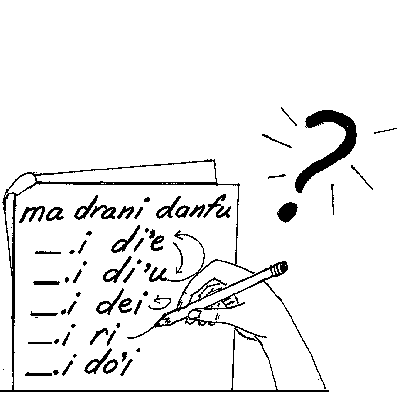

## What are pro-sumti and pro-bridi? What are they for?

Speakers of Lojban, like speakers of other languages, require mechanisms of abbreviation. If every time we referred to something, we had to express a complete description of it, life would be too short to say what we have to say. In English, we have words called “pronouns” which allow us to replace nouns or noun phrases with shorter terms. An English with no pronouns might look something like this:

##### Example 7.1.

Speakers of Lojban, like speakers of other languages, require mechanisms of abbreviation. If every time speakers of Lojban referred to a thing to which speakers of Lojban refer, speakers of Lojban had to express a complete description of what speakers of Lojban referred to, life would be too short to say what speakers of Lojban have to say.

Speakers of this kind of English would get mightily sick of talking. Furthermore, there are uses of pronouns in English which are independent of abbreviation. There is all the difference in the world between:

##### Example 7.2.

John picked up a stick and shook it.

and

##### Example 7.3.

John picked up a stick and shook a stick.

[Example 7.3](/chapter07/#example-random-id-GoqJ "Example 7.3. ") does not imply that the two sticks are necessarily the same, whereas [Example 7.2](/chapter07/#example-random-id-VISf "Example 7.2. ") requires that they are.

In Lojban, we have sumti rather than nouns, so our equivalent of pronouns are called by the hybrid term “pro-sumti”. A purely Lojban term would be *sumti cmavo*: all of the pro-sumti are cmavo belonging to selma'o KOhA. In exactly the same way, Lojban has a group of cmavo (belonging to selma'o GOhA) which serve as selbri or full bridi. These may be called “pro-bridi” or *bridi cmavo*. This chapter explains the uses of all the members of selma'o KOhA and GOhA. They fall into a number of groups, known as series: thus, in selma'o KOhA, we have among others the mi-series, the ko'a-series, the da-series, and so on. In each section, a series of pro-sumti is explained, and if there is a corresponding series of pro-bridi, it is explained and contrasted. Many pro-sumti series don't have pro-bridi analogues, however.

A few technical terms: The term “referent” means the thing to which a pro-sumti (by extension, a pro-bridi) refers. If the speaker of a sentence is James, then the referent of the word “I” is James. On the other hand, the term “antecedent” refers to a piece of language which a pro-sumti (or pro-bridi) implicitly repeats. In

##### Example 7.4.

John loves himself

the antecedent of “himself” is “John”; not the person, but a piece of text (a name, in this case). John, the person, would be the referent of “himself”. Not all pro-sumti or pro-bridi have antecedents, but all of them have referents.

## Personal pro-sumti: the mi-series

The following cmavo are discussed in this section:

|      |      |           |                              |
| ---- | ---- | --------- | ---------------------------- |
| mi   | KOhA | mi-series | I, me                        |
| do   | KOhA | mi-series | you                          |
| mi'o | KOhA | mi-series | you and I                    |
| mi'a | KOhA | mi-series | I and others, we but not you |
| ma'a | KOhA | mi-series | you and I and others         |
| do'o | KOhA | mi-series | you and others               |
| ko   | KOhA | mi-series | you-imperative               |

The mi-series of pro-sumti refer to the speaker, the listener, and others in various combinations. *[mi](/glossary/#valsi-mi)* refers to the speaker and perhaps others for whom the speaker speaks; it may be a Lojbanic mass. *[do](/glossary/#valsi-do)* refers to the listener or listeners. Neither *[mi](/glossary/#valsi-mi)* nor *[do](/glossary/#valsi-do)* is specific about the number of persons referred to; for example, the foreman of a jury may refer to the members of the jury as *[mi](/glossary/#valsi-mi)*, since in speaking officially he represents all of them.

The referents of *[mi](/glossary/#valsi-mi)* and *[do](/glossary/#valsi-do)* are usually obvious from the context, but may be assigned by the vocative words of selma'o COI, explained in [Section 13.14](/chapter13/#section-vocative-scales "13.14. Vocative scales"). The vocative *[mi'e](/glossary/#valsi-mihe)* assigns *[mi](/glossary/#valsi-mi)*, whereas all of the other vocatives assign *[do](/glossary/#valsi-do)*.

##### Example 7.5.

|      |        |     |        |     |         |          |     |       |            |     |     |
| ---- | ------ | --- | ------ | --- | ------- | -------- | --- | ----- | ---------- | --- | --- |
| mi'e | .djan. | doi | frank. | mi  | cusku   | lu       | mi  | bajra | li'u       |     | do  |
| I-am | John,  | O   | Frank, | I   | express | \[quote\] | I   | run   | \[unquote\] | to  | you |

|                                       |
| ------------------------------------- |
| I am John, Frank; I tell you “I run”. |

The cmavo *[mi'o](/glossary/#valsi-miho)*, *[mi'a](/glossary/#valsi-miha)*, *[ma'a](/glossary/#valsi-maha)*, and *[do'o](/glossary/#valsi-doho)* express various combinations of the speaker and/or the listener and/or other people:

- *[mi'o](/glossary/#valsi-miho)* includes only the speaker and the listener but no one else;

- *[mi'a](/glossary/#valsi-miha)* includes the speaker and others but excludes the listener;

- *[do'o](/glossary/#valsi-doho)* includes the listener and others but excludes the speaker;

- *[ma'a](/glossary/#valsi-maha)* includes all three: speaker, listener, others.

All of these pro-sumti represent masses. For example, *[mi'o](/glossary/#valsi-miho)* is the same as *mi joi do*, the mass of me and you considered jointly.

In English, “we” can mean *[mi](/glossary/#valsi-mi)* or *[mi'o](/glossary/#valsi-miho)* or *[mi'a](/glossary/#valsi-miha)* or even *[ma'a](/glossary/#valsi-maha)*, and English-speakers often suffer because they cannot easily distinguish *[mi'o](/glossary/#valsi-miho)* from *[mi'a](/glossary/#valsi-miha)*:

##### Example 7.6.

We're going to the store.

Does this include the listener or not? There's no way to be sure.

Finally, the cmavo *[ko](/glossary/#valsi-ko)* is logically equivalent to *[do](/glossary/#valsi-do)*; its referent is the listener. However, its use alters an assertion about the listener into a command to the listener to make the assertion true:

##### Example 7.7.

|     |       |     |        |
| --- | ----- | --- | ------ |
| do  | klama | le  | zarci  |
| You | go-to | the | store. |

becomes:

##### Example 7.8.

|                   |       |     |        |
| ----------------- | ----- | --- | ------ |
| ko                | klama | le  | zarci  |
| You \[imperative\] | go-to | the | store. |

|                                  |
| -------------------------------- |
| Make “you go to the store” true! |
| Go to the store!                 |

In English, the subject of a command is omitted, but in Lojban, the word *[ko](/glossary/#valsi-ko)* must be used. However, *[ko](/glossary/#valsi-ko)* does not have to appear in the x1 place:

##### Example 7.9.

|     |       |                   |
| --- | ----- | ----------------- |
| mi  | viska | ko                |
| I   | see   | you-\[imperative\] |

|                        |
| ---------------------- |
| Make “I see you” true! |
| Be seen by me!         |

In [Example 7.9](/chapter07/#example-random-id-5Jbi "Example 7.9. "), it is necessary to make the verb passive in English in order to convey the effect of *[ko](/glossary/#valsi-ko)* in the x2 place. Indeed, *[ko](/glossary/#valsi-ko)* does not even have to be a sumti of the main bridi:

##### Example 7.10.

|     |       |     |        |      |       |                   |
| --- | ----- | --- | ------ | ---- | ----- | ----------------- |
| mi  | viska | le  | prenu  | poi  | prami | ko                |
| I   | see   | the | person | that | loves | you-\[imperative\] |

|                                                      |
| ---------------------------------------------------- |
| Make “I see the person that loves you” true!         |
| Be such that the person who loves you is seen by me! |
| Show me the person who loves you!                    |

As mentioned in [Section 7.1](/chapter07/#section-anaphoric-cmavo-introduction "7.1. What are pro-sumti and pro-bridi? What are they for?"), some pro-sumti series have corresponding pro-bridi series. However, there is no equivalent of the mi-series among pro-bridi, since a person isn't a relationship.

## Demonstrative pro-sumti: the ti-series

The following cmavo are discussed in this section:

|     |      |           |                                     |
| --- | ---- | --------- | ----------------------------------- |
| ti  | KOhA | ti-series | this here, a nearby object          |
| ta  | KOhA | ti-series | that there, a medium-distant object |
| tu  | KOhA | ti-series | that yonder, a far-distant object   |

It is often useful to refer to things by pointing to them or by some related non-linguistic mechanism. In English, the words “this” and “that” serve this function among others: “this” refers to something pointed at that is near the speaker, and “that” refers to something further away. The Lojban pro-sumti of the ti-series serve the same functions, but more narrowly. The cmavo *[ti](/glossary/#valsi-ti)*, *[ta](/glossary/#valsi-ta)*, and *[tu](/glossary/#valsi-tu)* provide only the pointing function of “this” and “that”; they are not used to refer to things that cannot be pointed at.

There are three pro-sumti of the ti-series rather than just two because it is often useful to distinguish between objects that are at more than two different distances. Japanese, among other languages, regularly does this. Until the 16th century, English did too; the pronoun “that” referred to something at a medium distance from the speaker, and the now-archaic pronoun “yon” to something far away.

In conversation, there is a special rule about *[ta](/glossary/#valsi-ta)* and *[tu](/glossary/#valsi-tu)* that is often helpful in interpreting them. When used contrastingly, *[ta](/glossary/#valsi-ta)* refers to something that is near the listener, whereas *[tu](/glossary/#valsi-tu)* refers to something far from both speaker and listener. This makes for a parallelism between *[ti](/glossary/#valsi-ti)* and *[mi](/glossary/#valsi-mi)*, and *[ta](/glossary/#valsi-ta)* and *[do](/glossary/#valsi-do)*, that is convenient when pointing is not possible; for example, when talking by telephone. In written text, on the other hand, the meaning of the ti-series is inherently vague; is the writer to be taken as pointing to something, and if so, to what? In all cases, what counts as “near” and “far away” is relative to the current situation.

It is important to distinguish between the English pronoun “this” and the English adjective “this” as in “this boat”. The latter is not represented in Lojban by *[ti](/glossary/#valsi-ti)*:

##### Example 7.11.

|     |      |       |
| --- | ---- | ----- |
| le  | ti   | bloti |
| the | this | boat  |

does not mean “this boat” but rather “this one's boat”, “the boat associated with this thing”, as explained in [Section 8.7](/chapter08/#section-possessive-sumti "8.7. Possessive sumti"). A correct Lojban translation of [Example 7.11](/chapter07/#example-random-id-IWi7 "Example 7.11. ") is

##### Example 7.12.

|     |      |       |
| --- | ---- | ----- |
| le  | vi   | bloti |
| the | here | boat  |

|                 |
| --------------- |
| the nearby boat |

using a spatial tense before the selbri *[bloti](/glossary/#valsi-bloti)* to express that the boat is near the speaker. (Tenses are explained in full in [Chapter 10](/chapter10/ "Chapter 10. Imaginary Journeys: The Lojban Space/Time Tense System").) Another correct translation would be:

##### Example 7.13.

|            |                    |           |
| ---------- | ------------------ | --------- |
| ti         | noi                | bloti     |
| this-thing | which-incidentally | is-a-boat |

There are no demonstrative pro-bridi to correspond to the ti-series: you can't point to a relationship.

## Utterance pro-sumti: the di'u-series

The following cmavo are discussed in this section:

|      |      |             |                          |
| ---- | ---- | ----------- | ------------------------ |
| di'u | KOhA | di'u-series | the previous utterance   |
| de'u | KOhA | di'u-series | an earlier utterance     |
| da'u | KOhA | di'u-series | a much earlier utterance |
| di'e | KOhA | di'u-series | the next utterance       |
| de'e | KOhA | di'u-series | a later utterance        |
| da'e | KOhA | di'u-series | a much later utterance   |
| dei  | KOhA | di'u-series | this very utterance      |
| do'i | KOhA | di'u-series | some utterance           |

The cmavo of the di'u-series enable us to talk about things that have been, are being, or will be said. In English, it is normal to use “this” and “that” for this (indeed, the immediately preceding “this” is an example of such a usage):

##### Example 7.14.

You don't like cats.

That is untrue.

Here “that” does not refer to something that can be pointed to, but to the preceding sentence “You don't like cats”. In Lojban, therefore, [Example 7.14](/chapter07/#example-random-id-KNih "Example 7.14. ") is rendered:

##### Example 7.15.

|     |        |       |             |       |
| --- | ------ | ----- | ----------- | ----- |
| do  | na     | nelci | loi         | mlatu |
| You | (Not!) | like  | the-mass-of | cats  |

|     |                        |            |           |
| --- | ---------------------- | ---------- | --------- |
| .i  | di'u                   | jitfa      | jufra     |
| .   | The-previous-utterance | is-a-false | sentence. |

Using *[ta](/glossary/#valsi-ta)* instead of *[di'u](/glossary/#valsi-dihu)* would cause the listener to look around to see what the speaker of the second sentence was physically pointing to.

As with *[ti](/glossary/#valsi-ti)*, *[ta](/glossary/#valsi-ta)*, and *[tu](/glossary/#valsi-tu)*, the cmavo of the di'u-series come in threes: a close utterance, a medium-distance utterance, and a distant utterance, either in the past or in the future. It turned out to be impossible to use the *i*/ *a*/ *u* vowel convention of the demonstratives in [Section 7.3](/chapter07/#section-ti-series "7.3. Demonstrative pro-sumti: the ti-series") without causing collisions with other cmavo, and so the di'u-series has a unique *i*/ *e*/ *a* convention in the first vowel of the cmavo.

Most references in speech are to the past (what has already been said), so *[di'e](/glossary/#valsi-dihe)*, *[de'e](/glossary/#valsi-dehe)*, and *[da'e](/glossary/#valsi-dahe)* are not very useful when speaking. In writing, they are frequently handy:

##### Example 7.16.

|            |        |           |                          |
| ---------- | ------ | --------- | ------------------------ |
| la         | saimn. | cusku     | di'e                     |
| That-named | Simon  | expresses | the-following-utterance. |

|             |
| ----------- |
| Simon says: |

[Example 7.16](/chapter07/#example-random-id-erEL "Example 7.16. ") would typically be followed by a quotation. Note that although presumably the quotation is of something Simon has said in the past, the quotation utterance itself would appear after [Example 7.16](/chapter07/#example-random-id-erEL "Example 7.16. "), and so *[di'e](/glossary/#valsi-dihe)* is appropriate.

The remaining two cmavo, *[dei](/glossary/#valsi-dei)* and *[do'i](/glossary/#valsi-dohi)*, refer respectively to the very utterance that the speaker is uttering, and to some vague or unspecified utterance uttered by someone at some time:

##### Example 7.17.

|                |           |           |
| -------------- | --------- | --------- |
| dei            | jetnu     | jufra     |
| This-utterance | is-a-true | sentence. |

|                                            |
| ------------------------------------------ |
| What I am saying (at this moment) is true. |

##### Example 7.18.

|                |           |           |
| -------------- | --------- | --------- |
| do'i           | jetnu     | jufra     |
| Some-utterance | is-a-true | sentence. |

|                                                                   |
| ----------------------------------------------------------------- |
| That's true (where “that” is not necessarily what was just said). |

The cmavo of the di'u-series have a meaning that is relative to the context. The referent of *[dei](/glossary/#valsi-dei)* in the current utterance is the same as the referent of *[di'u](/glossary/#valsi-dihu)* in the next utterance. The term “utterance” is used rather than “sentence” because the amount of speech or written text referred to by any of these words is vague. Often, a single bridi is intended, but longer utterances may be thus referred to.

Note one very common construction with *[di'u](/glossary/#valsi-dihu)* and the cmavo *[la'e](/glossary/#valsi-lahe)* (of selma'o LAhE; see [Section 6.10](/chapter06/#section-sumti-qualifiers "6.10. sumti qualifiers")) which precedes a sumti and means “the thing referred to by (the sumti)”:

##### Example 7.19.

|     |       |            |        |     |     |       |                 |                     |
| --- | ----- | ---------- | ------ | --- | --- | ----- | --------------- | ------------------- |
| mi  | prami | la         | djein. | .i  | mi  | nelci | la'e            | di'u                |
| I   | love  | that-named | Jane.  | And | I   | like  | the-referent-of | the-last-utterance. |

|                               |
| ----------------------------- |
| I love Jane, and I like that. |

The effect of *la'e di'u* in [Example 7.19](/chapter07/#example-random-id-MsUd "Example 7.19. ") is that the speaker likes, not the previous sentence, but rather the state of affairs referred to by the previous sentence, namely his loving Jane. This cmavo compound is often written as a single word: *[la'edi'u](/glossary/#valsi-lahedihu)*. It is important not to mix up *[di'u](/glossary/#valsi-dihu)* and *[la'edi'u](/glossary/#valsi-lahedihu)*, or the wrong meaning will generally result:

##### Example 7.20.

|     |       |            |        |     |     |       |                     |
| --- | ----- | ---------- | ------ | --- | --- | ----- | ------------------- |
| mi  | prami | la         | djein. | .i  | mi  | nelci | di'u                |
| I   | love  | that-named | Jane.  | And | I   | like  | the-last-utterance. |

says that the speaker likes one of his own sentences.

There are no pro-bridi corresponding to the di'u-series.

## Assignable pro-sumti and pro-bridi: the ko'a-series and the broda-series

The following cmavo and gismu are discussed in this section:

|       |        |              |                      |
| ----- | ------ | ------------ | -------------------- |
| ko'a  | KOhA   | ko'a-series  | it-1                 |
| ko'e  | KOhA   | ko'a-series  | it-2                 |
| ko'i  | KOhA   | ko'a-series  | it-3                 |
| ko'o  | KOhA   | ko'a-series  | it-4                 |
| ko'u  | KOhA   | ko'a-series  | it-5                 |
| fo'a  | KOhA   | ko'a-series  | it-6                 |
| fo'e  | KOhA   | ko'a-series  | it-7                 |
| fo'i  | KOhA   | ko'a-series  | it-8                 |
| fo'o  | KOhA   | ko'a-series  | it-9                 |
| fo'u  | KOhA   | ko'a-series  | it-10                |
| broda | BRIVLA | broda-series | is-thing-1           |
| brode | BRIVLA | broda-series | is-thing-2           |
| brodi | BRIVLA | broda-series | is-thing-3           |
| brodo | BRIVLA | broda-series | is-thing-4           |
| brodu | BRIVLA | broda-series | is-thing-5           |
| goi   | GOI    |              | pro-sumti assignment |
| cei   | CEI    |              | pro-bridi assignment |

The discussion of personal pro-sumti in [Section 7.2](/chapter07/#section-mi-series "7.2. Personal pro-sumti: the mi-series") may have seemed incomplete. In English, the personal pronouns include not only “I” and “you” but also “he”, “she”, “it”, and “they”. Lojban does have equivalents of this latter group: in fact, it has more of them than English does. However, they are organized and used very differently.

There are ten cmavo in the ko'a-series, and they may be assigned freely to any sumti whatsoever. The English word “he” can refer only to males, “she” only to females (and ships and a few other things), “it” only to inanimate things, and “they” only to plurals; the cmavo of the ko'a-series have no restrictions at all. Therefore, it is almost impossible to guess from the context what ko'a-series cmavo might refer to if they are just used freely:

##### Example 7.21.

|            |        |         |     |       |     |      |          |
| ---------- | ------ | ------- | --- | ----- | --- | ---- | -------- |
| la         | .alis. | klama   | le  | zarci | .i  | ko'a | blanu    |
| That-named | Alice  | goes-to | the | store | .   | It-1 | is-blue. |

The English gloss “it-1”, plus knowledge about the real world, would tend to make English-speakers believe that *[ko'a](/glossary/#valsi-koha)* refers to the store; in other words, that its antecedent is *le zarci*. To a Lojbanist, however, *la .alis.* is just as likely an antecedent, in which case [Example 7.21](/chapter07/#example-random-id-qdCR "Example 7.21. ") means that Alice, not the store, is blue.

To avoid this pitfall, Lojban employs special syntax, using the cmavo *[goi](/glossary/#valsi-goi)*:

##### Example 7.22.

|            |        |         |     |       |
| ---------- | ------ | ------- | --- | ----- |
| la         | .alis. | klama   | le  | zarci |
| That-named | Alice  | goes-to | the | store |

|     |       |               |            |        |     |          |
| --- | ----- | ------------- | ---------- | ------ | --- | -------- |
| .i  | ko'a  | goi           | la         | .alis. | cu  | blanu    |
| .   | It-1, | also-known-as | that-named | Alice  | ,   | is-blue. |

Syntactically, *goi la .alis.* is a relative phrase (relative phrases are explained in [Chapter 8](/chapter08/ "Chapter 8. Relative Clauses, Which Make sumti Even More Complicated")). Semantically, it says that *[ko'a](/glossary/#valsi-koha)* and *la .alis.* refer to the same thing, and furthermore that this is true because *[ko'a](/glossary/#valsi-koha)* is being defined as meaning *la .alis.*. It is equally correct to say:

##### Example 7.23.

|            |        |         |     |       |
| ---------- | ------ | ------- | --- | ----- |
| la         | .alis. | klama   | le  | zarci |
| That-named | Alice  | goes-to | the | store |

|     |            |        |               |       |     |          |
| --- | ---------- | ------ | ------------- | ----- | --- | -------- |
| .i  | la         | .alis. | goi           | ko'a  | cu  | blanu    |
| .   | That-named | Alice, | also-known-as | it-1, |     | is-blue. |

in other words, *[goi](/glossary/#valsi-goi)* is symmetrical. There is a terminator, *[ge'u](/glossary/#valsi-gehu)* (of selma'o GEhU), which is almost always elidable. The details are in [Section 8.3](/chapter08/#section-relative-phrases "8.3. Relative phrases").

The afterthought form of *[goi](/glossary/#valsi-goi)* shown in [Example 7.22](/chapter07/#example-random-id-duGR "Example 7.22. ") and [Example 7.23](/chapter07/#example-random-id-oKaM "Example 7.23. ") is probably most common in speech, where we do not know until part way through our utterance that we will want to refer to Alice again. In writing, though, *[ko'a](/glossary/#valsi-koha)* may be assigned at the point where Alice is first mentioned. An example of this forethought form of *[goi](/glossary/#valsi-goi)* is:

##### Example 7.24.

|            |        |               |       |         |     |       |     |      |     |          |
| ---------- | ------ | ------------- | ----- | ------- | --- | ----- | --- | ---- | --- | -------- |
| la         | .alis. | goi           | ko'a  | klama   | le  | zarci | .i  | ko'a | cu  | blanu    |
| That-named | Alice, | also-known-as | it-1, | goes-to | the | store | .   | It-1 |     | is-blue. |

Again, *ko'a goi la .alis.* would have been entirely acceptable in [Example 7.24](/chapter07/#example-random-id-1FJV "Example 7.24. "). This last form is reminiscent of legal jargon: “The party of the first part, hereafter known as Buyer, ...”.

Just as the ko'a-series of pro-sumti allows a substitute for a sumti which is long or complex, or which for some other reason we do not want to repeat, so the broda-series of pro-bridi allows a substitute for a selbri or even a whole bridi:

##### Example 7.25.

|                                                                                                        |
| ------------------------------------------------------------------------------------------------------ |
| ti slasi je mlatu bo cidja lante gacri cei broda .i le crino broda cu barda .i le xunre broda cu cmalu |

|                                                                                                        |
| ------------------------------------------------------------------------------------------------------ |
| These are plastic cat-food can covers or thingies. The green thingy is large. The red thingy is small. |

The pro-bridi *[broda](/glossary/#valsi-broda)* has as its antecedent the selbri *slasi je mlatu bo cidja lante gacri*. The cmavo *[cei](/glossary/#valsi-cei)* performs the role of *[goi](/glossary/#valsi-goi)* in assigning *[broda](/glossary/#valsi-broda)* to this long phrase, and *[broda](/glossary/#valsi-broda)* can then be used just like any other brivla. (In fact, *[broda](/glossary/#valsi-broda)* and its relatives actually *are* brivla: they are gismu in morphology, although they behave exactly like the members of selma'o GOhA. The reasons for using gismu rather than cmavo are buried in the Loglan Project's history.)

Note that pro-bridi are so called because, even though they have the grammar of selbri, their antecedents are whole bridi. In the following rather contrived example, the antecedent of *[brode](/glossary/#valsi-brode)* is the whole bridi *mi klama le zarci*:

##### Example 7.26.

|     |       |           |          |     |       |     |     |          |
| --- | ----- | --------- | -------- | --- | ----- | --- | --- | -------- |
| mi  | klama | cei       | brode    | le  | zarci | .i  | do  | brode    |
| I   | go-to | (which-is | claim-1) | the | store | .   | You | claim-1. |

|                              |
| ---------------------------- |
| I go to the store. You, too. |

In the second bridi, *do brode* means *do klama le zarci*, because *[brode](/glossary/#valsi-brode)* carries the x2 sumti of *mi klama le zarci* along with it. It also potentially carries the x1 sumti as well, but the explicit x1 sumti *[do](/glossary/#valsi-do)* overrides the *[mi](/glossary/#valsi-mi)* of the antecedent bridi. Similarly, any tense or negation that is present in the antecedent is also carried, and can be overridden by explicit tense or negation cmavo on the pro-bridi. These rules hold for all pro-bridi that have antecedents.

Another use of *[broda](/glossary/#valsi-broda)* and its relatives, without assignment, is as “sample gismu”:

##### Example 7.27.

|     |         |         |     |         |         |         |     |
| --- | ------- | ------- | --- | ------- | ------- | ------- | --- |
|     | broda   |         | ke  | brode   |         | brodi   |     |
| a   | thing-1 | type-of | (   | thing-2 | type-of | thing-3 | )   |

represents an abstract pattern, a certain kind of tanru. (Historically, this use was the original one.)

As is explained in [Section 17.9](/chapter17/#section-lerfu-pro-sumti "17.9. lerfu words as pro-sumti"), the words for Lojban letters, belonging to selma'o BY and certain related selma'o, are also usable as assignable pro-sumti. The main difference between letter pro-sumti and ko'a-series pro-sumti is that, in the absence of an explicit assignment, letters are taken to refer to the most recent name or description sumti beginning with the same letter:

##### Example 7.28.

|     |       |     |       |     |     |           |          |        |     |
| --- | ----- | --- | ----- | --- | --- | --------- | -------- | ------ | --- |
| mi  | viska | le  | gerku | .i  | gy. | cusku     | zo       | arf.   |     |
| I   | see   | the | dog   | .   | D   | expresses | the-word | “Arf!” | .   |

The Lojban word *[gerku](/glossary/#valsi-gerku)* begins with *g*, so the antecedent of *[gy.](/glossary/#valsi-gy)*, the cmavo for the letter *g*, must be *le gerku*. In the English translation, we use the same principle to refer to the dog as “D”. Of course, in case of ambiguity, *[goi](/glossary/#valsi-goi)* can be used to make an explicit assignment.

Furthermore, *[goi](/glossary/#valsi-goi)* can even be used to assign a name:

##### Example 7.29.

|     |       |               |            |      |     |         |     |        |
| --- | ----- | ------------- | ---------- | ---- | --- | ------- | --- | ------ |
| le  | ninmu | goi           | la         | sam. | cu  | klama   | le  | zarci  |
| The | woman | also-known-as | that-named | Sam  |     | goes-to | the | store. |

|                                                   |
| ------------------------------------------------- |
| The woman, whom I'll call Sam, goes to the store. |

This usage does not imply that the woman's name is Sam, or even that the speaker usually calls the woman “Sam”. “Sam” is simply a name chosen, as if at random, for use in the current context only.

## Anaphoric pro-sumti and pro-bridi: the ri-series and the go'i-series

The following cmavo are discussed in this section:

|      |      |             |                              |
| ---- | ---- | ----------- | ---------------------------- |
| ri   | KOhA | ri-series   | (repeats last sumti)         |
| ra   | KOhA | ri-series   | (repeats previous sumti)     |
| ru   | KOhA | ri-series   | (repeats long-ago sumti)     |
| go'i | GOhA | go'i-series | (repeats last bridi)         |
| go'a | GOhA | go'i-series | (repeats previous bridi)     |
| go'u | GOhA | go'i-series | (repeats long-ago bridi)     |
| go'e | GOhA | go'i-series | (repeats last-but-one bridi) |
| go'o | GOhA | go'i-series | (repeats future bridi)       |
| nei  | GOhA | go'i-series | (repeats current bridi)      |
| no'a | GOhA | go'i-series | (repeats outer bridi)        |
| ra'o | RAhO |             | pro-cmavo update             |

The term “anaphora” literally means “repetition”, but is used in linguistics to refer to pronouns whose significance is the repetition of earlier words, namely their antecedents. Lojban provides three pro-sumti anaphora, *[ri](/glossary/#valsi-ri)*, *[ra](/glossary/#valsi-ra)*, and *[ru](/glossary/#valsi-ru)*; and three corresponding pro-bridi anaphora, *[go'i](/glossary/#valsi-gohi)*, *[go'a](/glossary/#valsi-goha)*, and *[go'u](/glossary/#valsi-gohu)*. These cmavo reveal the same vowel pattern as the ti-series, but the “distances” referred to are not physical distances, but distances from the anaphoric cmavo to its antecedent.

The cmavo *[ri](/glossary/#valsi-ri)* is the simplest of these; it has the same referent as the last complete sumti appearing before the *[ri](/glossary/#valsi-ri)*:

##### Example 7.30.

|            |        |        |      |     |     |                      |       |
| ---------- | ------ | ------ | ---- | --- | --- | -------------------- | ----- |
| la         | .alis. | sipna  | ne'i | le  |     | ri                   | kumfa |
| That-named | Alice  | sleeps | in   | the | of- | \[repeat-last-sumti\] | room. |

|                           |
| ------------------------- |
| Alice sleeps in her room. |

The *[ri](/glossary/#valsi-ri)* in [Example 7.30](/chapter07/#example-random-id-3som "Example 7.30. ") is equivalent to repeating the last sumti, which is *la .alis.*, so [Example 7.30](/chapter07/#example-random-id-3som "Example 7.30. ") is equivalent to:

##### Example 7.31.

|            |        |        |      |     |     |            |        |       |
| ---------- | ------ | ------ | ---- | --- | --- | ---------- | ------ | ----- |
| la         | .alis. | sipna  | ne'i | le  |     | la         | .alis. | kumfa |
| That-named | Alice  | sleeps | in   | the | of- | that-named | Alice  | room. |

|                               |
| ----------------------------- |
| Alice sleeps in Alice's room. |

Note that *[ri](/glossary/#valsi-ri)* does not repeat *le ri kumfa*, because that sumti is not yet complete when *[ri](/glossary/#valsi-ri)* appears. This prevents *[ri](/glossary/#valsi-ri)* from getting entangled in paradoxes of self-reference. (There are plenty of other ways to do that!) Note also that sumti within other sumti, as in quotations, abstractions, and the like, are counted in the order of their beginnings; thus a lower level sumti like *la alis.* in [Example 7.31](/chapter07/#example-random-id-bs5R "Example 7.31. ") is considered to be more recent than a higher level sumti that contains it.

Certain sumti are ignored by *[ri](/glossary/#valsi-ri)*; specifically, most of the other cmavo of KOhA, and the almost-grammatically-equivalent lerfu words of selma'o BY. It is simpler just to repeat these directly:

##### Example 7.32.

|     |       |     |
| --- | ----- | --- |
| mi  | prami | mi  |
| I   | love  | me. |

|                |
| -------------- |
| I love myself. |

However, the cmavo of the ti-series can be picked up by *[ri](/glossary/#valsi-ri)*, because you might have changed what you are pointing at, so repeating *[ti](/glossary/#valsi-ti)* may not be effective. Likewise, *[ri](/glossary/#valsi-ri)* itself (or rather its antecedent) can be repeated by a later *[ri](/glossary/#valsi-ri)*; in fact, a string of *[ri](/glossary/#valsi-ri)* cmavo with no other intervening sumti always all repeat the same sumti:

##### Example 7.33.

|            |       |       |     |       |     |
| ---------- | ----- | ----- | --- | ----- | --- |
| la         | djan. | viska | le  | tricu | .i  |
| That-named | John  | sees  | the | tree. |     |

|                |               |     |     |                |         |
| -------------- | ------------- | --- | --- | -------------- | ------- |
| ri             | se jadni      | le  |     | ri             | jimca   |
| \[repeat-last\] | is-adorned-by | the | of- | \[repeat-last\] | branch. |

|                                                    |
| -------------------------------------------------- |
| John sees the tree. It is adorned by its branches. |

Here the second *[ri](/glossary/#valsi-ri)* has as antecedent the first *[ri](/glossary/#valsi-ri)*, which has as antecedent *le tricu*. All three refer to the same thing: a tree.

To refer to the next-to-last sumti, the third-from-last sumti, and so on, *[ri](/glossary/#valsi-ri)* may be subscripted (subscripts are explained in [Section 19.6](/chapter19/#section-subscripts-general "19.6. Subscripts: XI")):

##### Example 7.34.

|     |        |     |     |       |     |            |      |       |                         |
| --- | ------ | --- | --- | ----- | --- | ---------- | ---- | ----- | ----------------------- |
| lo  | smuci  | .i  | lo  | forca | .i  | la         | rik. | pilno | rixire                  |
| A   | spoon. |     | A   | fork. |     | That-named | Rick | uses  | \[repeat-next-to-last\]. |

|     |            |        |       |                            |
| --- | ---------- | ------ | ----- | -------------------------- |
| .i  | la         | .alis. | pilno | riximu                     |
|     | That-named | Alice  | uses  | \[repeat-fifth-from-last\]. |

Here *rixire*, or “ri-sub-2”, skips *la rik.* to reach *lo forca*. In the same way, *riximu*, or “ri-sub-5”, skips *la .alis.*, *rixire*, *la rik.*, and *lo forca* to reach *lo smuci*. As can clearly be seen, this procedure is barely practicable in writing, and would break down totally in speech.

Therefore, the vaguer *[ra](/glossary/#valsi-ra)* and *[ru](/glossary/#valsi-ru)* are also provided. The cmavo *[ra](/glossary/#valsi-ra)* repeats a recently used sumti, and *[ru](/glossary/#valsi-ru)* one that was further back in the speech or text. The use of *[ra](/glossary/#valsi-ra)* and *[ru](/glossary/#valsi-ru)* forces the listener to guess at the referent, but makes life easier for the speaker. Can *[ra](/glossary/#valsi-ra)* refer to the last sumti, like *[ri](/glossary/#valsi-ri)*? The answer is no if *[ri](/glossary/#valsi-ri)* has also been used. If *[ri](/glossary/#valsi-ri)* has not been used, then *[ra](/glossary/#valsi-ra)* might be the last sumti. Likewise, if *[ra](/glossary/#valsi-ra)* has been used, then any use of *[ru](/glossary/#valsi-ru)* would repeat a sumti earlier than the one *[ra](/glossary/#valsi-ra)* is repeating. A more reasonable version of [Example 7.34](/chapter07/#example-random-id-Lc2y "Example 7.34. "), but one that depends more on context, is:

##### Example 7.35.

|     |        |     |     |       |     |            |      |       |                         |
| --- | ------ | --- | --- | ----- | --- | ---------- | ---- | ----- | ----------------------- |
| lo  | smuci  | .i  | lo  | forca | .i  | la         | rik. | pilno | ra                      |
| A   | spoon. |     | A   | fork. |     | That-named | Rick | uses  | \[some-previous-thing\]. |

|     |            |        |       |                            |
| --- | ---------- | ------ | ----- | -------------------------- |
| .i  | la         | .alis. | pilno | ru                         |
|     | That-named | Alice  | uses  | \[some-more-remote-thing\]. |

In [Example 7.35](/chapter07/#example-random-id-N89g "Example 7.35. "), the use of *[ra](/glossary/#valsi-ra)* tells us that something other than *la rik.* is the antecedent; *lo forca* is the nearest sumti, so it is probably the antecedent. Similarly, the antecedent of *[ru](/glossary/#valsi-ru)* must be something even further back in the utterance than *lo forca*, and *lo smuci* is the obvious candidate.

The meaning of *[ri](/glossary/#valsi-ri)* must be determined every time it is used. Since *[ra](/glossary/#valsi-ra)* and *[ru](/glossary/#valsi-ru)* are more vaguely defined, they may well retain the same meaning for a while, but the listener cannot count on this behavior. To make a permanent reference to something repeated by *[ri](/glossary/#valsi-ri)*, *[ra](/glossary/#valsi-ra)*, or *[ru](/glossary/#valsi-ru)*, use *[goi](/glossary/#valsi-goi)* and a ko'a-series cmavo:

##### Example 7.36.

|            |        |         |     |       |
| ---------- | ------ | ------- | --- | ----- |
| la         | .alis. | klama   | le  | zarci |
| That-named | Alice  | goes-to | the | store |

|     |                   |               |      |          |
| --- | ----------------- | ------------- | ---- | -------- |
| .i  | ri                | goi           | ko'a | blanu    |
| .   | It-last-mentioned | also-known-as | it-1 | is-blue. |

allows the store to be referred to henceforth as *[ko'a](/glossary/#valsi-koha)* without ambiguity. [Example 7.36](/chapter07/#example-random-id-xIRG "Example 7.36. ") is equivalent to [Example 7.21](/chapter07/#example-random-id-qdCR "Example 7.21. ") and eliminates any possibility of *[ko'a](/glossary/#valsi-koha)* being interpreted by the listener as referring to Alice.

The cmavo *[go'i](/glossary/#valsi-gohi)*, *[go'a](/glossary/#valsi-goha)*, and *[go'u](/glossary/#valsi-gohu)* follow exactly the same rules as *[ri](/glossary/#valsi-ri)*, *[ra](/glossary/#valsi-ra)*, and *[ru](/glossary/#valsi-ru)*, except that they are pro-bridi, and therefore repeat bridi, not sumti – specifically, main sentence bridi. Any bridi that are embedded within other bridi, such as relative clauses or abstractions, are not counted. Like the cmavo of the broda-series, the cmavo of the go'i-series copy all sumti with them. This makes *[go'i](/glossary/#valsi-gohi)* by itself convenient for answering a question affirmatively, or for repeating the last bridi, possibly with new sumti:

##### Example 7.37.

|                |          |        |                |      |     |                       |
| -------------- | -------- | ------ | -------------- | ---- | --- | --------------------- |
| xu             | zo       | .djan. | cmene          | do   | .i  | go'i                  |
| \[True-false?\] | The-word | “John” | is-the-name-of | you? |     | \[repeat last bridi\]. |

|                         |
| ----------------------- |
| Is John your name? Yes. |

##### Example 7.38.

|     |       |     |       |     |     |                       |
| --- | ----- | --- | ----- | --- | --- | --------------------- |
| mi  | klama | le  | zarci | .i  | do  | go'i                  |
| I   | go-to | the | store | .   | You | \[repeat last bridi\]. |

|                               |
| ----------------------------- |
| I go to the store . You, too. |

Note that [Example 7.38](/chapter07/#example-random-id-qLn5 "Example 7.38. ") means the same as [Example 7.26](/chapter07/#example-random-id-UFJf "Example 7.26. "), but without the bother of assigning an actual broda-series word to the first bridi. For long-term reference, use *go'i cei broda* or the like, analogously to *ri goi ko'a* in [Example 7.36](/chapter07/#example-random-id-xIRG "Example 7.36. ").

The remaining four cmavo of the go'i-series are provided for convenience or for achieving special effects. The cmavo *[go'e](/glossary/#valsi-gohe)* means the same as *go'ixire*: it repeats the last bridi but one. This is useful in conversation:

##### Example 7.39.

|     |     |           |       |     |        |
| --- | --- | --------- | ----- | --- | ------ |
| A:  | mi  | ba        | klama | le  | zarci  |
| A:  | I   | \[future\] | go-to | the | store. |

|                             |
| --------------------------- |
| A: I am going to the store. |

|     |     |       |     |            |     |                       |
| --- | --- | ----- | --- | ---------- | --- | --------------------- |
| B:  | mi  | nelci | le  | si'o       | mi  | go'i                  |
| B:  | I   | like  | the | concept-of | I   | \[repeat-last-bridi\]. |

|                                 |
| ------------------------------- |
| B: I like the idea of my going. |

|     |     |                               |
| --- | --- | ----------------------------- |
| A:  | do  | go'e                          |
| A:  | You | \[repeat-last-bridi-but-one\]. |

|                    |
| ------------------ |
| A: You'll go, too. |

Here B's sentence repeats A's within an abstraction (explained in [Chapter 11](/chapter11/ "Chapter 11. Events, Qualities, Quantities, And Other Vague Words: On Lojban Abstraction")): *le si'o mi go'i* means *le si'o mi klama le zarci*. Why must B use the word *[mi](/glossary/#valsi-mi)* explicitly to replace the x1 of *mi klama le zarci*, even though it looks like *[mi](/glossary/#valsi-mi)* is replacing *[mi](/glossary/#valsi-mi)*? Because B's *[mi](/glossary/#valsi-mi)* refers to B, whereas A's *[mi](/glossary/#valsi-mi)* refers to A. If B said:

##### Example 7.40.

mi nelci le si'o go'i

that would mean:

> I like the idea of your going to the store.

The repetition signalled by *[go'i](/glossary/#valsi-gohi)* is not literally of words, but of concepts. Finally, A repeats her own sentence, but with the x1 changed to *[do](/glossary/#valsi-do)*, meaning B. Note that in [Example 7.39](/chapter07/#example-random-id-9hf5 "Example 7.39. "), the tense *[ba](/glossary/#valsi-ba)* (future time) is carried along by both *[go'i](/glossary/#valsi-gohi)* and *[go'e](/glossary/#valsi-gohe)*.

Descriptions based on go'i-series cmavo can be very useful for repeating specific sumti of previous bridi:

##### Example 7.41.

|     |       |       |     |         |     |        |     |                                   |
| --- | ----- | ----- | --- | ------- | --- | ------ | --- | --------------------------------- |
| le  | xekri | mlatu | cu  | klama   | le  | zarci  | .i  | le                                |
| The | black | cat   |     | goes-to | the | store. |     | That-described-as-the-x1-place-of |

|                      |     |          |     |       |
| -------------------- | --- | -------- | --- | ----- |
| go'i                 | cu  | cadzu    | le  | bisli |
| \[repeat-last-bridi\] |     | walks-on | the | ice.  |

|                                                       |
| ----------------------------------------------------- |
| The black cat goes to the store. It walks on the ice. |

Here the *[go'i](/glossary/#valsi-gohi)* repeats *le xekri mlatu cu klama le zarci*, and since *[le](/glossary/#valsi-le)* makes the x1 place into a description, and the x1 place of this bridi is *le xekri mlatu*, *le go'i* means *le xekri mlatu*.

The cmavo *[go'o](/glossary/#valsi-goho)*, *[nei](/glossary/#valsi-nei)*, and *[no'a](/glossary/#valsi-noha)*, unlike the other members of the go'i- series, can repeat non-sentence bridi). Here are a few examples:

##### Example 7.42.

|     |         |     |          |     |                         |
| --- | ------- | --- | -------- | --- | ----------------------- |
| mi  | nupre   | le  | nu       | mi  | go'o                    |
| I   | promise | the | event-of | I   | \[repeat-future-bridi\]. |

|     |           |       |     |       |     |     |       |
| --- | --------- | ----- | --- | ----- | --- | --- | ----- |
| .i  | ba        | dunda | le  | djini |     | le  | bersa |
|     | \[Future\] | give  | the | money | to  | the | son   |

|     |           |       |     |       |     |     |          |
| --- | --------- | ----- | --- | ----- | --- | --- | -------- |
| .i  | ba        | dunda | le  | zdani |     | le  | tixnu    |
|     | \[Future\] | give  | the | house | to  | the | daughter |

|                                                                                         |
| --------------------------------------------------------------------------------------- |
| I promise to do the following: Give the money to my son. Give the house to my daughter. |

(Note: The Lojban does not contain an equivalent of the *[my](/glossary/#valsi-my)* in the colloquial English; it leaves the fact that it is the speaker's son and daughter that are referred to implicit. To make the fact explicit, use *tixnu be mi*.)

For good examples of *[nei](/glossary/#valsi-nei)* and *[no'a](/glossary/#valsi-noha)*, we need nested bridi contexts:

##### Example 7.43.

|     |     |               |     |          |      |             |     |           |
| --- | --- | ------------- | --- | -------- | ---- | ----------- | --- | --------- |
| mi  | se  | pluka         | le  | nu       | do   | pensi       | le  | nu        |
| I   |     | am-pleased-by | the | event-of | (you | think-about | the | (event-of |

|               |     |        |     |           |      |          |
| ------------- | --- | ------ | --- | --------- | ---- | -------- |
| nei           | kei | pu     | le  | nu        | do   | zukte    |
| \[main-bridi\] | )   | before | the | (event-of | your | acting). |

|                                                                                              |
| -------------------------------------------------------------------------------------------- |
| I am pleased that you thought about whether I would be pleased (about ...) before you acted. |

##### Example 7.44.

|     |           |       |            |     |          |     |                        |
| --- | --------- | ----- | ---------- | --- | -------- | --- | ---------------------- |
| mi  | ba        | klama | ca         | le  | nu       | do  | no'a                   |
| I   | \[future\] | go    | \[present\] | the | event-of | you | \[repeats outer bridi\] |

|                        |
| ---------------------- |
| I will go when you do. |

Finally, *[ra'o](/glossary/#valsi-raho)* is a cmavo that can be appended to any go'i-series cmavo, or indeed any cmavo of selma'o GOhA, to signal that pro-sumti or pro-bridi cmavo in the antecedent are to be repeated literally and reinterpreted in their new context. Normally, any pro-sumti used within the antecedent of the pro-bridi keep their meanings intact. In the presence of *[ra'o](/glossary/#valsi-raho)*, however, their meanings must be reinterpreted with reference to the new environment. If someone says to you:

##### Example 7.45.

|                         |
| ----------------------- |
| mi ba lumci le mi karce |

|                     |
| ------------------- |
| I will wash my car. |

you might reply either:

##### Example 7.46.

|         |
| ------- |
| mi go'i |

|                       |
| --------------------- |
| I will wash your car. |

or:

##### Example 7.47.

|              |
| ------------ |
| mi go'i ra'o |

|                     |
| ------------------- |
| I will wash my car. |

The *[ra'o](/glossary/#valsi-raho)* forces the second *[mi](/glossary/#valsi-mi)* from the original bridi to mean the new speaker rather than the former speaker. This means that *go'e ra'o* would be an acceptable alternative to *do go'e* in B's statement in [Example 7.39](/chapter07/#example-random-id-9hf5 "Example 7.39. ").

The anaphoric pro-sumti of this section can be used in quotations, but never refer to any of the supporting text outside the quotation, since speakers presumably do not know that they may be quoted by someone else.

However, a *ri-*&#x73;eries or *go'a-*&#x73;eries reference within a quotation can refer to something mentioned in an earlier quotation if the two quotations are closely related in time and context. This allows a quotation to be broken up by narrative material without interfering with the pro-sumti within it. Here's an example:

##### Example 7.48.

|            |       |       |          |     |       |     |       |             |
| ---------- | ----- | ----- | -------- | --- | ----- | --- | ----- | ----------- |
| la         | djan. | cusku | lu       | mi  | klama | le  | zarci | li'u        |
| That-named | John  | says  | \[quote\] | I   | go-to | the | store | \[unquote\]. |

|     |            |        |       |          |     |           |             |
| --- | ---------- | ------ | ----- | -------- | --- | --------- | ----------- |
| .i  | la         | .alis. | cusku | lu       | mi  | go'i      | li'u        |
|     | That-named | Alice  | says  | \[quote\] | I   | \[repeat\] | \[unquote\]. |

|                                                             |
| ----------------------------------------------------------- |
| John says, “I am going to the store.” Alice says, “Me too.” |

Of course, there is no problem with narrative material referring to something within a quotation: people who quote, unlike people who are quoted, are aware of what they are doing.

## Indefinite pro-sumti and pro-bridi: the zo'e-series and the co'e-series

The following cmavo are discussed in this section:

|      |      |             |                              |
| ---- | ---- | ----------- | ---------------------------- |
| zo'e | KOhA | zo'e-series | the obvious value            |
| zu'i | KOhA | zo'e-series | the typical value            |
| zi'o | KOhA | zo'e-series | the nonexistent value        |
| co'e | GOhA | co'e-series | has the obvious relationship |

The cmavo of the zo'e-series represent indefinite, unspecified sumti. The cmavo *[zo'e](/glossary/#valsi-zohe)* represents an elliptical value for this sumti place; it is the optional spoken place holder when a sumti is skipped without being specified. Note that the elliptical value is not always the typical value. The properties of ellipsis lead to an elliptical sumti being defined as “whatever I want it to mean but haven't bothered to figure out, or figure out how to express”.

The cmavo *[zu'i](/glossary/#valsi-zuhi)*, on the other hand, represents the typical value for this place of this bridi:

##### Example 7.49.

|     |       |     |         |     |     |       |      |
| --- | ----- | --- | ------- | --- | --- | ----- | ---- |
| mi  | klama | le  | bartu   | be  | le  | zdani |      |
| I   | go-to | the | outside | of  | the | house | from |

|     |        |     |     |       |                     |                     |
| --- | ------ | --- | --- | ----- | ------------------- | ------------------- |
| le  | nenri  | be  | le  | zdani | zu'i                | zu'i                |
| the | inside | of  | the | house | \[by-typical-route\] | \[by-typical-means\] |

In [Example 7.49](/chapter07/#example-random-id-VScg "Example 7.49. "), the first *[zu'i](/glossary/#valsi-zuhi)* probably means something like “by the door”, and the second *[zu'i](/glossary/#valsi-zuhi)* probably means something like “on foot”, those being the typical route and means for leaving a house. On the other hand, if you are at the top of a high rise during a fire, neither *[zu'i](/glossary/#valsi-zuhi)* is appropriate. It's also common to use *[zu'i](/glossary/#valsi-zuhi)* in “by standard” places.

Finally, the cmavo *[zi'o](/glossary/#valsi-ziho)* represents a value which does not even exist. When a bridi fills one of its places with *[zi'o](/glossary/#valsi-ziho)*, what is really meant is that the selbri has a place which is irrelevant to the true relationship the speaker wishes to express. For example, the place structure of *[zbasu](/glossary/#valsi-zbasu)* is:

> actor x1 makes x2 from materials x3

Consider the sentence

> Living things are made from cells.

This cannot be correctly expressed as:

##### Example 7.50.

|             |               |     |          |                 |      |             |       |
| ----------- | ------------- | --- | -------- | --------------- | ---- | ----------- | ----- |
| loi         | jmive         | cu  | se zbasu | \[zo'e\]         | fi   | loi         | selci |
| The-mass-of | living-things |     | is-made  | \[by-something\] | from | the-mass-of | cells |

because the *[zo'e](/glossary/#valsi-zohe)*, expressed or understood, in [Example 7.50](/chapter07/#example-random-id-ipCV "Example 7.50. ") indicates that there is still a “maker” in this relationship. We do not generally suppose, however, that someone “makes” living things from cells. The best answer is probably to find a different selbri, one which does not imply a “maker”: however, an alternative strategy is to use *[zi'o](/glossary/#valsi-ziho)* to eliminate the maker place:

##### Example 7.51.

|             |               |     |
| ----------- | ------------- | --- |
| loi         | jmive         | cu  |
| The-mass-of | living-things |     |

|          |                  |      |             |        |
| -------- | ---------------- | ---- | ----------- | ------ |
| se zbasu | zi'o             |      | loi         | selci  |
| is-made  | \[without-maker\] | from | the-mass-of | cells. |

Note: The use of *[zi'o](/glossary/#valsi-ziho)* to block up, as it were, one place of a selbri actually creates a new selbri with a different place structure. Consider the following examples:

##### Example 7.52.

|     |       |     |          |      |                     |       |
| --- | ----- | --- | -------- | ---- | ------------------- | ----- |
| mi  | zbasu | le  | dinju    |      | loi                 | mudri |
| I   | make  | the | building | from | some-of-the-mass-of | wood. |

|                                  |
| -------------------------------- |
| I make the building out of wood. |

##### Example 7.53.

|                  |       |     |          |      |                     |       |
| ---------------- | ----- | --- | -------- | ---- | ------------------- | ----- |
| zi'o             | zbasu | le  | dinju    |      | loi                 | mudri |
| \[without-maker\] | makes | the | building | from | some-of-the-mass-of | wood. |

|                                   |
| --------------------------------- |
| The building is made out of wood. |

##### Example 7.54.

|     |       |                       |      |                     |       |
| --- | ----- | --------------------- | ---- | ------------------- | ----- |
| mi  | zbasu | zi'o                  |      | loi                 | mudri |
| I   | make  | \[without-thing-made\] | from | some-of-the-mass-of | wood. |

|                     |
| ------------------- |
| I build using wood. |

##### Example 7.55.

|     |       |     |          |                      |
| --- | ----- | --- | -------- | -------------------- |
| mi  | zbasu | le  | dinju    | zi'o                 |
| I   | make  | the | building | \[without-material\]. |

|                      |
| -------------------- |
| I make the building. |

If [Example 7.52](/chapter07/#example-random-id-qLoY "Example 7.52. ") is true, then [Example 7.53](/chapter07/#example-random-id-qLPI "Example 7.53. ") through [Example 7.55](/chapter07/#example-random-id-qLqE "Example 7.55. ") must be true also. However, [Example 7.51](/chapter07/#example-random-id-xxm1 "Example 7.51. ") does not correspond to any sentence with three regular (non- *[zi'o](/glossary/#valsi-ziho)*) sumti.

The pro-bridi *[co'e](/glossary/#valsi-cohe)* (which by itself constitutes the co'e-series of selma'o GOhA) represents the elliptical selbri. Lojban grammar does not allow the speaker to merely omit a selbri from a bridi, although any or all sumti may be freely omitted. Being vague about a relationship requires the use of *[co'e](/glossary/#valsi-cohe)* as a selbri place-holder:

##### Example 7.56.

|     |       |     |          |     |                             |        |       |
| --- | ----- | --- | -------- | --- | --------------------------- | ------ | ----- |
| mi  | troci | le  | nu       | mi  | co'e                        | le     | vorme |
| I   | try   | the | event-of | my  | \[doing-the-obvious-action\] | to-the | door. |

|                 |
| --------------- |
| I try the door. |

The English version means, and the Lojban version probably means, that I try to open the door, but the relationship of opening is not actually specified; the Lojbanic listener must guess it from context. Lojban, unlike English, makes it clear that there is an implicit action that is not being expressed.

The form of *[co'e](/glossary/#valsi-cohe)* was chosen to resemble *[zo'e](/glossary/#valsi-zohe)*; the cmavo *[do'e](/glossary/#valsi-dohe)* of selma'o BAI (see [Section 9.6](/chapter09/#section-BAI "9.6. Modal tags: BAI")) also belongs to the same group of cmavo.

Note that *[do'i](/glossary/#valsi-dohi)*, of the di'u-series, is also a kind of indefinite pro-sumti: it is indefinite in referent, but is restricted to referring only to an utterance.

## Reflexive and reciprocal pro-sumti: the vo'a-series

The following cmavo are discussed in this section:

|      |      |             |                  |
| ---- | ---- | ----------- | ---------------- |
| vo'a | KOhA | vo'a-series | x1 of this bridi |
| vo'e | KOhA | vo'a-series | x2 of this bridi |
| vo'i | KOhA | vo'a-series | x3 of this bridi |
| vo'o | KOhA | vo'a-series | x4 of this bridi |
| vo'u | KOhA | vo'a-series | x5 of this bridi |
| soi  | SOI  |             | reciprocity      |
| se'u | SEhU |             | soi terminator   |

The cmavo of the vo'a-series are pro-sumti anaphora, like those of the ri-series, but have a specific function. These cmavo refer to the other places of the same bridi; the five of them represent up to five places. The same vo'a-series cmavo mean different things in different bridi. Some examples:

##### Example 7.57.

|               |
| ------------- |
| mi lumci vo'a |

|               |
| ------------- |
| I wash myself |

##### Example 7.58.

|                        |
| ---------------------- |
| mi klama le zarci vo'e |

|                                                             |
| ----------------------------------------------------------- |
| I go to the store from itself \[by some route unspecified\]. |

To refer to places of neighboring bridi, constructions like *le se go'i ku* do the job: this refers to the 2nd place of the previous main bridi, as explained in [Section 7.6](/chapter07/#section-ri-gohi-series "7.6. Anaphoric pro-sumti and pro-bridi: the ri-series and the go'i-series").

The cmavo of the vo'a-series are also used with *[soi](/glossary/#valsi-soi)* (of selma'o SOI) to precisely express reciprocity, which in English is imprecisely expressed with a discursive phrase like “vice versa”:

##### Example 7.59.

|     |       |     |                |                     |                      |
| --- | ----- | --- | -------------- | ------------------- | -------------------- |
| mi  | prami | do  | soi            | vo'a                | vo'e                 |
| I   | love  | you | \[reciprocity\] | \[x1 of this bridi\] | \[x2 of this bridi\]. |

|                                                     |
| --------------------------------------------------- |
| I love you and vice versa (swapping “I” and “you”). |

The significance of *soi vo'a vo'e* is that the bridi is still true even if the x1 (specified by *[vo'a](/glossary/#valsi-voha)*) and the x2 (specified by *[vo'e](/glossary/#valsi-vohe)*) places are interchanged. If only a single sumti follows *[soi](/glossary/#valsi-soi)*, then the sumti immediately preceding *[soi](/glossary/#valsi-soi)* is understood to be one of those involved:

##### Example 7.60.

|     |       |     |                |                      |
| --- | ----- | --- | -------------- | -------------------- |
| mi  | prami | do  | soi            | vo'a                 |
| I   | love  | you | \[reciprocity\] | \[x1 of this bridi\]. |

again involves the x1 and x2 places.

Of course, other places can be involved, and other sumti may be used in place of vo'a-series cmavo, provided those other sumti can be reasonably understood as referring to the same things mentioned in the bridi proper. Here are several examples that mean the same thing:

##### Example 7.61.

|                                |
| ------------------------------ |
| mi bajykla ti ta soi vo'e -    |
| mi bajykla ti ta soi vo'e vo'i |
| soi vo'e vo'i mi bajykla ti ta |

|                                                                      |
| -------------------------------------------------------------------- |
| I runningly-go to this from that and vice versa (to that from this). |

The elidable terminator for *[soi](/glossary/#valsi-soi)* is *[se'u](/glossary/#valsi-sehu)* (selma'o SEhU), which is normally needed only if there is just one sumti after the *[soi](/glossary/#valsi-soi)*, and the *[soi](/glossary/#valsi-soi)* construction is not at the end of the bridi. Constructions using *[soi](/glossary/#valsi-soi)* are free modifiers, and as such can go almost anywhere. Here is an example where *[se'u](/glossary/#valsi-sehu)* is required:

##### Example 7.62.

|     |                 |      |                |                     |      |      |      |
| --- | --------------- | ---- | -------------- | ------------------- | ---- | ---- | ---- |
| mi  | bajykla         | ti   | soi            | vo'i                | se'u |      | ta   |
| I   | runningly-go-to | this | \[reciprocity\] | \[x3 of this bridi\] |      | from | that |

|                                                  |
| ------------------------------------------------ |
| I runningly-go to this from that and vice versa. |

## sumti and bridi questions: *ma* and *mo*

The following cmavo are discussed in this section:

|     |      |                |
| --- | ---- | -------------- |
| ma  | KOhA | sumti question |
| mo  | GOhA | bridi question |

Lojban questions are more fully explained in [Section 19.5](/chapter19/#section-questions-and-answers "19.5. Questions and answers"), but *[ma](/glossary/#valsi-ma)* and *[mo](/glossary/#valsi-mo)* are listed in this chapter for completeness. The cmavo *[ma](/glossary/#valsi-ma)* asks for a sumti to make the bridi true:

##### Example 7.63.

|     |       |       |
| --- | ----- | ----- |
| do  | klama | ma    |
| You | go-to | what? |

|                      |
| -------------------- |
| Where are you going? |

The cmavo *[mo](/glossary/#valsi-mo)*, on the other hand, asks for a selbri which makes the question bridi true. If the answer is a full bridi, then the arguments of the answer override the arguments in the question, in the same manner as the go'i-series cmavo. A simple example is:

##### Example 7.64.

|       |
| ----- |
| do mo |

|                                           |
| ----------------------------------------- |
| What predicate is true as applied to you? |
| How are you?                              |
| What are you doing?                       |
| What are you?                             |

[Example 7.65](/chapter07/#example-random-id-8HKo "Example 7.65. ") is a truly pregnant question that will have several meanings depending on context.

(One thing it probably does not mean is “Who are you?” in the sense “What is your name/identity?”, which is better expressed by:

##### Example 7.65.

|            |                |      |
| ---------- | -------------- | ---- |
| ma         | cmene          | do   |
| What-sumti | is-the-name-of | you? |

|                    |
| ------------------ |
| What is your name? |

or even

##### Example 7.66.

|     |                |
| --- | -------------- |
| doi | ma             |
| O   | \[what sumti?\] |

which uses the vocative *[doi](/glossary/#valsi-doi)* to address someone, and simultaneously asks who the someone is.)

A further example of *[mo](/glossary/#valsi-mo)*:

##### Example 7.67.

|     |                 |         |        |     |       |      |     |              |
| --- | --------------- | ------- | ------ | --- | ----- | ---- | --- | ------------ |
| lo  | mo              |         | prenu  | cu  | darxi | do   | .i  | barda        |
| A   | \[what selbri?\] | type-of | person |     | hit   | you? |     | A big thing. |

|                                    |
| ---------------------------------- |
| Which person hit you? The big one. |

When *[ma](/glossary/#valsi-ma)* or *[mo](/glossary/#valsi-mo)* is repeated, multiple questions are being asked simultaneously:

##### Example 7.68.

|               |       |                |
| ------------- | ----- | -------------- |
| ma            | djuno | ma             |
| \[What-sumti\] | knows | \[what-sumti\]? |

|                 |
| --------------- |
| Who knows what? |

## Relativized pro-sumti: *ke'a*

The following cmavo are discussed in this section:

|      |      |                   |
| ---- | ---- | ----------------- |
| ke'a | KOhA | relativized sumti |

This pro-sumti is used in relative clauses (explained in [Chapter 8](/chapter08/ "Chapter 8. Relative Clauses, Which Make sumti Even More Complicated")) to indicate how the sumti being relativized fits within the clause. For example:

##### Example 7.69.

|     |       |     |       |           |                       |
| --- | ----- | --- | ----- | --------- | --------------------- |
| mi  | catlu | lo  | mlatu | poi       | \[zo'e\]               |
| I   | see   | a   | cat   | such-that | something-unspecified |

|       |                                        |      |              |          |
| ----- | -------------------------------------- | ---- | ------------ | -------- |
| zbasu | ke'a                                   |      | lei          | slasi    |
| makes | the-thing-being-relativized-\[the-cat\] | from | some-mass-of | plastic. |

|                              |
| ---------------------------- |
| I see a cat made of plastic. |

If *[ke'a](/glossary/#valsi-keha)* were omitted from [Example 7.69](/chapter07/#example-random-id-UNBb "Example 7.69. "), it might be confused with:

##### Example 7.70.

|     |       |     |       |           |
| --- | ----- | --- | ----- | --------- |
| mi  | catlu | lo  | mlatu | poi       |
| I   | see   | a   | cat   | such-that |

|                                        |       |           |         |
| -------------------------------------- | ----- | --------- | ------- |
| \[ke'a\]                                | zbasu | lei       | slasi   |
| the-thing-being-relativized-\[the-cat\] | makes | a-mass-of | plastic |

|                                 |
| ------------------------------- |
| I see a cat that makes plastic. |

The anaphora cmavo *[ri](/glossary/#valsi-ri)* cannot be used in place of *[ke'a](/glossary/#valsi-keha)* in [Example 7.69](/chapter07/#example-random-id-UNBb "Example 7.69. ") and [Example 7.70](/chapter07/#example-random-id-0EWp "Example 7.70. "), because the relativized sumti is not yet complete when the *[ke'a](/glossary/#valsi-keha)* appears.

Note that *[ke'a](/glossary/#valsi-keha)* is used only with relative clauses, and not with other embedded bridi such as abstract descriptions. In the case of relative clauses within relative clauses, *[ke'a](/glossary/#valsi-keha)* may be subscripted to make the difference clear (see [Section 8.10](/chapter08/#section-nesting "8.10. Relative clauses within relative clauses")).

## Abstraction focus pro-sumti: *ce'u*

The following cmavo are discussed in this section:

|      |      |                   |
| ---- | ---- | ----------------- |
| ce'u | KOhA | abstraction focus |

The cmavo *[ce'u](/glossary/#valsi-cehu)* is used within abstraction bridi, particularly property abstractions introduced by the cmavo *[ka](/glossary/#valsi-ka)*. Abstractions, including the uses of *[ce'u](/glossary/#valsi-cehu)*, are discussed in full in [Chapter 11](/chapter11/ "Chapter 11. Events, Qualities, Quantities, And Other Vague Words: On Lojban Abstraction").

In brief: Every property abstraction specifies a property of one of the sumti in it; that sumti place is filled by using *[ce'u](/glossary/#valsi-cehu)*. This convention enables us to distinguish clearly between:

##### Example 7.71.

|     |             |      |              |
| --- | ----------- | ---- | ------------ |
| le  | ka          | ce'u | gleki        |
| the | property-of | (X   | being-happy) |

|                             |
| --------------------------- |
| the property of being happy |
| happiness                   |

and

##### Example 7.72.

|     |             |                    |      |
| --- | ----------- | ------------------ | ---- |
| le  | ka          | gleki              | ce'u |
| the | property-of | (being-happy-about | X)   |

|                                                         |
| ------------------------------------------------------- |
| the property of being that which someone is happy about |

## Bound variable pro-sumti and pro-bridi: the da-series and the bu'a-series

The following cmavo are discussed in this section:

|      |      |             |                  |
| ---- | ---- | ----------- | ---------------- |
| da   | KOhA | da-series   | something-1      |
| de   | KOhA | da-series   | something-2      |
| di   | KOhA | da-series   | something-3      |
| bu'a | GOhA | bu'a-series | some-predicate-1 |
| bu'e | GOhA | bu'a-series | some-predicate-2 |
| bu'i | GOhA | bu'a-series | some-predicate-3 |

Bound variables belong to the predicate-logic part of Lojban, and are listed here for completeness only. Their semantics is explained in [Chapter 16](/chapter16/ "Chapter 16. “Who Did You Pass On The Road? Nobody”: Lojban And Logic"). It is worth mentioning that the Lojban translation of [Example 7.2](/chapter07/#example-random-id-VISf "Example 7.2. ") is:

##### Example 7.73.

|            |       |     |        |             |       |
| ---------- | ----- | --- | ------ | ----------- | ----- |
| la         | djan. | cu  | lafti  | da          | poi   |
| That-named | John  |     | raised | something-1 | which |

|            |      |      |           |              |
| ---------- | ---- | ---- | --------- | ------------ |
| grana      | ku'o | gi'e | desygau   | da           |
| is-a-stick |      | and  | shake-did | something-1. |

|                                      |
| ------------------------------------ |
| John picked up a stick and shook it. |

## Pro-sumti and pro-bridi cancelling

The following cmavo are discussed in this section:

|      |      |                                |
| ---- | ---- | ------------------------------ |
| da'o | DAhO | cancel all pro-sumti/pro-bridi |

How long does a pro-sumti or pro-bridi remain stable? In other words, once we know the referent of a pro-sumti or pro-bridi, how long can we be sure that future uses of the same cmavo have the same referent? The answer to this question depends on which series the cmavo belongs to.

Personal pro-sumti are stable until there is a change of speaker or listener, possibly signaled by a vocative. Assignable pro-sumti and pro-bridi last indefinitely or until rebound with *[goi](/glossary/#valsi-goi)* or *[cei](/glossary/#valsi-cei)*. Bound variable pro-sumti and pro-bridi also generally last until re-bound; details are available in [Section 16.14](/chapter16/#section-notes-on-variables "16.14. A few notes on variables").

Utterance pro-sumti are stable only within the utterance in which they appear; similarly, reflexive pro-sumti are stable only within the bridi in which they appear; and *[ke'a](/glossary/#valsi-keha)* is stable only within its relative clause. Anaphoric pro-sumti and pro-bridi are stable only within narrow limits depending on the rules for the particular cmavo.

Demonstrative pro-sumti, indefinite pro-sumti and pro-bridi, and sumti and bridi questions potentially change referents every time they are used.

However, there are ways to cancel all pro-sumti and pro-bridi, so that none of them have known referents. (Some, such as *[mi](/glossary/#valsi-mi)*, will acquire the same referent as soon as they are used again after the cancellation.) The simplest way to cancel everything is with the cmavo *[da'o](/glossary/#valsi-daho)* of selma'o DAhO, which is used solely for this purpose; it may appear anywhere, and has no effect on the grammar of texts containing it. One use of *[da'o](/glossary/#valsi-daho)* is when entering a conversation, to indicate that one's pro-sumti assignments have nothing to do with any assignments already made by other participants in the conversation.

In addition, the cmavo *[ni'o](/glossary/#valsi-niho)* and *[no'i](/glossary/#valsi-nohi)* of selma'o NIhO, which are used primarily to indicate shifts in topic, may also have the effect of canceling pro-sumti and pro-bridi assignments, or of reinstating ones formerly in effect. More explanations of NIhO can be found in [Section 19.3](/chapter19/#section-niho "19.3. Paragraphs: NIhO").

## The identity predicate: du

The following cmavo is discussed in this section:

|     |      |          |
| --- | ---- | -------- |
| du  | GOhA | identity |

The cmavo *[du](/glossary/#valsi-du)* has the place structure:

> x1 is identical with x2, x3, ...

and appears in selma'o GOhA for reasons of convenience: it is not a pro-bridi. *[du](/glossary/#valsi-du)* serves as mathematical “=”, and outside mathematical contexts is used for defining or identifying. Mathematical examples may be found in [Chapter 18](/chapter18/ "Chapter 18. lojbau mekso: Mathematical Expressions in Lojban").

The main difference between

##### Example 7.74.

|      |                 |     |       |
| ---- | --------------- | --- | ----- |
| ko'a | du              | le  | nanmu |
| It-1 | is-identical-to | the | man   |

and

##### Example 7.75.

|      |                |     |       |
| ---- | -------------- | --- | ----- |
| ko'a | mintu          | le  | nanmu |
| It-1 | is-the-same-as | the | man   |

is this defining nature. [Example 7.74](/chapter07/#example-random-id-GGoH "Example 7.74. ") presumes that the speaker is responding to a request for information about what *[ko'a](/glossary/#valsi-koha)* refers to, or that the speaker in some way feels the need to define *[ko'a](/glossary/#valsi-koha)* for later reference. A bridi with *[du](/glossary/#valsi-du)* is an identity sentence, somewhat metalinguistically saying that all attached sumti are representations for the same referent. There may be any number of sumti associated with *[du](/glossary/#valsi-du)*, and all are said to be identical.

[Example 7.75](/chapter07/#example-random-id-prfu "Example 7.75. "), however, predicates; it is used to make a claim about the identity of *[ko'a](/glossary/#valsi-koha)*, which presumably has been defined previously.

Note: *[du](/glossary/#valsi-du)* historically is derived from *[dunli](/glossary/#valsi-dunli)*, but *[dunli](/glossary/#valsi-dunli)* has a third place which *[du](/glossary/#valsi-du)* lacks: the standard of equality.

## lujvo based on pro-sumti

There exist rafsi allocated to a few cmavo of selma'o KOhA, but they are rarely used. (See [Section 7.16](/chapter07/#section-koha-summary "7.16. KOhA cmavo by series") for a complete list.) The obvious way to use them is as internal sumti, filling in an appropriate place of the gismu or lujvo to which they are attached; as such, they usually stand as the first rafsi in their lujvo.

Thus *[donta'a](/glossary/#valsi-dontaha)*, meaning “you-talk”, would be interpreted as *tavla be do*, and would have the place structure

##### Example 7.76.

> t1 talks to you about subject t3 in language t4

since `t2` (the addressee) is already known to be *[do](/glossary/#valsi-do)*.

On the other hand, the lujvo *[donma'o](/glossary/#valsi-donmaho)*, literally “you-cmavo”, which means “a second person personal pronoun”, would be interpreted as *cmavo be zo do*, and have the place structure:

##### Example 7.77.

> c1 is a second person pronoun in language c4

since both the `c2` place (the grammatical class) and the `c3` place (the meaning) are obvious from the context *[do](/glossary/#valsi-do)*.

An anticipated use of rafsi for cmavo in the *[fo'a](/glossary/#valsi-foha)* series is to express lujvo which can't be expressed in a convenient rafsi form, because they are too long to express, or are formally inconvenient (fu'ivla, cmene, and so forth.) An example would be:

##### Example 7.78.

|      |            |     |                 |     |     |               |
| ---- | ---------- | --- | --------------- | --- | --- | ------------- |
| fo'a | goi        | le  | kulnrsu,omi     | .i  | lo  | fo'arselsanga |
| x6   | stands-for | the | Finnish-culture | .   | An  | x6-song.      |

Finally, lujvo involving *[zi'o](/glossary/#valsi-ziho)* are also possible, and are fully discussed in [Chapter 12](/chapter12/ "Chapter 12. Dog House And White House: Determining lujvo Place Structures"). In brief, the convention is to use the rafsi for *[zi'o](/glossary/#valsi-ziho)* as a prefix immediately followed by the rafsi for the number of the place to be deleted. Thus, if we consider a beverage (something drunk without considering who, if anyone, drinks it) as a *se pinxe be zi'o*, the lujvo corresponding to this is *zilrelselpinxe* (deleting the second place of *se pinxe*). Deleting the x1 place in this fashion would move all remaining places up by one. This would mean that *zilpavypinxe* has the same place structure as *zilrelselpinxe*, and *lo zilpavypinxe*, like *lo zilrelselpinxe*, refers to a beverage, and not to a non-existent drinker.

The pro-bridi *[co'e](/glossary/#valsi-cohe)*, *[du](/glossary/#valsi-du)*, and *[bu'a](/glossary/#valsi-buha)* also have rafsi, which can be used just as if they were gismu. The resulting lujvo have (except for *du-*&#x62;ased lujvo) highly context-dependent meanings.

## KOhA cmavo by series

mi-series

|      |                                                     |
| ---- | --------------------------------------------------- |
| mi   | I (rafsi: *mib*)                                    |
| do   | you (rafsi: *don* and *[doi](/glossary/#valsi-doi)*) |
| mi'o | you and I                                           |
| mi'a | I and others, we but not you                        |
| ma'a | you and I and others                                |
| do'o | you and others                                      |
| ko   | you-imperative                                      |

ti-series

|     |                                                   |
| --- | ------------------------------------------------- |
| ti  | this here; something nearby (rafsi: *tif*)        |
| ta  | that there; something distant (rafsi: *taz*)      |
| tu  | that yonder; something far distant (rafsi: *tuf*) |

di'u-series

|      |                          |
| ---- | ------------------------ |
| di'u | the previous utterance   |
| de'u | an earlier utterance     |
| da'u | a much earlier utterance |
| di'e | the next utterance       |
| de'e | a later utterance        |
| da'e | a much later utterance   |
| dei  | this very utterance      |
| do'i | some utterance           |

ko'a-series

|      |                                                                        |
| ---- | ---------------------------------------------------------------------- |
| ko'a | it-1; 1st assignable pro-sumti                                         |
| ko'e | it-2; 2nd assignable pro-sumti                                         |
| ko'i | it-3; 3rd assignable pro-sumti                                         |
| ko'o | it-4; 4th assignable pro-sumti                                         |
| ko'u | it-5; 5th assignable pro-sumti                                         |
| fo'a | it-6; 6th assignable pro-sumti (rafsi: *[fo'a](/glossary/#valsi-foha)*) |
| fo'e | it-7; 7th assignable pro-sumti (rafsi: *[fo'e](/glossary/#valsi-fohe)*) |
| fo'i | it-8; 8th assignable pro-sumti (rafsi: *[fo'i](/glossary/#valsi-fohi)*) |
| fo'o | it-9; 9th assignable pro-sumti                                         |
| fo'u | it-10; 10th assignable pro-sumti                                       |

ri-series

|     |                            |
| --- | -------------------------- |
| ri  | (repeats the last sumti)   |
| ra  | (repeats a previous sumti) |
| ru  | (repeats a long-ago sumti) |

zo'e-series

|      |                                      |
| ---- | ------------------------------------ |
| zo'e | the obvious value                    |
| zu'i | the typical value                    |
| zi'o | the nonexistent value (rafsi: *zil*) |

vo'a-series

|      |                  |
| ---- | ---------------- |
| vo'a | x1 of this bridi |
| vo'e | x2 of this bridi |
| vo'i | x3 of this bridi |
| vo'o | x4 of this bridi |
| vo'u | x5 of this bridi |

da-series

|     |                                  |
| --- | -------------------------------- |
| da  | something-1 (rafsi: *dav*/*dza*) |
| de  | something-2                      |
| di  | something-3                      |

others:

|      |                   |
| ---- | ----------------- |
| ke'a | relativized sumti |
| ma   | sumti question    |
| ce'u | abstraction focus |

## GOhA and other pro-bridi by series

broda-series (not GOhA):

|       |                                |
| ----- | ------------------------------ |
| broda | is-1; 1st assignable pro-bridi |
| brode | is-2; 2nd assignable pro-bridi |
| brodi | is-3; 3rd assignable pro-bridi |
| brodo | is-4; 4th assignable pro-bridi |
| brodu | is-5; 5th assignable pro-bridi |

go'i-series

|      |                                  |
| ---- | -------------------------------- |
| go'i | (repeats the last bridi)         |
| go'a | (repeats a previous bridi)       |
| go'u | (repeats a long-ago bridi)       |
| go'e | (repeats the last-but-one bridi) |
| go'o | (repeats a future bridi)         |
| nei  | (repeats the current bridi)      |
| no'a | (repeats the next outer bridi)   |

bu'a-series

|      |                                 |
| ---- | ------------------------------- |
| bu'a | some-predicate-1 (rafsi: *bul*) |
| bu'e | some-predicate-2                |
| bu'i | some-predicate-3                |

others:

|      |                                                                            |     |      |
| ---- | -------------------------------------------------------------------------- | --- | ---- |
| co'e | has the obvious relationship (rafsi: *com*/*[co'e](/glossary/#valsi-cohe)*) |     |      |
| mo   | bridi question                                                             |     |      |
| du   | identity: x1 is identical to x2, x3 ...                                    | dub | du'o |

## Other cmavo discussed in this chapter

|      |      |                                     |
| ---- | ---- | ----------------------------------- |
| goi  | GOI  | pro-sumti assignment (ko'a-series)  |
| cei  | CEI  | pro-bridi assignment (broda-series) |
| ra'o | RAhO | pro-sumti/pro-bridi update          |
| soi  | SOI  | reciprocity                         |
| se'u | SEhU | soi terminator                      |
| da'o | DAhO | cancel all pro-sumti/pro-bridi      |

