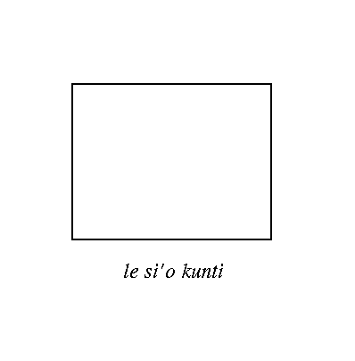

## The syntax of abstraction

The purpose of the feature of Lojban known as “abstraction” is to provide a means for taking whole bridi and packaging them up, as it were, into simple selbri. Syntactically, abstractions are very simple and uniform; semantically, they are rich and complex, with few features in common between one variety of abstraction and another. We will begin by discussing syntax without regard to semantics; as a result, the notion of abstraction may seem unmotivated at first. Bear with this difficulty until [Section 11.2](chapter11#section-events "11.2. Event abstraction").

An abstraction selbri is formed by taking a full bridi and preceding it by any cmavo of selma'o NU. There are twelve such cmavo; they are known as “abstractors”. The bridi is closed by the elidable terminator _[kei](glossary#valsi-kei)_, of selma'o KEI. Thus, to change the bridi

### Example 11.1.

|     |       |     |       |
| --- | ----- | --- | ----- |
| mi  | klama | le  | zarci |
| I   | go-to | the | store |

into an abstraction using _[nu](glossary#valsi-nu)_, one of the members of selma'o NU, we change it into

### Example 11.2.

|             |     |          |     |       |        |
| ----------- | --- | -------- | --- | ----- | ------ |
| nu          | mi  | klama    | le  | zarci | \[kei] |
| an-event-of | my  | going-to | the | store |        |

The bridi may be a simple selbri, or it may have associated sumti, as here. It is important to beware of eliding _[kei](glossary#valsi-kei)_ improperly, as many of the common uses of abstraction selbri involve following them with words that would appear to be part of the abstraction if _[kei](glossary#valsi-kei)_ had been elided.

(Technically, _[kei](glossary#valsi-kei)_ is never necessary, because the elidable terminator _[vau](glossary#valsi-vau)_ that closes every bridi can substitute for it; however, _[kei](glossary#valsi-kei)_ is specific to abstractions, and using it is almost always clearer.)

The grammatical uses of an abstraction selbri are exactly the same as those of a simple brivla. In particular, abstraction selbri may be used as observatives, as in [Example 11.2](chapter11#example-random-id-Via0 "Example 11.2. "), or used in tanru:

### Example 11.3.

|            |       |       |     |           |                 |     |         |          |
| ---------- | ----- | ----- | --- | --------- | --------------- | --- | ------- | -------- |
| la         | djan. |       | cu  | nu        | sonci           | kei |         | djica    |
| That-named | John  | is-an |     | (event-of | being-a-soldier | )   | type-of | desirer. |

|                             |
| --------------------------- |
| John wants to be a soldier. |

Abstraction selbri may also be used in descriptions, preceded by _[le](glossary#valsi-le)_ (or any other member of selma'o LE):

### Example 11.4.

|            |       |     |         |     |          |                  |        |
| ---------- | ----- | --- | ------- | --- | -------- | ---------------- | ------ |
| la         | djan. | cu  | djica   | le  | nu       | sonci            | \[kei] |
| That-named | John  |     | desires | the | event-of | being-a-soldier. |        |

We will most often use descriptions containing abstraction either at the end of a bridi, or just before the main selbri with its _[cu](glossary#valsi-cu)_; in either of these circumstances, _[kei](glossary#valsi-kei)_ can normally be elided.

The place structure of an abstraction selbri depends on the particular abstractor, and will be explained individually in the following sections.

Note: In glosses of bridi within abstractions, the grammatical form used in the English changes. Thus, in the gloss of [Example 11.2](chapter11#example-random-id-Via0 "Example 11.2. ") we see “my going-to the store” rather than “I go-to the store”; likewise, in the glosses of [Example 11.3](chapter11#example-random-id-0Ff4 "Example 11.3. ") and [Example 11.4](chapter11#example-random-id-sQ33 "Example 11.4. ") we see “being-a-soldier” rather than “is-a-soldier”. This procedure reflects the desire for more understandable glosses, and does not indicate any change in the Lojban form. A bridi is a bridi, and undergoes no change when it is used as part of an abstraction selbri.

## Event abstraction

The following cmavo is discussed in this section:

|     |     |                  |
| --- | --- | ---------------- |
| nu  | NU  | event abstractor |

The examples in [Section 11.1](chapter11#section-syntax "11.1. The syntax of abstraction") made use of _[nu](glossary#valsi-nu)_ as the abstractor, and it is certainly the most common abstractor in Lojban text. Its purpose is to capture the event or state of the bridi considered as a whole. Do not confuse the _[le](glossary#valsi-le)_ description built on a _[nu](glossary#valsi-nu)_ abstraction with ordinary descriptions based on _[le](glossary#valsi-le)_ alone. The following sumti are quite distinct:

### Example 11.5.

|     |       |
| --- | ----- |
| le  | klama |

|                             |
| --------------------------- |
| the comer, that which comes |

### Example 11.6.

|     |     |       |
| --- | --- | ----- |
| le  | se  | klama |

|                 |
| --------------- |
| the destination |

### Example 11.7.

|     |     |       |
| --- | --- | ----- |
| le  | te  | klama |

|            |
| ---------- |
| the origin |

### Example 11.8.

|     |     |       |
| --- | --- | ----- |
| le  | ve  | klama |

|           |
| --------- |
| the route |

### Example 11.9.

|     |     |       |
| --- | --- | ----- |
| le  | xe  | klama |

|                             |
| --------------------------- |
| the means of transportation |

### Example 11.10.

|     |     |       |
| --- | --- | ----- |
| le  | nu  | klama |

|                                                                                        |
| -------------------------------------------------------------------------------------- |
| the event of someone coming to somewhere from somewhere by some route using some means |

[Example 11.5](chapter11#example-random-id-qF0u "Example 11.5. ") through [Example 11.9](chapter11#example-random-id-qf4x "Example 11.9. ") are descriptions that isolate the five individual sumti places of the selbri _[klama](glossary#valsi-klama)_. [Example 11.10](chapter11#example-random-id-qf97 "Example 11.10. ") describes something associated with the bridi as a whole: the event of it.

In Lojban, the term “event” is divorced from its ordinary English sense of something that happens over a short period of time. The description:

### Example 11.11.

|     |          |     |           |
| --- | -------- | --- | --------- |
| le  | nu       | mi  | vasxu     |
| the | event-of | my  | breathing |

is an event which lasts for the whole of my life (under normal circumstances). On the other hand,

### Example 11.12.

|     |          |            |       |         |            |        |
| --- | -------- | ---------- | ----- | ------- | ---------- | ------ |
| le  | nu       | la         | djan. | cinba   | la         | djein. |
| the | event-of | that-named | John  | kissing | that-named | Jane   |

is relatively brief by comparison (again, under normal circumstances).

We can see from [Example 11.10](chapter11#example-random-id-qf97 "Example 11.10. ") through [Example 11.12](chapter11#example-random-id-BPcI "Example 11.12. ") that ellipsis of sumti is valid in the bridi of abstraction selbri, just as in the main bridi of a sentence. Any sumti may be ellipsized if the listener will be able to figure out from context what the proper value of it is, or else to recognize that the proper value is unimportant. It is extremely common for _[nu](glossary#valsi-nu)_ abstractions in descriptions to have the x1 place ellipsized:

### Example 11.13.

|     |       |     |          |           |
| --- | ----- | --- | -------- | --------- |
| mi  | nelci | le  | nu       | limna     |
| I   | like  | the | event-of | swimming. |

|                  |
| ---------------- |
| I like swimming. |

is elliptical, and most probably means:

### Example 11.14.

|     |       |     |          |     |       |
| --- | ----- | --- | -------- | --- | ----- |
| mi  | nelci | le  | nu       | mi  | limna |
| I   | like  | the | event-of | I   | swim. |

In the proper context, of course, [Example 11.13](chapter11#example-random-id-FRoP "Example 11.13. ") could refer to the event of somebody else swimming. Its English equivalent, “I like swimming”, can't be interpreted as “I like Frank's swimming”; this is a fundamental distinction between English and Lojban. In Lojban, an omitted sumti can mean whatever the context indicates that it should mean.

Note that the lack of an explicit NU cmavo in a sumti can sometimes hide an implicit abstraction. In the context of [Example 11.14](chapter11#example-random-id-Ys8w "Example 11.14. "), the appearance of _le se nelci_ (“that which is liked”) is in effect an abstraction:

### Example 11.15.

|     |             |     |              |
| --- | ----------- | --- | ------------ |
| le  | se nelci    | cu  | cafne        |
| The | liked-thing |     | is-frequent. |

|                                       |
| ------------------------------------- |
| The thing which I like happens often. |

which in this context means

> My swimming happens often.

Event descriptions with _le nu_ are commonly used to fill the “under conditions...” places, among others, of gismu and lujvo place structures:

### Example 11.16.

|            |         |     |             |     |     |
| ---------- | ------- | --- | ----------- | --- | --- |
| la         | lojban. | cu  | frili       |     | mi  |
| That-named | Lojban  |     | is-easy-for | me  |     |

|                  |     |          |     |       |        |
| ---------------- | --- | -------- | --- | ----- | ------ |
|                  | le  | nu       | mi  | tadni | \[kei] |
| under-conditions | the | event-of | I   | study |        |

|                                     |
| ----------------------------------- |
| Lojban is easy for me when I study. |

(The “when” of the English would also be appropriate for a construction involving a Lojban tense, but the Lojban sentence says more than that the studying is concurrent with the ease.)

The place structure of a _[nu](glossary#valsi-nu)_ abstraction selbri is simply:

> x1 is an event of (the bridi)

## Types of event abstractions

The following cmavo are discussed in this section:

|      |     |                        |
| ---- | --- | ---------------------- |
| mu'e | NU  | point-event abstractor |
| pu'u | NU  | process abstractor     |
| zu'o | NU  | activity abstractor    |
| za'i | NU  | state abstractor       |

Event abstractions with _[nu](glossary#valsi-nu)_ suffice to express all kinds of events, whether long, short, unique, repetitive, or whatever. Lojban also has more finely discriminating machinery for talking about events, however. There are four other abstractors of selma'o NU for talking about four specific types of events, or four ways of looking at the same event.

An event considered as a point in time is called a “point-event”, or sometimes an “achievement”. (This latter word should be divorced, in this context, from all connotations of success or triumph.) A point-event can be extended in duration, but it is still a point-event if it is thought of as unitary, having no internal structure. The abstractor _[mu'e](glossary#valsi-muhe)_ means “point-event-of”:

### Example 11.17.

|     |                |             |       |       |            |       |     |             |
| --- | -------------- | ----------- | ----- | ----- | ---------- | ----- | --- | ----------- |
| le  | mu'e           | la          | djan. | catra | la         | djim. | cu  | zekri       |
| The | point-event-of | (that-named | John  | kills | that-named | Jim)  |     | is-a-crime. |

|                                                                |
| -------------------------------------------------------------- |
| John's killing Jim (considered as a point in time) is a crime. |

An event considered as extended in time, and structured with a beginning, a middle containing one or more stages, and an end, is called a “process”. The abstractor _[pu'u](glossary#valsi-puhu)_ means “process-of”:

### Example 11.18.

|                 |     |             |     |       |             |     |             |     |
| --------------- | --- | ----------- | --- | ----- | ----------- | --- | ----------- | --- |
| ca'o            | le  | pu'u        | le  | latmo | balje'a     | cu  | porpi       | kei |
| \[continuitive] | the | process-of( | the | Latin | great-state |     | breaking-up | )   |

|      |              |     |             |
| ---- | ------------ | --- | ----------- |
| so'i | je'atru      | cu  | selcatra    |
| many | state-rulers |     | were-killed |

|                                                                 |
| --------------------------------------------------------------- |
| During the fall of the Roman Empire, many Emperors were killed. |

An event considered as extended in time and cyclic or repetitive is called an “activity”. The abstractor _[zu'o](glossary#valsi-zuho)_ means “activity-of”:

### Example 11.19.

|     |          |            |     |             |     |        |
| --- | -------- | ---------- | --- | ----------- | --- | ------ |
| mi  | tatpi    | ri'a       | le  | zu'o        | mi  | plipe  |
| I   | am-tired | because-of | the | activity-of | (I  | jump). |

|                            |
| -------------------------- |
| I am tired because I jump. |

An event considered as something that is either happening or not happening, with sharp boundaries, is called a “state”. The abstractor _[za'i](glossary#valsi-zahi)_ means “state-of”:

### Example 11.20.

|     |          |     |           |     |                 |      |
| --- | -------- | --- | --------- | --- | --------------- | ---- |
| le  | za'i     | mi  | jmive     | cu  | ckape           | do   |
| The | state-of | (I  | am-alive) |     | is-dangerous-to | you. |

|                                     |
| ----------------------------------- |
| My being alive is dangerous to you. |

The abstractors in [Example 11.17](chapter11#example-random-id-nFR1 "Example 11.17. ") through [Example 11.20](chapter11#example-random-id-WztQ "Example 11.20. ") could all have been replaced by _[nu](glossary#valsi-nu)_, with some loss of precision. Note that Lojban allows every sort of event to be viewed in any of these four ways:

- the “state of running” begins when the runner starts and ends when the runner stops;

- the “activity of running” consists of the cycle “lift leg, step forward, drop leg, lift other leg...” (each such cycle is a process, but the activity consists in the repetition of the cycle);

- the “process of running” puts emphasis on the initial sprint, the steady speed, and the final slowdown;

- the “achievement of running” is most alien to English, but sees the event of running as a single indivisible thing, like “Pheidippides' run from Marathon to Athens” (the original marathon).

Further information on types of events can be found in [Section 11.12](chapter11#section-abstractor-connection "11.12. Abstractor connection").

The four event type abstractors have the following place structures:

> _mu'e_: x1 is a point event of (the bridi)
> _pu'u_: x1 is a process of (the bridi) with stages x2
> _za'i_: x1 is a continuous state of (the bridi) being true
> _zu'o_: x1 is an activity of (the bridi) consisting of repeated actions x2

## Property abstractions

The following cmavo are discussed in this section:

|      |      |                     |
| ---- | ---- | ------------------- |
| ka   | NU   | property abstractor |
| ce'u | KOhA | abstraction focus   |

The things described by _le nu_ descriptions (or, to put it another way, the things of which _[nu](glossary#valsi-nu)_ selbri may correctly be predicated) are only moderately “abstract”. They are still closely tied to happenings in space and time. Properties, however, are much more ethereal. What is “the property of being blue”, or “the property of being a go-er”? They are what logicians call “intensions”. If John has a heart, then “the property of having a heart” is an abstract object which, when applied to John, is true. In fact,

### Example 11.21.

|            |       |     |              |                        |
| ---------- | ----- | --- | ------------ | ---------------------- |
| la         | djan. | cu  | se risna     | zo'e                   |
| That-named | John  |     | has-as-heart | something-unspecified. |

|                   |
| ----------------- |
| John has a heart. |

has the same truth conditions as

### Example 11.22.

|            |       |     |                  |
| ---------- | ----- | --- | ---------------- |
| la         | djan. | cu  | ckaji            |
| That-named | John  |     | has-the-property |

|     |             |                 |            |        |
| --- | ----------- | --------------- | ---------- | ------ |
| le  | ka          | se risna        | \[zo'e]    | \[kei] |
| the | property-of | having-as-heart | something. |        |

|                                          |
| ---------------------------------------- |
| John has the property of having a heart. |

(The English word “have” frequently appears in any discussion of Lojban properties: things are said to “have” properties, but this is not the same sense of “have” as in “I have money”, which is possession.)Property descriptions, like event descriptions, are often wanted to fill places in brivla place structures:

### Example 11.23.

|     |         |       |                       |             |            |        |
| --- | ------- | ----- | --------------------- | ----------- | ---------- | ------ |
| do  | cnino   | mi    | le                    | ka          | xunre      | \[kei] |
| You | are-new | to-me | in-the-quality-of-the | property-of | being-red. |        |

|                               |
| ----------------------------- |
| You are new to me in redness. |

(The English suffix “-ness” often signals a property abstraction, as does the suffix “-ity”.)We can also move the property description to the x1 place of [Example 11.23](chapter11#example-random-id-v3Ba "Example 11.23. "), producing:

### Example 11.24.

|     |             |      |           |        |     |        |        |
| --- | ----------- | ---- | --------- | ------ | --- | ------ | ------ |
| le  | ka          | do   | xunre     | \[kei] | cu  | cnino  | mi     |
| The | property-of | your | being-red |        |     | is-new | to me. |

|                            |
| -------------------------- |
| Your redness is new to me. |

It would be suitable to use [Example 11.23](chapter11#example-random-id-v3Ba "Example 11.23. ") and [Example 11.24](chapter11#example-random-id-proQ "Example 11.24. ") to someone who has returned from the beach with a sunburn.

There are several different properties that can be extracted from a bridi, depending on which place of the bridi is “understood” as being specified externally. Thus:

### Example 11.25.

|               |     |        |                       |        |
| ------------- | --- | ------ | --------------------- | ------ |
| ka            | mi  | prami  | \[zo'e]               | \[kei] |
| a-property-of | me  | loving | something-unspecified |        |

is quite different from### Example 11.26.

|               |                       |        |     |        |
| ------------- | --------------------- | ------ | --- | ------ |
| ka            | \[zo'e]               | prami  | mi  | \[kei] |
| a-property-of | something-unspecified | loving | me  |        |

In particular, sentences like [Example 11.27](chapter11#example-random-id-qfAM "Example 11.27. ") and [Example 11.28](chapter11#example-random-id-qfav "Example 11.28. ") are quite different in meaning:

### Example 11.27.

|            |       |     |         |            |         |
| ---------- | ----- | --- | ------- | ---------- | ------- |
| la         | djan. | cu  | zmadu   | la         | djordj. |
| That-named | John  |     | exceeds | that-named | George  |

|        |             |     |       |     |
| ------ | ----------- | --- | ----- | --- |
| le     | ka          | mi  | prami |     |
| in-the | property-of | (I  | love  | X)  |

|                                      |
| ------------------------------------ |
| I love John more than I love George. |

### Example 11.28.

|            |       |     |         |            |         |
| ---------- | ----- | --- | ------- | ---------- | ------- |
| la         | djan. | cu  | zmadu   | la         | djordj. |
| That-named | John  |     | exceeds | that-named | George  |

|        |             |     |       |      |
| ------ | ----------- | --- | ----- | ---- |
| le     | ka          |     | prami | mi   |
| in-the | property of | (X  | loves | me). |

|                                          |
| ---------------------------------------- |
| John loves me more than George loves me. |

The “X” used in the glosses of [Example 11.27](chapter11#example-random-id-qfAM "Example 11.27. ") through [Example 11.28](chapter11#example-random-id-qfav "Example 11.28. ") as a place-holder cannot be represented only by ellipsis in Lojban, because ellipsis means that there must be a specific value that can fill the ellipsis, as mentioned in [Section 11.2](chapter11#section-events "11.2. Event abstraction"). Instead, the cmavo _[ce'u](glossary#valsi-cehu)_ of selma'o KOhA is employed when an explicit sumti is wanted. (The form “X” will be used in literal translations.)Therefore, an explicit equivalent of [Example 11.27](chapter11#example-random-id-qfAM "Example 11.27. "), with no ellipsis, is:

### Example 11.29.

|            |       |     |         |            |         |
| ---------- | ----- | --- | ------- | ---------- | ------- |
| la         | djan. | cu  | zmadu   | la         | djordj. |
| That-named | John  |     | exceeds | that-named | George  |

|        |             |     |       |      |
| ------ | ----------- | --- | ----- | ---- |
| le     | ka          | mi  | prami | ce'u |
| in-the | property-of | (I  | love  | X).  |

and of [Example 11.28](chapter11#example-random-id-qfav "Example 11.28. ") is:

### Example 11.30.

|            |       |     |         |            |         |
| ---------- | ----- | --- | ------- | ---------- | ------- |
| la         | djan. | cu  | zmadu   | la         | djordj. |
| That-named | John  |     | exceeds | that-named | George  |

|        |             |      |       |      |
| ------ | ----------- | ---- | ----- | ---- |
| le     | ka          | ce'u | prami | mi   |
| in-the | property-of | (X   | loves | me). |

This convention allows disambiguation of cases like:

### Example 11.31.

|     |             |         |        |     |       |         |        |
| --- | ----------- | ------- | ------ | --- | ----- | ------- | ------ |
| le  | ka          | \[zo'e] | dunda  | le  | xirma | \[zo'e] | \[kei] |
| the | property-of |         | giving | the | horse |         |        |

into### Example 11.32.

|     |             |      |               |     |       |     |                     |        |
| --- | ----------- | ---- | ------------- | --- | ----- | --- | ------------------- | ------ |
| le  | ka          | ce'u | dunda         | le  | xirma |     | \[zo'e]             | \[kei] |
| the | property-of | (X   | is-a-giver-of | the | horse | to  | someone-unspecified | )      |

|                                            |
| ------------------------------------------ |
| the property of being a giver of the horse |

which is the most natural interpretation of [Example 11.31](chapter11#example-random-id-GiJp "Example 11.31. "), versus

### Example 11.33.

|     |             |                      |               |     |       |     |      |        |
| --- | ----------- | -------------------- | ------------- | --- | ----- | --- | ---- | ------ |
| le  | ka          | \[zo'e]              | dunda         | le  | xirma |     | ce'u | \[kei] |
| the | property-of | (someone-unspecified | is-a-giver-of | the | horse | to  | X    | )      |

|                                                      |
| ---------------------------------------------------- |
| the property of being one to whom the horse is given |

which is also a possible interpretation.

It is also possible to have more than one _[ce'u](glossary#valsi-cehu)_ in a _[ka](glossary#valsi-ka)_ abstraction, which transforms it from a property abstraction into a relationship abstraction. Relationship abstractions “package up” a complex relationship for future use; such an abstraction can be translated back into a selbri by placing it in the x2 place of the selbri _[bridi](glossary#valsi-bridi)_, whose place structure is:

> _[bridi](glossary#valsi-bridi)_ x1 is a predicate relationship with relation x2 (abstraction) among arguments (sequence/set) x3

The place structure of _[ka](glossary#valsi-ka)_ abstraction selbri is simply:

> _[ka](glossary#valsi-ka)_ x1 is a property of (the bridi)## Amount abstractions

The following cmavo is discussed in this section:

|     |     |                    |
| --- | --- | ------------------ |
| ni  | NU  | amount abstraction |

Amount abstractions are far more limited than event or property abstractions. They really make sense only if the selbri of the abstracted bridi is subject to measurement of some sort. Thus we can speak of:

### Example 11.34.

|     |           |      |         |     |            |        |
| --- | --------- | ---- | ------- | --- | ---------- | ------ |
| le  | ni        | le   | pixra   | cu  | blanu      | \[kei] |
| the | amount-of | (the | picture |     | being-blue | )      |

|                                       |
| ------------------------------------- |
| the amount of blueness in the picture |

because “blueness” could be measured with a colorimeter or a similar device. However,

### Example 11.35.

|     |           |             |        |     |                |        |
| --- | --------- | ----------- | ------ | --- | -------------- | ------ |
| le  | ni        | la          | djein. | cu  | mamta          | \[kei] |
| the | amount-of | (that-named | Jane   |     | being-a-mother | )      |

|                                       |
| ------------------------------------- |
| the amount of Jane's mother-ness (?)  |
| the amount of mother-ness in Jane (?) |

makes very little sense in either Lojban or English. We simply do not have any sort of measurement scale for being a mother.

Semantically, a sumti with _le ni_ is a number; however, it cannot be treated grammatically as a quantifier in Lojban unless prefixed by the mathematical cmavo _[mo'e](glossary#valsi-mohe)_:

### Example 11.36.

|            |     |       |             |     |           |     |
| ---------- | --- | ----- | ----------- | --- | --------- | --- |
| li         | pa  | vu'u  | mo'e        | le  | ni        |     |
| the-number | 1   | minus | the-operand | the | amount-of | (   |

|     |         |     |            |        |
| --- | ------- | --- | ---------- | ------ |
| le  | pixra   | cu  | blanu      | \[kei] |
| the | picture |     | being-blue | )      |

|                                            |
| ------------------------------------------ |
| 1 - B, where `B` = blueness of the picture |

Mathematical Lojban is beyond the scope of this chapter, and is explained more fully in [Chapter 18](chapter18 "Chapter 18. lojbau mekso: Mathematical Expressions in Lojban").

There are contexts where either property or amount abstractions make sense, and in such constructions, amount abstractions can make use of _[ce'u](glossary#valsi-cehu)_ just like property abstractors. Thus,

### Example 11.37.

|     |         |     |        |        |             |      |         |        |
| --- | ------- | --- | ------ | ------ | ----------- | ---- | ------- | ------ |
| le  | pixra   | cu  | cenba  | le     | ka          | ce'u | blanu   | \[kei] |
| The | picture |     | varies | in-the | property-of | (X   | is blue | ).     |

|                                   |
| --------------------------------- |
| The picture varies in being blue. |
| The picture varies in blueness.   |

is not the same as

### Example 11.38.

|     |         |     |        |        |           |      |         |        |
| --- | ------- | --- | ------ | ------ | --------- | ---- | ------- | ------ |
| le  | pixra   | cu  | cenba  | le     | ni        | ce'u | blanu   | \[kei] |
| The | picture |     | varies | in-the | amount-of | (X   | is blue | ).     |

|                                       |
| ------------------------------------- |
| The picture varies in how blue it is. |
| The picture varies in blueness.       |

[Example 11.37](chapter11#example-random-id-1LtX "Example 11.37. ") conveys that the blueness comes and goes, whereas [Example 11.38](chapter11#example-random-id-QKpo "Example 11.38. ") conveys that its quantity changes over time.

Whenever we talk of measurement of an amount, there is some sort of scale, and so the place structure of _[ni](glossary#valsi-ni)_ abstraction selbri is:
> _[_ni_](glossary#valsi-ni)_ x1 is the amount of (the bridi) on scale x2 Note: the best way to express the x2 places of abstract sumti is to use something like _le ni ... kei be_. See [Example 11.62](chapter11#example-random-id-zvfX "Example 11.62. ") for the use of this construction.

## Truth-value abstraction: _jei_

The “blueness of the picture” discussed in [Section 11.5](chapter11#section-amounts "11.5. Amount abstractions") refers to the measurable amount of blue pigment (or other source of blueness), not to the degree of truth of the claim that blueness is present. That abstraction is expressed in Lojban using _[jei](glossary#valsi-jei)_, which is closely related semantically to _[ni](glossary#valsi-ni)_. In the simplest cases, _le jei_ produces not a number but a truth value:

### Example 11.39.

|     |                |            |     |      |     |     |            |     |        |
| --- | -------------- | ---------- | --- | ---- | --- | --- | ---------- | --- | ------ |
| le  | jei            | li         | re  | su'i | re  | du  | li         | vo  | \[kei] |
| the | truth-value-of | the-number | 2   | +    | 2   | =   | the-number | 4   |        |

|                            |
| -------------------------- |
| the truth of 2 + 2 being 4 |

is equivalent to “truth”, and### Example 11.40.

|     |                |            |     |      |     |     |            |     |        |
| --- | -------------- | ---------- | --- | ---- | --- | --- | ---------- | --- | ------ |
| le  | jei            | li         | re  | su'i | re  | du  | li         | mu  | \[kei] |
| the | truth-value-of | the-number | 2   | +    | 2   | =   | the-number | 5   |        |

|                            |
| -------------------------- |
| the truth of 2 + 2 being 5 |

is equivalent to “falsehood”.

However, not everything in life (or even in Lojban) is simply true or false. There are shades of gray even in truth value, and _[jei](glossary#valsi-jei)_ is Lojban's mechanism for indicating the shade of grey intended:

### Example 11.41.

|     |           |        |     |                 |            |         |
| --- | --------- | ------ | --- | --------------- | ---------- | ------- |
| mi  | ba        | jdice  | le  | jei             | la         | djordj. |
| I   | \[future] | decide | the | (truth-value of | that-named | George  |

|     |                |       |        |
| --- | -------------- | ----- | ------ |
| cu  | zekri          | gasnu | \[kei] |
|     | being-a-(crime | doer) | ).     |

|                                             |
| ------------------------------------------- |
| I will decide whether George is a criminal. |

[Example 11.41](chapter11#example-random-id-MRD8 "Example 11.41. ") does not imply that George is, or is not, definitely a criminal. Depending on the legal system I am using, I may make some intermediate decision. As a result, _[jei](glossary#valsi-jei)_ requires an x2 place analogous to that of _[ni](glossary#valsi-ni)_:

> _[jei](glossary#valsi-jei)_ x1 is the truth value of (the bridi) under epistemology x2

Abstractions using _[jei](glossary#valsi-jei)_ are the mechanism for fuzzy logic in Lojban; the _[jei](glossary#valsi-jei)_ abstraction refers to a number between 0 and 1 inclusive (as distinct from _[ni](glossary#valsi-ni)_ abstractions, which are often on open-ended scales). The detailed conventions for using _[jei](glossary#valsi-jei)_ in fuzzy-logic contexts have not yet been established.

## Predication/sentence abstraction

The following cmavo is discussed in this section:

|      |     |                         |
| ---- | --- | ----------------------- |
| du'u | NU  | predication abstraction |

There are some selbri which demand an entire predication as a sumti; they make claims about some predication considered as a whole. Logicians call these the “propositional attitudes”, and they include (in English) things like knowing, believing, learning, seeing, hearing, and the like. Consider the English sentence:

### Example 11.42.

I know that Frank is a fool.

How's that in Lojban? Let us try:

### Example 11.43.

|     |       |     |     |     |        |     |       |        |
| --- | ----- | --- | --- | --- | ------ | --- | ----- | ------ |
| mi  | djuno | le  | nu  | la  | frank. | cu  | bebna | \[kei] |

|                                         |
| --------------------------------------- |
| I know the event of Frank being a fool. |

Not quite right. Events are actually or potentially physical, and can't be contained inside one's mind, except for events of thinking, feeling, and the like; [Example 11.43](chapter11#example-random-id-brpf "Example 11.43. ") comes close to claiming that Frank's being-a-fool is purely a mental activity on the part of the speaker. (In fact, [Example 11.43](chapter11#example-random-id-brpf "Example 11.43. ") is an instance of improperly marked “sumti raising”, a concept discussed further in [Section 11.10](chapter11#section-sumti-raising "11.10. Lojban sumti raising")).

Try again:

### Example 11.44.

|     |       |     |     |     |        |     |       |        |
| --- | ----- | --- | --- | --- | ------ | --- | ----- | ------ |
| mi  | djuno | le  | jei | la  | frank. | cu  | bebna | \[kei] |

|                                               |
| --------------------------------------------- |
| I know the truth-value of Frank being a fool. |

Closer. [Example 11.44](chapter11#example-random-id-oCgP "Example 11.44. ") says that I know whether or not Frank is a fool, but doesn't say that he is one, as [Example 11.42](chapter11#example-random-id-7N2q "Example 11.42. ") does. To catch that nuance, we must say:

### Example 11.45.

|     |       |     |      |     |        |     |       |        |
| --- | ----- | --- | ---- | --- | ------ | --- | ----- | ------ |
| mi  | djuno | le  | du'u | la  | frank. | cu  | bebna | \[kei] |

|                                              |
| -------------------------------------------- |
| I know the predication that Frank is a fool. |

Now we have it. Note that the implied assertion “Frank is a fool” is not a property of _le du'u_ abstraction, but of _[djuno](glossary#valsi-djuno)_; we can only know what is in fact true. (As a result, _[djuno](glossary#valsi-djuno)_ like _[jei](glossary#valsi-jei)_ has a place for epistemology, which specifies how we know.) [Example 11.46](chapter11#example-random-id-eYiD "Example 11.46. ") has no such implied assertion:

### Example 11.46.

|     |       |     |      |     |        |     |       |        |
| --- | ----- | --- | ---- | --- | ------ | --- | ----- | ------ |
| mi  | kucli | le  | du'u | la  | frank. | cu  | bebna | \[kei] |

|                                             |
| ------------------------------------------- |
| I am curious about whether Frank is a fool. |

and here _[du'u](glossary#valsi-duhu)_ could probably be replaced by _[jei](glossary#valsi-jei)_ without much change in meaning:

### Example 11.47.

|     |       |     |     |     |        |     |       |        |
| --- | ----- | --- | --- | --- | ------ | --- | ----- | ------ |
| mi  | kucli | le  | jei | la  | frank. | cu  | bebna | \[kei] |

|                                                         |
| ------------------------------------------------------- |
| I am curious about how true it is that Frank is a fool. |

As a matter of convenience rather than logical necessity, _[du'u](glossary#valsi-duhu)_ has been given an x2 place, which is a sentence (piece of language) expressing the bridi:
> _[du'u](glossary#valsi-duhu)_ x1 is the predication (the bridi), expressed in sentence x2and _le se du'u ..._ is very useful in filling places of selbri which refer to speaking, writing, or other linguistic behavior regarding bridi:

### Example 11.48.

|            |       |           |     |                           |
| ---------- | ----- | --------- | --- | ------------------------- |
| la         | djan. | cusku     | le  | se du'u                   |
| That-named | John  | expresses | the | (sentence-expressing-that |

|            |         |         |     |       |        |
| ---------- | ------- | ------- | --- | ----- | ------ |
| la         | djordj. | klama   | le  | zarci | \[kei] |
| that-named | George  | goes-to | the | store | )      |

|                                          |
| ---------------------------------------- |
| John says that George goes to the store. |

[Example 11.48](chapter11#example-random-id-hzd8 "Example 11.48. ") differs from### Example 11.49.

|            |      |            |        |
| ---------- | ---- | ---------- | ------ |
| la         | djan | cusku      | lu     |
| That-named | John | expresses, | quote, |

|            |         |       |        |        |          |
| ---------- | ------- | ----- | ------ | ------ | -------- |
| la         | djordj. | klama | le     | zarci  | li'u     |
| that-named | George  | goes  | to-the | store, | unquote. |

|                                       |
| ------------------------------------- |
| John says “George goes to the store”. |

because [Example 11.49](chapter11#example-random-id-AX2I "Example 11.49. ") claims that John actually said the quoted words, whereas [Example 11.48](chapter11#example-random-id-hzd8 "Example 11.48. ") claims only that he said some words or other which were to the same purpose._le se du'u_ is much the same as _lu'e le du'u_, a symbol for the predication, but _se du'u_ can be used as a selbri, whereas _[lu'e](glossary#valsi-luhe)_ is ungrammatical in a selbri. (See [Section 6.10](chapter06#section-sumti-qualifiers "6.10. sumti qualifiers") for a discussion of _[lu'e](glossary#valsi-luhe)_.)## Indirect questions

The following cmavo is discussed in this section:

|     |     |                          |
| --- | --- | ------------------------ |
| kau | UI  | indirect question marker |

There is an alternative type of sentence involving _[du'u](glossary#valsi-duhu)_ and a selbri expressing a propositional attitude. In addition to sentences like### Example 11.50.

I know that John went to the store.we can also say things like### Example 11.51.

I know who went to the store.

This form is called an “indirect question” in English because the embedded English sentence is a question: “Who went to the store?” A person who says [Example 11.51](chapter11#example-random-id-N4Ja "Example 11.51. ") is claiming to know the answer to this question. Indirect questions can occur with many other English verbs as well: I can wonder, or doubt, or see, or hear, as well as know who went to the store.

To express indirect questions in Lojban, we use a _le du'u_ abstraction, but rather than using a question word like “who” (_[ma](glossary#valsi-ma)_ in Lojban), we use any word that will fit grammatically and mark it with the suffix particle _[kau](glossary#valsi-kau)_. This cmavo belongs to selma'o UI, so grammatically it can appear anywhere. The simplest Lojban translation of [Example 11.51](chapter11#example-random-id-N4Ja "Example 11.51. ") is therefore:

### Example 11.52.

|     |       |     |                |
| --- | ----- | --- | -------------- |
| mi  | djuno | le  | du'u           |
| I   | know  | the | predication-of |

|     |                      |         |          |     |        |
| --- | -------------------- | ------- | -------- | --- | ------ |
| ma  | kau                  | pu      | klama    | le  | zarci  |
| X   | \[indirect-question] | \[past] | going-to | the | store. |

In [Example 11.52](chapter11#example-random-id-QUxG "Example 11.52. "), we have chosen to use _[ma](glossary#valsi-ma)_ as the word marked by _[kau](glossary#valsi-kau)_. In fact, any other sumti would have done as well: _[zo'e](glossary#valsi-zohe)_ or _[da](glossary#valsi-da)_ or even _la djan._. Using _la djan._ would suggest that it was John who I knew had gone to the store, however:

### Example 11.53.

|     |       |     |                          |
| --- | ----- | --- | ------------------------ |
| mi  | djuno | le  | du'u                     |
| I   | know  | the | predication-of/fact-that |

|            |       |                      |         |          |     |        |
| ---------- | ----- | -------------------- | ------- | -------- | --- | ------ |
| la         | djan. | kau                  | pu      | klama    | le  | zarci  |
| that-named | John  | \[indirect-question] | \[past] | going-to | the | store. |

|                                                |
| ---------------------------------------------- |
| I know who went to the store, namely John.     |
| I know that it was John who went to the store. |

Using one of the indefinite pro-sumti such as _[ma](glossary#valsi-ma)_, _[zo'e](glossary#valsi-zohe)_, or _[da](glossary#valsi-da)_ does not suggest any particular value.

Why does Lojban require the _[kau](glossary#valsi-kau)_ marker, rather than using _[ma](glossary#valsi-ma)_ as English and Chinese and many other languages do? Because _[ma](glossary#valsi-ma)_ always signals a direct question, and so### Example 11.54.

|     |       |     |                |                |         |         |     |       |
| --- | ----- | --- | -------------- | -------------- | ------- | ------- | --- | ----- |
| mi  | djuno | le  | du'u           | ma             | pu      | klama   | le  | zarci |
| I   | know  | the | predication-of | \[what sumti?] | \[past] | goes-to | the | store |

means

### Example 11.55.

Who is it that I know goes to the store?

It is actually not necessary to use _le du'u_ and _[kau](glossary#valsi-kau)_ at all if the indirect question involves a sumti; there is generally a paraphrase of the type:

### Example 11.56.

|     |       |       |     |         |       |     |     |        |
| --- | ----- | ----- | --- | ------- | ----- | --- | --- | ------ |
| mi  | djuno | fi    | le  | pu      | klama | be  | le  | zarci  |
| I   | know  | about | the | \[past] | goer  | to  | the | store. |

|                                                                              |
| ---------------------------------------------------------------------------- |
| I know something about the one who went to the store (namely, his identity). |

because the x3 place of _[djuno](glossary#valsi-djuno)_ is the subject of knowledge, as opposed to the fact that is known. But when the questioned point is not a sumti, but (say) a logical connection, then there is no good alternative to _[kau](glossary#valsi-kau)_:

### Example 11.57.

|     |           |         |     |                          |            |       |
| --- | --------- | ------- | --- | ------------------------ | ---------- | ----- |
| mi  | ba        | zgana   | le  | du'u                     | la         | djan. |
| I   | \[future] | observe | the | predication-of/fact-that | that-named | John  |

|                                 |            |         |     |       |     |       |
| ------------------------------- | ---------- | ------- | --- | ----- | --- | ----- |
| jikau                           | la         | djordj. | cu  | zvati | le  | panka |
| \[connective-indirect-question] | that-named | George  |     | is-at | the | park. |

|                                                             |
| ----------------------------------------------------------- |
| I will see whether John or George (or both) is at the park. |

In addition, [Example 11.56](chapter11#example-random-id-b6VT "Example 11.56. ") is only a loose paraphrase of [Example 11.52](chapter11#example-random-id-QUxG "Example 11.52. "), because it is left to the listener's insight to realize that what is known about the goer-to-the-store is his identity rather than some other of his attributes.

## Minor abstraction types

The following cmavo are discussed in this section:

|      |     |                       |
| ---- | --- | --------------------- |
| li'i | NU  | experience abstractor |
| si'o | NU  | concept abstractor    |
| su'u | NU  | general abstractor    |

There are three more abstractors in Lojban, all of them little used so far. The abstractor _[li'i](glossary#valsi-lihi)_ expresses experience:

### Example 11.58.

|     |          |     |               |     |                |
| --- | -------- | --- | ------------- | --- | -------------- |
| mi  | morji    | le  | li'i          | mi  | verba          |
| I   | remember | the | experience-of | (my | being-a-child) |

The abstractor _[si'o](glossary#valsi-siho)_ expresses a mental image, a concept, an idea:

### Example 11.59.

|     |       |     |            |            |         |     |                 |
| --- | ----- | --- | ---------- | ---------- | ------- | --- | --------------- |
| mi  | nelci | le  | si'o       | la         | lojban. | cu  | mulno           |
| I   | enjoy | the | concept-of | that-named | Lojban  |     | being-complete. |

Finally, the abstractor _[su'u](glossary#valsi-suhu)_ is a vague abstractor, whose meaning must be grasped from context:

### Example 11.60.

|                   |         |     |                    |     |       |       |     |         |
| ----------------- | ------- | --- | ------------------ | --- | ----- | ----- | --- | ------- |
| ko                | zgana   | le  | su'u               | le  | ci    | smacu | cu  | bajra   |
| you \[imperative] | observe | the | abstract-nature-of | the | three | mice  |     | running |

|                             |
| --------------------------- |
| See how the three mice run! |

All three of these abstractors have an x2 place. An experience requires an experiencer, so the place structure of _[li'i](glossary#valsi-lihi)_ is:

> _[li'i](glossary#valsi-lihi)_ x1 is the experience of (the bridi) as experienced by x2

Similarly, an idea requires a mind to hold it, so the place structure of _[si'o](glossary#valsi-siho)_ is:

> _[si'o](glossary#valsi-siho)_ x1 is the idea/concept of (the bridi) in the mind of x2

Finally, there needs to be some way of specifying just what sort of abstraction _[su'u](glossary#valsi-suhu)_ is representing, so its place structure is:

> _[su'u](glossary#valsi-suhu)_ x1 is an abstract nature of (the bridi) of type x2

The x2 place of _[su'u](glossary#valsi-suhu)_ allows it to serve as a substitute for any of the other abstractors, or as a template for creating new ones. For example,

### Example 11.61.

|     |          |     |       |
| --- | -------- | --- | ----- |
| le  | nu       | mi  | klama |
| the | event-of | my  | going |

can be paraphrased as

### Example 11.62.

|     |                    |     |        |     |         |     |       |
| --- | ------------------ | --- | ------ | --- | ------- | --- | ----- |
| le  | su'u               | mi  | klama  | kei | be      | lo  | fasnu |
| the | abstract-nature-of | (my | going) |     | of-type | an  | event |

and there is a book whose title might be rendered in Lojban as:

### Example 11.63.

|     |                    |             |          |
| --- | ------------------ | ----------- | -------- |
| le  | su'u               | la          | .iecuas. |
| the | abstract-nature-of | (that-named | Jesus    |

|                       |                    |     |
| --------------------- | ------------------ | --- |
| kuctai                | selcatra           | kei |
| is-an-intersect-shape | type-of-killed-one | )   |

|         |     |                     |
| ------- | --- | ------------------- |
| be      | lo  | sa'ordzifa'a        |
| of-type | a   | slope-low-direction |

|         |                   |                   |
| ------- | ----------------- | ----------------- |
| ke      | nalmatma'e        | sutyterjvi        |
| type-of | non-motor-vehicle | speed-competition |

|                                                                |
| -------------------------------------------------------------- |
| The Crucifixion of Jesus Considered As A Downhill Bicycle Race |

Note the importance of using _[kei](glossary#valsi-kei)_ after _[su'u](glossary#valsi-suhu)_ when the x2 of _[su'u](glossary#valsi-suhu)_ (or any other abstractor) is being specified; otherwise, the _be lo_ ends up inside the abstraction bridi.

## Lojban sumti raising

The following cmavo are discussed in this section:

|      |      |                          |
| ---- | ---- | ------------------------ |
| tu'a | LAhE | an abstraction involving |
| jai  | JAI  | abstraction conversion   |

It is sometimes inconvenient, in a situation where an abstract description is logically required, to express the abstraction. In English we can say:

### Example 11.64.

I try to open the door.which in Lojban is:

### Example 11.65.

|     |       |     |          |       |             |
| --- | ----- | --- | -------- | ----- | ----------- |
| mi  | troci | le  | nu       | \[mi] | gasnu       |
| I   | try   | the | event-of | (I    | am-agent-in |

|     |          |      |       |     |                 |
| --- | -------- | ---- | ----- | --- | --------------- |
| le  | nu       | le   | vorme | cu  | karbi'o         |
| the | event-of | (the | door  |     | open-becomes)). |

which has an abstract description within an abstract description, quite a complex structure. In English (but not in all other languages), we may also say:

### Example 11.66.

I try the door.where it is understood that what I try is actually not the door itself, but the act of opening it. The same simplification can be done in Lojban, but it must be marked explicitly using a cmavo. The relevant cmavo is _[tu'a](glossary#valsi-tuha)_, which belongs to selma'o LAhE. The Lojban equivalent of [Example 11.66](chapter11#example-random-id-K14X "Example 11.66. ") is:

### Example 11.67.

|     |       |                        |     |       |
| --- | ----- | ---------------------- | --- | ----- |
| mi  | troci | tu'a                   | le  | vorme |
| I   | try   | some-action-to-do-with | the | door. |

The term “sumti-raising”, as in the title of this section, signifies that a sumti which logically belongs within an abstraction (or even within an abstraction which is itself inside an intermediate abstraction) is “raised” to the main bridi level. This transformation from [Example 11.65](chapter11#example-random-id-1WER "Example 11.65. ") to [Example 11.67](chapter11#example-random-id-gabC "Example 11.67. ") loses information: nothing except convention tells us what the abstraction was.

Using _[tu'a](glossary#valsi-tuha)_ is a kind of laziness: it makes speaking easier at the possible expense of clarity for the listener. The speaker must be prepared for the listener to respond something like:

### Example 11.68.

|                      |     |       |               |               |
| -------------------- | --- | ----- | ------------- | ------------- |
| tu'a                 | le  | vorme | lu'u          | ki'a          |
| something-to-do-with | the | door  | \[terminator] | \[confusion!] |

which indicates that _tu'a le vorme_ cannot be understood. (The terminator for _[tu'a](glossary#valsi-tuha)_ is _[lu'u](glossary#valsi-luhu)_, and is used in [Example 11.68](chapter11#example-random-id-mKBy "Example 11.68. ") to make clear just what is being questioned: the sumti-raising, rather than the word _[vorme](glossary#valsi-vorme)_ as such.) An example of a confusing raised sumti might be:

### Example 11.69.

|                      |            |       |     |                   |
| -------------------- | ---------- | ----- | --- | ----------------- |
| tu'a                 | la         | djan. | cu  | cafne             |
| something-to-do-with | that-named | John  |     | frequently-occurs |

This must mean that something which John does, or which happens to John, occurs frequently: but without more context there is no way to figure out what. Note that without the _[tu'a](glossary#valsi-tuha)_, [Example 11.69](chapter11#example-random-id-9S5B "Example 11.69. ") would mean that John considered as an event frequently occurs – in other words, that John has some sort of on-and-off existence! Normally we do not think of people as events in English, but the x1 place of _[cafne](glossary#valsi-cafne)_ is an event, and if something that does not seem to be an event is put there, the Lojbanic listener will attempt to construe it as one. (Of course, this analysis assumes that _djan._ is the name of a person, and not the name of some event.)Logically, a counterpart of some sort is needed to _[tu'a](glossary#valsi-tuha)_ which transposes an abstract sumti into a concrete one. This is achieved at the selbri level by the cmavo _[jai](glossary#valsi-jai)_ (of selma'o JAI). This cmavo has more than one function, discussed in [Section 9.12](chapter09#section-modal-jai "9.12. Modal conversion: JAI") and [Section 10.22](chapter10#section-jai "10.22. Conversion of sumti tcita: JAI"); for the purposes of this chapter, it operates as a conversion of selbri, similarly to the cmavo of selma'o SE. This conversion changes

### Example 11.70.

|                      |     |        |     |          |     |          |
| -------------------- | --- | ------ | --- | -------- | --- | -------- |
| tu'a                 | mi  | rinka  | le  | nu       | do  | morsi    |
| something-to-do-with | me  | causes | the | event-of | you | are-dead |

|                              |
| ---------------------------- |
| My action causes your death. |

into### Example 11.71.

|     |                    |         |     |          |      |        |
| --- | ------------------ | ------- | --- | -------- | ---- | ------ |
| mi  | jai                | rinka   | le  | nu       | do   | morsi  |
| I   | am-associated-with | causing | the | event-of | your | death. |

|                     |
| ------------------- |
| I cause your death. |

In English, the subject of “cause” can either be the actual cause (an event), or else the agent of the cause (a person, typically); not so in Lojban, where the x1 of _[rinka](glossary#valsi-rinka)_ is always an event. [Example 11.70](chapter11#example-random-id-jAdY "Example 11.70. ") and [Example 11.71](chapter11#example-random-id-R8SN "Example 11.71. ") look equally convenient (or inconvenient), but in making descriptions, [Example 11.71](chapter11#example-random-id-R8SN "Example 11.71. ") can be altered to:

### Example 11.72.

|               |                 |         |     |     |          |      |       |     |
| ------------- | --------------- | ------- | --- | --- | -------- | ---- | ----- | --- |
| le            | jai             | rinka   | be  | le  | nu       | do   | morsi |     |
| that-which-is | associated-with | causing | (   | the | event-of | your | death | )   |

|                               |
| ----------------------------- |
| the one who caused your death |

because _[jai](glossary#valsi-jai)_ modifies the selbri and can be incorporated into the description – not so for _[tu'a](glossary#valsi-tuha)_.

The weakness of _[jai](glossary#valsi-jai)_ used in descriptions in this way is that it does not specify which argument of the implicit abstraction is being raised into the x1 place of the description selbri. One can be more specific by using the modal form of _[jai](glossary#valsi-jai)_ explained in [Section 9.12](chapter09#section-modal-jai "9.12. Modal conversion: JAI"):

### Example 11.73.

|               |          |         |     |     |          |      |       |     |
| ------------- | -------- | ------- | --- | --- | -------- | ---- | ----- | --- |
| le            | jai gau  | rinka   | be  | le  | nu       | do   | morsi |     |
| that-which-is | agent-in | causing | (   | the | event-of | your | death | )   |

## Event-type abstractors and event contour tenses

This section is a logical continuation of [Section 11.3](chapter11#section-event-types "11.3. Types of event abstractions").

There exists a relationship between the four types of events explained in [Section 11.3](chapter11#section-event-types "11.3. Types of event abstractions") and the event contour tense cmavo of selma'o ZAhO. The specific cmavo of NU and of ZAhO are mutually interdefining; the ZAhO contours were chosen to fit the needs of the NU event types and vice versa. Event contours are explained in full in [Section 10.10](chapter10#section-event-contours "10.10. Event contours: ZAhO and re'u"), and only summarized here.

The purpose of ZAhO cmavo is to represent the natural portions of an event, such as the beginning, the middle, and the end. They fall into several groups:* The cmavo _[pu'o](glossary#valsi-puho)_, _[ca'o](glossary#valsi-caho)_, and _[ba'o](glossary#valsi-baho)_ represent spans of time: before an event begins, while it is going on, and after it is over, respectively.

- The cmavo _[co'a](glossary#valsi-coha)_, _[de'a](glossary#valsi-deha)_, _[di'a](glossary#valsi-diha)_, and _[co'u](glossary#valsi-cohu)_ represent points of time: the start of an event, the temporary stopping of an event, the resumption of an event after a stop, and the end of an event, respectively. Not all events can have breaks in them, in which case _[de'a](glossary#valsi-deha)_ and _[di'a](glossary#valsi-diha)_ do not apply.

- The cmavo _[mo'u](glossary#valsi-mohu)_ and _[za'o](glossary#valsi-zaho)_ correspond to _[co'u](glossary#valsi-cohu)_ and _[ba'o](glossary#valsi-baho)_ respectively, in the case of those events which have a natural ending point that may not be the same as the actual ending point: _[mo'u](glossary#valsi-mohu)_ refers to the natural ending point, and _[za'o](glossary#valsi-zaho)_ to the time between the natural ending point and the actual ending point (the “excessive” or “superfective” part of the event).

- The cmavo _[co'i](glossary#valsi-cohi)_ represents an entire event considered as a point-event or achievement.

All these cmavo are applicable to events seen as processes and abstracted with _[pu'u](glossary#valsi-puhu)_. Only processes have enough internal structure to make all these points and spans of time meaningful.

For events seen as states and abstracted with _[za'i](glossary#valsi-zahi)_, the meaningful event contours are the spans _[pu'o](glossary#valsi-puho)_, _[ca'o](glossary#valsi-caho)_, and _[ba'o](glossary#valsi-baho)_; the starting and ending points _[co'a](glossary#valsi-coha)_ and _[co'u](glossary#valsi-cohu)_, and the achievement contour _[co'i](glossary#valsi-cohi)_. States do not have natural endings distinct from their actual endings. (It is an open question whether states can be stopped and resumed.)For events seen as activities and abstracted with _[zu'o](glossary#valsi-zuho)_, the meaningful event contours are the spans _[pu'o](glossary#valsi-puho)_, _[ca'o](glossary#valsi-caho)_, and _[ba'o](glossary#valsi-baho)_, and the achievement contour _[co'i](glossary#valsi-cohi)_. Because activities are inherently cyclic and repetitive, the beginning and ending points are not well-defined: you do not know whether an activity has truly begun until it begins to repeat.

For events seen as point-events and abstracted with _[mu'e](glossary#valsi-muhe)_, the meaningful event contours are the spans _[pu'o](glossary#valsi-puho)_ and _[ba'o](glossary#valsi-baho)_ but not _[ca'o](glossary#valsi-caho)_ (a point-event has no duration), and the achievement contour _[co'i](glossary#valsi-cohi)_.

Note that the parts of events are themselves events, and may be treated as such. The points in time may be seen as _[mu'e](glossary#valsi-muhe)_ point-events; the spans of time may constitute processes or activities. Therefore, Lojban allows us to refer to processes within processes, activities within states, and many other complicated abstract things.

## Abstractor connection

An abstractor may be replaced by two or more abstractors joined by logical or non-logical connectives. Connectives are explained in detail in [Chapter 14](chapter14 "Chapter 14. If Wishes Were Horses: The Lojban Connective System"). The connection can be expanded to one between two bridi which differ only in abstraction marker. [Example 11.74](chapter11#example-random-id-qFBV "Example 11.74. ") and [Example 11.75](chapter11#example-random-id-qFdz "Example 11.75. ") are equivalent in meaning:

### Example 11.74.

|     |            |            |        |         |     |         |
| --- | ---------- | ---------- | ------ | ------- | --- | ------- |
| le  | ka         | la         | frank. | ciska   | cu  | xlali   |
| The | quality-of | that-named | Frank  | writing |     | is-bad, |

|      |     |             |            |        |         |     |         |
| ---- | --- | ----------- | ---------- | ------ | ------- | --- | ------- |
| .ije | le  | ni          | la         | frank. | ciska   | cu  | xlali   |
| and  | the | quantity-of | that-named | Frank  | writing |     | is-bad. |

### Example 11.75.

|     |     |     |     |     |        |       |     |       |
| --- | --- | --- | --- | --- | ------ | ----- | --- | ----- |
| le  | ka  | je  | ni  | la  | frank. | ciska | cu  | xlali |

|                                                     |
| --------------------------------------------------- |
| The quality and quantity of Frank's writing is bad. |

This feature of Lojban has hardly ever been used, and nobody knows what uses it may eventually have.

## Table of abstractors

The following table gives each abstractor, an English gloss for it, a Lojban gismu which is connected with it (more or less remotely: the associations between abstractors and gismu are meant more as memory hooks than for any kind of inference), the rafsi associated with it, and (on the following line) its place structure.

|      |                |       |     |                                                          |
| ---- | -------------- | ----- | --- | -------------------------------------------------------- |
| nu   | event of       | fasnu | nun | x1 is an event of (the bridi)                            |
| ka   | property of    | ckaji | kam | x1 is a property of (the bridi)                          |
| ni   | amount of      | klani | nil | x1 is an amount of (the bridi) measured on scale x2      |
| jei  | truth-value of | jetnu | jez | x1 is a truth-value of (the bridi) under epistemology x2 |
| li'i | experience of  | lifri | liz | x1 is an experience of (the bridi) to experiencer x2     |
| si'o | idea of        | sidbo | siz | x1 is an idea/concept of (the bridi) in the mind of x2   |
| du'u | predication of | ----- | dum | x1 is the bridi (the bridi) expressed by sentence x2     |
| su'u | abstraction of | sucta | sus | x1 is an abstract nature of (the bridi)                  |
| za'i | state of       | zasti | zam | x1 is a state of (the bridi)                             |
| zu'o | activity of    | zukte | zum | x1 is an activity of (the bridi)                         |
| pu'u | process of     | pruce | pup | x1 is a process of (the bridi)                           |
| mu'e | point-event of | mulno | mub | x1 is a point-event/achievement of (the bridi)           |

| The Complete Lojban Language |
| :--------------------------: |

|                                         |                                        |
| --------------------------------------: | :------------------------------------- |
| [Prev: Chapter 10](chapter10) | [Next: Chapter 12](chapter12) |

[Table of Contents](../)[Book Info Page](http://www.lojban.org/cll)
