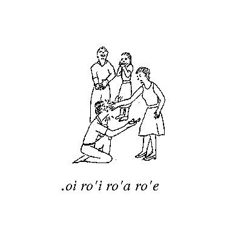

## Table of Contents

## 13.1. What are attitudinal indicators?

This chapter explains the various words that Lojban provides for expressing attitude and related notions. In natural languages, attitudes are usually expressed by the tone of voice when speaking, and (very imperfectly) by punctuation when writing. For example, the bare words

##### Example 13.1.

John is coming.

can be made, through tone of voice, to express the speaker's feeling of happiness, pity, hope, surprise, or disbelief. These fine points of tone cannot be expressed in writing. Attitudes are also expressed with various sounds which show up in print as oddly spelled words, such as the “Oooh!”, “Arrgh!”, “Ugh!”, and “Yecch!” in the title. These are part of the English language; people born to other languages use a different set; yet you won't find any of these words in a dictionary.

In Lojban, everything that can be spoken can also be written. Therefore, these tones of voice must be represented by explicit words known as “attitudinal indicators”, or just “attitudinals”. This rule seems awkward and clunky to English-speakers at first, but is an essential part of the Lojbanic way of doing things.

The simplest way to use attitudinal indicators is to place them at the beginning of a text. In that case, they express the speaker's prevailing attitude. Here are some examples, correlated with the attitudes mentioned following [Example 13.1](/chapter13/#example-131 "Example 13.1."):

##### Example 13.2.

|           |            |      |            |
| --------- | ---------- | ---- | ---------- |
| .ui       | la         | djan | klama      |
| \[Whee!\] | that-named | John | is-coming! |

##### Example 13.3.

|           |            |      |            |
| --------- | ---------- | ---- | ---------- |
| .uu       | la         | djan | klama      |
| \[Alas!\] | that-named | John | is-coming. |

##### Example 13.4.

|               |            |      |            |
| ------------- | ---------- | ---- | ---------- |
| .a'o          | la         | djan | klama      |
| \[Hopefully\] | that-named | John | is-coming. |

##### Example 13.5.

|          |            |      |            |
| -------- | ---------- | ---- | ---------- |
| .ue      | la         | djan | klama      |
| \[Wow!\] | that-named | John | is-coming! |

##### Example 13.6.

|               |            |      |            |
| ------------- | ---------- | ---- | ---------- |
| .ianai        | la         | djan | klama      |
| \[Nonsense!\] | that-named | John | is-coming. |

*[.ai](/glossary/#ai)*, *[.au](/glossary/#au)*, *[.ei](/glossary/#ei)*, and *[.ia](/glossary/#ia)*, *[.ie](/glossary/#ie)*, *[.ii](/glossary/#ii)*, *[.io](/glossary/#io)*, *[.iu](/glossary/#iu)*, *[.ua](/glossary/#ua)*, *[.ue](/glossary/#ue)*, *[.ui](/glossary/#ui)*, *[.uo](/glossary/#uo)*, and *[.uu](/glossary/#uu)*. Note that each of these cmavo has a period before it, marking the pause that is mandatory before every word beginning with a vowel. Attitudinals, like most of the other kinds of indicators described in this chapter, belong to selma'o UI.

Attitudinals can also be compound cmavo, of the types explained in Sections 4-8; [Example 13.6](/chapter13/#example-136 "Example 13.6.") illustrates one such possibility, the compound attitudinal *[.ianai](/glossary/#ianai)*. In attitudinals, *-nai* indicates polar negation: the opposite of the simple attitudinal without the *-nai*. Thus, as you might suppose, *[.ia](/glossary/#ia)* expresses belief, since *[.ianai](/glossary/#ianai)* expresses disbelief.

In addition to the attitudinals, there are other classes of indicators: intensity markers, emotion categories, attitudinal modifiers, observationals, and discursives. All of them are grammatically equivalent, which is why they are treated together in this chapter.

Every indicator behaves in more or less the same way with respect to the grammar of the rest of the language. In general, one or more indicators can be inserted at the beginning of an utterance or after any word. Indicators at the beginning apply to the whole utterance; otherwise, they apply to the word that they follow. More details can be found in [Section 13.9](/chapter13/#139-the-uses-of-indicators "13.9. The uses of indicators").

Throughout this chapter, tables of indicators will be written in four columns. The first column is the cmavo itself. The second column is a corresponding English word, not necessarily a literal translation. The fourth column represents the opposite of the second column, and shows the approximate meaning of the attitudinal when suffixed with *-nai*. The third column, which is sometimes omitted, indicates a neutral point between the second and fourth columns, and shows the approximate meaning of the attitudinal when it is suffixed with *-cu'i*. The cmavo *[cu'i](/glossary/#cui)* belongs to selma'o CAI, and is explained more fully in [Section 13.4](/chapter13/#134-attitudes-as-scales "13.4. Attitudes as scales").

One flaw that the English glosses are particularly subject to is that in English it is often difficult to distinguish between expressing your feelings and talking about them, particularly with the limited resource of the written word. So the gloss for *[.ui](/glossary/#ui)* should not really be “happiness” but some sound or tone that expresses happiness. However, there aren't nearly enough of those that have unambiguous or obvious meanings in English to go around for all the many, many different emotions Lojban speakers can readily express.

Many indicators of CV'V form are loosely derived from specific gismu. The gismu should be thought of as a memory hook, not an equivalent of the cmavo. Such gismu are shown in this chapter between square brackets, thus: \[gismu\].

## 13.2. Pure emotion indicators

Attitudinals make no claim: they are expressions of attitude, not of facts or alleged facts. As a result, attitudinals themselves have no truth value, nor do they directly affect the truth value of a bridi that they modify. However, since emotional attitudes are carried in your mind, they reflect reactions to that version of the world that the mind is thinking about; this is seldom identical with the real world. At times, we are thinking about our idealized version of the real world; at other times we are thinking about a potential world that might or might not ever exist.

Therefore, there are two groups of attitudinals in Lojban. The “pure emotion indicators” express the way the speaker is feeling, without direct reference to what else is said. These indicators comprise the attitudinals which begin with *u* or *o* and many of those beginning with *i*.

The cmavo beginning with *u* are simple emotions, which represent the speaker's reaction to the world as it is, or as it is perceived to be.

|      |            |                |                |
| ---- | ---------- | -------------- | -------------- |
| .ua  | discovery  |                | confusion      |
| .u'a | gain       |                | loss           |
| .ue  | surprise   | no surprise    | expectation    |
| .u'e | wonder     |                | commonplace    |
| .ui  | happiness  |                | unhappiness    |
| .u'i | amusement  |                | weariness      |
| .uo  | completion |                | incompleteness |
| .u'o | courage    | timidity       | cowardice      |
| .uu  | pity       |                | cruelty        |
| .u'u | repentance | lack of regret | innocence      |

Here are some typical uses of the *u* attitudinals:

##### Example 13.7.

|             |     |           |       |     |       |       |
| ----------- | --- | --------- | ----- | --- | ----- | ----- |
| .ua         | mi  | facki     | fi    | le  | mi    | mapku |
| \[Eureka!\] | I   | found-out | about | the | of-me | hat.  |

|                                                                     |
| ------------------------------------------------------------------- |
| \[Eureka!\] I found my hat! \[emphasizes the discovery of the hat\] |

##### Example 13.8.

|           |     |           |       |     |       |       |
| --------- | --- | --------- | ----- | --- | ----- | ----- |
| .u'a      | mi  | facki     | fi    | le  | mi    | mapku |
| \[Gain!\] | I   | found-out | about | the | of-me | hat.  |

|                                                                   |
| ----------------------------------------------------------------- |
| \[Gain!\] I found my hat! \[emphasizes the obtaining of the hat\] |

##### Example 13.9.

|          |     |           |       |     |       |       |
| -------- | --- | --------- | ----- | --- | ----- | ----- |
| .ui      | mi  | facki     | fi    | le  | mi    | mapku |
| \[Yay!\] | I   | found-out | about | the | of-me | hat.  |

|                                                                  |
| ---------------------------------------------------------------- |
| \[Yay!\] I found my hat! \[emphasizes the feeling of happiness\] |

##### Example 13.10.

|              |     |           |       |     |       |       |
| ------------ | --- | --------- | ----- | --- | ----- | ----- |
| .uo          | mi  | facki     | fi    | le  | mi    | mapku |
| \[At-last!\] | I   | found-out | about | the | of-me | hat.  |

|                                                                          |
| ------------------------------------------------------------------------ |
| \[At last!\] I found my hat! \[emphasizes that the finding is complete\] |

##### Example 13.11.

|           |     |            |
| --------- | --- | ---------- |
| .uu       | do  | cortu      |
| \[Pity!\] | you | feel-pain. |

|                                                           |
| --------------------------------------------------------- |
| \[Pity!\] you feel pain. \[expresses speaker's sympathy\] |

##### Example 13.12.

|                 |     |            |
| --------------- | --- | ---------- |
| .u'u            | do  | cortu      |
| \[Repentance!\] | you | feel-pain. |

|                                                                        |
| ---------------------------------------------------------------------- |
| \[Repentance!\] you feel pain. \[expresses that speaker feels guilty\] |

In [Example 13.10](/chapter13/#example-1310 "Example 13.10."), note that the attitudinal *[.uo](/glossary/#uo)* is translated by an English non-attitudinal phrase: “At last!” It is common for the English equivalents of Lojban attitudinals to be short phrases of this sort, with more or less normal grammar, but actually expressions of emotion.

In particular, both *[.uu](/glossary/#uu)* and *[.u'u](/glossary/#uu)* can be translated into English as “I'm sorry”; the difference between these two attitudes frequently causes confusion among English-speakers who use this phrase, leading to responses like “Why are you sorry? It's not your fault!”

It is important to realize that *[.uu](/glossary/#uu)*, and indeed all attitudinals, are meant to be used sincerely, not ironically. In English, the exclamation “Pity!” is just as likely to be ironically intended, but this usage does not extend to Lojban. Lying with attitudinals is (normally) as inappropriate to Lojban discourse as any other kind of lying: perhaps worse, because misunderstood emotions can cause even greater problems than misunderstood statements.

The following examples display the effects of *[nai](/glossary/#nai)* and *[cu'i](/glossary/#cui)* when suffixed to an attitudinal:

##### Example 13.13.

|               |            |       |        |
| ------------- | ---------- | ----- | ------ |
| .ue           | la         | djan. | klama  |
| \[Surprise!\] | that-named | John  | comes. |

##### Example 13.14.

|             |            |       |        |
| ----------- | ---------- | ----- | ------ |
| .uecu'i     | la         | djan. | klama  |
| \[Ho-hum.\] | that-named | John  | comes. |

##### Example 13.15.

|               |            |       |        |
| ------------- | ---------- | ----- | ------ |
| .uenai        | la         | djan. | klama  |
| \[Expected!\] | that-named | John  | comes. |

In [Example 13.15](/chapter13/#example-1315 "Example 13.15."), John's coming has been anticipated by the speaker. In [Example 13.13](/chapter13/#example-1313 "Example 13.13.") and [Example 13.14](/chapter13/#example-1314 "Example 13.14."), no such anticipation has been made, but in [Example 13.14](/chapter13/#example-1314 "Example 13.14.") the lack-of-anticipation goes no further – in [Example 13.13](/chapter13/#example-1313 "Example 13.13."), it amounts to actual surprise.

It is not possible to firmly distinguish the pure emotion words beginning with *o* or *i* from those beginning with *u*, but in general they represent more complex, more ambivalent, or more difficult emotions.

|      |                |                |          |
| ---- | -------------- | -------------- | -------- |
| .o'a | pride          | modesty        | shame    |
| .o'e | closeness      | detachment     | distance |
| .oi  | complaint/pain | doing OK       | pleasure |
| .o'i | caution        | boldness       | rashness |
| .o'o | patience       | mere tolerance | anger    |
| .o'u | relaxation     | composure      | stress   |

Here are some examples:

##### Example 13.16.

|                |            |       |            |
| -------------- | ---------- | ----- | ---------- |
| .oi            | la         | djan. | klama      |
| \[Complaint!\] | that-named | John  | is-coming. |

Here the speaker is distressed or discomfited over John's coming. The word *[.oi](/glossary/#oi)* is derived from the Yiddish word “oy” of similar meaning. It is the only cmavo with a Yiddish origin.

##### Example 13.17.

|            |            |       |            |
| ---------- | ---------- | ----- | ---------- |
| .o'onai    | la         | djan. | klama      |
| \[Anger!\] | that-named | John  | is-coming! |

Here the speaker feels anger over John's coming.

##### Example 13.18.

|             |            |       |            |
| ----------- | ---------- | ----- | ---------- |
| .o'i        | la         | djan. | klama      |
| \[Beware!\] | that-named | John  | is-coming. |

Here there is a sense of danger in John's arrival.

##### Example 13.19.

|                 |            |       |            |
| --------------- | ---------- | ----- | ---------- |
| .o'ecu'i        | la         | djan. | klama      |
| \[Detachment!\] | that-named | John  | is-coming. |

##### Example 13.20.

|           |            |       |            |
| --------- | ---------- | ----- | ---------- |
| .o'u      | la         | djan. | klama      |
| \[Phew!\] | that-named | John  | is-coming. |

In [Example 13.19](/chapter13/#example-1319 "Example 13.19.") and [Example 13.20](/chapter13/#example-1320 "Example 13.20."), John's arrival is no problem: in the former example, the speaker feels emotional distance from the situation; in the latter example, John's coming is actually a relief of some kind.

The pure emotion indicators beginning with *i* are those which could not be fitted into the *u* or *o* groups because there was a lack of room, so they are a mixed lot. *[.ia](/glossary/#ia)*, *[i'a](/glossary/#ia)*, *[.ie](/glossary/#ie)*, and *[i'e](/glossary/#ie)* do not appear here, as they belong in [Section 13.3](/chapter13/#133-propositional-attitude-indicators "13.3. Propositional attitude indicators") instead.

|      |              |              |            |
| ---- | ------------ | ------------ | ---------- |
| .ii  | fear         | nervousness  | security   |
| .i'i | togetherness |              | privacy    |
| .io  | respect      |              | disrespect |
| .i'o | appreciation |              | envy       |
| .iu  | love         | no love lost | hatred     |
| .i'u | familiarity  |              | mystery    |

Here are some examples:

##### Example 13.21.

|           |                           |
| --------- | ------------------------- |
| .ii       | smacu                     |
| \[Fear!\] | \[Observative:\]-a-mouse! |

|               |
| ------------- |
| Eek! A mouse! |

##### Example 13.22.

|            |       |           |            |
| ---------- | ----- | --------- | ---------- |
| la         | djan. | .iu       | klama      |
| That-named | John  | \[love!\] | is-coming. |

##### Example 13.23.

|            |       |                 |            |
| ---------- | ----- | --------------- | ---------- |
| la         | djan. | .ionai          | klama      |
| That-named | John  | \[disrespect!\] | is-coming. |

[Example 13.21](/chapter13/#example-1321 "Example 13.21.") shows an attitude-colored observative; the attitudinal modifies the situation described by the observative, namely the mouse that is causing the emotion. Lojban-speaking toddlers, if there ever are any, will probably use sentences like [Example 13.21](/chapter13/#example-1321 "Example 13.21.") a lot.

[Example 13.22](/chapter13/#example-1322 "Example 13.22.") and [Example 13.23](/chapter13/#example-1323 "Example 13.23.") use attitudinals that follow *la djan.* rather than being at the beginning of the sentence. This form means that the attitude is attached to John rather than the event of his coming; the speaker loves or disrespects John specifically. Compare:

##### Example 13.24.

|            |       |           |           |
| ---------- | ----- | --------- | --------- |
| la         | djan. | klama     | .iu       |
| That-named | John  | is-coming | \[love!\] |

where it is specifically the coming of John that inspires the feeling.

[Example 13.23](/chapter13/#example-1323 "Example 13.23.") is a compact way of swearing at John: you could translate it as “That good-for-nothing John is coming.”

## 13.3. Propositional attitude indicators

As mentioned at the beginning of [Section 13.2](/chapter13/#132-pure-emotion-indicators "13.2. Pure emotion indicators"), attitudinals may be divided into two groups, the pure emotion indicators explained in that section, and a contrasting group which may be called the “propositional attitude indicators”. These indicators establish an internal, hypothetical world which the speaker is reacting to, distinct from the world as it really is. Thus we may be expressing our attitude towards “what the world would be like if ...”, or more directly stating our attitude towards making the potential world a reality.

In general, the bridi paraphrases of pure emotions look (in English) something like “I'm going to the market, and I'm happy about it”. The emotion is present with the subject of the primary claim, but is logically independent of it. Propositional attitudes, though, look more like “I intend to go to the market”, where the main claim is logically subordinate to the intention: I am not claiming that I am actually going to the market, but merely that I intend to.

There is no sharp distinction between attitudinals beginning with *a* and those beginning with *e*; however, the original intent (not entirely realized due to the need to cram too many attitudes into too little space) was to make the members of the *a*-series the purer, more attitudinal realizers of a potential world, while the members of the *e*-series were more ambivalent or complex about the speaker's intention with regard to the predication. The relationship between the *a*-series and the *e*-series is similar to that between the *u*-series and the *o*-series, respectively. A few propositional attitude indicators overflowed into the *i*-series as well.

In fact, the entire distinction between pure emotions and propositional attitudes is itself a bit shaky: *[u'u](/glossary/#uu)* can be seen as a propositional attitude indicator meaning “I regret that ...”, and *[a'e](/glossary/#ae)* (discussed below) can be seen as a pure emotion meaning “I'm awake/aware”. The division of the attitudinals into pure-emotion and propositional-attitude classes in this chapter is mostly by way of explanation; it is not intended to permit firm rulings on specific points. Attitudinals are the part of Lojban most distant from the “logical language” aspect.

Here is the list of propositional attitude indicators grouped by initial letter, starting with those beginning with *a*:

|      |           |                |            |
| ---- | --------- | -------------- | ---------- |
| .a'a | attentive | inattentive    | avoiding   |
| .a'e | alertness |                | exhaustion |
| .ai  | intent    | indecision     | refusal    |
| .a'i | effort    | no real effort | repose     |
| .a'o | hope      |                | despair    |
| .au  | desire    | indifference   | reluctance |
| .a'u | interest  | no interest    | repulsion  |

Some examples (of a parental kind):

##### Example 13.25.

|               |     |         |     |                      |
| ------------- | --- | ------- | --- | -------------------- |
| .a'a          | do  | zgana   | le  | veltivni             |
| \[attentive\] | you | observe | the | television-receiver. |

|                                            |
| ------------------------------------------ |
| I'm noticing that you are watching the TV. |

##### Example 13.26.

|                |     |              |        |
| -------------- | --- | ------------ | ------ |
| .a'enai        | do  | ranji        | bacru  |
| \[exhaustion\] | you | continuously | utter. |

|                                          |
| ---------------------------------------- |
| I'm worn out by your continuous talking. |

##### Example 13.27.

|            |     |          |     |        |       |
| ---------- | --- | -------- | --- | ------ | ----- |
| .ai        | mi  | benji    | do  | le     | ckana |
| \[intent\] | I   | transfer | you | to-the | bed.  |

|                         |
| ----------------------- |
| I'm putting you to bed. |

##### Example 13.28.

|            |     |            |                 |     |          |     |          |         |
| ---------- | --- | ---------- | --------------- | --- | -------- | --- | -------- | ------- |
| .a'i       | mi  | ba         | gasnu           | le  | nu       | do  | cikna    | binxo   |
| \[effort\] | I   | \[future\] | am-the-actor-in | the | event-of | you | awake-ly | become. |

|                                      |
| ------------------------------------ |
| It'll be hard for me to wake you up. |

##### Example 13.29.

|          |     |                     |         |     |                      |
| -------- | --- | ------------------- | ------- | --- | -------------------- |
| .a'o     | mi  | kanryze'a           | ca      | le  | bavlamdei            |
| \[hope\] | I   | am-health-increased | at-time | the | future-adjacent-day. |

|                                |
| ------------------------------ |
| I hope I feel better tomorrow! |

##### Example 13.30.

|            |     |        |
| ---------- | --- | ------ |
| .au        | mi  | sipna  |
| \[desire\] | I   | sleep. |

|                  |
| ---------------- |
| I want to sleep. |

##### Example 13.31.

|                 |     |           |
| --------------- | --- | --------- |
| .a'ucu'i        | do  | pante     |
| \[no-interest\] | you | complain. |

|                                        |
| -------------------------------------- |
| I have no interest in your complaints. |

(In a real-life situation, [Example 13.25](/chapter13/#example-1325 "Example 13.25.") through [Example 13.31](/chapter13/#example-1331 "Example 13.31.") would also be decorated by various pure emotion indicators, certainly including *.oicai*, but probably also *.iucai*.)

Splitting off the attitude into an indicator allows the regular bridi grammar to do what it does best: express the relationships between concepts that are intended, desired, hoped for, or whatever. Rephrasing these examples to express the attitude as the main selbri would make for unacceptably heavyweight grammar.

Here are the propositional attitude indicators beginning with *e*, which stand roughly in the relation to those beginning with *a* as the pure-emotion indicators beginning with *o* do to those beginning with *u*- they are more complex or difficult:

|      |            |               |                          |
| ---- | ---------- | ------------- | ------------------------ |
| .e'a | permission |               | prohibition              |
| .e'e | competence |               | incompetence             |
| .ei  | obligation |               | freedom                  |
| .e'i | constraint | independence  | resistance to constraint |
| .e'o | request    |               | negative request         |
| .e'u | suggestion | no suggestion | warning                  |

More examples (after a good night's sleep):

##### Example 13.32.

|                |     |       |     |       |
| -------------- | --- | ----- | --- | ----- |
| .e'a           | do  | sazri | le  | karce |
| \[permission\] | you | drive | the | car.  |

|                              |
| ---------------------------- |
| Sure, you can drive the car. |

##### Example 13.33.

|                |     |            |                      |      |
| -------------- | --- | ---------- | -------------------- | ---- |
| .e'e           | mi  | lifri      | tu'a                 | do   |
| \[competence\] | I   | experience | something-related-to | you. |

|                                |
| ------------------------------ |
| I feel up to dealing with you. |

##### Example 13.34.

|                |     |         |     |             |                      |
| -------------- | --- | ------- | --- | ----------- | -------------------- |
| .ei            | mi  | tisygau | le  | karce       | ctilyvau             |
| \[obligation\] | I   | fill    | the | car-type-of | petroleum-container. |

|                                   |
| --------------------------------- |
| I should fill the car's gas tank. |

##### Example 13.35.

|             |                |                   |            |
| ----------- | -------------- | ----------------- | ---------- |
| .e'o        | ko             | ko                | kurji      |
| \[request\] | you-imperative | of-you-imperative | take-care. |

|                               |
| ----------------------------- |
| Please take care of yourself! |

##### Example 13.36.

|                |     |       |        |       |
| -------------- | --- | ----- | ------ | ----- |
| .e'u           | do  | klama | le     | panka |
| \[suggestion\] | you | go    | to-the | park. |

|                              |
| ---------------------------- |
| I suggest going to the park. |

Finally, the propositional attitude indicators beginning with *i*, which are the overflow from the other sets:

|      |            |              |              |
| ---- | ---------- | ------------ | ------------ |
| .ia  | belief     | skepticism   | disbelief    |
| .i'a | acceptance |              | blame        |
| .ie  | agreement  |              | disagreement |
| .i'e | approval   | non-approval | disapproval  |

Still more examples (much, much later):

##### Example 13.37.

|               |     |          |       |     |          |           |     |
| ------------- | --- | -------- | ----- | --- | -------- | --------- | --- |
| .ianai        | do  | pu       | pensi | le  | nu       | tcica     | mi  |
| \[disbelief\] | you | \[past\] | think | the | event-of | deceiving | me. |

|                                                |
| ---------------------------------------------- |
| I can't believe you thought you could fool me. |

##### Example 13.38.

|     |           |         |        |     |        |        |
| --- | --------- | ------- | ------ | --- | ------ | ------ |
| do  | .i'anai   | na      | xruti  | do  | le     | zdani  |
| You | \[blame\] | did-not | return | you | to-the | house. |

|                                  |
| -------------------------------- |
| I blame you for not coming home. |

##### Example 13.39.

|               |     |         |         |              |
| ------------- | --- | ------- | ------- | ------------ |
| .ie           | mi  | na      | cusku   | lu'e         |
| \[agreement\] | I   | did-not | express | a-symbol-for |

|     |             |     |     |          |         |
| --- | ----------- | --- | --- | -------- | ------- |
| le  | tcika       | be  | le  | nu       | xruti   |
| the | time-of-day | of  | the | event-of | return. |

|                                                |
| ---------------------------------------------- |
| It's true I didn't tell you when to come back. |

##### Example 13.40.

|                 |     |              |       |
| --------------- | --- | ------------ | ----- |
| .i'enai         | do  | .i'e         | zukte |
| \[disapproval\] | you | \[approval\] | act.  |

|                                                        |
| ------------------------------------------------------ |
| I don't approve of what you did, but I approve of you. |

[Example 13.40](/chapter13/#example-1340 "Example 13.40.") illustrates the use of a propositional attitude indicator, *[i'e](/glossary/#ie)*, in both the usual sense (at the beginning of the bridi) and as a pure emotion (attached to *[do](/glossary/#do)*). The event expressed by the main bridi is disapproved of by the speaker, but the referent of the sumti in the x1 place (namely the listener) is approved of.

To indicate that an attitudinal discussed in this section is not meant to indicate a propositional attitude, the simplest expedient is to split the attitudinal off into a separate sentence. Thus, a version of [Example 13.32](/chapter13/#example-1332 "Example 13.32.") which actually claimed that the listener was or would be driving the car might be:

##### Example 13.41.

|     |       |     |       |     |                 |
| --- | ----- | --- | ----- | --- | --------------- |
| do  | sazri | le  | karce | .i  | .e'a            |
| You | drive | the | car.  |     | \[Permission\]. |

|                                                          |
| -------------------------------------------------------- |
| You're driving (or will drive) the car, and that's fine. |

## 13.4. Attitudes as scales

In Lojban, all emotions and attitudes are scales. These scales run from some extreme value (which we'll call “positive”) to an opposite extreme (which we'll call “negative”). In the tables above, we have seen three points on the scale: “positive”, neutral, and “negative”. The terms “positive” and “negative” are put into quotation marks because they are loaded words when applied to emotions, and the attitudinal system reflects this loading, which is a known cultural bias. Only two of the “positive” words, namely *[.ii](/glossary/#ii)* (fear) and *[.oi](/glossary/#oi)* (pain/complaint), represent emotions commonly thought of as less “virtuous” in most cases than their negative counterparts. But these two were felt to be instinctive, distinct, and very powerful emotions that needed to be expressible in a monosyllable when necessary, while their counterparts are less commonly expressed.

(Why the overt bias? Because there are a lot of attitudinals and they will be difficult to learn as an entire set. By aligning our scales arbitrarily, we give the monosyllable *[nai](/glossary/#nai)* a useful meaning and make it easier for a novice to recognize at least the positive or negative alignment of an indicator, if not the specific word. Other choices considered were “random” orientation, which would have unknown biases and be difficult to learn, and orientation based on our guesses as to which scale orientations made the most frequent usages shorter, which would be biased in favor of American perceptions of “usefulness”. If bias must exist in our indicator set, it might as well be a known bias that eases learning, and in addition might as well favor a harmonious and positive world-view.)

In fact, though, each emotional scale has seven positions defined, three “positive” ones (shown below on the left), three “negative” ones (shown below on the right), and a neutral one indicating that no particular attitude on this scale is felt. The following chart indicates the seven positions of the scale and the associated cmavo. All of these cmavo, except *[nai](/glossary/#nai)*, are in selma'o CAI.

|               |               |                |                |               |              |              |
| ------------- | ------------- | -------------- | -------------- | ------------- | ------------ | ------------ |
| cai&#xA;carmi | sai&#xA;tsali | ru'e&#xA;ruble | cu'i&#xA;cumki | nairu'e&#xA;- | naisai&#xA;- | naicai&#xA;- |

A scalar attitude is expressed by using the attitudinal word, and then following it by the desired scalar intensity. The bias creeps in because the “negative” emotions take the extra syllable *[nai](/glossary/#nai)* to indicate their negative position on the axis, and thus require a bit more effort to express.

Much of this system is optional. You can express an attitude without a scale indicator, if you don't want to stop and think about how strongly you feel. Indeed, for most attitudinals, we've found that either no scalar value is used, or *[cai](/glossary/#cai)* is used to indicate especially high intensity. Less often, *[ru'e](/glossary/#rue)* is used for a recognizably weak intensity, and *[cu'i](/glossary/#cui)* is used in response to the attitudinal question *[pei](/glossary/#pei)* (see [Section 13.10](/chapter13/#1310-attitude-questions-empathy-attitude-contours "13.10. Attitude questions; empathy; attitude contours")) to indicate that the emotion is not felt.

The following shows the variations resulting from intensity variation:

##### Example 13.42.

|                |
| -------------- |
| .ei            |
| \[obligation\] |

|                             |
| --------------------------- |
| I ought to                  |
| (a non-specific obligation) |

##### Example 13.43.

|                        |
| ---------------------- |
| .eicai                 |
| \[obligation-maximal\] |

|                                                               |
| ------------------------------------------------------------- |
| I shall/must                                                  |
| (an intense obligation or requirement, possibly a formal one) |

##### Example 13.44.

|                       |
| --------------------- |
| .eisai                |
| \[obligation-strong\] |

|                                                                                    |
| ---------------------------------------------------------------------------------- |
| I should                                                                           |
| (a strong obligation or necessity, possibly an implied but not formal requirement) |

##### Example 13.45.

|                     |
| ------------------- |
| .eiru'e             |
| \[obligation-weak\] |

|                                                                       |
| --------------------------------------------------------------------- |
| I might                                                               |
| (a weak obligation in English often mixed with permission and desire) |

##### Example 13.46.

|                        |
| ---------------------- |
| .eicu'i                |
| \[obligation-neutral\] |

|                            |
| -------------------------- |
| No matter                  |
| (no particular obligation) |

##### Example 13.47.

|                    |
| ------------------ |
| .einai             |
| \[obligation-not\] |

|                    |
| ------------------ |
| I need not         |
| (a non-obligation) |

You can also utter a scale indicator without a specific emotion. This is often used in the language: in order to emphasize a point about which you feel strongly, you mark what you are saying with the scale indicator *[cai](/glossary/#cai)*. You could also indicate that you don't care using *[cu'i](/glossary/#cui)* by itself.

## 13.5. The space of emotions

Each of the attitude scales constitutes an axis in a multi-dimensional space. In effect, given our total so far of 39 scales, we have a 39-dimensional space. At any given time, our emotions and attitudes are represented by a point in this 39-dimensional space, with the intensity indicators serving as coordinates along each dimension. A complete attitudinal inventory, should one decide to express it, would consist of reading off each of the scale values for each of the emotions, with the vector sum serving as a distinct single point, which is our attitude.

Now no one is going to ever utter a string of 100-odd attitudinals to express their emotions. If asked, we normally do not recognize more than one or two emotions at a time – usually the ones that are strongest or which most recently changed in some significant way. But the scale system provides some useful insights into a possible theory of emotion (which might be testable using Lojban), and incidentally explains how Lojbanists express compound emotions when they do recognize them.

The existence of 39 scales highlights the complexity of emotion. We also aren't bound to the 39. There are modifiers described in [Section 13.6](/chapter13/#136-emotional-categories "13.6. Emotional categories") that multiply the set of scales by an order of magnitude. You can also have mixed feelings on a scale, which might be expressed by *[cu'i](/glossary/#cui)*, but could also be expressed by using both the “positive” and “negative” scale emotions at once. One expression of “fortitude” might be *.ii.iinai*- fear coupled with security.

Uttering one or more attitudinals to express an emotion reflects several things. We will tend to utter emotions in their immediate order of importance to us. We feel several emotions at once, and our expression reflects these emotions simultaneously, although their order of importance to us is also revealing – of our attitude towards our attitude, so to speak. There is little analysis necessary; for those emotions you feel, you express them; the “vector sum” naturally expresses the result. This is vital to their nature as attitudinals – if you had to stop and think about them, or to worry about grammar, they wouldn't be emotions but rationalizations.

People have proposed that attitudinals be expressed as bridi just like everything else; but emotions aren't logical or analytical – saying “I'm awed” is not the same as saying “Wow!!!”. The Lojban system is intended to give the effects of an analytical system without the thought involved. Thus, you can simply feel in Lojban.

A nice feature of this design is that you can be simple or complex, and the system works the same way. The most immediate benefit is in learning. You only need to learn a couple of the scale words and a couple of attitude words, and you're ready to express your emotions Lojbanically. As you learn more, you can express your emotions more thoroughly and more precisely, but even a limited vocabulary offers a broad range of expression.

## 13.6. Emotional categories

The Lojban attitudinal system was designed by starting with a long list of English emotion words, far too many to fit into the 39 available VV-form cmavo. To keep the number of cmavo limited, the emotion words in the list were grouped together by common features: each group was then assigned a separate cmavo. This was like making tanru in reverse, and the result is a collection of indicators that can be combined, like tanru, to express very complex emotions. Some examples in a moment.

The most significant “common feature” we identified was that the emotional words on the list could easily be broken down into six major groups, each of which was assigned its own cmavo:

|      |           |         |                   |
| ---- | --------- | ------- | ----------------- |
| ro'a | social    | asocial | antisocial        |
| ro'e | mental    |         | mindless          |
| ro'i | emotional |         | denying emotion   |
| ro'o | physical  |         | denying physical  |
| ro'u | sexual    |         | sexual abstinence |
| re'e | spiritual | secular | sacrilegious      |

Using these, we were able to assign *[o'u](/glossary/#ou)* to mark a scale of what we might call “generalized comfort”. When you are comfortable, relaxed, satisfied, you express comfort with *[o'u](/glossary/#ou)*, possibly followed by a scale indicator to indicate how comfortable you are. The six cmavo given above allow you to turn this scale into six separate ones, should you wish.

For example, embarrassment is a social discomfort, expressible as *.o'unairo'a*. Some emotions that we label “stress” in English are expressed in Lojban with *.o'unairo'i*. Physical distress can be expressed with *.o'unairo'o*, which makes a nice groan if you say it with feeling. Mental discomfort might be what you feel when you don't know the answer to the test question, but feel that you should. Most adults can recall some instance where we felt sexual discomfort, *o'unairo'u*. Spiritual discomfort, *o'unaire'e*, might be felt by a church-goer who has wandered into the wrong kind of religious building.

Most of the time when expressing an emotion, you won't categorize it with these words. Emotional expressions should be quickly expressible without having to think about them. However, we sometimes have mixed emotions within this set, as for example emotional discomfort coupled with physical comfort or vice versa.

Coupling these six words with our 39 attitude scales, each of which has a positive and negative side, already gives you far more emotional expression words than we have emotional labels in English. Thus, you'll never see a Lojban-English emotional dictionary that covers all the Lojban possibilities. Some may be useless, but others convey emotions that probably never had a word for them before, though many have felt them (*.eiro'u*, for example – look it up).

You can use scale markers and *[nai](/glossary/#nai)* on these six category words, and you can also use category words without specifying the emotion. Thus, “I'm trying to concentrate” could be expressed simply as *[ro'e](/glossary/#roe)*, and if you are feeling anti-social in some non-specific way, *[ro'anai](/glossary/#roanai)* will express it.

There is a mnemonic device for the six emotion categories, based on moving your arms about. In the following table, your hands begin above your head and move down your body in sequence.

|      |                     |              |
| ---- | ------------------- | ------------ |
| ro'a | hands above head    | social       |
| ro'e | hands on head       | intellectual |
| ro'i | hands on heart      | emotional    |
| ro'o | hands on belly      | physical     |
| ro'u | hands on groin      | sexual       |
| re'e | hands moving around | spiritual    |

The implicit metaphors “heart” for emotional and “belly” for physical are not really Lojbanic, but they work fine for English-speakers.

## 13.7. Attitudinal modifiers

The following cmavo are discussed in this section:

|      |           |                                      |                       |                                   |
| ---- | --------- | ------------------------------------ | --------------------- | --------------------------------- |
| ga'i | \[galtu\] | hauteur; rank                        | equal rank            | meekness; lack of rank            |
| le'o |           | aggressive                           | passive               | defensive                         |
| vu'e | \[vrude\] | virtue (*[zabna](/glossary/#zabna)*) |                       | sin (*[mabla](/glossary/#mabla)*) |
| se'i | \[sevzi\] | self-orientation                     |                       | other-orientation                 |
| ri'e | \[zifre\] | release                              | restraint             | control                           |
| fu'i | \[frili\] | with help; easily                    | without help          | with opposition; with difficulty  |
| be'u |           | lack/need                            | presence/satisfaction | satiation                         |
| se'a | \[sevzi\] | self-sufficiency                     |                       | dependency                        |

It turned out that, once we had devised the six emotion categories, we also recognized some other commonalities among emotions. These tended to fit nicely on scales of their own, but generally tend not to be thought of as separate emotions. Some of these are self-explanatory, some need to be placed in context. Some of these tend to go well with only a few of the attitudinals, others go with nearly all of them. To really understand these modifiers, try to use them in combination with one or two of the attitudinals found in [Section 13.2](/chapter13/#132-pure-emotion-indicators "13.2. Pure emotion indicators") and [Section 13.3](/chapter13/#133-propositional-attitude-indicators "13.3. Propositional attitude indicators"), and see what emotional pictures you can build:

The cmavo *[ga'i](/glossary/#gai)* expresses the scale used to indicate condescension or polite deference; it is not respect in general, which is *[.io](/glossary/#io)*. Whatever it is attached to is marked as being below (for *[ga'i](/glossary/#gai)*) or above (for *[ga'inai](/glossary/#gainai)*) the speaker's rank or social position. Note that it is always the referent, not the speaker or listener, who is so marked: in order to mark the listener, the listener must appear in the sentence, as with *doi ga'inai*, which can be appended to a statement addressed to a social superior.

##### Example 13.48.

|                |               |               |         |     |       |        |
| -------------- | ------------- | ------------- | ------- | --- | ----- | ------ |
| ko             | ga'inai       | nenri         | klama   | le  | mi    | zdani  |
| You-imperative | \[low-rank!\] | enter-type-of | come-to | the | of-me | house. |

|                                                     |
| --------------------------------------------------- |
| I would be honored if you would enter my residence. |

Note that imperatives in Lojban need not be imperious! Corresponding examples with *[ga'icu'i](/glossary/#gaicui)* and *[ga'i](/glossary/#gai)*:

##### Example 13.49.

|                |                 |               |         |     |       |        |
| -------------- | --------------- | ------------- | ------- | --- | ----- | ------ |
| ko             | ga'icu'i        | nenri         | klama   | le  | mi    | zdani  |
| You-imperative | \[equal-rank!\] | enter-type-of | come-to | the | of-me | house. |

|                         |
| ----------------------- |
| Come on in to my place. |

##### Example 13.50.

|                |                |               |         |     |       |        |
| -------------- | -------------- | ------------- | ------- | --- | ----- | ------ |
| ko             | ga'i           | nenri         | klama   | le  | mi    | zdani  |
| You-imperative | \[high-rank!\] | enter-type-of | come-to | the | of-me | house. |

|                  |
| ---------------- |
| You! Get inside! |

Since *[ga'i](/glossary/#gai)* expresses the relative rank of the speaker and the referent, it does not make much sense to attach it to *[mi](/glossary/#mi)*, unless the speaker is using *[mi](/glossary/#mi)* to refer to a group (as in English “we”), or a past or future version of himself with a different rank.

It is also possible to attach *[ga'i](/glossary/#gai)* to a whole bridi, in which case it expresses the speaker's superiority to the event the bridi refers to:

##### Example 13.51.

|                |     |       |          |       |
| -------------- | --- | ----- | -------- | ----- |
| ga'i           | le  | xarju | pu       | citka |
| \[High-rank!\] | the | pig   | \[past\] | eats. |

|                                                    |
| -------------------------------------------------- |
| The pig ate (which is an event beneath my notice). |

When used without being attached to any bridi, *[ga'i](/glossary/#gai)* expresses the speaker's superiority to things in general, which may represent an absolute social rank: *ga'icai* is an appropriate opening word for an emperor's address from the throne.

The cmavo *[le'o](/glossary/#leo)* represents the scale of aggressiveness. We seldom overtly recognize that we are feeling aggressive or defensive, but perhaps in counseling sessions, a psychologist might encourage someone to express these feelings on this scale. And football teams could be urged on by their coach using *ro'ole'o*. *[le'o](/glossary/#leo)* is also useful in threats as an alternative to *o'onai*, which expresses anger.

The cmavo *[vu'e](/glossary/#vue)* represents ethical virtue or its absence. An excess of almost any emotion is usually somewhat “sinful” in the eyes of most ethical systems. On the other hand, we often feel virtuous about our feelings – what we call righteous indignation might be *o'onaivu'e*. Note that this is distinct from lack of guilt: *[.u'unai](/glossary/#uunai)*.

The cmavo *[se'i](/glossary/#sei)* expresses the difference between selfishness and generosity, for example (in combination with *[.au](/glossary/#au)*):

##### Example 13.52.

|                 |
| --------------- |
| .ause'i         |
| \[desire-self\] |

|            |
| ---------- |
| I want it! |

##### Example 13.53.

|                  |
| ---------------- |
| .ause'inai       |
| \[desire-other\] |

|                        |
| ---------------------- |
| I want you to have it! |

In both cases, the English “it” is vague, reflecting the absence of a bridi. [Example 13.52](/chapter13/#example-1352 "Example 13.52.") and [Example 13.53](/chapter13/#example-1353 "Example 13.53.") are pure expressions of attitude. Analogously, *.uuse'i* is self-pity, whereas *.uuse'inai* is pity for someone else.

The modifier *[ri'e](/glossary/#rie)* indicates emotional release versus emotional control. “I will not let him know how angry I am”, you say to yourself before entering the room. The Lojban is much shorter:

##### Example 13.54.

|           |             |
| --------- | ----------- |
| .o'onai   | ri'enai     |
| \[anger\] | \[control\] |

On the other hand, *[ri'e](/glossary/#rie)* can be used by itself to signal an emotional outburst.

The cmavo *[fu'i](/glossary/#fui)* may express a reason for feeling the way we do, as opposed to a feeling in itself; but it is a reason that is more emotionally determined than most. For example, it could show the difference between the mental discomfort mentioned in [Section 13.6](/chapter13/#136-emotional-categories "13.6. Emotional categories") when it is felt on an easy test, as opposed to on a hard test. When someone gives you a back massage, you could use *.o'ufu'i* to show appreciation for the assistance in your comfort.

The cmavo *[be'u](/glossary/#beu)* expresses, roughly speaking, whether the emotion it modifies is in response to something you don't have enough of, something you have enough of, or something you have too much of. It is more or less the attitudinal equivalent of the subjective quantifier cmavo *[mo'a](/glossary/#moa)*, *[rau](/glossary/#rau)*, and *[du'e](/glossary/#due)* (these belong to selma'o PA, and are discussed in [Section 18.8](/chapter18/#188-indefinite-numbers "18.8. Indefinite numbers")). For example,

##### Example 13.55.

|                          |
| ------------------------ |
| .uiro'obe'unai           |
| \[Yay-physical-enough!\] |

might be something you say after a large meal which you enjoyed.

Like all modifiers, *[be'u](/glossary/#beu)* can be used alone:

##### Example 13.56.

|     |       |             |     |                |                 |
| --- | ----- | ----------- | --- | -------------- | --------------- |
| le  | cukta | be'u        | cu  | zvati          | ma              |
| The | book  | \[Needed!\] |     | is-at-location | \[what-sumti?\] |

|                              |
| ---------------------------- |
| Where's the book? I need it! |

Lastly, the modifier *[se'a](/glossary/#sea)* shows whether the feeling is associated with self-sufficiency or with dependence on others.

##### Example 13.57.

|                            |
| -------------------------- |
| .e'ese'a                   |
| \[I-can-self-sufficient!\] |

|                            |
| -------------------------- |
| I can do it all by myself! |

is something a Lojban-speaking child might say. On the other hand,

##### Example 13.58.

|                     |
| ------------------- |
| .e'ese'anai         |
| \[I-can-dependent\] |

|                             |
| --------------------------- |
| I can do it if you help me. |

from the same child would indicate a (hopefully temporary) loss of self-confidence. It is also possible to negate the *[e'e](/glossary/#ee)* in [Example 13.54](/chapter13/#example-1354 "Example 13.54.") and [Example 13.55](/chapter13/#example-1355 "Example 13.55."), leading to:

##### Example 13.59.

|                             |
| --------------------------- |
| .e'enaise'a                 |
| \[I-can't-self-sufficient\] |

|                                              |
| -------------------------------------------- |
| I can't do it if you insist on “helping” me! |

and

##### Example 13.60.

|                       |
| --------------------- |
| .e'enaise'anai        |
| \[I-can't-dependent\] |

|                          |
| ------------------------ |
| I can't do it by myself! |

Some of the emotional expressions may seem too complicated to use. They might be for most circumstances. It is likely that most combinations will never get used. But if one person uses one of these expressions, another person can understand (as unambiguously as the expresser intends) what emotion is being expressed. Most probably as the system becomes well-known and internalized by Lojban-speakers, particular attitudinal combinations will come to be standard expressions (if not cliches) of emotion.

## 13.8. Compound indicators

The grammar of indicators is quite simple; almost all facets are optional. You can combine indicators in any order, and they are still grammatical. The presumed denotation is additive; thus the whole is the sum of the parts regardless of the order expressed, although the first expressed is presumed most important to the speaker. Every possible string of UI cmavo has some meaning.

Within a string of indicators, there will be conventions of interpretation which amount to a kind of second-order grammar. Each of the modifier words is presumed to modify an indicator to the left, if there is one. (There is an “unspecified emotion” word, *[ge'e](/glossary/#gee)*, reserved to ensure that if you want to express a modifier without a root emotion, it doesn't attach to and modify a previous but distinct emotional expression.)

For example, *.ieru'e* expresses a weak positive value on the scale of agreement: the speaker agrees (presumably with the listener or with something else just stated), but with the least possible degree of intensity. But *.ie ge'eru'e* expresses agreement (at an unspecified level), followed by some other unstated emotion which is felt at a weak level. A rough English equivalent of *.ie ge'eru'e* might be “I agree, but ...” where the “but” is left hanging. (Again, attitudes aren't always expressed in English by English attitudinals.)

A scale variable similarly modifies the previous emotion word. You put the scale word for a root emotion word before a modifier, since the latter can have its own scale word. This merely maximizes the amount of information expressible. For example, *[ro'u](/glossary/#rou)*) in nature.

The cmavo *[nai](/glossary/#nai)* is the most tightly bound modifier in the language: it always negates exactly one word – the preceding one. Of all the words used in indicator constructs, *[nai](/glossary/#nai)* is the only one with any meaning outside the indicator system. If you try to put an indicator between a non-indicator cmavo and its *[nai](/glossary/#nai)* negator, the *[nai](/glossary/#nai)* will end up negating the last word of the indicator. The result, though unambiguous, is not what you want. For example,

##### Example 13.61.

|     |     |          |          |      |
| --- | --- | -------- | -------- | ---- |
| mi  | .e  | .ui      | nai      | do   |
| I   | and | \[Yay!\] | \[Not!\] | you. |

means “I and (unfortunately) you”, whereas

##### Example 13.62.

|     |     |          |          |      |
| --- | --- | -------- | -------- | ---- |
| mi  | .e  | nai      | .ui      | do   |
| I   | and | \[Not!\] | \[Yay!\] | you. |

means “I but (fortunately) not you”. Attitudinal *[nai](/glossary/#nai)* expresses a “scalar negation”, a concept explained in [Section 15.3](/chapter15/#153-scalar-negation "15.3. Scalar Negation"); since every attitudinal word implies exactly one scale, the effect of *[nai](/glossary/#nai)* on each should be obvious.

Thus, the complete internal grammar of UI is as follows, with each listed part optionally present or absent without affecting grammaticality, though it obviously would affect meaning.

|             |                         |                |                         |          |                         |                |                         |                    |
| ----------- | ----------------------- | -------------- | ----------------------- | -------- | ----------------------- | -------------- | ----------------------- | ------------------ |
| attitudinal | *[nai](/glossary/#nai)* | intensity-word | *[nai](/glossary/#nai)* | modifier | *[nai](/glossary/#nai)* | intensity-word | *[nai](/glossary/#nai)* | (possiblyrepeated) |

*[ge'e](/glossary/#gee)*, the non-specific emotion word, functions as an attitudinal. If multiple attitudes are being expressed at once, then in the 2nd or greater position, either *[ge'e](/glossary/#gee)* or a VV word must be used to prevent any modifiers from modifying the previous attitudinal.

## 13.9. The uses of indicators

The behavior of indicators in the “outside grammar” is nearly as simple as their internal structure. Indicator groupings are identified immediately after the metalinguistic erasers *[si](/glossary/#si)*, *[sa](/glossary/#sa)*, and *[su](/glossary/#su)* and some, though not all, kinds of quotations. The details of such interactions are discussed in [Section 19.16](/chapter19/#1916-list-of-cmavo-interactions "19.16. List of cmavo interactions").

A group of indicators may appear anywhere that a single indicator may, except in those few situations (as in *[zo](/glossary/#zo)* quotation, explained in [Section 19.10](/chapter19/#1910-more-on-quotations-zo-zoi "19.10. More on quotations: ZO, ZOI")) where compound cmavo may not be used.

At the beginning of a text, indicators modify everything following them indefinitely: such a usage is taken as a raw emotional expression, and we normally don't turn off our emotions when we start and stop sentences. In every other place in an utterance, the indicator (or group) attaches to the word immediately to its left, and indicates that the attitude is being expressed concerning the object or concept to which the word refers.

If the word that an indicator (or group) attaches to is itself a cmavo which governs a grammatical structure, then the indicator construct pertains to the referent of the entire structure. There is also a mechanism, discussed in [Section 19.8](/chapter19/#198-attitude-scope-markers-fuhefuho "19.8. Attitude scope markers: FUhE/FUhO"), for explicitly marking the range of words to which an indicator applies.

More details about the uses of indicators, and the way they interact with other specialized cmavo, are given in [Chapter 19](/chapter19/ "Chapter 19. Putting It All Together: Notes on the Structure of Lojban Texts"). It is worth mentioning that real-world interpretation is not necessarily consistent with the formal scope rules. People generally express emotions when they feel them, with only a minimum of grammatical constraint on that expression; complexities of emotional expression are seldom logically analyzable. Lojban attempts to provide a systematic reference that could possibly be ingrained to an instinctive level. However, it should always be assumed that the referent of an indicator has some uncertainty.

For example, in cases of multiple indicators expressed together, the combined form has some ambiguity of interpretation. It is possible to interpret the second indicator as expressing an attitude about the first, or to interpret both as expressing attitudes about the common referent. For example, in

##### Example 13.63.

|     |          |         |     |           |         |
| --- | -------- | ------- | --- | --------- | ------- |
| mi  | pu       | tavla   | do  | .o'onai   | .oi     |
| I   | \[past\] | talk-to | you | \[Grrr!\] | \[Oy!\] |

can be interpreted as expressing complaint about the anger, in which case it means “Damn, I snapped at you”; or as expressing both anger and complaint about the listener, in which case it means “I told you, you pest!”

Similarly, an indicator after the final brivla of a tanru may be taken to express an attitude about the particular brivla placed there – as the rules have it – or about the entire bridi which hinges on that brivla. Remembering that indicators are supposedly direct expressions of emotion, this ambiguity is acceptable.

Even if the scope rules given for indicators turn out to be impractical or unintuitive for use in conversation, they are still useful in written expression. There, where you can go back and put in markers or move words around, the scope rules can be used in lieu of elaborate nuances of body language and intonation to convey the writer's intent.

## 13.10. Attitude questions; empathy; attitude contours

The following cmavo are discussed in this section:

|      |                   |                  |             |
| ---- | ----------------- | ---------------- | ----------- |
| pei  | attitude question |                  |             |
| dai  | empathy           |                  |             |
| bu'o | start emotion     | continue emotion | end emotion |

You can ask someone how they are feeling with a normal bridi sentence, but you will get a normal bridi answer in response, one which may be true or false. Since the response to a question about emotions is no more logical than the emotion itself, this isn't appropriate.

The word *[pei](/glossary/#pei)* is therefore reserved for attitude questions. Asked by itself, it captures all of the denotation of English “How are you?” coupled with “How do you feel?” (which has a slightly different range of usage).

When asked in the context of discourse, *[pei](/glossary/#pei)* acts like other Lojban question words – it requests the respondent to “fill in the blank”, in this case with an appropriate attitudinal describing the respondent's feeling about the referent expression. As with other questions, plausibility is polite; if you answer with an irrelevant UI cmavo, such as a discursive, you are probably making fun of the questioner. (A *[ge'e](/glossary/#gee)*, however, is always in order – you are not required to answer emotionally. This is not the same as *[.i'inai](/glossary/#iinai)*, which is privacy as the reverse of conviviality.)

Most often, however, the asker will use *[pei](/glossary/#pei)* as a place holder for an intensity marker. (As a result, *[pei](/glossary/#pei)* is placed in selma'o CAI, although selma'o UI would have been almost as appropriate. Grammatically, there is no difference between UI and CAI.) Such usage corresponds to a whole range of idiomatic usages in natural languages:

##### Example 13.64.

|                        |
| ---------------------- |
| .iepei                 |
| \[agreement-question\] |

|               |
| ------------- |
| Do you agree? |

##### Example 13.65.

|                               |
| ----------------------------- |
| .iare'epei                    |
| \[belief-spiritual-question\] |

|                     |
| ------------------- |
| Are you a Believer? |

##### Example 13.66.

|                        |
| ---------------------- |
| .aipei                 |
| \[intention-question\] |

|                         |
| ----------------------- |
| Are you going to do it? |

[Example 13.66](/chapter13/#example-1366 "Example 13.66.") might appear at the end of a command, to which the response

##### Example 13.67.

|                       |
| --------------------- |
| .aicai                |
| \[intention-maximal\] |

corresponds to “Aye! Aye!” (hence the choice of cmavo).

##### Example 13.68.

|                         |
| ----------------------- |
| .e'apei                 |
| \[permission-question\] |

|                        |
| ---------------------- |
| Please, Mommy! Can I?? |

Additionally, when *[pei](/glossary/#pei)* is used at the beginning of an indicator construct, it asks specifically if that construct reflects the attitude of the respondent, as in (asked of someone who has been ill or in pain):

##### Example 13.69.

|                      |
| -------------------- |
| pei.o'u              |
| \[question-comfort\] |

|                      |
| -------------------- |
| Are you comfortable? |

##### Example 13.70.

|                              |
| ---------------------------- |
| pei.o'ucu'i                  |
| \[question-comfort-neutral\] |

|                            |
| -------------------------- |
| Are you no longer in pain? |

##### Example 13.71.

|                             |
| --------------------------- |
| pei.o'usai                  |
| \[question-comfort-strong\] |

|                        |
| ---------------------- |
| Are you again healthy? |

Empathy, which is not really an emotion, is expressed by the indicator *[dai](/glossary/#dai)*. (Don't confuse empathy with sympathy, which is *.uuse'inai*.) Sometimes, as when telling a story, you want to attribute emotion to someone else. You can of course make a bridi claim that so-and-so felt such-and-such an emotion, but you can also make use of the attitudinal system by adding the indicator *[dai](/glossary/#dai)*, which attributes the preceding attitudinal to someone else – exactly whom, must be determined from context. You can also use *[dai](/glossary/#dai)* conversationally when you empathize, or feel someone else's emotion as if it were your own:

##### Example 13.72.

|                           |
| ------------------------- |
| .oiro'odai                |
| \[Pain-physical-empathy\] |

|                            |
| -------------------------- |
| Ouch, that must have hurt! |

It is even possible to “empathize” with a non-living object:

##### Example 13.73.

|     |       |                  |           |          |         |     |              |
| --- | ----- | ---------------- | --------- | -------- | ------- | --- | ------------ |
| le  | bloti | .iidai           | .uu       | pu       | klama   | le  | xasloi       |
| The | ship  | \[fear-empathy\] | \[pity!\] | \[past\] | goes-to | the | ocean-floor. |

|                                       |
| ------------------------------------- |
| Fearfully the ship, poor thing, sank. |

suggesting that the ship felt fear at its impending destruction, and simultaneously reporting the speaker's pity for it.

Both *[pei](/glossary/#pei)* and *[dai](/glossary/#dai)* represent exceptions to the normal rule that attitudinals reflect the speaker's attitude.

Finally, we often want to report how our attitudes are changing. If our attitude has not changed, we can just repeat the attitudinal. (Therefore, *.ui .ui .ui* is not the same as *.uicai*, but simply means that we are continuing to be happy.) If we want to report that we are beginning to feel, continuing to feel, or ceasing to feel an emotion, we can use the attitudinal contour cmavo *[bu'o](/glossary/#buo)*.

When attached to an attitudinal, *[bu'o](/glossary/#buo)* means that you are starting to have that attitude, *[bu'ocu'i](/glossary/#buocui)* that you are continuing to have it, and *[bu'onai](/glossary/#buonai)* that you are ceasing to have it. Some examples:

##### Example 13.74.

|            |                   |
| ---------- | ----------------- |
| .o'onai    | bu'o              |
| \[Anger!\] | \[start-emotion\] |

|                    |
| ------------------ |
| I'm getting angry! |

##### Example 13.75.

|           |                 |                  |
| --------- | --------------- | ---------------- |
| .iu       | bu'onai         | .uinai           |
| \[Love!\] | \[end-emotion\] | \[unhappiness!\] |

|                                     |
| ----------------------------------- |
| I don't love you any more; I'm sad. |

Note the difference in effect between [Example 13.75](/chapter13/#example-1375 "Example 13.75.") and:

##### Example 13.76.

|     |             |               |       |     |             |     |          |     |          |
| --- | ----------- | ------------- | ----- | --- | ----------- | --- | -------- | --- | -------- |
| mi  | ca          | ba'o          | prami | do  | ja'e        | le  | nu       | mi  | badri    |
| I   | \[present\] | \[cessitive\] | love  | you | with-result | the | event-of | (I  | am-sad). |

|                                            |
| ------------------------------------------ |
| I no longer love you; therefore, I am sad. |

which is a straightforward bridi claim. [Example 13.76](/chapter13/#example-1376 "Example 13.76.") states that you have (or have had) certain emotions; [Example 13.75](/chapter13/#example-1375 "Example 13.75.") expresses those emotions directly.

## 13.11. Evidentials

The following cmavo are discussed in this section:

|      |           |                               |              |                 |
| ---- | --------- | ----------------------------- | ------------ | --------------- |
| ja'o | \[jalge\] | I conclude                    |              |                 |
| ca'e |           | I define                      |              |                 |
| ba'a | \[balvi\] | I expect                      | I experience | I remember      |
| su'a | \[sucta\] | I generalize                  |              | I particularize |
| ti'e | \[tirna\] | I hear (hearsay)              |              |                 |
| ka'u | \[kulnu\] | I know by cultural means      |              |                 |
| se'o | \[senva\] | I know by internal experience |              |                 |
| za'a | \[zgana\] | I observe                     |              |                 |
| pe'i | \[pensi\] | I opine                       |              |                 |
| ru'a | \[sruma\] | I postulate                   |              |                 |
| ju'a | \[jufra\] | I state                       |              |                 |

Now we proceed from the attitudinal indicators and their relatives to the other, semantically unrelated, categories of indicators. The indicators known as “evidentials” show how the speaker came to say the utterance; i.e. the source of the information or the idea. Lojban's list of evidentials was derived from lists describing several American Indian languages. Evidentials are also essential to the constructed language Láadan, designed by the linguist and novelist Suzette Haden Elgin. Láadan's set of indicators was drawn on extensively in developing the Lojban indicator system.

It is important to realize, however, that evidentials are not some odd system used by some strange people who live at the other end of nowhere: although their English equivalents aren't single words, English-speakers have vivid notions of what constitutes evidence, and of the different kinds of evidence.

Like the attitudinal indicators, the evidentials belong to selma'o UI, and may be treated identically for grammatical purposes. Most of them are not usually considered scalar in nature, but a few have associated scales.

A bridi with an evidential in it becomes “indisputable”, in the sense that the speaker is saying “how it is with him or her”, which is beyond argument. Claims about one's own mental states may be true or false, but are hardly subject to other people's examination. If you say that you think, or perceive, or postulate such-and-such a predication, who can contradict you? Discourse that uses evidentials has therefore a different rhetorical flavor than discourse that does not; arguments tend to become what can be called dialogues or alternating monologues, depending on your prejudices.

Evidentials are most often placed at the beginning of sentences, and are often attached to the *[i](/glossary/#i)* that separates sentences in connected discourse. It is in the nature of an evidential to affect the entire bridi in which it is placed: like the propositional attitude indicators, they strongly affect the claim made by the main bridi.

A bridi marked by *[ja'o](/glossary/#jao)* is a conclusion by the speaker based on other (stated or unstated) information or ideas. Rough English equivalents of *[ja'o](/glossary/#jao)* are “thus” and “therefore”.

A bridi marked by *[ca'e](/glossary/#cae)* is true because the speaker says so. In addition to definitions of words, *[ca'e](/glossary/#cae)* is also appropriate in what are called performatives, where the very act of speaking the words makes them true. An English example is “I now pronounce you husband and wife”, where the very act of uttering the words makes the listeners into husband and wife. A Lojban translation might be:

##### Example 13.77.

|               |     |     |        |     |            |          |
| ------------- | --- | --- | ------ | --- | ---------- | -------- |
| ca'e          | le  | re  | do     | cu  | simxu      | speni    |
| \[I-define!\] | the | two | of-you |     | are-mutual | spouses. |

The three scale positions of *[ba'a](/glossary/#baa)*, when attached to a bridi, indicate that it is based on the speaker's view of the real world. Thus *[ba'a](/glossary/#baa)* means that the statement represents a future event as anticipated by the speaker; *[ba'acu'i](/glossary/#baacui)*, a present event as experienced by the speaker; *[ba'anai](/glossary/#baanai)*, a past event as remembered by the speaker. It is accidental that this scale runs from future to past instead of past to future.

##### Example 13.78.

|                   |     |       |     |     |     |                       |
| ----------------- | --- | ----- | --- | --- | --- | --------------------- |
| ba'acu'i          | le  | tuple | be  | mi  | cu  | se cortu              |
| \[I-experience!\] | the | leg   | of  | me  |     | is-the-locus-of-pain. |

|               |
| ------------- |
| My leg hurts. |

A bridi marked by *[su'a](/glossary/#sua)* is a generalization by the speaker based on other (stated or unstated) information or ideas. The difference between *[su'a](/glossary/#sua)* and *[ja'o](/glossary/#jao)* is that *[ja'o](/glossary/#jao)* suggests some sort of reasoning or deduction (not necessarily rigorous), whereas *[su'a](/glossary/#sua)* suggests some sort of induction or pattern recognition from existing examples (not necessarily rigorous).

The opposite point of the scale, *[su'anai](/glossary/#suanai)*, indicates abduction, or drawing specific conclusions from general premises or patterns.

This cmavo can also function as a discursive (see [Section 13.12](/chapter13/#1312-discursives "13.12. Discursives")), in which case *[su'a](/glossary/#sua)* means “abstractly” or “in general”, and *[su'anai](/glossary/#suanai)* means “concretely” or “in particular”.

A bridi marked by *[ti'e](/glossary/#tie)* is relayed information from some source other than the speaker. There is no necessary implication that the information was relayed via the speaker's ears; what we read in a newspaper is an equally good example of *[ti'e](/glossary/#tie)*, unless we have personal knowledge of the content.

##### Example 13.79.

|             |       |         |                     |        |
| ----------- | ----- | ------- | ------------------- | ------ |
| ti'e        | la    | .uengas | cu                  | zergau |
| \[I-hear!\] | Wenga |         | is-a-criminal-doer. |        |

|                               |
| ----------------------------- |
| I hear that Wenga is a crook. |

A bridi marked by *[ka'u](/glossary/#kau)* is one held to be true in the speaker's cultural context, as a matter of myth or custom, for example. Such statements should be agreed on by a community of people – you cannot just make up your own cultural context – although “objectivity” in the sense of actual correspondence with the facts is certainly not required.

On the other hand, *[se'o](/glossary/#seo)* marks a bridi whose truth is asserted by the speaker as a result of an internal experience not directly available to others, such as a dream, vision, or personal revelation. In some cultures, the line between *[ka'u](/glossary/#kau)* and *[se'o](/glossary/#seo)* is fuzzy or even nonexistent.

A bridi marked by *[za'a](/glossary/#zaa)* is based on perception or direct observation by the speaker. This use of “observe” is not connected with the Lojban “observative”, or bridi with the first sumti omitted. The latter has no explicit aspect, and could be a direct observation, a conclusion, an opinion, or other aspectual point of view.

##### Example 13.80.

|                |     |            |
| -------------- | --- | ---------- |
| za'a           | do  | tatpi      |
| \[I-observe!\] | you | are-tired. |

|                      |
| -------------------- |
| I see you are tired. |

A bridi marked by *[pe'i](/glossary/#pei)* is the opinion of the speaker. The form *pe'ipei* is common, meaning “Is this your opinion?”. (Strictly, this should be *peipe'i*, in accordance with the distinction explained in [Example 13.69](/chapter13/#example-1369 "Example 13.69.") through [Example 13.71](/chapter13/#example-1371 "Example 13.71."), but since *[pe'i](/glossary/#pei)* is not really a scale, there is no real difference between the two orders.)

##### Example 13.81.

|              |            |           |                |               |
| ------------ | ---------- | --------- | -------------- | ------------- |
| pe'i         | la         | kartagos. | .ei            | se daspo      |
| \[I-opine!\] | that-named | Carthage  | \[obligation\] | is-destroyed. |

|                                              |
| -------------------------------------------- |
| In my opinion, Carthage should be destroyed. |

A bridi marked by *[ru'a](/glossary/#rua)* is an assumption made by the speaker. This is similar to one possible use of *[e'u](/glossary/#eu)*.

##### Example 13.82.

|               |     |              |
| ------------- | --- | ------------ |
| ru'a          | doi | livinston.   |
| \[I-presume\] | o   | Livingstone. |

|                                                                               |
| ----------------------------------------------------------------------------- |
| Dr. Livingstone, I presume? (A rhetorical question: Stanley knew who he was.) |

Finally, the evidential *[ju'a](/glossary/#jua)* is used to avoid stating a specific basis for a statement. It can also be used when the basis for the speaker's statement is not covered by any other evidential. For the most part, using *[ju'a](/glossary/#jua)* is equivalent to using no evidential at all, but in question form it can be useful: *ju'apei* means “What is the basis for your statement?” and serves as an evidential, as distinct from emotional, question.

## 13.12. Discursives

The term “discursive” is used for those members of selma'o UI that provide structure to the discourse, and which show how a given word or utterance relates to the whole discourse. To express these concepts in regular bridi would involve extra layers of nesting: rather than asserting that “I also came”, we would have to say “I came; furthermore, the event of my coming is an additional instance of the relationship expressed by the previous sentence”, which is intolerably clumsy. Typical English equivalents of discursives are words or phrases like “however”, “summarizing”, “in conclusion”, and “for example”.

Discursives are not attitudinals: they express no particular emotion. Rather, they are abbreviations for metalinguistic claims that reference the sentence or text they are found in.

Discursives are most often used at the beginning of sentences, often attached to the *[i](/glossary/#i)* that separates sentences in running discourse, but can (like all other indicators) be attached to single words when it seems necessary or useful.

The discursives discussed in this section are given in groups, roughly organized by function. First, the “consecutive discourse” group:

|      |           |                         |
| ---- | --------- | ----------------------- |
| ku'i | \[karbi\] | however/but/in contrast |
| ji'a | \[jmina\] | additionally            |
| si'a | \[simsa\] | similarly               |
| mi'u | \[mintu\] | ditto                   |
| po'o |           | the only relevant case  |

These five discursives are mutually exclusive, and therefore they are not usually considered as scales. The first four are used in consecutive discourse. The first, *[ku'i](/glossary/#kui)*, makes an exception to the previous argument. The second, *[ji'a](/glossary/#jia)*, adds weight to the previous argument. The third, *[si'a](/glossary/#sia)*, adds quantity to the previous argument, enumerating an additional example. The fourth, *[mi'u](/glossary/#miu)*, adds a parallel case to the previous argument, and can also be used in tables or the like to show that something is being repeated from the previous column. It is distinct from *[go'i](/glossary/#goi)* (of selma'o GOhA, discussed in [Section 7.6](/chapter07/#76-anaphoric-pro-sumti-and-pro-bridi-the-ri-series-and-the-goi-series "7.6. Anaphoric pro-sumti and pro-bridi: the ri-series and the go'i-series")), which is a non-discursive version of “ditto” that explicitly repeats the claim of the previous bridi.

Lastly, *[po'o](/glossary/#poo)* is used when there is no other comparable case, and thus corresponds to some of the uses of “only”, a word difficult to express in pure bridi form:

##### Example 13.83.

|     |          |       |     |       |        |          |     |       |
| --- | -------- | ----- | --- | ----- | ------ | -------- | --- | ----- |
| mi  | po'o     | darxi | le  | mi    | tamne  | fo       | le  | nazbi |
| I   | \[only\] | hit   | the | of-me | cousin | at-locus | the | nose. |

|                                                 |
| ----------------------------------------------- |
| Only I (nobody else) hit my cousin on his nose. |

##### Example 13.84.

|     |       |          |     |       |        |          |     |       |
| --- | ----- | -------- | --- | ----- | ------ | -------- | --- | ----- |
| mi  | darxi | po'o     | le  | mi    | tamne  | fo       | le  | nazbi |
| I   | hit   | \[only\] | the | of-me | cousin | at-locus | the | nose. |

|                                                               |
| ------------------------------------------------------------- |
| I only hit my cousin on his nose (I did nothing else to him). |

##### Example 13.85.

|     |       |     |       |        |          |          |     |       |
| --- | ----- | --- | ----- | ------ | -------- | -------- | --- | ----- |
| mi  | darxi | le  | mi    | tamne  | po'o     | fo       | le  | nazbi |
| I   | hit   | the | of-me | cousin | \[only\] | at-locus | the | nose. |

|                                                 |
| ----------------------------------------------- |
| I hit only my cousin on his nose (no one else). |

##### Example 13.86.

|     |       |     |       |        |          |     |       |           |
| --- | ----- | --- | ----- | ------ | -------- | --- | ----- | --------- |
| mi  | darxi | le  | mi    | tamne  | fo       | le  | nazbi | po'o      |
| I   | hit   | the | of-me | cousin | at-locus | the | nose  | \[only\]. |

|                                                  |
| ------------------------------------------------ |
| I hit my cousin only on his nose (nowhere else). |

Note that “only” can go before or after what it modifies in English, but *[po'o](/glossary/#poo)*, as an indicator, always comes afterward.

Next, the “commentary on words” group:

|      |           |                   |                   |
| ---- | --------- | ----------------- | ----------------- |
| va'i | \[valsi\] | in other words    | in the same words |
| ta'u | \[tanru\] | expanding a tanru | making a tanru    |

The discursives *[va'i](/glossary/#vai)* and *[ta'u](/glossary/#tau)* operate at the level of words, rather than discourse proper, or if you like, they deal with how things are said. An alternative English expression for *[va'i](/glossary/#vai)* is “rephrasing”; for *[va'inai](/glossary/#vainai)*, “repeating”. Also compare *[va'i](/glossary/#vai)* with *[ke'u](/glossary/#keu)*, discussed below.

The cmavo *[ta'u](/glossary/#tau)* is a discursive unique to Lojban; it expresses the particularly Lojbanic device of tanru. Since tanru are semantically ambiguous, they are subject to misunderstanding. This ambiguity can be removed by expanding the tanru into some semantically unambiguous structure, often involving relative clauses or the introduction of additional brivla. The discursive *[ta'u](/glossary/#tau)* marks the transition from the use of a brief but possibly confusing tanru to its fuller, clearer expansion; the discursive *[ta'unai](/glossary/#taunai)* marks a transition in the reverse direction.

Next, the “commentary on discourse” group:

|      |           |                    |          |                  |
| ---- | --------- | ------------------ | -------- | ---------------- |
| li'a | \[klina\] | clearly; obviously |          | obscurely        |
| ba'u | \[banli\] | exaggeration       | accuracy | understatement   |
| zo'o |           | humorously         | dully    | seriously        |
| sa'e | \[satci\] | precisely speaking |          | loosely speaking |
| to'u | \[tordu\] | in brief           |          | in detail        |
| do'a | \[dunda\] | generously         |          | parsimoniously   |
| sa'u | \[sampu\] | simply             |          | elaborating      |
| pa'e | \[pajni\] | justice            |          | prejudice        |
| je'u | \[jetnu\] | truly              |          | falsely          |

This group is used by the speaker to characterize the nature of the discourse, so as to prevent misunderstanding. It is well-known that listeners often fail to recognize a humorous statement and take it seriously, or miss an exaggeration, or try to read more into a statement than the speaker intends to put there. In speech, the tone of voice often provides the necessary cue, but the reader of ironic or understated or imprecise discourse is often simply clueless. As with the attitudinals, the use of these cmavo may seem fussy to new Lojbanists, but it is important to remember that *[zo'o](/glossary/#zoo)*, for example, is the equivalent of smiling while you speak, not the equivalent of a flat declaration like “What I'm about to say is supposed to be funny.”

A few additional English equivalents: for *[sa'enai](/glossary/#saenai)*, “roughly speaking” or “approximately speaking”; for *[sa'unai](/glossary/#saunai)*, “furthermore”; for *[to'u](/glossary/#tou)*, “in short” or “skipping details”; for *[do'a](/glossary/#doa)*, “broadly construed”; for *[do'anai](/glossary/#doanai)* (as you might expect), “narrowly construed”.

The cmavo *[pa'e](/glossary/#pae)* is used to claim (truly or falsely) that one is being fair or just to all parties mentioned, whereas *[pa'enai](/glossary/#paenai)* admits (or proclaims) a bias in favor of one party.

The scale of *[je'u](/glossary/#jeu)* and *[je'unai](/glossary/#jeunai)* is a little different from the others in the group. By default, we assume that people speak the truth – or at least, that if they are lying, they will do their best to conceal it from us. So under what circumstances would *[je'unai](/glossary/#jeunai)* be used, or *[je'u](/glossary/#jeu)* be useful? For one thing, *[je'u](/glossary/#jeu)* can be used to mark a tautology: a sentence that is a truth of logic, like “All cats are cats.” Its counterpart *[je'unai](/glossary/#jeunai)* then serves to mark a logical contradiction. In addition, *[je'unai](/glossary/#jeunai)* can be used to express one kind of sarcasm or irony, where the speaker pretends to believe what he/she says, but actually wishes the listener to infer a contrary opinion. Other forms of irony can be marked with *[zo'o](/glossary/#zoo)* (humor) or *[.ianai](/glossary/#ianai)* (disbelief).

When used as a discursive, *[su'a](/glossary/#sua)* (see [Section 13.11](/chapter13/#1311-evidentials "13.11. Evidentials")) belongs to this group.

Next, the “knowledge” group:

|      |           |           |           |               |
| ---- | --------- | --------- | --------- | ------------- |
| ju'o | \[djuno\] | certainly | uncertain | certainly not |
| la'a | \[lakne\] | probably  |           | improbably    |

These two discursives describe the speaker's state of knowledge about the claim of the associated bridi. They are similar to the propositional attitudes of [Section 13.3](/chapter13/#133-propositional-attitude-indicators "13.3. Propositional attitude indicators"), as they create a hypothetical world. We may be quite certain that something is true, and label our bridi with *[ju'o](/glossary/#juo)*; but it may be false all the same.

Next, the “discourse management” group:

|      |           |                 |                   |                    |
| ---- | --------- | --------------- | ----------------- | ------------------ |
| ta'o | \[tanjo\] | by the way      |                   | returning to point |
| ra'u | \[ralju\] | chiefly         | equally           | incidentally       |
| mu'a | \[mupli\] | for example     | omitting examples | end examples       |
| zu'u |           | on the one hand |                   | on the other hand  |
| ke'u | \[krefu\] | repeating       |                   | continuing         |
| da'i |           | supposing       |                   | in fact            |

This final group is used to perform what may be called “managing the discourse”: providing reference points to help the listener understand the flow from one sentence to the next.

Other English equivalents of *[ta'onai](/glossary/#taonai)* are “anyway”, “anyhow”, “in any case”, “in any event”, “as I was saying”, and “continuing”.

The scale of *[ra'u](/glossary/#rau)* has to do with the importance of the point being, or about to be, expressed: *[ra'u](/glossary/#rau)* is the most important point, *[ra'ucu'i](/glossary/#raucui)* is a point of equal importance, and *[ra'unai](/glossary/#raunai)* is a lesser point. Other English equivalents of *[ra'u](/glossary/#rau)* are “above all” and “primarily”.

The cmavo *[ke'u](/glossary/#keu)* is very similar to *[va'i](/glossary/#vai)*, although *[ke'unai](/glossary/#keunai)* and *[va'inai](/glossary/#vainai)* are quite different. Both *[ke'u](/glossary/#keu)* and *[va'i](/glossary/#vai)* indicate that the same idea is going to be expressed using different words, but the two cmavo differ in emphasis. Using *[ke'u](/glossary/#keu)* emphasizes that the content is the same; using *[va'i](/glossary/#vai)* emphasizes that the words are different. Therefore, *[ke'unai](/glossary/#keunai)* shows that the content is new (and therefore the words are also); *[va'inai](/glossary/#vainai)* shows that the words are the same (and therefore so is the content). One English equivalent of *[ke'unai](/glossary/#keunai)* is “furthermore”.

The discursive *[da'i](/glossary/#dai)* marks the discourse as possibly taking a non-real-world viewpoint (“Supposing that”, “By hypothesis”), whereas *[da'inai](/glossary/#dainai)* insists on the real-world point of view (“In fact”, “In truth”, “According to the facts”). A common use of *[da'i](/glossary/#dai)* is to distinguish between:

##### Example 13.87.

|       |                  |     |       |     |       |       |         |
| ----- | ---------------- | --- | ----- | --- | ----- | ----- | ------- |
| ganai | da'i             | do  | viska | le  | mi    | citno | mensi   |
| If    | \[hypothetical\] | you | see   | the | of-me | young | sister, |

|      |             |     |       |     |                |     |              |
| ---- | ----------- | --- | ----- | --- | -------------- | --- | ------------ |
| gi   | ju'o        | do  | djuno | le  | du'u           | ri  | pazvau       |
| then | \[certain\] | you | know  | the | predication-of | she | is-pregnant. |

|                                                                                 |
| ------------------------------------------------------------------------------- |
| If you were to see my younger sister, you would certainly know she is pregnant. |

and:

##### Example 13.88.

|       |             |     |       |     |       |       |         |
| ----- | ----------- | --- | ----- | --- | ----- | ----- | ------- |
| ganai | da'inai     | do  | viska | le  | mi    | citno | mensi   |
| If    | \[factual\] | you | see   | the | of-me | young | sister, |

|      |               |     |       |     |                |     |              |
| ---- | ------------- | --- | ----- | --- | -------------- | --- | ------------ |
| gi   | ju'o          | do  | djuno | le  | du'u           | ri  | pazvau       |
| then | \[certainty\] | you | know  | the | predication-of | she | is-pregnant. |

|                                                                         |
| ----------------------------------------------------------------------- |
| If you saw my younger sister, you would certainly know she is pregnant. |

It is also perfectly correct to omit the discursive altogether, and leave the context to indicate which significance is meant. (Chinese always leaves this distinction to the context: the Chinese sentence

##### Example 13.89.

- *ru2guo3 ni3 kan4dao4 wo3 mei4mei, ni3 yi2ding4 zhi1dao4 ta1 huai2yun4 le*

- if you see-arrive my younger-sister, you certainly know she pregnant

is the equivalent of either [Example 13.87](/chapter13/#example-1387 "Example 13.87.") or [Example 13.88](/chapter13/#example-1388 "Example 13.88.").)

## 13.13. Miscellaneous indicators

Some indicators do not fall neatly into the categories of attitudinal, evidential, or discursive. This section discusses the following miscellaneous indicators:

|      |                                      |     |                     |
| ---- | ------------------------------------ | --- | ------------------- |
| ki'a | metalinguistic confusion             |     |                     |
| na'i | metalinguistic negator               |     |                     |
| jo'a | metalinguistic affirmer              |     |                     |
| li'o | omitted text (quoted material)       |     |                     |
| sa'a | material inserted by editor/narrator |     |                     |
| xu   | true-false question                  |     |                     |
| pau  | question premarker                   |     | rhetorical question |
| pe'a | figurative language                  |     | literal language    |
| bi'u | new information                      |     | old information     |
| ge'e | non-specific indicator               |     |                     |

The cmavo *[ki'a](/glossary/#kia)* is one of the most common of the miscellaneous indicators. It expresses metalinguistic confusion; i.e. confusion about what has been said, as opposed to confusion not tied to the discourse (which is *[.uanai](/glossary/#uanai)*). The confusion may be about the meaning of a word or of a grammatical construct, or about the referent of a sumti. One of the uses of English “which” corresponds to *[ki'a](/glossary/#kia)*:

##### Example 13.90.

|     |       |     |          |
| --- | ----- | --- | -------- |
| mi  | nelci | le  | ctuca    |
| I   | like  | the | teacher. |

|     |     |       |          |
| --- | --- | ----- | -------- |
| .i  | le  | ki'a  | ctuca    |
|     | The | which | teacher? |

|                |
| -------------- |
| Which teacher? |

Here, the second speaker does not understand the referent of the sumti *le ctuca*, and so echoes back the sumti with the confusion marker.

The metalinguistic negation cmavo *[na'i](/glossary/#nai)* and its opposite *[jo'a](/glossary/#joa)* are explained in full in [Chapter 15](/chapter15/ "Chapter 15. “No” Problems: On Lojban Negation"). In general, *[na'i](/glossary/#nai)* indicates that there is something wrong with a piece of discourse: either an error, or a false underlying assumption, or something else of the sort. The discourse is invalid or inappropriate due to the marked word or construct.

Similarly, *[jo'a](/glossary/#joa)* marks something which looks wrong but is in fact correct. These two cmavo constitute a scale, but are kept apart for two reasons: *na'inai* means the same as *[jo'a](/glossary/#joa)*, but would be too confusing as an affirmation; *jo'anai* means the same as *[na'i](/glossary/#nai)*, but is too long to serve as a convenient metalinguistic negator.

The next two cmavo are used to assist in quoting texts written or spoken by others. It is often the case that we wish to quote only part of a text, or to supply additional material either by way of commentary or to make a fragmentary text grammatical. The cmavo *[li'o](/glossary/#lio)* serves the former function. It indicates that words were omitted from the quotation. What remains of the quotation must be grammatical, however, as *[li'o](/glossary/#lio)* does not serve any grammatical function. It cannot, for example, take the place of a missing selbri in a bridi, or supply the missing tail of a description sumti: *le li'o* in isolation is not grammatical.

The cmavo *[sa'a](/glossary/#saa)* indicates in a quotation that the marked word or construct was not actually expressed, but is inserted for editorial, narrative, or grammatical purposes. Strictly, even a *[li'o](/glossary/#lio)* should appear in the form *li'osa'a*, since the *[li'o](/glossary/#lio)* was not part of the original quotation. In practice, this and other forms which are already associated with metalinguistic expressions, such as *[sei](/glossary/#sei)* (of selma'o SEI) or *[to'i](/glossary/#toi)* (of selma'o TO) need not be marked except where confusion might result.

In the rare case that the quoted material already contains one or more instances of *[sa'a](/glossary/#saa)*, they can be changed to *sa'asa'a*.

The cmavo *[xu](/glossary/#xu)* marks truth questions, which are discussed in detail in [Section 15.8](/chapter15/#158-truth-questions "15.8. Truth questions"). In general, *[xu](/glossary/#xu)* may be translated “Is it true that ... ?” and questions whether the attached bridi is true. When *[xu](/glossary/#xu)* is attached to a specific word or construct, it directs the focus of the question to that word or construct.

Lojban question words, unlike those of English, frequently do not stand at the beginning of the question. Placing the cmavo *[pau](/glossary/#pau)* at the beginning of a bridi helps the listener realize that the bridi is a question, like the symbol at the beginning of written Spanish questions that looks like an upside-down question mark. The listener is then warned to watch for the actual question word.

Although *[pau](/glossary/#pau)* is grammatical in any location (like all indicators), it is not really useful except at or near the beginning of a bridi. Its scalar opposite, *[paunai](/glossary/#paunai)*, signals that a bridi is not really a question despite its form. This is what we call in English a rhetorical question: an example appears in the English text near the beginning of [Section 13.11](/chapter13/#1311-evidentials "13.11. Evidentials").

The cmavo *[pe'a](/glossary/#pea)* is the indicator of figurative speech, indicating that the previous word should be taken figuratively rather than literally:

##### Example 13.91.

|     |       |     |       |                |        |
| --- | ----- | --- | ----- | -------------- | ------ |
| mi  | viska | le  | blanu | pe'a           | zdani  |
| I   | see   | the | blue  | \[figurative\] | house. |

|                         |
| ----------------------- |
| I see the “blue” house. |

Here the house is not blue in the sense of color, but in some other sense, whose meaning is entirely culturally dependent. The use of *[pe'a](/glossary/#pea)* unambiguously marks a cultural reference: *[blanu](/glossary/#blanu)* in [Example 13.91](/chapter13/#example-1391 "Example 13.91.") could mean “sad” (as in English) or something completely different.

The negated form, *pe'anai*, indicates that what has been said is to be interpreted literally, in the usual way for Lojban; natural-language intuition is to be ignored.

Alone among the cmavo of selma'o UI, *[pe'a](/glossary/#pea)* has a rafsi, namely *pev*. This rafsi is used in forming figurative (culturally dependent) lujvo, whose place structure need have nothing to do with the place structure of the components. Thus *risnyjelca* (heart burn) might have a place structure like:

> x1 is the heart of x2, burning in atmosphere x3 at temperature x4

whereas *pevrisnyjelca*, explicitly marked as figurative, might have the place structure:

> x1 is indigestion/heartburn suffered by x2

which obviously has nothing to do with the places of either *[risna](/glossary/#risna)* or *[jelca](/glossary/#jelca)*.

The uses of *[bi'u](/glossary/#biu)* and *[bi'unai](/glossary/#biunai)* correspond to one of the uses of the English articles “the” and “a/an”. An English-speaker telling a story may begin with “I saw a man who ...”. Later in the story, the same man will be referred to with the phrase “the man”. Lojban does not use its articles in the same way: both “a man” and “the man” would be translated *le nanmu*, since the speaker has in mind a specific man. However, the first use might be marked *le bi'u nanmu*, to indicate that this is a new man, not mentioned before. Later uses could correspondingly be tagged *le bi'unai nanmu*.

Most of the time, the distinction between *[bi'u](/glossary/#biu)* and *[bi'unai](/glossary/#biunai)* need not be made, as the listener can infer the right referent. However, if a different man were referred to still later in the story, *le bi'u nanmu* would clearly show that this man was different from the previous one.

Finally, the indicator *[ge'e](/glossary/#gee)* has been discussed in [Section 13.8](/chapter13/#138-compound-indicators "13.8. Compound indicators") and [Section 13.10](/chapter13/#1310-attitude-questions-empathy-attitude-contours "13.10. Attitude questions; empathy; attitude contours"). It is used to express an attitude which is not covered by the existing set, or to avoid expressing any attitude.

Another use for *[ge'e](/glossary/#gee)* is to explicitly avoid expressing one's feeling on a given scale; in this use, it functions like a member of selma'o CAI: *.iige'e* means roughly “I'm not telling whether I'm afraid or not.”

|     |                   |
| --- | ----------------- |
| kau | indirect question |

This cmavo is explained in detail in [Section 11.8](/chapter11/#118-indirect-questions "11.8. Indirect questions"). It marks the word it is attached to as the focus of an indirect question:

##### Example 13.92.

|     |       |     |                |                        |       |        |        |
| --- | ----- | --- | -------------- | ---------------------- | ----- | ------ | ------ |
| mi  | djuno | le  | du'u           | dakau                  | klama | le     | zarci  |
| I   | know  | the | predication-of | somebody-\[indirect?\] | goes  | to-the | store. |

|                               |
| ----------------------------- |
| I know who goes to the store. |

## 13.14. Vocative scales

“Vocatives” are words used to address someone directly; they precede and mark a name used in direct address, just as *[la](/glossary/#la)* (and the other members of selma'o LA) mark a name used to refer to someone. The vocatives actually are indicators – in fact, discursives – but the need to tie them to names and other descriptions of listeners requires them to be separated from selma'o UI. But like the cmavo of UI, the members of selma'o COI can be “negated” with *[nai](/glossary/#nai)* to get the opposite part of the scale.

Because of the need for redundancy in noisy environments, the Lojban design does not compress the vocatives into a minimum number of scales. Doing so would make a non-redundant *[nai](/glossary/#nai)* too often vital to interpretation of a protocol signal, as explained later in this section.

The grammar of vocatives is explained in [Section 6.11](/chapter06/#611-the-syntax-of-vocative-phrases "6.11. The syntax of vocative phrases"); but in brief, a vocative may be followed by a name (without *[la](/glossary/#la)*), a description (without *[le](/glossary/#le)* or its relatives), a complete sumti, or nothing at all (if the addressee is obvious from the context). There is an elidable terminator, *[do'u](/glossary/#dou)* (of selma'o DOhU) which is almost never required unless no name (or other indication of the addressee) follows the vocative.

Using any vocative except *[mi'e](/glossary/#mie)* (explained below) implicitly defines the meaning of the pro-sumti *[do](/glossary/#do)*, as the whole point of vocatives is to specify the listener, or at any rate the desired listener – even if the desired listener isn't listening! We will use the terms “speaker” and “listener” for clarity, although in written Lojban the appropriate terms would be “writer” and “reader”.

In the following list of vocatives, the translations include the symbol X. This represents the name (or identifying description, or whatever) of the listener.

The cmavo *[doi](/glossary/#doi)* is the general-purpose vocative. Unlike the cmavo of selma'o COI, explained below, *[doi](/glossary/#doi)* can precede a name directly without an intervening pause. It is not considered a scale, and *doinai* is not grammatical. In general, *[doi](/glossary/#doi)* needs no translation in English (we just use names by themselves without any preceding word, although in poetic styles we sometimes say “Oh X”, which is equivalent to *[doi](/glossary/#doi)*). One may attach an attitudinal to *[doi](/glossary/#doi)* to express various English vocatives. For example, *doi .io* means “Sir/Madam!”, whereas *doi .ionai* means “You there!”.

All members of selma'o COI require a pause when used immediately before a name, in order to prevent the name from absorbing the COI word. This is unlike selma'o DOI and LA, which do not require pauses because the syllables of these cmavo are not permitted to be embedded in a Lojban name. When calling out to someone, this is fairly natural, anyway. “Hey! John!” is thus a better translation of *ju'i .djan.* than “Hey John!”. No pause is needed if the vocative reference is something other than a name, as in the title of the Lojban journal, *ju'i lobypli*.

(Alternatively, *[doi](/glossary/#doi)* can be inserted between the COI cmavo and the name, making a pause unnecessary: *coi doi djan.*)

|     |           |
| --- | --------- |
| coi | greetings |

|                                                                   |
| ----------------------------------------------------------------- |
| “Hello, X”; “Greetings, X”; indicates a greeting to the listener. |

|      |          |
| ---- | -------- |
| co'o | partings |

|                                                                                                                                                            |
| ---------------------------------------------------------------------------------------------------------------------------------------------------------- |
| “Good-bye, X”; indicates parting from immediate company by either the speaker or the listener. *[coico'o](/glossary/#coicoo)* means “greeting in passing”. |

|      |           |           |         |              |
| ---- | --------- | --------- | ------- | ------------ |
| ju'i | \[jundi\] | attention | at ease | ignore me/us |

|                                                                                                                     |
| ------------------------------------------------------------------------------------------------------------------- |
| “Attention/Lo/Hark/Behold/Hey!/Listen, X”; indicates an important communication that the listener should listen to. |

|      |           |         |                 |             |
| ---- | --------- | ------- | --------------- | ----------- |
| nu'e | \[nupre\] | promise | release promise | non-promise |

|                                                                                                                                                         |
| ------------------------------------------------------------------------------------------------------------------------------------------------------- |
| “I promise, X”; indicates a promise to the listener. In some contexts, *[nu'e](/glossary/#nue)* may be prefixed to an oath or other formal declaration. |

|      |           |              |
| ---- | --------- | ------------ |
| ta'a | \[tavla\] | interruption |

|                                                                                                                                                                                                                                                                                                                                                                                                                                    |
| ---------------------------------------------------------------------------------------------------------------------------------------------------------------------------------------------------------------------------------------------------------------------------------------------------------------------------------------------------------------------------------------------------------------------------------- |
| “I interrupt, X”, “I desire the floor, X”; a vocative expression to (possibly) interrupt and claim the floor to make a statement or expression. This can be used for both rude and polite interruptions, although rude interruptions will probably tend not to use a vocative at all. An appropriate response to an interruption might be *[re'i](/glossary/#rei)* (or *[re'inai](/glossary/#reinai)* to ignore the interruption). |

|      |           |         |
| ---- | --------- | ------- |
| pe'u | \[cpedu\] | request |

|                                                                                                                                                                                                                                                                                                                                |
| ------------------------------------------------------------------------------------------------------------------------------------------------------------------------------------------------------------------------------------------------------------------------------------------------------------------------------ |
| “Please, X”; indicates a request to the listener. It is a formal, non-attitudinal, equivalent of *[e'o](/glossary/#eo)* with a specific recipient being addressed. On the other hand, *[e'o](/glossary/#eo)* may be used when there is no specific listener, but merely a “sense of petition floating in the air”, as it were. |

|      |           |                         |                              |
| ---- | --------- | ----------------------- | ---------------------------- |
| ki'e | \[ckire\] | appreciation; gratitude | disappreciation; ingratitude |

|                                                                                                                                                                                                                                          |
| ---------------------------------------------------------------------------------------------------------------------------------------------------------------------------------------------------------------------------------------- |
| “Thank you, X”; indicates appreciation or gratitude toward the listener. The usual response is *[je'e](/glossary/#jee)*, but *[fi'i](/glossary/#fii)* is appropriate on rare occasions: see the explanation of *[fi'i](/glossary/#fii)*. |

|      |           |                   |                          |
| ---- | --------- | ----------------- | ------------------------ |
| fi'i | \[friti\] | welcome; offering | unwelcome; inhospitality |

|                                                                                                                                                                                                                                                                                                                                        |
| -------------------------------------------------------------------------------------------------------------------------------------------------------------------------------------------------------------------------------------------------------------------------------------------------------------------------------------- |
| “At your service, X”; “Make yourself at home, X”; offers hospitality (possibly in response to thanks, but not necessarily) to the listener. Note that *[fi'i](/glossary/#fii)* is *not* the equivalent of American English “You're welcome” as a mechanical response to “Thank you”; that is *[je'e](/glossary/#jee)*, as noted below. |

|      |           |                 |
| ---- | --------- | --------------- |
| be'e | \[benji\] | request to send |

|                                                                                                                                                                                                                                                                                 |
| ------------------------------------------------------------------------------------------------------------------------------------------------------------------------------------------------------------------------------------------------------------------------------- |
| “Request to send to X”; indicates that the speaker wishes to express something, and wishes to ensure that the listener is listening. In a telephone conversation, can be used to request the desired conversant(s). A more colloquial equivalent is “Hello? Can I speak to X?”. |

|      |           |                  |           |
| ---- | --------- | ---------------- | --------- |
| re'i | \[bredi\] | ready to receive | not ready |

|                                                                                                                                                                                                                                                                                                                                                                                         |
| --------------------------------------------------------------------------------------------------------------------------------------------------------------------------------------------------------------------------------------------------------------------------------------------------------------------------------------------------------------------------------------- |
| “Ready to receive, X”; indicates that the speaker is attentive and awaiting communication from the listener. It can be used instead of *[mi'e](/glossary/#mie)* to respond when called to the telephone. The negative form can be used to prevent the listener from continuing to talk when the speaker is unable to pay attention: it can be translated “Hold on!” or “Just a minute”. |

|      |           |                         |                |
| ---- | --------- | ----------------------- | -------------- |
| mu'o | \[mulno\] | completion of utterance | more to follow |

|                                                                                                                                                                                                                                                                                                             |
| ----------------------------------------------------------------------------------------------------------------------------------------------------------------------------------------------------------------------------------------------------------------------------------------------------------- |
| “Over, X”; indicates that the speaker has completed the current utterance and is ready to hear a response from the listener. The negative form signals that the pause or non-linguistic sound which follows does not represent the end of the current utterance: more colloquially, “I'm not done talking!” |

|      |           |                    |                      |
| ---- | --------- | ------------------ | -------------------- |
| je'e | \[jimpe\] | successful receipt | unsuccessful receipt |

|                                                                                                                                                                                                                                                                                                                                                                                                                                                                                                 |
| ----------------------------------------------------------------------------------------------------------------------------------------------------------------------------------------------------------------------------------------------------------------------------------------------------------------------------------------------------------------------------------------------------------------------------------------------------------------------------------------------- |
| “Roger, X!”, “I understand”; acknowledges the successful receipt of a communication from the listener. The negative form indicates failure to receive correctly, and is usually followed by *[ke'o](/glossary/#keo)*. The colloquial English equivalents of *[je'e](/glossary/#jee)* and *[je'enai](/glossary/#jeenai)* are the grunt typically written “uh-huh” and “What?/Excuse me?”. *[je'e](/glossary/#jee)* is also used to mean “You're welcome” when that is a response to “Thank you”. |

|      |     |             |                 |
| ---- | --- | ----------- | --------------- |
| vi'o |     | will comply | will not comply |

|                                                                                                                                                                                                                                                                                                                                                                                                                                                                                  |
| -------------------------------------------------------------------------------------------------------------------------------------------------------------------------------------------------------------------------------------------------------------------------------------------------------------------------------------------------------------------------------------------------------------------------------------------------------------------------------- |
| “Wilco, X”, “I understand and will comply”. Similar to *[je'e](/glossary/#jee)* but signals an intention (similar to *[.ai](/glossary/#ai)*) to comply with the other speaker's request. This cmavo is the main way of saying “OK” in Lojban, in the usual sense of “Agreed!”, although *[.ie](/glossary/#ie)* carries some of the same meaning. The negative form indicates that the message was received but that you will not comply: a very colloquial version is “No way!”. |

|      |           |               |                  |
| ---- | --------- | ------------- | ---------------- |
| ke'o | \[krefu\] | please repeat | no repeat needed |

|                                                                                                                                                                                                                                                                                                    |
| -------------------------------------------------------------------------------------------------------------------------------------------------------------------------------------------------------------------------------------------------------------------------------------------------- |
| “What did you say, X?”; a request for repetition or clarification due to unsuccessful receipt or understanding. This is the vocative equivalent of *[ki'a](/glossary/#kia)*, and is related to *[je'enai](/glossary/#jeenai)*. The negative form may be rendered “Okay, already; I get the point!” |

|      |           |                      |          |
| ---- | --------- | -------------------- | -------- |
| fe'o | \[fanmo\] | end of communication | not done |

|                                                                                                                                                                                                                                                                                                                                                                                                                                                                                                                                                                                                                                                                                                                                               |
| --------------------------------------------------------------------------------------------------------------------------------------------------------------------------------------------------------------------------------------------------------------------------------------------------------------------------------------------------------------------------------------------------------------------------------------------------------------------------------------------------------------------------------------------------------------------------------------------------------------------------------------------------------------------------------------------------------------------------------------------- |
| “Over and out, X”; indicates completion of statement(s) and communication directed at the identified person(s). Used to terminate a letter if a signature is not required because the sender has already been identified (as in memos). The negative form means “Wait, hold it, we're not done!” and differs from *[mu'onai](/glossary/#muonai)* in that it means more exchanges are to follow, rather than that the current exchange is incomplete. Do not confuse *[fe'o](/glossary/#feo)* with *[fa'o](/glossary/#fao)* (selma'o FAhO) which is a mechanical, extra-grammatical signal that a text is complete. One may say *[fe'o](/glossary/#feo)* to one participant of a multi-way conversation and then go on speaking to the others. |

|      |               |                     |                    |
| ---- | ------------- | ------------------- | ------------------ |
| mi'e | \[cmavo: mi\] | self-identification | non-identification |

|                                                                                                                                                                                                                                                                                                                                                                                                                                                                                                                                         |
| --------------------------------------------------------------------------------------------------------------------------------------------------------------------------------------------------------------------------------------------------------------------------------------------------------------------------------------------------------------------------------------------------------------------------------------------------------------------------------------------------------------------------------------- |
| “And I am X”; a generalized self-vocative. Although grammatically just like the other members of selma'o COI, *[mi'e](/glossary/#mie)* is quite different semantically. In particular, rather than specifying the listener, the person whose name (or description) follows *[mi'e](/glossary/#mie)* is taken to be the speaker. Therefore, using *[mi'e](/glossary/#mie)* specifies the meaning of the pro-sumti *[mi](/glossary/#mi)*. It can be used to introduce oneself, to close letters, or to identify oneself on the telephone. |

This cmavo is often combined with other members of COI: *fe'omi'e* would be an appropriate closing at the end of a letter; *re'imi'e* would be a self-vocative used in delayed responses, as when called to the phone, or possibly in a roll-call. As long as the *[mi'e](/glossary/#mie)* comes last, the following name is that of the speaker; if another COI cmavo is last, the following name is that of the listener. It is not possible to name both speaker and listener in a single vocative expression, but this fact is of no importance, because wherever one vocative expression is grammatical, any number of consecutive ones may appear.

The negative form denies an identity which someone else has attributed to you; *mi'enai .djan.* means that you are saying you are not John.

Many of the vocatives have been listed with translations which are drawn from radio use: “roger”, “wilco”, “over and out”. This form of translation does not mean that Lojban is a language of CB enthusiasts, but rather that in most natural languages these forms are so well handled by the context that only in specific domains (like speaking on the radio) do they need special words. In Lojban, dependence on the context can be dangerous, as speaker and listener may not share the right context, and so the vocatives provide a formal protocol for use when it is appropriate. Other appropriate contexts include computer communications and parliamentary procedure: in the latter context, the protocol question *ta'apei* would mean “Will the speaker yield?”

## 13.15. A sample dialogue

The following dialogue in Lojban illustrates the uses of attitudinals and protocol vocatives in conversation. The phrases enclosed in *sei ... se'u* indicate the speaker of each sentence.

|           |      |     |            |        |        |        |             |
| --------- | ---- | --- | ---------- | ------ | ------ | ------ | ----------- |
| la        | rik. | .e  | la         | .alis. | nerkla | le     | kafybarja   |
| That-name | Rick | and | that-named | Alice  | in-go  | to-the | coffee-bar. |

|                                        |
| -------------------------------------- |
| Rick and Alice go into the coffee bar. |

|     |             |            |      |       |                 |
| --- | ----------- | ---------- | ---- | ----- | --------------- |
| .i  | sei         | la         | rik. | cusku | se'u            |
|     | \[Comment\] | that-named | Rick | says, | \[end-comment\] |

|               |     |       |     |             |
| ------------- | --- | ----- | --- | ----------- |
| ta'a          | ro  | zvati | be  | ti          |
| \[Interrupt\] | all | at    |     | this-place, |

|     |            |            |              |          |           |
| --- | ---------- | ---------- | ------------ | -------- | --------- |
| mi  | ba         | za         | speni        | ti       | .iu       |
| I   | \[future\] | \[medium\] | am-spouse-to | this-one | \[love\]. |

|                                                                                             |
| ------------------------------------------------------------------------------------------- |
| Rick said, “Sorry to break in, everybody. Pretty soon I'm getting married to my love here.” |

|     |             |            |         |       |                 |
| --- | ----------- | ---------- | ------- | ----- | --------------- |
| .i  | sei         | la         | djordj. | cusku | se'u            |
|     | \[Comment\] | that-named | George  | says, | \[end-comment\] |

|          |                    |            |     |          |
| -------- | ------------------ | ---------- | --- | -------- |
| .a'o     | ko                 | gleki      | doi | ma       |
| \[Hope\] | \[You-imperative\] | are-happy, | O   | \[who?\] |

|                                                 |
| ----------------------------------------------- |
| George said, “I hope you'll be happy, um, ...?” |

|     |             |            |      |       |                 |            |        |
| --- | ----------- | ---------- | ---- | ----- | --------------- | ---------- | ------ |
| .i  | sei         | la         | pam. | cusku | se'u            | pe'u       | .alis. |
|     | \[Comment\] | that-named | Pam  | says, | \[end-comment\] | \[Please\] | Alice, |

|                 |     |            |                  |     |                           |
| --------------- | --- | ---------- | ---------------- | --- | ------------------------- |
| xu              | mi  | ba         | terfriti         | le  | nunspenybi'o              |
| \[Is-it-true?\] | I   | \[future\] | receive-offer-of | the | event-of-spouse-becoming? |

|                                                                     |
| ------------------------------------------------------------------- |
| Pam said, “Please, Alice, am I going to be invited to the wedding?” |

|     |             |            |       |       |                 |
| --- | ----------- | ---------- | ----- | ----- | --------------- |
| .i  | sei         | la         | mark. | cusku | se'u            |
|     | \[Comment\] | that-named | Mark  | says, | \[end-comment\] |

|               |            |            |            |
| ------------- | ---------- | ---------- | ---------- |
| coi           | ba         | za         | speni      |
| \[Greetings\] | \[future\] | \[medium\] | spouse(s), |

|          |     |     |        |            |     |             |              |
| -------- | --- | --- | ------ | ---------- | --- | ----------- | ------------ |
| a'o      | le  | re  | do     | lifri      | le  | ka          | gleki        |
| \[Hope\] | the | two | of-you | experience | the | property-of | being-happy. |

|                                                                           |
| ------------------------------------------------------------------------- |
| Mark said, “Hello, spouses-to-be. I hope both of you will be very happy.” |

|     |             |            |      |       |                 |
| --- | ----------- | ---------- | ---- | ----- | --------------- |
| .i  | sei         | la         | rik. | cusku | se'u            |
|     | \[Comment\] | that-named | Rick | says, | \[end-comment\] |

|          |       |     |              |
| -------- | ----- | --- | ------------ |
| mi'e     | .rik. | doi | terpreti     |
| \[I-am\] | Rick, | O   | questioners. |

|                                                                  |
| ---------------------------------------------------------------- |
| Rick said, “My name is Rick, for those of you who want to know.” |

|     |             |            |        |       |                 |
| --- | ----------- | ---------- | ------ | ----- | --------------- |
| .i  | sei         | la         | .alis. | cusku | se'u            |
|     | \[Comment\] | that-named | Alice  | says, | \[end-comment\] |

|                |       |               |               |     |            |         |
| -------------- | ----- | ------------- | ------------- | --- | ---------- | ------- |
| nu'e           | .pam. | .o'e          | ro'i          | do  | ba         | zvati   |
| \[Promise-to\] | Pam,  | \[closeness\] | \[emotional\] | you | \[future\] | are-at. |

|                                                     |
| --------------------------------------------------- |
| Alice said, “I promise you'll be there, Pam honey.” |

|     |             |            |       |       |                 |
| --- | ----------- | ---------- | ----- | ----- | --------------- |
| .i  | sei         | la         | fred. | cusku | se'u            |
|     | \[Comment\] | that-named | Fred  | says, | \[end-comment\] |

|           |         |             |               |     |                  |
| --------- | ------- | ----------- | ------------- | --- | ---------------- |
| .ui       | nai     | cai         | ro'i          | mi  | ji'a             |
| \[Happy\] | \[not\] | \[maximal\] | \[emotional\] | I   | \[additionally\] |

|       |            |        |                     |       |
| ----- | ---------- | ------ | ------------------- | ----- |
| prami | la         | .alis. | fe'o                | .rik. |
| love  | that-named | Alice. | \[Over-and-out-to\] | Rick. |

|                                                                    |
| ------------------------------------------------------------------ |
| “I love Alice too,” said Fred miserably. “Have a nice life, Rick.” |

|     |            |       |         |
| --- | ---------- | ----- | ------- |
| .i  | la         | fred. | cliva   |
|     | that-named | Fred  | leaves. |

|              |
| ------------ |
| And he left. |

|     |             |            |      |       |                 |
| --- | ----------- | ---------- | ---- | ----- | --------------- |
| .i  | sei         | la         | rik. | cusku | se'u            |
|     | \[Comment\] | that-named | Rick | says, | \[end-comment\] |

|                |     |           |
| -------------- | --- | --------- |
| fi'i           | ro  | zvati     |
| \[Welcome-to\] | all | at-place, |

|                    |       |     |        |      |       |     |
| ------------------ | ----- | --- | ------ | ---- | ----- | --- |
| ko                 | pinxe | pa  | ckafi  | fi'o | pleji | mi  |
| \[You-imperative\] | drink | one | coffee | with | payer | me. |

|                                                                       |
| --------------------------------------------------------------------- |
| Rick said, raising his voice, “A cup of coffee for the house, on me.” |

|     |             |            |      |       |                 |
| --- | ----------- | ---------- | ---- | ----- | --------------- |
| .i  | sei         | la         | pam. | cusku | se'u            |
|     | \[Comment\] | that-named | Pam  | says, | \[end-comment\] |

|                         |         |
| ----------------------- | ------- |
| be'e                    | selfu   |
| \[Request-to-speak-to\] | server. |

|                     |
| ------------------- |
| Pam said, “Waiter!” |

|     |             |     |        |     |       |                 |                       |
| --- | ----------- | --- | ------ | --- | ----- | --------------- | --------------------- |
| .i  | sei         | le  | selfu  | cu  | cusku | se'u            | re'i                  |
|     | \[Comment\] | the | server |     | says, | \[end-comment\] | \[Ready-to-receive\]. |

|                                       |
| ------------------------------------- |
| The waiter replied, “May I help you?” |

|     |             |            |      |       |                 |
| --- | ----------- | ---------- | ---- | ----- | --------------- |
| .i  | sei         | la         | pam. | cusku | se'u            |
|     | \[Comment\] | that-named | Pam  | says, | \[end-comment\] |

|              |                    |       |     |                |       |        |
| ------------ | ------------------ | ----- | --- | -------------- | ----- | ------ |
| .e'o         | ko                 | selfu | le  | traji          | xamgu | ckafi  |
| \[Petition\] | \[You-imperative\] | serve | the | (superlatively | good) | coffee |

|        |            |            |        |      |       |     |
| ------ | ---------- | ---------- | ------ | ---- | ----- | --- |
| le     | ba         | za         | speni  | fi'o | pleji | mi  |
| to-the | \[future\] | \[medium\] | spouse | with | payer | me. |

|                                                                 |
| --------------------------------------------------------------- |
| Pam said, “One Jamaica Blue for the lovebirds here, on my tab.” |

|     |             |     |        |     |       |                 |                 |
| --- | ----------- | --- | ------ | --- | ----- | --------------- | --------------- |
| .i  | sei         | le  | selfu  | cu  | cusku | se'u            | vi'o            |
|     | \[Comment\] | the | server |     | says, | \[end-comment\] | \[Will-comply\] |

|                            |
| -------------------------- |
| “Gotcha”, said the waiter. |

|     |             |            |      |       |                 |            |       |
| --- | ----------- | ---------- | ---- | ----- | --------------- | ---------- | ----- |
| .i  | sei         | la         | rik. | cusku | se'u            | ki'e       | .pam. |
|     | \[Comment\] | that-named | Rick | says, | \[end-comment\] | \[Thanks\] | Pam.  |

|                           |
| ------------------------- |
| “Thanks, Pam”, said Rick. |

|     |             |            |      |       |                 |                  |
| --- | ----------- | ---------- | ---- | ----- | --------------- | ---------------- |
| .i  | sei         | la         | pam. | cusku | se'u            | je'e             |
|     | \[Comment\] | that-named | Pam  | says, | \[end-comment\] | \[Acknowledge\]. |

|                   |
| ----------------- |
| “Sure”, said Pam. |

|     |             |            |       |       |                 |
| --- | ----------- | ---------- | ----- | ----- | --------------- |
| .i  | sei         | la         | djan. | cusku | se'u            |
|     | \[Comment\] | that-named | John  | says, | \[end-comment\] |

|        |     |        |       |                       |        |     |          |     |        |
| ------ | --- | ------ | ----- | --------------------- | ------ | --- | -------- | --- | ------ |
| .y.    | mi  | .y.    | mutce | spopa                 | .y.    | le  | nu       | le  | speni  |
| \[Uh\] | I   | \[uh\] | very  | \[nonexistent-gismu\] | \[uh\] | the | event-of | the | spouse |

|           |        |            |        |        |        |               |          |          |
| --------- | ------ | ---------- | ------ | ------ | ------ | ------------- | -------- | -------- |
| si        | .y.    | ba         | speni  | .y.    | .y.    | su            | .yyyyyy. | mu'o     |
| \[erase\] | \[uh\] | \[future\] | spouse | \[uh\] | \[uh\] | \[erase-all\] | \[uh\]   | \[over\] |

|                                                                                              |
| -------------------------------------------------------------------------------------------- |
| John said, “I, er, a lotta, uh, marriage, upcoming marriage, .... Oh, forget it. Er, later.” |

|     |             |            |         |       |                 |
| --- | ----------- | ---------- | ------- | ----- | --------------- |
| .i  | sei         | la         | djordj. | cusku | se'u            |
|     | \[Comment\] | that-named | George  | says, | \[end-comment\] |

|              |        |            |
| ------------ | ------ | ---------- |
| ke'o         | .djan. | zo'o       |
| \[Repeat-O\] | John   | \[humor\]. |

|                                        |
| -------------------------------------- |
| “How's that again, John?” said George. |

|     |             |            |      |       |                 |
| --- | ----------- | ---------- | ---- | ----- | --------------- |
| .i  | sei         | la         | pam. | cusku | se'u            |
|     | \[Comment\] | that-named | Pam  | says, | \[end-comment\] |

|               |          |             |     |       |            |           |        |
| ------------- | -------- | ----------- | --- | ----- | ---------- | --------- | ------ |
| ju'i          | .djordj. | .e'unai     | le  | kabri | ba         | zi        | farlu  |
| \[Attention\] | George,  | \[Warning\] | the | cup   | \[future\] | \[short\] | falls. |

|                                                     |
| --------------------------------------------------- |
| “George, watch out!” said Pam. “The cup's falling!” |

|     |     |       |     |        |        |
| --- | --- | ----- | --- | ------ | ------ |
| .i  | le  | kabri | cu  | je'a   | farlu  |
|     | The | cup   |     | indeed | falls. |

|               |
| ------------- |
| The cup fell. |

|     |             |            |       |       |                 |
| --- | ----------- | ---------- | ----- | ----- | --------------- |
| .i  | sei         | la         | djan. | cusku | se'u            |
|     | \[Comment\] | that-named | John  | says, | \[end-comment\] |

|              |     |         |           |               |
| ------------ | --- | ------- | --------- | ------------- |
| e'o          | doi | djordj. | zo'o      | rapygau       |
| \[Petition\] | o   | George  | \[humor\] | repeat-cause. |

|                                      |
| ------------------------------------ |
| John said, “Try that again, George!” |

|     |             |            |         |       |                 |
| --- | ----------- | ---------- | ------- | ----- | --------------- |
| .i  | sei         | la         | djordj. | cusku | se'u            |
|     | \[Comment\] | that-named | George  | says, | \[end-comment\] |

|              |     |          |           |         |            |       |                 |
| ------------ | --- | -------- | --------- | ------- | ---------- | ----- | --------------- |
| co'o         | ro  | zvati    | pe        | secau   | la         | djan. | ga'i            |
| \[Partings\] | all | at-place | which-are | without | that-named | John  | \[superiority\] |

|                                                                 |
| --------------------------------------------------------------- |
| “Goodbye to all of you,” said George sneeringly, “except John.” |

|     |            |         |         |
| --- | ---------- | ------- | ------- |
| .i  | la         | djordj. | cliva   |
|     | that-named | George  | leaves. |

|              |
| ------------ |
| George left. |

## 13.16. Tentative conclusion

The exact ramifications of the indicator system in actual usage are unknown. There has never been anything like it in natural language before. The system provides great potential for emotional expression and transcription, from which significant Sapir-Whorf effects can be anticipated. When communicating across cultural boundaries, where different indicators are often used for the same emotion, accidental offense can be avoided. If we ever ran into an alien race, a culturally neutral language of emotion could be vital. (A classic example, taken from the science fiction of Larry Niven, is to imagine speaking Lojban to the carnivorous warriors called Kzinti, noting that a human smile bares the teeth, and could be seen as an intent to attack.) And for communicating emotions to computers, when we cannot identify all of the signals involved in subliminal human communication (things like body language are also cultural), a system like this is needed.

We have tried to err on the side of overkill. There are distinctions possible in this system that no one may care to make in any culture. But it was deemed more neutral to overspecify and let usage decide, than to choose a limited set and constrain emotional expression. For circumstances in which even the current indicator set is not enough, it is possible using the cmavo *[sei](/glossary/#sei)*, explained in [Section 19.12](/chapter19/#1912-parenthesis-and-metalinguistic-commentary-to-toi-sei "19.12. Parenthesis and metalinguistic commentary: TO, TOI, SEI"), to create metalinguistic comments that act like indicators.

We envision an evolutionary development. At this point, the system is little more than a mental toy. Many of you who read this will try playing around with various combinations of indicators, trying to figure out what emotions they express and when the expressions might be useful. You may even find an expression for which there currently is no good English word and start using it. Why not, if it helps you express your feelings?

There will be a couple dozen of these used pretty much universally – mostly just simple attitudinals with, at most, intensity markers. These are the ones that will quickly be expressed at the subconscious level. But every Lojbanist who plays with the list will bring in a couple of new words. Poets will paint emotional pictures, and people who identify with those pictures will use the words so created for their own experiences.

Just as a library of tanru is built up, so will a library of attitudes be built. Unlike the tanru, though, the emotional expressions are built on some fairly nebulous root emotions – words that cannot be defined with the precision of the gismu. The emotion words of Lojban will very quickly take on a life of their own, and the outline given here will evolve into a true system of emotions.

There are several theories as to the nature of emotion, and they change from year to year as we learn more about ourselves. Whether or not Lojban's additive/scalar emotional model is an accurate model for human emotions, it does support the linguistic needs for expressing those emotions. Researchers may learn more about the nature of human emotions by exploring the use of the system by Lojban speakers. They also may be able to use the Lojban system as a means for more clearly recording emotions.

The full list of scales and attitudes will probably not be used until someone speaks the language from birth. Until then, people will use the attitudes that are important to them. In this way, we counter cultural bias – if a culture is prone to recognizing and/or expressing certain emotions more than others, its members will use only those out of the enormous set available. If a culture hides certain emotions, its members simply won't express them.

Perhaps native Lojban speakers will be more expressively clear about their emotions than others. Perhaps they will feel some emotions more strongly than others in ways that can be correlated with the word choices; any difference from the norms of other cultures could be significant. Psychologists have devised elaborate tests for measuring attitudes and personality; this may be the easiest area in which to detect any systematic cultural effect of the type sought to confirm Sapir-Whorf, simply because we already have tools in existence to test it. Because Lojban is unique among languages in having such extensive and expressive indicators, it is likely that a Sapir-Whorf effect will occur and will be recognized.

It is unlikely that we will know the true potential of a system like this one until and unless we have children raised entirely in a multi-cultural Lojban-speaking environment. We learn too many cultural habits in the realm of emotional communication “at our mother's knee”. Such children will have a Lojban system that has stronger reinforcement than any typical culture system. The second generation of such children, then, could be said to be the start of a true Lojbanic culture.

We shouldn't need to wait that long to detect significant effects. Emotion is so basic to our lives that even a small change or improvement in emotional communication would have immediately noticeable effects. Perhaps it will be the case that the most important contribution of our “logical language” will be in the non-logical realm of emotion!

