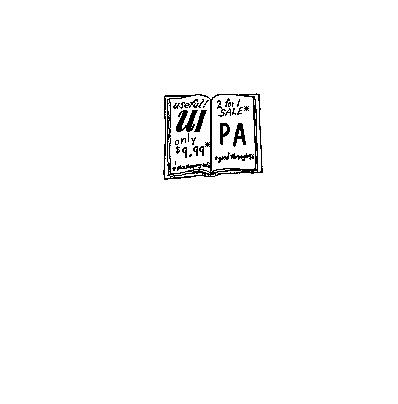

## A Catalogue Of selma'o

The following paragraphs list all the selma'o of Lojban, with a brief explanation of what each one is about, and reference to the chapter number where each is explained more fully. As usual, all selma'o names are given in capital letters (with “h” serving as the capital of “'”) and are the names of a representative cmavo, often the most important or the first in alphabetical order. One example is given of each selma'o: for selma'o which have several uses, the most common use is shown.

### selma'o A ([Section 14.6](chapter14#section-sumti-connection "14.6. sumti connection"))

Specifies a logical connection (e.g. “and”, “or”, “if”), usually between sumti.

|          |        |           |         |     |       |
| -------- | ------ | --------- | ------- | --- | ----- |
| la djan. | a      | la djein. | klama   | le  | zarci |
| John     | and/or | Jane      | goes-to | the | store |

Also used to create vowel lerfu words when followed with “bu”.

### selma'o BAI ([Section 9.6](chapter09#section-BAI "9.6. Modal tags: BAI"))

May be prefixed to a sumti to specify an additional place, not otherwise present in the place structure of the selbri, and derived from a single place of some other selbri.

|    |       |             |            |
| -- | ----- | ----------- | ---------- |
| mi | tavla | bau         | la lojban. |
| I  | speak | in-language | Lojban.    |

### selma'o BAhE ([Section 19.11](chapter19#section-bahe "19.11. Contrastive emphasis: BAhE"))

Emphasizes the next single word, or marks it as a nonce word (one invented for the occasion).

|                  |         |     |        |
| ---------------- | ------- | --- | ------ |
| la ba'e .djordj. | klama   | le  | zarci  |
| _George_         | goes-to | the | store. |

|                                     |
| ----------------------------------- |
| It is George who goes to the store. |

### selma'o BE ([Section 5.7](chapter05#section-be-sumti "5.7. Linked sumti: be-bei-be'o"))

Attaches sumti which fill the place structure of a single unit making up a tanru. Unless otherwise indicated, the sumti fill the x2, x3, and successive places in that order. [BE](chapter20#BE) is most useful in descriptions formed with [LE](chapter20#LE). See [BEI](chapter20#BEI), [BEhO](chapter20#BEhO).

|    |      |       |    |       |         |        |
| -- | ---- | ----- | -- | ----- | ------- | ------ |
| mi |      | klama | be | ta    |         | troci  |
| I  | am-a | (goer | to | that) | type-of | trier. |

|                            |
| -------------------------- |
| I try to go to that place. |

### selma'o BEI ([Section 5.7](chapter05#section-be-sumti "5.7. Linked sumti: be-bei-be'o"))

Separates multiple sumti attached by [BE](chapter20#BE) to a tanru unit.

|    |      |       |    |     |       |      |     |       |      |         |        |
| -- | ---- | ----- | -- | --- | ----- | ---- | --- | ----- | ---- | ------- | ------ |
| mi |      | klama | be | le  | zarci | bei  | le  | zdani | be'o |         | troci  |
| I  | am-a | (goer | to | the | store | from | the | home  | )    | type-of | trier. |

|                                          |
| ---------------------------------------- |
| I try to go from the home to the market. |

### selma'o BEhO ([Section 5.7](chapter05#section-be-sumti "5.7. Linked sumti: be-bei-be'o"))

Elidable terminator for [BE](chapter20#BE). Terminates sumti that are attached to a tanru unit.

|    |      |       |    |     |        |      |         |        |
| -- | ---- | ----- | -- | --- | ------ | ---- | ------- | ------ |
| mi |      | klama | be | le  | zarci  | be'o |         | troci  |
| I  | am-a | (goer | to | the | market | )    | type-of | trier. |

|                            |
| -------------------------- |
| I try to go to the market. |

### selma'o BIhE ([Section 18.5](chapter18#section-simple-infix "18.5. Simple infix expressions and equations"))

Prefixed to a mathematical operator to mark it as higher priority than other mathematical operators, binding its operands more closely.

|            |    |             |       |    |      |    |        |            |      |
| ---------- | -- | ----------- | ----- | -- | ---- | -- | ------ | ---------- | ---- |
| li         | ci | bi'e        | pi'i  | vo | su'i | mu | du     | li         | paze |
| The-number | 3  | \[priority] | times | 4  | plus | 5  | equals | the-number | 17.  |

|                |
| -------------- |
| 3 × 4 + 5 = 17 |

### selma'o BIhI ([Section 14.16](chapter14#section-non-logical-continued-continued "14.16. Interval connectives and forethought non-logical connection"))

Joins sumti or tanru units (as well as some other things) to form intervals. See [GAhO](chapter20#GAhO).

|    |            |                  |            |             |               |
| -- | ---------- | ---------------- | ---------- | ----------- | ------------- |
| mi | ca         | sanli            | la drezdn. | bi'i        | la frankfurt. |
| I  | \[present] | stand-on-surface | Dresden    | \[interval] | Frankfurt.    |

|                                              |
| -------------------------------------------- |
| I am standing between Dresden and Frankfurt. |

### selma'o BO ([Section 5.3](chapter05#section-three-part-tanru "5.3. Three-part tanru grouping with bo"), [Section 15.6](chapter15#section-sumti-negation "15.6. sumti negation"), [Section 18.17](chapter18#section-connectives-within-mekso "18.17. Logical and non-logical connectives within mekso"))

Joins tanru units, binding them together closely. Also used to bind logically or non-logically connected phrases, sentences, etc. [BO](chapter20#BO) is always high precedence and right-grouping.

|      |            |         |       |         |          |
| ---- | ---------- | ------- | ----- | ------- | -------- |
| ta   | cmalu      |         | nixli | bo      | ckule    |
| That | is-a-small | type-of | (girl | type-of | school). |

|                                   |
| --------------------------------- |
| That is a small school for girls. |

### selma'o BOI ([Section 18.6](chapter18#section-forethought "18.6. Forethought operators (Polish notation, functions)"))

Elidable terminator for [PA](chapter20#PA) or [BY](chapter20#BY). Used to terminate a number (string of numeric cmavo) or lerfu string (string of letter words) when another string immediately follows.

|            |     |        |            |                   |        |     |      |
| ---------- | --- | ------ | ---------- | ----------------- | ------ | --- | ---- |
| li         | re  | du     | li         | vu'u              | vo boi |     | re   |
| The-number | two | equals | the-number | the-difference-of | four   | and | two. |

### selma'o BU ([Section 17.4](chapter17#section-bu "17.4. The universal bu"))

A suffix which can be attached to any word, typically a word representing a letter of the alphabet or else a name, to make a word for a symbol or a different letter of the alphabet. In particular, attached to single-vowel cmavo to make words for vowel letters.

|      |      |      |      |      |      |
| ---- | ---- | ---- | ---- | ---- | ---- |
| .abu | .ebu | .ibu | .obu | .ubu | .ybu |
| a,   | e,   | i,   | o,   | u,   | y.   |

### selma'o BY ([Section 17.2](chapter17#section-lerfu-liste "17.2. A to Z in Lojban, plus one"))

Words representing the letters of the Lojban alphabet, plus various shift words which alter the interpretation of other letter words. Terminated by BOI.

|      |          |    |       |     |     |             |            |
| ---- | -------- | -- | ----- | --- | --- | ----------- | ---------- |
| .abu | tavla    | by |       | le  |     | la .ibymym. | skami      |
| A    | talks-to | B  | about | the | of- | IBM         | computers. |

|                                   |
| --------------------------------- |
| A talks to B about IBM computers. |

### selma'o CAI ([Section 13.4](chapter13#section-intensity-scale "13.4. Attitudes as scales"))

Indicates the intensity of an emotion: maximum, strong, weak, or not at all. Typically follows another particle which specifies the emotion.

|                |             |    |       |     |         |
| -------------- | ----------- | -- | ----- | --- | ------- |
| .ei            | cai         | mi | klama | le  | zarci   |
| \[Obligation!] | \[Intense!] | I  | go-to | the | market. |

|                          |
| ------------------------ |
| I must go to the market. |

### selma'o CAhA ([Section 10.19](chapter10#section-caha "10.19. Actuality, potentiality, capability: CAhA"))

Specifies whether a bridi refers to an actual fact, a potential (achieved or not), or merely an innate capability.

|     |       |               |                     |
| --- | ----- | ------------- | ------------------- |
| ro  | datka | ka'e          | flulimna            |
| All | ducks | \[capability] | are-float-swimmers. |

|                                                        |
| ------------------------------------------------------ |
| All ducks have the capability of swimming by floating. |

### selma'o CEI ([Section 7.5](chapter07#section-koha-broda-series "7.5. Assignable pro-sumti and pro-bridi: the ko'a-series and the broda-series"))

Assigns a selbri definition to one of the five pro-bridi gismu: “broda”, “brode”, “brodi”, “brodo”, or “brodu”, for later use.

|                                                  |
| ------------------------------------------------ |
| ti slasi je mlatu bo cidja lante gacri cei broda |

|                                                  |
| ------------------------------------------------ |
| This is a plastic cat-food can cover, or thingy. |

|                                                       |
| ----------------------------------------------------- |
| .i le crino broda cu barda .i le xunre broda cu cmalu |

|                                                     |
| --------------------------------------------------- |
| The green thingy is large. The red thingy is small. |

### selma'o CEhE ([Section 14.11](chapter14#section-termsets "14.11. Termset logical connection"), [Section 16.7](chapter16#section-quantifier-grouping "16.7. Grouping of quantifiers"))

Joins multiple terms into a termset. Termsets are used to associate several terms for logical connectives, for equal quantifier scope, or for special constructs in tenses.

|    |      |     |          |     |          |      |             |    |                 |
| -- | ---- | --- | -------- | --- | -------- | ---- | ----------- | -- | --------------- |
| mi | ce'e | do  | pe'e     | je  | la djan. | ce'e | la djeimyz. | cu | pendo           |
| I  | \[,] | you | \[joint] | and | John     | \[,] | James       |    | are-friends-of. |

|                                                      |
| ---------------------------------------------------- |
| I am a friend of you, and John is a friend of James. |

### selma'o CO ([Section 5.8](chapter05#section-co-inversion "5.8. Inversion of tanru: co"))

When inserted between the components of a tanru, inverts it, so that the following tanru unit modifies the previous one.

|    |            |         |          |     |        |      |     |         |
| -- | ---------- | ------- | -------- | --- | ------ | ---- | --- | ------- |
| mi | troci      | co      | klama    | le  | zarci  |      | le  | zdani   |
| I  | am-a-trier | of-type | (goer-to | the | market | from | the | house). |

|                                           |
| ----------------------------------------- |
| I try to go to the market from the house. |

### selma'o COI ([Section 6.11](chapter06#section-vocative-syntax "6.11. The syntax of vocative phrases"), [Section 13.14](chapter13#section-vocative-scales "13.14. Vocative scales"))

When prefixed to a name, description, or sumti, produces a vocative: a phrase which indicates who is being spoken to (or who is speaking). Vocatives are used in conversational protocols, including greeting, farewell, and radio communication. Terminated by [DOhU](chapter20#DOhU). See [DOI](chapter20#DOI).

|            |        |
| ---------- | ------ |
| coi        | .djan. |
| Greetings, | John.  |

### selma'o CU ([Section 9.2](chapter09#section-cu "9.2. Standard bridi form: cu"))

Separates the selbri of a bridi from any sumti which precede it. Never strictly necessary, but often useful to eliminate various elidable terminators.

|     |       |    |         |     |        |
| --- | ----- | -- | ------- | --- | ------ |
| le  | gerku | cu | klama   | le  | zarci  |
| The | dog   |    | goes-to | the | store. |

### selma'o CUhE ([Section 10.24](chapter10#section-tense-questions "10.24. Tense questions: cu'e"))

Forms a question which asks when, where, or in what mode the rest of the bridi is true. See [PU](chapter20#PU), [CAhA](chapter20#CAhA), [TAhE](chapter20#TAhE), and [BAI](chapter20#BAI).

|     |                |       |     |        |
| --- | -------------- | ----- | --- | ------ |
| do  | cu'e           | klama | le  | zarci  |
| You | \[When/Where?] | go-to | the | store? |

|                                  |
| -------------------------------- |
| When are you going to the store? |

### selma'o DAhO ([Section 7.13](chapter07#section-daho "7.13. Pro-sumti and pro-bridi cancelling"))

Cancels the assigned significance of all sumti cmavo (of selma'o [KOhA](chapter20#KOhA)) and bridi cmavo (of selma'o [GOhA](chapter20#GOhA)).

### selma'o DOI ([Section 13.14](chapter13#section-vocative-scales "13.14. Vocative scales"))

The non-specific vocative indicator. May be used with or without [COI](chapter20#COI). No pause is required between “doi” and a following name. See [DOhU](chapter20#DOhU).

|     |        |    |          |      |
| --- | ------ | -- | -------- | ---- |
| doi | frank. | mi | tavla    | do   |
| O   | Frank, | I  | speak-to | you. |

|                            |
| -------------------------- |
| Frank, I'm talking to you. |

### selma'o DOhU ([Section 13.14](chapter13#section-vocative-scales "13.14. Vocative scales"))

Elidable terminator for [COI](chapter20#COI) or [DOI](chapter20#DOI). Signals the end of a vocative.

|           |               |
| --------- | ------------- |
| coi       | do'u          |
| Greetings | \[terminator] |

|                               |
| ----------------------------- |
| Greetings, O unspecified one! |

### selma'o FA ([Section 9.3](chapter09#section-FA "9.3. Tagging places: FA"))

Prefix for a sumti, indicating which numbered place in the place structure the sumti belongs in; overrides word order.

|     |    |    |       |     |               |
| --- | -- | -- | ----- | --- | ------------- |
| fa  | mi | cu | klama | fi  | la .atlantas. |
| x1= | I  |    | go    | x3= | Atlanta       |

|     |           |     |     |       |     |     |       |
| --- | --------- | --- | --- | ----- | --- | --- | ----- |
| fe  | la bastn. | fo  | le  | dargu | fu  | le  | karce |
| x2= | Boston    | x4= | the | road  | x5= | the | car.  |

|                                                         |
| ------------------------------------------------------- |
| I go from Atlanta to Boston via the road using the car. |

### selma'o FAhA ([Section 10.2](chapter10#section-spatial-tenses "10.2. Spatial tenses: FAhA and VA"))

Specifies the direction in which, or toward which (when marked with [MOhI](chapter20#MOhI)) or along which (when prefixed by [VEhA](chapter20#VEhA) or [VIhA](chapter20#VIhA)) the action of the bridi takes place.

|     |       |         |       |     |       |
| --- | ----- | ------- | ----- | --- | ----- |
| le  | nanmu | zu'a    | batci | le  | gerku |
| The | man   | \[left] | bites | the | dog.  |

|                                    |
| ---------------------------------- |
| To my left, the man bites the dog. |

### selma'o FAhO ([Section 19.15](chapter19#section-faho "19.15. No more to say: FAhO"))

A mechanical signal, outside the grammar, indicating that there is no more text. Useful in talking to computers.

### selma'o FEhE ([Section 10.11](chapter10#section-fehe "10.11. Space interval modifiers: FEhE"))

Indicates that the following interval modifier (using [TAhE](chapter20#TAhE), [ROI](chapter20#ROI), or [ZAhO](chapter20#ZAhO)) refers to space rather than time.

|                |                  |          |              |       |     |        |
| -------------- | ---------------- | -------- | ------------ | ----- | --- | ------ |
| ko             | vi'i             | fe'e     | di'i         | sombo | le  | gurni  |
| You-imperative | \[1-dimensional] | \[space] | \[regularly] | sow   | the | grain. |

|                                     |
| ----------------------------------- |
| Sow the grain in a line and evenly! |

### selma'o FEhU ([Section 9.5](chapter09#section-selbri-modals "9.5. Modal places: FIhO, FEhU"))

Elidable terminator for [FIhO](chapter20#FIhO). Indicates the end of an ad hoc modal tag: the tagged sumti immediately follows.

|    |       |     |          |       |         |     |            |
| -- | ----- | --- | -------- | ----- | ------- | --- | ---------- |
| mi | viska | do  | fi'o     | kanla | \[fe'u] | le  | zunle      |
| I  | see   | you | \[modal] | eye   | :       | the | left-thing |

|                              |
| ---------------------------- |
| I see you with the left eye. |

### selma'o FIhO ([Section 9.5](chapter09#section-selbri-modals "9.5. Modal places: FIhO, FEhU"))

When placed before a selbri, transforms the selbri into a modal tag, grammatically and semantically equivalent to a member of selma'o [BAI](chapter20#BAI). Terminated by [FEhU](chapter20#FEhU).

|    |       |     |      |       |     |            |
| -- | ----- | --- | ---- | ----- | --- | ---------- |
| mi | viska | do  | fi'o | kanla | le  | zunle      |
| I  | see   | you | with | eye   | the | left-thing |

|                             |
| --------------------------- |
| I see you with my left eye. |

### selma'o FOI ([Section 17.6](chapter17#section-accents "17.6. Accent marks and compound lerfu words"))

Signals the end of a compound alphabet letter word that begins with [TEI](chapter20#TEI). Not an elidable terminator.

|     |      |           |     |
| --- | ---- | --------- | --- |
| tei | .ebu | .akut. bu | foi |
| (   | “e”  | “acute”   | )   |

|                                     |
| ----------------------------------- |
| the letter “e” with an acute accent |

### selma'o FUhA ([Section 18.16](chapter18#section-reverse-polish-notation "18.16. Reverse Polish notation"))

Indicates that the following mathematical expression is to be interpreted as reverse Polish (RP), a mode in which mathematical operators follow their operands.

|            |        |       |          |      |        |            |      |
| ---------- | ------ | ----- | -------- | ---- | ------ | ---------- | ---- |
| li         | fu'a   | reboi | re\[boi] | su'i | du     | li         | vo   |
| the-number | \[RP!] | two,  | two,     | plus | equals | the-number | four |

|           |
| --------- |
| 2 + 2 = 4 |

### selma'o FUhE ([Section 19.8](chapter19#section-attitudinal-scope "19.8. Attitude scope markers: FUhE/FUhO"))

Indicates that the following indicator(s) of selma'o [UI](chapter20#UI) affect not the preceding word, as usual, but rather all following words until a [FUhO](chapter20#FUhO).

|    |       |     |          |           |       |       |        |           |
| -- | ----- | --- | -------- | --------- | ----- | ----- | ------ | --------- |
| mi | viska | le  | fu'e     | .ia       | blanu | zdani | fu'o   | ponse     |
| I  | see   | the | \[start] | \[belief] | blue  | house | \[end] | possessor |

|                                                               |
| ------------------------------------------------------------- |
| I see the owner of a blue house, or what I believe to be one. |

### selma'o FUhO ([Section 19.8](chapter19#section-attitudinal-scope "19.8. Attitude scope markers: FUhE/FUhO"))

Cancels all indicators of selma'o [UI](chapter20#UI) which are in effect.

|    |       |     |          |           |       |       |        |            |
| -- | ----- | --- | -------- | --------- | ----- | ----- | ------ | ---------- |
| mi | viska | le  | fu'e     | .ia       | blanu | zdani | fu'o   | ponse      |
| I  | see   | the | \[start] | \[belief] | blue  | house | \[end] | possessor. |

|                                                       |
| ----------------------------------------------------- |
| I see the owner of what I believe to be a blue house. |

### selma'o GA ([Section 14.5](chapter14#section-forethought-bridi-connection "14.5. Forethought bridi connection"))

Indicates the beginning of two logically connected sumti, bridi-tails, or various other things. Logical connections include “both ... and”, “either ... or”, “if ... then”, and so on. See [GI](chapter20#GI).

|                                        |
| -------------------------------------- |
| ga la djan. nanmu gi la djeimyz. ninmu |

|                                                     |
| --------------------------------------------------- |
| Either John is a man or James is a woman (or both). |

### selma'o GAhO ([Section 14.16](chapter14#section-non-logical-continued-continued "14.16. Interval connectives and forethought non-logical connection"))

Specifies whether an interval specified by [BIhI](chapter20#BIhI) includes or excludes its endpoints. Used in pairs before and after the [BIhI](chapter20#BIhI) cmavo, to specify the nature of both the left- and the right-hand endpoints.

|    |            |       |            |
| -- | ---------- | ----- | ---------- |
| mi | ca         | sanli | la drezdn. |
| I  | \[present] | stand | Dresden    |

|              |             |              |               |
| ------------ | ----------- | ------------ | ------------- |
| ga'o         | bi'i        | ga'o         | la frankfurt. |
| \[inclusive] | \[interval] | \[inclusive] | Frankfurt.    |

|                                                                 |
| --------------------------------------------------------------- |
| I am standing between Dresden and Frankfurt, inclusive of both. |

### selma'o GEhU ([Section 8.3](chapter08#section-relative-phrases "8.3. Relative phrases"))

Elidable terminator for [GOI](chapter20#GOI). Marks the end of a relative phrase. See [KUhO](chapter20#KUhO).

|          |                 |      |      |          |
| -------- | --------------- | ---- | ---- | -------- |
| la djan. | goi             | ko'a | ge'u | blanu    |
| John     | (referred to as | it-1 | )    | is-blue. |

### selma'o GI ([Section 14.5](chapter14#section-forethought-bridi-connection "14.5. Forethought bridi connection"))

Separates two logically or non-logically connected sumti, tanru units, bridi-tails, or other things, when the prefix is a forethought connective involving [GA](chapter20#GA), [GUhA](chapter20#GUhA), or [JOI](chapter20#JOI).

|                                        |
| -------------------------------------- |
| ge la djan. nanmu gi la djeimyz. ninmu |

|                                                            |
| ---------------------------------------------------------- |
| (It is true that) both John is a man and James is a woman. |

### selma'o GIhA ([Section 14.3](chapter14#section-six-types "14.3. The six types of logical connectives"))

Specifies a logical connective (e.g. “and”, “or”, “if”) between two bridi-tails: a bridi-tail is a selbri with any associated following sumti, but not including any preceding sumti.

|    |       |     |        |      |       |          |
| -- | ----- | --- | ------ | ---- | ----- | -------- |
| mi | klama | le  | zarci  | gi'e | nelci | la djan. |
| I  | go-to | the | market | and  | like  | John.    |

### selma'o GOI ([Section 8.3](chapter08#section-relative-phrases "8.3. Relative phrases"))

Specifies the beginning of a relative phrase, which associates a subordinate sumti (following) to another sumti (preceding). Terminated by [GEhU](chapter20#GEhU) See [NOI](chapter20#NOI).

|          |                 |       |    |          |
| -------- | --------------- | ----- | -- | -------- |
| la djan. | goi             | ko'a  | cu | blanu    |
| John     | (referred to as | it-1) |    | is-blue. |

### selma'o GOhA ([Section 7.6](chapter07#section-ri-gohi-series "7.6. Anaphoric pro-sumti and pro-bridi: the ri-series and the go'i-series"))

A general selma'o for all cmavo which can take the place of brivla. There are several groups of these.

|                      |
| -------------------- |
| A: mi klama le zarci |
| B: mi go'i           |

|                             |
| --------------------------- |
| A: I'm going to the market. |
| B: Me, too.                 |

### selma'o GUhA ([Section 14.3](chapter14#section-six-types "14.3. The six types of logical connectives"))

Indicates the beginning of two logically connected tanru units. Takes the place of [GA](chapter20#GA) when forming logically-connected tanru. See [GI](chapter20#GI).

|           |         |       |     |       |
| --------- | ------- | ----- | --- | ----- |
| la .alis. | gu'e    | ricfu | gi  | blanu |
| Alice     | is both | rich  | and | blue. |

### selma'o I ([Section 19.2](chapter19#section-i "19.2. Sentences: I"))

Separates two sentences from each other.

|    |       |     |        |    |    |       |     |        |
| -- | ----- | --- | ------ | -- | -- | ----- | --- | ------ |
| mi | klama | le  | zarci  | .i | mi | klama | le  | zdani  |
| I  | go-to | the | market | .  | I  | go-to | the | house. |

### selma'o JA ([Section 14.3](chapter14#section-six-types "14.3. The six types of logical connectives"))

Specifies a logical connection (e.g. “and”, “or”, “if”) between two tanru units, mathematical operands, tenses, or abstractions.

|      |         |     |          |
| ---- | ------- | --- | -------- |
| ti   | blanu   | je  | zdani    |
| This | is-blue | and | a-house. |

### selma'o JAI ([Section 9.12](chapter09#section-modal-jai "9.12. Modal conversion: JAI"))

When followed by a tense or modal, creates a conversion operator attachable to a selbri which exchanges the modal place with the x1 place of the selbri. When alone, is a conversion operator exchanging the x1 place of the selbri (which should be an abstract sumti) with one of the places of the abstracted-over bridi.

|    |                 |           |     |       |          |
| -- | --------------- | --------- | --- | ----- | -------- |
| mi | jai gau         | galfi     | le  | bitmu | se skari |
| I  | am-the-actor-in | modifying | the | wall  | color.   |

|                                       |
| ------------------------------------- |
| I act so as to modify the wall color. |
| I change the color of the wall.       |

### selma'o JOI ([Section 14.14](chapter14#section-non-logical-connectives "14.14. Non-logical connectives"))

Specifies a non-logical connection (e.g. together-with-as-mass, -set, or -sequence) between two sumti, tanru units, or various other things. When immediately followed by [GI](chapter20#GI), provides forethought non-logical connection analogous to [GA](chapter20#GA).

|          |             |           |    |       |     |        |
| -------- | ----------- | --------- | -- | ----- | --- | ------ |
| la djan. | joi         | la .alis. | cu | bevri | le  | pipno  |
| John     | massed-with | Alice     |    | carry | the | piano. |

### selma'o JOhI ([Section 18.15](chapter18#section-vectors-matrices "18.15. Vectors and matrices"))

Indicates that the following mathematical operands (a list terminated by [TEhU](chapter20#TEhU)) form a mathematical vector (one-dimensional array).

|            |        |       |       |      |      |        |        |       |        |
| ---------- | ------ | ----- | ----- | ---- | ---- | ------ | ------ | ----- | ------ |
| li         | jo'i   | paboi | reboi | te'u | su'i | jo'i   | ciboi  | voboi | du     |
| The-number | array( | one,  | two   | )    | plus | array( | three, | four) | equals |

|            |        |       |       |
| ---------- | ------ | ----- | ----- |
| li         | jo'i   | voboi | xaboi |
| the-number | array( | four, | six). |

|                       |
| --------------------- |
| (1,2) + (3,4) = (4,6) |

### selma'o KE ([Section 5.5](chapter05#section-ke-grouping "5.5. Complex tanru with ke and ke'e"))

Groups everything between itself and a following [KEhE](chapter20#KEhE) for purposes of logical connection, tanru construction, or other purposes. [KE](chapter20#KE) and [KEhE](chapter20#KEhE) are not used for mathematical (see [VEI](chapter20#VEI) and [VEhO](chapter20#VEhO)) or discursive (see [TO](chapter20#TO) and [TOI](chapter20#TOI)) purposes.

|      |        |        |        |      |       |         |
| ---- | ------ | ------ | ------ | ---- | ----- | ------- |
| ta   | ke     | melbi  | cmalu  | ke'e | nixli | ckule   |
| That | is-a-( | pretty | little | )    | girl  | school. |

|                                                                |
| -------------------------------------------------------------- |
| That is a school for girls who are pretty in their littleness. |

### selma'o KEI ([Section 11.1](chapter11#section-syntax "11.1. The syntax of abstraction"))

Elidable terminator for [NU](chapter20#NU). Marks the end of an abstraction bridi.

|          |    |                 |                 |     |         |          |
| -------- | -- | --------------- | --------------- | --- | ------- | -------- |
| la djan. | cu | nu              | sonci           | kei |         | djica    |
| John     |    | is-an-(event-of | being-a-soldier | )   | type-of | desirer. |

|                             |
| --------------------------- |
| John wants to be a soldier. |

### selma'o KEhE ([Section 5.5](chapter05#section-ke-grouping "5.5. Complex tanru with ke and ke'e"))

Elidable terminator for [KE](chapter20#KE). Marks the end of a grouping.

|      |        |        |        |      |       |         |
| ---- | ------ | ------ | ------ | ---- | ----- | ------- |
| ta   | ke     | melbi  | cmalu  | ke'e | nixli | ckule   |
| That | is-a-( | pretty | little | )    | girl  | school. |

|                                                                |
| -------------------------------------------------------------- |
| That is a school for girls who are pretty in their littleness. |

### selma'o KI ([Section 10.13](chapter10#section-sticky-tenses "10.13. Sticky and multiple tenses: KI"))

When preceded by a tense or modal, makes it “sticky”, so that it applies to all further bridi until reset by another appearance of [KI](chapter20#KI). When alone, eliminates all sticky tenses.

### selma'o KOhA ([Section 7.1](chapter07#section-anaphoric-cmavo-introduction "7.1. What are pro-sumti and pro-bridi? What are they for?"))

A general selma'o which contains all cmavo which can substitute for sumti. These cmavo are divided into several groups.

|     |       |       |                 |       |    |         |
| --- | ----- | ----- | --------------- | ----- | -- | ------- |
| le  | blanu | zdani | goi             | ko'a  | cu | barda   |
| The | blue  | house | (referred to as | it-1) |    | is-big. |

|    |      |        |              |             |
| -- | ---- | ------ | ------------ | ----------- |
| .i | ko'a | na     | cmamau       | ti          |
|    | It-1 | is-not | smaller-than | this-thing. |

### selma'o KU ([Section 6.2](chapter06#section-basic-descriptors "6.2. The three basic description types"), [Section 10.1](chapter10#section-tenses-introduction "10.1. Introductory"))

Elidable terminator for [LE](chapter20#LE) and some uses of [LA](chapter20#LA). Indicates the end of a description sumti. Also used after a tense or modal to indicate that no sumti follows, and in the compound [NA](chapter20#NA)+ [KU](chapter20#KU) to indicate natural language-style negation.

|     |        |    |    |     |       |    |       |
| --- | ------ | -- | -- | --- | ----- | -- | ----- |
| le  | prenu  | ku |    | le  | zdani | ku | klama |
| The | person | ,  | to | the | house | ,  | goes. |

|                               |
| ----------------------------- |
| The person goes to the house. |

### selma'o KUhE ([Section 18.6](chapter18#section-forethought "18.6. Forethought operators (Polish notation, functions)"))

Elidable terminator for [PEhO](chapter20#PEhO): indicates the end of a forethought mathematical expression (one in which the operator precedes the operands).

|            |                |            |       |       |          |        |
| ---------- | -------------- | ---------- | ----- | ----- | -------- | ------ |
| li         | pe'o           | su'i       | reboi | reboi | re\[boi] | ku'e   |
| The-number | \[forethought] | the-sum-of | two   | two   | two      | \[end] |

|        |            |      |
| ------ | ---------- | ---- |
| du     | li         | xa   |
| equals | the-number | six. |

### selma'o KUhO ([Section 8.1](chapter08#section-poi "8.1. What are you pointing at?"))

Elidable terminator for [NOI](chapter20#NOI). Indicates the end of a relative clause.

|     |       |       |         |      |         |
| --- | ----- | ----- | ------- | ---- | ------- |
| le  | zdani | poi   | blanu   | ku'o | barda   |
| The | house | that( | is-blue | )    | is-big. |

### selma'o LA ([Section 6.2](chapter06#section-basic-descriptors "6.2. The three basic description types"))

Descriptors which change name words (or selbri) into sumti which identify people or things by name. Similar to [LE](chapter20#LE). May be terminated with [KU](chapter20#KU) if followed by a description selbri.

|             |    |           |
| ----------- | -- | --------- |
| la kikeros. | du | la tulis. |
| Cicero      | is | Tully.    |

### selma'o LAU ([Section 17.14](chapter17#section-lerfu-cmavo-summary "17.14. List of all auxiliary lerfu-word cmavo"))

Combines with the following alphabetic letter to represent a single marker: change from lower to upper case, change of font, punctuation, etc.)

|                 |     |      |
| --------------- | --- | ---- |
| tau             | sy  | .ibu |
| \[single-shift] | “s” | “i”  |

|                                  |
| -------------------------------- |
| Si (chemical symbol for silicon) |

### selma'o LAhE ([Section 6.10](chapter06#section-sumti-qualifiers "6.10. sumti qualifiers"))

Qualifiers which, when prefixed to a sumti, change it into another sumti with related meaning. Qualifiers can also consist of a cmavo from selma'o [NAhE](chapter20#NAhE) plus [BO](chapter20#BO). Terminated by [LUhU](chapter20#LUhU).

|    |       |                     |          |        |                      |       |
| -- | ----- | ------------------- | -------- | ------ | -------------------- | ----- |
| mi | viska | la'e                | zoi      | .kuot. | A Tale of Two Cities | .kuot |
| I  | see   | that-represented-by | the-text | “      | A Tale of Two Cities | ”.    |

|                                        |
| -------------------------------------- |
| I see the book “A Tale of Two Cities”. |

### selma'o LE ([Section 6.2](chapter06#section-basic-descriptors "6.2. The three basic description types"))

Descriptors which make selbri into sumti which describe or specify things that fit into the x1 place of the selbri. Terminated by [KU](chapter20#KU). See [LA](chapter20#LA).

|     |       |    |         |     |        |
| --- | ----- | -- | ------- | --- | ------ |
| le  | gerku | cu | klama   | le  | zdani  |
| The | dog   |    | goes-to | the | house. |

### selma'o LEhU ([Section 19.9](chapter19#section-quotations "19.9. Quotations: LU, LIhU, LOhU, LEhU"))

Indicates the end of a quotation begun with [LOhU](chapter20#LOhU). Not an elidable terminator.

|          |                |            |    |        |              |          |
| -------- | -------------- | ---------- | -- | ------ | ------------ | -------- |
| lo'u     | mi du do du mi | le'u       | cu | na     | lojbo        | drani    |
| \[quote] | mi du do du mi | \[unquote] |    | is-not | Lojbanically | correct. |

|                                         |
| --------------------------------------- |
| “mi du do du mi” is not correct Lojban. |

### selma'o LI ([Section 18.5](chapter18#section-simple-infix "18.5. Simple infix expressions and equations"))

Descriptors which change numbers or other mathematical expressions into sumti which specify numbers or numerical expressions. Terminated by [LOhO](chapter20#LOhO).

|            |    |       |    |     |        |            |    |      |    |
| ---------- | -- | ----- | -- | --- | ------ | ---------- | -- | ---- | -- |
| li         | re | vu'u  | re | na  | du     | li         | vo | su'i | vo |
| The-number | 2  | minus | 2  | not | equals | the-number | 4  | plus | 4. |

|               |
| ------------- |
| 2 - 2 ≠ 4 + 4 |

### selma'o LIhU ([Section 19.9](chapter19#section-quotations "19.9. Quotations: LU, LIhU, LOhU, LEhU"))

Elidable terminator for [LU](chapter20#LU). Indicates the end of a text quotation.

|    |         |          |    |       |     |        |               |
| -- | ------- | -------- | -- | ----- | --- | ------ | ------------- |
| mi | cusku   | lu       | mi | klama | le  | zarci  | li'u          |
| I  | express | \[quote] | I  | go-to | the | market | \[end-quote]. |

### selma'o LOhO ([Section 18.17](chapter18#section-connectives-within-mekso "18.17. Logical and non-logical connectives within mekso"))

Elidable terminator for [LI](chapter20#LI). Indicates the end of a mathematical expression used in a [LI](chapter20#LI) description.

|            |    |                |            |    |                |    |             |
| ---------- | -- | -------------- | ---------- | -- | -------------- | -- | ----------- |
| li         | vo | lo'o           | li         | ci | lo'o           | cu | zmadu       |
| The-number | 4  | \[end-number], | the-number | 3  | \[end-number], |    | is-greater. |

|       |
| ----- |
| 4 > 3 |

### selma'o LOhU ([Section 19.9](chapter19#section-quotations "19.9. Quotations: LU, LIhU, LOhU, LEhU"))

Indicates the beginning of a quotation (a sumti) which is grammatical as long as the quoted material consists of Lojban words, whether they form a text or not. Terminated by [LEhU](chapter20#LEhU).

|     |         |          |                  |               |
| --- | ------- | -------- | ---------------- | ------------- |
| do  | cusku   | lo'u     | mi du do du ko'a | le'u          |
| You | express | \[quote] | mi du do du ko'a | \[end-quote]. |

|                               |
| ----------------------------- |
| You said, “mi du do du ko'a”. |

### selma'o LU ([Section 19.9](chapter19#section-quotations "19.9. Quotations: LU, LIhU, LOhU, LEhU"))

Indicates the beginning of a quotation (a sumti) which is grammatical only if the quoted material also forms a grammatical Lojban text. Terminated by [LIhU](chapter20#LIhU).

|    |         |          |    |       |     |        |               |
| -- | ------- | -------- | -- | ----- | --- | ------ | ------------- |
| mi | cusku   | lu       | mi | klama | le  | zarci  | li'u          |
| I  | express | \[quote] | I  | go-to | the | market | \[end-quote]. |

### selma'o LUhU ([Section 6.10](chapter06#section-sumti-qualifiers "6.10. sumti qualifiers"))

Elidable terminator for [LAhE](chapter20#LAhE) and [NAhE](chapter20#NAhE)+ [BO](chapter20#BO). Indicates the end of a qualified sumti.

|    |       |                 |          |       |       |              |            |
| -- | ----- | --------------- | -------- | ----- | ----- | ------------ | ---------- |
| mi | viska | la'e            | lu       | barda | gerku | li'u         | lu'u       |
| I  | see   | the-referent-of | \[quote] | big   | dog   | \[end-quote] | \[end-ref] |

|                                                        |
| ------------------------------------------------------ |
| I saw “Big Dog” \[not the words, but a book or movie]. |

### selma'o MAI ([Section 18.19](chapter18#section-other-mekso-uses "18.19. Other uses of mekso"), [Section 19.1](chapter19#section-structure-introduction "19.1. Introductory"))

When suffixed to a number or string of letter words, produces a free modifier which serves as an index number within a text.

|         |    |         |       |     |         |
| ------- | -- | ------- | ----- | --- | ------- |
| pamai   | mi | pu      | klama | le  | zarci   |
| 1-thly, | I  | \[past] | go-to | the | market. |

|                              |
| ---------------------------- |
| First, I went to the market. |

### selma'o MAhO ([Section 18.6](chapter18#section-forethought "18.6. Forethought operators (Polish notation, functions)"))

Produces a mathematical operator from a letter or other operand. Terminated by [TEhU](chapter20#TEhU). See [VUhU](chapter20#VUhU).

|             |     |     |     |
| ----------- | --- | --- | --- |
| ma'o        | fy. | boi | xy. |
| \[operator] | f   |     | x   |

|        |
| ------ |
| _f(x)_ |

### selma'o ME ([Section 5.10](chapter05#section-me-selbri "5.10. selbri based on sumti: me"), [Section 18.1](chapter18#section-mekso-introduction "18.1. Introductory"))

Produces a tanru unit from a sumti, which is applicable to the things referenced by the sumti. Terminated by [MEhU](chapter20#MEhU).

|      |                |       |
| ---- | -------------- | ----- |
| ta   | me la ford.    | karce |
| That | is-a-Ford-type | car   |

|                    |
| ------------------ |
| That's a Ford car. |

### selma'o MEhU ([Section 5.11](chapter05#section-place-conversion "5.11. Conversion of simple selbri"))

The elidable terminator for [ME](chapter20#ME). Indicates the end of a sumti converted to a tanru unit.

|                     |
| ------------------- |
| ta me mi me'u zdani |

|                            |
| -------------------------- |
| That's a me type of house. |

### selma'o MOI ([Section 5.11](chapter05#section-place-conversion "5.11. Conversion of simple selbri"), [Section 18.18](chapter18#section-lojban-within-mekso "18.18. Using Lojban resources within mekso"))

Suffixes added to numbers or other quantifiers to make various numerically-based selbri.

|          |                |           |    |               |         |          |
| -------- | -------------- | --------- | -- | ------------- | ------- | -------- |
| la djan. | joi            | la frank. | cu | bruna         |         | remei    |
| John     | in-a-mass-with | Frank     |    | are-a-brother | type-of | twosome. |

|                                  |
| -------------------------------- |
| John and Frank are two brothers. |

### selma'o MOhE ([Section 18.18](chapter18#section-lojban-within-mekso "18.18. Using Lojban resources within mekso"))

Produces a mathematical operand from a sumti; used to make dimensioned units. Terminated by [TEhU](chapter20#TEhU).

|            |            |     |       |      |            |     |         |
| ---------- | ---------- | --- | ----- | ---- | ---------- | --- | ------- |
| li         | mo'e       | re  | ratcu | su'i | mo'e       | re  | ractu   |
| The-number | \[operand] | two | rats  | plus | \[operand] | two | rabbits |

|    |        |            |            |      |          |
| -- | ------ | ---------- | ---------- | ---- | -------- |
| cu | du     | li         | mo'e       | vo   | danlu    |
|    | equals | the-number | \[operand] | four | animals. |

|                                 |
| ------------------------------- |
| 2 rats + 2 rabbits = 4 animals. |

### selma'o MOhI ([Section 10.8](chapter10#section-movement "10.8. Movement in space: MOhI"))

A tense flag indicating movement in space, in a direction specified by a following [FAhA](chapter20#FAhA) cmavo.

|     |       |             |          |          |     |       |
| --- | ----- | ----------- | -------- | -------- | --- | ----- |
| le  | verba | mo'i        | ri'u     | cadzu    | le  | bisli |
| The | child | \[movement] | \[right] | walks-on | the | ice.  |

|                                             |
| ------------------------------------------- |
| The child walks toward my right on the ice. |

### selma'o NA ([Section 14.3](chapter14#section-six-types "14.3. The six types of logical connectives"), [Section 15.7](chapter15#section-other-negation "15.7. Negation of minor grammatical constructs"))

Contradictory negators, asserting that a whole bridi is false (or true).

|                      |
| -------------------- |
| mi na klama le zarci |

|                                         |
| --------------------------------------- |
| It is not true that I go to the market. |

Also used to construct logical connective compound cmavo.

### selma'o NAI ([Section 14.3](chapter14#section-six-types "14.3. The six types of logical connectives"), [Section 15.7](chapter15#section-other-negation "15.7. Negation of minor grammatical constructs"))

Negates the previous word, but can only be used with certain selma'o as specified by the grammar.

### selma'o NAhE ([Section 15.4](chapter15#section-nahe "15.4. selbri and tanru negation"))

Scalar negators, modifying a selbri or a sumti to a value other than the one stated, the opposite of the one stated, etc. Also used with following [BO](chapter20#BO) to construct a sumti qualifier; see [LAhE](chapter20#LAhE).

|      |           |       |        |
| ---- | --------- | ----- | ------ |
| ta   | na'e      | blanu | zdani  |
| That | is-a-non- | blue  | house. |

|                                           |
| ----------------------------------------- |
| That is a house which is other than blue. |

### selma'o NAhU ([Section 18.18](chapter18#section-lojban-within-mekso "18.18. Using Lojban resources within mekso"))

Creates a mathematical operator from a selbri. Terminated by [TEhU](chapter20#TEhU). See [VUhU](chapter20#VUhU).

|            |               |         |      |
| ---------- | ------------- | ------- | ---- |
| li         | na'u          | tanjo   | te'u |
| The-number | the-operator( | tangent | )    |

|     |     |      |    |         |    |            |           |
| --- | --- | ---- | -- | ------- | -- | ---------- | --------- |
| vei | pai | fe'i | re | \[ve'o] | du | li         | ci'i      |
| (   | π   | /    | 2  | )       | =  | the-number | infinity. |

|              |
| ------------ |
| tan(π/2) = ∞ |

### selma'o NIhE ([Section 18.18](chapter18#section-lojban-within-mekso "18.18. Using Lojban resources within mekso"))

Creates a mathematical operand from a selbri, usually a “ni” abstraction. Terminated by [TEhU](chapter20#TEhU).

|            |      |             |        |         |       |
| ---------- | ---- | ----------- | ------ | ------- | ----- |
| li         | ni'e | ni          | clani  | \[te'u] | pi'i  |
| The-number |      | quantity-of | length |         | times |

|      |             |       |         |       |
| ---- | ----------- | ----- | ------- | ----- |
| ni'e | ni          | ganra | \[te'u] | pi'i  |
|      | quantity-of | width |         | times |

|      |             |       |      |        |            |      |             |         |
| ---- | ----------- | ----- | ---- | ------ | ---------- | ---- | ----------- | ------- |
| ni'e | ni          | condi | te'u | du     | li         | ni'e | ni          | canlu   |
|      | quantity-of | depth |      | equals | the-number |      | quantity-of | volume. |

|                                 |
| ------------------------------- |
| Length × Width × Depth = Volume |

### selma'o NIhO ([Section 19.3](chapter19#section-niho "19.3. Paragraphs: NIhO"))

Marks the beginning of a new paragraph, and indicates whether it contains old or new subject matter.

### selma'o NOI ([Section 8.1](chapter08#section-poi "8.1. What are you pointing at?"))

Introduces relative clauses. The following bridi modifies the preceding sumti. Terminated by [KUhO](chapter20#KUhO). See [GOI](chapter20#GOI).

|     |       |       |         |    |           |
| --- | ----- | ----- | ------- | -- | --------- |
| le  | zdani | poi   | blanu   | cu | cmalu     |
| The | house | which | is-blue |    | is-small. |

### selma'o NU ([Section 11.1](chapter11#section-syntax "11.1. The syntax of abstraction"))

Abstractors which, when prefixed to a bridi, create abstraction selbri. Terminated by [KEI](chapter20#KEI).

|          |    |         |     |          |                  |        |
| -------- | -- | ------- | --- | -------- | ---------------- | ------ |
| la djan. | cu | djica   | le  | nu       | sonci            | \[kei] |
| John     |    | desires | the | event-of | being-a-soldier. |        |

### selma'o NUhA ([Section 18.19](chapter18#section-other-mekso-uses "18.19. Other uses of mekso"))

Creates a selbri from a mathematical operator. See [VUhU](chapter20#VUhU).

|            |        |    |                    |            |        |
| ---------- | ------ | -- | ------------------ | ---------- | ------ |
| li         | ni'umu | cu | nu'a va'a          | li         | ma'umu |
| The-number | -5     |    | is-the-negation-of | the-number | +5     |

### selma'o NUhI ([Section 14.11](chapter14#section-termsets "14.11. Termset logical connection"), [Section 16.7](chapter16#section-quantifier-grouping "16.7. Grouping of quantifiers"))

Marks the beginning of a termset, which is used to make simultaneous claims involving two or more different places of a selbri. Terminated by [NUhU](chapter20#NUhU).

|    |       |          |      |    |     |        |      |     |        |
| -- | ----- | -------- | ---- | -- | --- | ------ | ---- | --- | ------ |
| mi | klama | nu'i     | ge   |    | le  | zarci  |      | le  | briju  |
| I  | go    | \[start] | both | to | the | market | from | the | office |

|          |     |    |     |       |      |     |         |         |
| -------- | --- | -- | --- | ----- | ---- | --- | ------- | ------- |
| nu'u     | gi  |    | le  | zdani |      | le  | ckule   | \[nu'u] |
| \[joint] | and | to | the | house | from | the | school. |         |

### selma'o NUhU ([Section 14.11](chapter14#section-termsets "14.11. Termset logical connection"))

Elidable terminator for [NUhI](chapter20#NUhI). Marks the end of a termset.

|    |       |          |      |    |     |        |      |     |        |
| -- | ----- | -------- | ---- | -- | --- | ------ | ---- | --- | ------ |
| mi | klama | nu'i     | ge   |    | le  | zarci  |      | le  | briju  |
| I  | go    | \[start] | both | to | the | market | from | the | office |

|          |     |    |     |       |      |     |         |         |
| -------- | --- | -- | --- | ----- | ---- | --- | ------- | ------- |
| nu'u     | gi  |    | le  | zdani |      | le  | ckule   | \[nu'u] |
| \[joint] | and | to | the | house | from | the | school. |         |

### selma'o PA ([Section 18.2](chapter18#section-mekso-numbers "18.2. Lojban numbers"))

Digits and related quantifiers (some, all, many, etc.). Terminated by [BOI](chapter20#BOI).

|    |               |     |        |
| -- | ------------- | --- | ------ |
| mi | speni         | re  | ninmu  |
| I  | am-married-to | two | women. |

### selma'o PEhE ([Section 14.11](chapter14#section-termsets "14.11. Termset logical connection"))

Precedes a logical or non-logical connective that joins two termsets. Termsets (see [CEhE](chapter20#CEhE)) are used to associate several terms for logical connectives, for equal quantifier scope, or for special constructs in tenses.

|    |      |     |          |     |          |      |             |    |                 |
| -- | ---- | --- | -------- | --- | -------- | ---- | ----------- | -- | --------------- |
| mi | ce'e | do  | pe'e     | je  | la djan. | ce'e | la djeimyz. | cu | pendo           |
| I  | \[,] | you | \[joint] | and | John     | \[,] | James       |    | are-friends-of. |

|                                                      |
| ---------------------------------------------------- |
| I am a friend of you, and John is a friend of James. |

### selma'o PEhO ([Section 18.6](chapter18#section-forethought "18.6. Forethought operators (Polish notation, functions)"))

An optional signal of forethought mathematical operators, which precede their operands. Terminated by [KUhE](chapter20#KUhE).

|            |      |        |            |                |        |       |      |
| ---------- | ---- | ------ | ---------- | -------------- | ------ | ----- | ---- |
| li         | vo   | du     | li         | pe'o           | su'i   | reboi | re   |
| The-number | four | equals | the-number | \[forethought] | sum-of | two   | two. |

### selma'o PU ([Section 10.4](chapter10#section-temporal-tenses "10.4. Temporal tenses: PU and ZI"))

Specifies simple time directions (future, past, or neither).

|    |         |       |     |         |
| -- | ------- | ----- | --- | ------- |
| mi | pu      | klama | le  | zarci   |
| I  | \[past] | go-to | the | market. |

|                       |
| --------------------- |
| I went to the market. |

### selma'o RAhO ([Section 7.6](chapter07#section-ri-gohi-series "7.6. Anaphoric pro-sumti and pro-bridi: the ri-series and the go'i-series"))

The pro-bridi update flag: changes the meaning of sumti implicitly attached to a pro-bridi (see [GOhA](chapter20#GOhA)) to fit the current context rather than the original context.

|                            |
| -------------------------- |
| A: mi ba lumci le mi karce |
| B: mi go'i                 |
| A: mi ba lumci le mi karce |
| B: mi go'i ra'o            |

|                                                      |
| ---------------------------------------------------- |
| A: I \[future] wash my car.                          |
| B: I do-the-same-thing (i.e. wash A's car).          |
| A: I \[future] wash my car.                          |
| B: I do-the-corresponding-thing (i.e. wash B's car). |

### selma'o ROI ([Section 10.9](chapter10#section-interval-properties "10.9. Interval properties: TAhE and roi"))

When suffixed to a number, makes an extensional tense (e.g. once, twice, many times).

|    |       |       |     |         |
| -- | ----- | ----- | --- | ------- |
| mi | reroi | klama | le  | zarci   |
| I  | twice | go-to | the | market. |

### selma'o SA ([Section 19.13](chapter19#section-erasure "19.13. Erasure: SI, SA, SU"))

Erases the previous phrase or sentence.

|    |       |     |     |       |     |         |
| -- | ----- | --- | --- | ----- | --- | ------- |
| mi | klama | sa  | do  | klama | le  | zarci   |
| I  | go,   | er, | you | go-to | the | market. |

### selma'o SE ([Section 5.11](chapter05#section-place-conversion "5.11. Conversion of simple selbri"), [Section 9.4](chapter09#section-SE "9.4. Conversion: SE"))

Converts a selbri, rearranging the order of places by exchanging the x1 place with a specified numbered place.

|     |        |    |               |     |
| --- | ------ | -- | ------------- | --- |
| le  | zarci  | cu | se klama      | mi  |
| The | market |    | is-gone-to-by | me. |

Also used in constructing connective and modal compound cmavo.

### selma'o SEI ([Section 19.12](chapter19#section-parentheses "19.12. Parenthesis and metalinguistic commentary: TO, TOI, SEI"))

Marks the beginning of metalinguistic insertions which comment on the main bridi. Terminated by [SEhU](chapter20#SEhU).

|           |       |     |       |          |         |           |
| --------- | ----- | --- | ----- | -------- | ------- | --------- |
| la frank. | prami | sei |       | gleki    | \[se'u] | la djein. |
| Frank     | loves | (   | \[he] | is-happy | )       | Jane.     |

### selma'o SEhU ([Section 19.12](chapter19#section-parentheses "19.12. Parenthesis and metalinguistic commentary: TO, TOI, SEI"))

Elidable terminator for [SEI](chapter20#SEI) and [SOI](chapter20#SOI). Ends metalinguistic insertions.

|           |       |     |       |          |      |           |
| --------- | ----- | --- | ----- | -------- | ---- | --------- |
| la frank. | prami | sei |       | gleki    | se'u | la djein. |
| Frank     | loves | (   | \[he] | is-happy | )    | Jane.     |

### selma'o SI ([Section 19.13](chapter19#section-erasure "19.13. Erasure: SI, SA, SU"))

Erases the previous single word.

|    |     |     |       |     |         |
| -- | --- | --- | ----- | --- | ------- |
| mi | si  | do  | klama | le  | zarci   |
| I, | er, | you | go-to | the | market. |

### selma'o SOI ([Section 7.8](chapter07#section-voha-series "7.8. Reflexive and reciprocal pro-sumti: the vo'a-series"))

Marks reciprocity between two sumti (like “vice versa” in English).

|    |       |     |                 |     |
| -- | ----- | --- | --------------- | --- |
| mi | prami | do  | soi             | mi  |
| I  | love  | you | \[reciprocally] | me. |

|                            |
| -------------------------- |
| I love you and vice versa. |

### selma'o SU ([Section 19.13](chapter19#section-erasure "19.13. Erasure: SI, SA, SU"))

Closes and erases the entire previous discourse.

### selma'o TAhE ([Section 10.9](chapter10#section-interval-properties "10.9. Interval properties: TAhE and roi"))

A tense modifier specifying frequencies within an interval of time or space (regularly, habitually, etc.).

|     |       |            |         |     |         |
| --- | ----- | ---------- | ------- | --- | ------- |
| le  | verba | ta'e       | klama   | le  | ckule   |
| The | child | habitually | goes-to | the | school. |

### selma'o TEI ([Section 17.6](chapter17#section-accents "17.6. Accent marks and compound lerfu words"))

Signals the beginning of a compound letter word, which acts grammatically like a single letter. Compound letter words end with the non-elidable selma'o [FOI](chapter20#FOI).

|     |      |           |     |
| --- | ---- | --------- | --- |
| tei | .ebu | .akut. bu | foi |
| (   | “e”  | “acute”   | )   |

|                                     |
| ----------------------------------- |
| the letter “e” with an acute accent |

### selma'o TEhU ([Section 18.15](chapter18#section-vectors-matrices "18.15. Vectors and matrices"))

Elidable terminator for [JOhI](chapter20#JOhI), [MAhO](chapter20#MAhO), [MOhE](chapter20#MOhE), [NAhU](chapter20#NAhU), or [NIhE](chapter20#NIhE). Marks the end of a mathematical conversion construct.

|            |        |       |       |      |      |        |        |       |        |
| ---------- | ------ | ----- | ----- | ---- | ---- | ------ | ------ | ----- | ------ |
| li         | jo'i   | paboi | reboi | te'u | su'i | jo'i   | ciboi  | voboi | du     |
| The-number | array( | one,  | two   | )    | plus | array( | three, | four) | equals |

|            |        |       |       |
| ---------- | ------ | ----- | ----- |
| li         | jo'i   | voboi | xaboi |
| the-number | array( | four, | six). |

|                       |
| --------------------- |
| (1,2) + (3,4) = (4,6) |

### selma'o TO ([Section 19.12](chapter19#section-parentheses "19.12. Parenthesis and metalinguistic commentary: TO, TOI, SEI"))

Left discursive parenthesis: allows inserting a digression. Terminated by [TOI](chapter20#TOI).

|     |        |    |        |     |          |
| --- | ------ | -- | ------ | --- | -------- |
| doi | lisas. | mi | djica  | le  | nu       |
| O   | Lisa,  | I  | desire | the | event-of |

|    |     |        |               |       |     |     |       |     |       |
| -- | --- | ------ | ------------- | ----- | --- | --- | ----- | --- | ----- |
| to | doi | frank. | ko            | sisti | toi | do  | viska | le  | mlatu |
| (  | O   | Frank, | \[imperative] | stop! | )   | you | see   | the | cat.  |

|                                                 |
| ----------------------------------------------- |
| Lisa, I want you to (Frank! Stop!) see the cat. |

### selma'o TOI ([Section 19.12](chapter19#section-parentheses "19.12. Parenthesis and metalinguistic commentary: TO, TOI, SEI"))

Elidable terminator for [TO](chapter20#TO). The right discursive parenthesis.

|     |        |    |        |     |          |
| --- | ------ | -- | ------ | --- | -------- |
| doi | lisas. | mi | djica  | le  | nu       |
| O   | Lisa,  | I  | desire | the | event-of |

|    |     |        |               |       |     |     |       |     |       |
| -- | --- | ------ | ------------- | ----- | --- | --- | ----- | --- | ----- |
| to | doi | frank. | ko            | sisti | toi | do  | viska | le  | mlatu |
| (  | O   | Frank, | \[imperative] | stop! | )   | you | see   | the | cat.  |

|                                                 |
| ----------------------------------------------- |
| Lisa, I want you to (Frank! Stop!) see the cat. |

### selma'o TUhE ([Section 19.2](chapter19#section-i "19.2. Sentences: I"))

Groups multiple sentences or paragraphs into a logical unit. Terminated by [TUhU](chapter20#TUhU).

|      |        |      |          |       |       |      |       |
| ---- | ------ | ---- | -------- | ----- | ----- | ---- | ----- |
| lo   | xagmau | zo'u | tu'e     | ganai | cidja | gi   | citno |
| Some | best   | :    | \[start] | If    | food, | then | new.  |

|    |       |       |      |         |         |
| -- | ----- | ----- | ---- | ------- | ------- |
| .i | ganai | vanju | gi   | tolci'o | \[tu'u] |
|    | If    | wine, | then | old.    |         |

|                                                                                  |
| -------------------------------------------------------------------------------- |
| As for what is best: if food, then new \[is best]; if wine, then old \[is best]. |

### selma'o TUhU ([Section 19.2](chapter19#section-i "19.2. Sentences: I"))

Elidable terminator for [TUhE](chapter20#TUhE). Marks the end of a multiple sentence group.

### selma'o UI ([Section 13.1](chapter13#section-attitudinals-introduction "13.1. What are attitudinal indicators?"))

Particles which indicate the speaker's emotional state or source of knowledge, or the present stage of discourse.

|               |          |            |
| ------------- | -------- | ---------- |
| .ui           | la djan. | klama      |
| \[Happiness!] | John     | is-coming. |

|                         |
| ----------------------- |
| Hurrah! John is coming! |

### selma'o VA ([Section 10.2](chapter10#section-spatial-tenses "10.2. Spatial tenses: FAhA and VA"))

A tense indicating distance in space (near, far, or neither).

|     |       |                    |       |     |       |
| --- | ----- | ------------------ | ----- | --- | ----- |
| le  | nanmu | va                 | batci | le  | gerku |
| The | man   | \[medium-distance] | bites | the | dog.  |

|                                       |
| ------------------------------------- |
| Over there the man is biting the dog. |

### selma'o VAU ([Section 14.9](chapter14#section-compound-bridi "14.9. Compound bridi"))

Elidable terminator for a simple bridi, or for each bridi-tail of a [GIhA](chapter20#GIhA) logical connection.

|    |       |     |       |        |      |
| -- | ----- | --- | ----- | ------ | ---- |
| mi | dunda | le  | cukta | \[vau] | gi'e |
| I  | (give | the | book  | )      | and  |

|       |      |                |     |         |      |        |
| ----- | ---- | -------------- | --- | ------- | ---- | ------ |
| lebna | lo   | rupnu          | vau |         | do   | \[vau] |
| (take | some | currency-units | )   | to/from | you. |        |

### selma'o VEI ([Section 18.5](chapter18#section-simple-infix "18.5. Simple infix expressions and equations"))

Left mathematical parenthesis: groups mathematical operations. Terminated by [VEhO](chapter20#VEhO).

|            |     |     |      |     |      |
| ---------- | --- | --- | ---- | --- | ---- |
| li         | vei | ny. | su'i | pa  | ve'o |
| The-number | (   | “n” | plus | one | )    |

|       |     |     |      |     |         |        |
| ----- | --- | --- | ---- | --- | ------- | ------ |
| pi'i  | vei | ny. | su'i | pa  | \[ve'o] | du     |
| times | (   | “n” | plus | one | )       | equals |

|            |     |             |       |     |
| ---------- | --- | ----------- | ----- | --- |
| li         | ny. | \[bi'e]     | te'a  | re  |
| the-number | n   | \[priority] | power | two |

|      |     |             |       |     |      |    |
| ---- | --- | ----------- | ----- | --- | ---- | -- |
| su'i | re  | bi'e        | pi'i  | ny. | su'i | pa |
| plus | two | \[priority] | times | “n” | plus | 1. |

|                               |
| ----------------------------- |
| (n + 1)(n + 1) = n 2 + 2n + 1 |

### selma'o VEhA ([Section 10.5](chapter10#section-interval-sizes "10.5. Interval sizes: VEhA and ZEhA"))

A tense indicating the size of an interval in space (long, medium, or short).

### selma'o VEhO ([Section 19.5](chapter19#section-questions-and-answers "19.5. Questions and answers"))

Elidable terminator for [VEI](chapter20#VEI): right mathematical parenthesis.

|            |     |     |      |     |      |       |
| ---------- | --- | --- | ---- | --- | ---- | ----- |
| li         | vei | ny. | su'i | pa  | ve'o | pi'i  |
| The-number | (   | “n” | plus | one | )    | times |

|     |     |      |     |         |        |
| --- | --- | ---- | --- | ------- | ------ |
| vei | ny. | su'i | pa  | \[ve'o] | du     |
| (   | “n” | plus | one | )       | equals |

|            |     |             |       |     |      |
| ---------- | --- | ----------- | ----- | --- | ---- |
| li         | ny. | \[bi'e]     | te'a  | re  | su'i |
| the-number | n   | \[priority] | power | two | plus |

|     |             |       |     |      |    |
| --- | ----------- | ----- | --- | ---- | -- |
| re  | bi'e        | pi'i  | ny. | su'i | pa |
| two | \[priority] | times | “n” | plus | 1. |

|                               |
| ----------------------------- |
| (n + 1)(n + 1) = n 2 + 2n + 1 |

### selma'o VIhA ([Section 10.7](chapter10#section-dimensionality "10.7. Dimensionality: VIhA"))

A tense indicating dimensionality in space (line, plane, volume, or space-time interval).

|     |       |                          |
| --- | ----- | ------------------------ |
| le  | verba | ve'a                     |
| The | child | \[medium-space-interval] |

|                  |          |     |       |
| ---------------- | -------- | --- | ----- |
| vi'a             | cadzu    | le  | bisli |
| \[2-dimensional] | walks-on | the | ice.  |

|                                                     |
| --------------------------------------------------- |
| In a medium-sized area, the child walks on the ice. |

### selma'o VUhO ([Section 8.8](chapter08#section-vuho "8.8. Relative clauses and complex sumti: vu'o"))

Attaches relative clauses or phrases to a whole (possibly connected) sumti, rather than simply to the leftmost portion of the sumti.

|           |                |            |      |       |            |    |        |     |       |
| --------- | -------------- | ---------- | ---- | ----- | ---------- | -- | ------ | --- | ----- |
| la frank. | ce             | la djordj. | vu'o | noi   | gidva      | cu | zvati  | le  | kumfa |
| Frank     | \[in-set-with] | George     | ,    | which | are-guides | ,  | are-in | the | room. |

|                                                    |
| -------------------------------------------------- |
| Frank and George, who are guides, are in the room. |

### selma'o VUhU ([Section 18.5](chapter18#section-simple-infix "18.5. Simple infix expressions and equations"))

Mathematical operators (e.g. +, −). See [MAhO](chapter20#MAhO).

|            |    |       |    |        |            |    |
| ---------- | -- | ----- | -- | ------ | ---------- | -- |
| li         | mu | vu'u  | re | du     | li         | ci |
| The-number | 5  | minus | 2  | equals | the-number | 3. |

|           |
| --------- |
| 5 − 2 = 3 |

### selma'o XI ([Section 18.13](chapter18#section-subscripts-math "18.13. Subscripts"))

The subscript marker: the following number or lerfu string is a subscript for whatever precedes it.

|     |     |    |
| --- | --- | -- |
| xy. | xi  | re |
| x   | sub | 2  |

|    |
| -- |
| x2 |

### selma'o Y ([Section 19.14](chapter19#section-hesitation "19.14. Hesitation: Y"))

Hesitation noise: content-free, but holds the floor or continues the conversation. It is different from silence in that silence may be interpreted as having nothing more to say.

|     |     |     |       |
| --- | --- | --- | ----- |
| doi | .y. | .y. | .djan |
| O,  | uh, | uh, | John! |

### selma'o ZAhO ([Section 10.10](chapter10#section-event-contours "10.10. Event contours: ZAhO and re'u"))

A tense modifier specifying the contour of an event (e.g. beginning, ending, continuing).

|    |               |        |
| -- | ------------- | ------ |
| mi | pu'o          | damba  |
| I  | \[inchoative] | fight. |

|                               |
| ----------------------------- |
| I'm on the verge of fighting. |

### selma'o ZEI ([Section 4.6](chapter04#section-rafsi "4.6. rafsi"))

A morphological glue word, which joins the two words it stands between into the equivalent of a lujvo.

|      |          |     |       |         |
| ---- | -------- | --- | ----- | ------- |
| ta   | xy.      | zei | kantu | kacma   |
| That | is-an-(X |     | ray)  | camera. |

|                          |
| ------------------------ |
| That is an X-ray camera. |

### selma'o ZEhA ([Section 10.5](chapter10#section-interval-sizes "10.5. Interval sizes: VEhA and ZEhA"))

A tense indicating the size of an interval in time (long, medium, or short).

|    |         |                   |       |
| -- | ------- | ----------------- | ----- |
| mi | pu      | ze'i              | citka |
| I  | \[past] | \[short-interval] | eat.  |

|                           |
| ------------------------- |
| I ate for a little while. |

### selma'o ZI ([Section 10.4](chapter10#section-temporal-tenses "10.4. Temporal tenses: PU and ZI"))

A tense indicating distance in time (a long, medium or short time ago or in the future).

|    |         |                   |       |
| -- | ------- | ----------------- | ----- |
| mi | pu      | zi                | citka |
| I  | \[past] | \[short-distance] | eat.  |

|                           |
| ------------------------- |
| I ate a little while ago. |

### selma'o ZIhE ([Section 8.4](chapter08#section-zihe "8.4. Multiple relative clauses: zi'e"))

Joins multiple relative phrases or clauses which apply to the same sumti. Although generally translated with “and”, it is not considered a logical connective.

|    |       |     |       |    |           |             |
| -- | ----- | --- | ----- | -- | --------- | ----------- |
| mi | ponse | pa  | gerku | ku | poi       | blabi       |
| I  | own   | one | dog   |    | such-that | it-is-white |

|      |                        |    |       |      |
| ---- | ---------------------- | -- | ----- | ---- |
| zi'e | noi                    | mi | prami | ke'a |
| and  | such-that-incidentally | I  | love  | it.  |

|                                                            |
| ---------------------------------------------------------- |
| I own a dog that is white and which, incidentally, I love. |
| I own a white dog, which I love.                           |

### selma'o ZO ([Section 19.10](chapter19#section-more-quotations "19.10. More on quotations: ZO, ZOI"))

Single-word quotation: quotes the following single Lojban word.

|          |      |    |               |       |
| -------- | ---- | -- | ------------- | ----- |
| zo       | si   | cu | lojbo         | valsi |
| The-word | “si” |    | is-a-Lojbanic | word. |

### selma'o ZOI ([Section 19.10](chapter19#section-more-quotations "19.10. More on quotations: ZO, ZOI"))

Non-Lojban quotation: quotes any text using a delimiting word (which can be any single Lojban word) placed before and after the text. The delimiting word must not appear in the text, and must be separated from the text by pauses.

|          |        |                    |        |    |               |           |
| -------- | ------ | ------------------ | ------ | -- | ------------- | --------- |
| zoi      | .kuot. | Socrates is mortal | .kuot. | cu | glico         | jufra     |
| The-text | “      | Socrates is mortal | ”      |    | is-an-English | sentence. |

### selma'o ZOhU ([Section 16.2](chapter16#section-da-and-zohu "16.2. Existential claims, prenexes, and variables"), [Section 19.4](chapter19#section-topic-comments "19.4. Topic-comment sentences: ZOhU"))

Separates a logical prenex from a bridi or group of sentences to which it applies. Also separates a topic from a comment in topic/comment sentences.

|                  |    |       |             |
| ---------------- | -- | ----- | ----------- |
| su'o             | da | poi   | remna       |
| For-at-least-one | X  | which | is-a-human, |

|         |    |       |          |      |    |       |    |
| ------- | -- | ----- | -------- | ---- | -- | ----- | -- |
| ro      | de | poi   | finpe    | zo'u | da | prami | de |
| for-all | Ys | which | are-fish | :    | X  | loves | Y  |

|                                      |
| ------------------------------------ |
| There is someone who loves all fish. |

